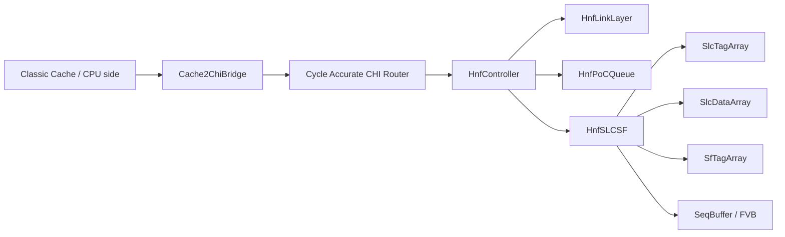
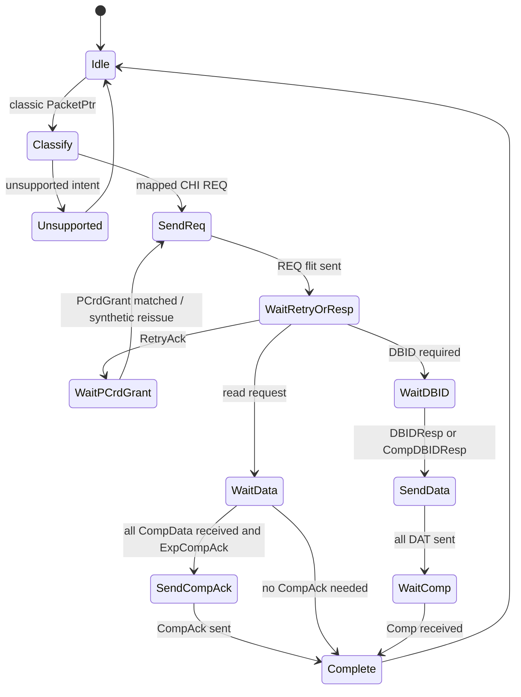
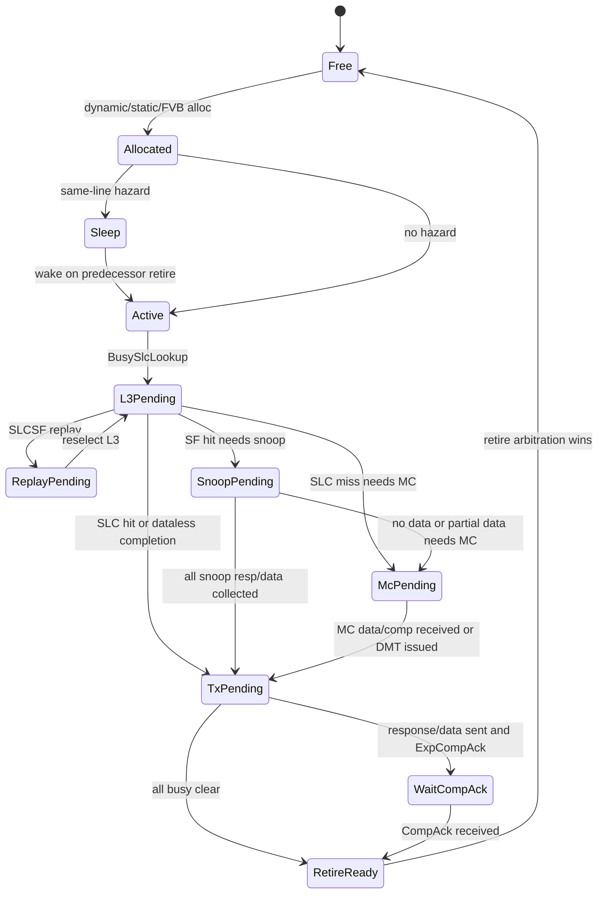
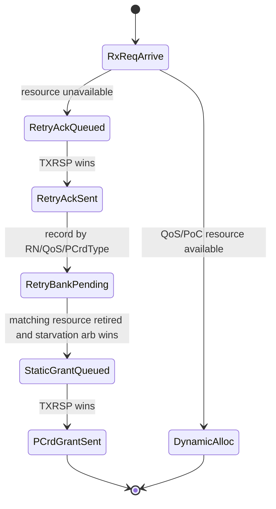

# HNF Gem5 C++ 架构设计文档

> 版本：v1.0
> 目标平台：gem5 classic cache + cache2chi bridge + cycle-accurate CHI router
> 建模对象：CHI HNF，三层建模结构为 `LinkLayer / PoC Queue / L3 SLC+SF`。
> 设计原则：不新增 RTL spec 之外的微架构；不确定处显式标注为 Open Question。

---

## 1. Problem Statement

香山当前 gem5 侧基于 classic cache，而目标系统需要建模 CHI NoC 中的 HNF 行为。直接让 classic cache 访问 HNF 会缺少 CHI 的 REQ/RSP/DAT/SNP flit 语义、link credit、protocol credit、RetryAck/PCrdGrant、DBID、CompAck、snoop response、DMT、SLC/SF lookup、PoC hazard、PoC busy 和 pipeline timing。

因此本方案需要在 gem5 classic cache 与 CHI router/HNF 之间增加 `Cache2ChiBridge`，并实现一个 cycle-level HNF C++ 模型。这个模型需要满足：

1. classic cache 请求能够被转换为有限集合的 CHI RNF 事务；
2. bridge 能够作为 RNF-side transaction agent 处理 HNF 返回的 response/data/snoop，而不是只做 flit encoder；
3. HNF 按 RTL spec 的三层结构拆分为 `HnfLinkLayer`、`HnfPoCQueue`、`HnfSLCSF`；
4. PoC entry、busy、hazard、retry、QoS pool、SLC/SF replay、snoop、MC access 和 TX channel arbitration 都能影响 cycle-level timing；
5. MVP 明确只覆盖必要事务，不声明覆盖全部 CHI。

本设计文档面向 gem5 C++ 实现，给出类、字段、队列、状态机、pipeline stage、模块输入输出、MVP 与完整版本边界。

---

## 2. Design Goals

### 2.1 功能目标

1. **RNF bridge 闭环**：`Cache2ChiBridge` 需要同时处理 classic-side request/response 和 CHI-side REQ/RSP/DAT/SNP，维护 RNF 事务表。
2. **HNF 三层建模**：
   - `HnfLinkLayer`：flit unpack/pack、RX/TX credit、fastpath、dynamic/static allocation、RetryAck/PCrdGrant、FVB insertion。
   - `HnfPoCQueue`：entry allocation/retire、AgeQ、hazard sleep/wake、busy state、abuf/dbuf、RX encoders、TX decoders、scheduled arbitration。
   - `HnfSLCSF`：SLC tag/data、SF tag、SLC/SF state update、victim、SEQ/FVB、replay、init。
3. **事务状态可观测**：每个 `PoCEntry` 保留 `origOpcode`、`intOpcode`、TxnID、DBID、busyMask、snoop counter、QW mask、SLC/SF state、retry/replay/selfCancel/DMT 等字段。
4. **cycle-level timing 可调**：Link、PoC、SLC/SF pipeline stage 以参数配置；MVP 使用近似固定延迟，完整版本按 H-stage 建模。
5. **协议错误显式暴露**：unsupported opcode、非法 response、孤儿 flit、credit underflow、same-line ordering violation、CompAck timeout 都需要统计或 panic。

### 2.2 时序目标

1. 不允许在同一个 `tick()` 中组合穿透多个模块导致“零周期完成”。
2. 所有模块采用 `evaluate()` / `commit()` 两阶段更新。
3. 对每个 pipeline stage 使用 `PipeReg<T>` 或 `TimedQueue<T>` 建模。
4. Link credit 与 protocol credit 分开建模，不能混用。
5. PoC 的 arbitration 需要按资源类型拆开：L3、MC Retry、MC、TXDAT、TXSNP、TXRSP。

### 2.3 MVP 与 Full 共同目标

| 目标 | MVP | Full |
|---|---|---|
| 可以运行香山典型 load/store/cache miss/evict | 必须 | 必须 |
| 支持 HNF 的主要事务路径 | RNSD/RU/MU/Evict/WBF/NoSnp basic | 覆盖 spec-supported opcode |
| 支持 retry/p-credit | synthetic reissue | true requester reissue 或 synthetic 可配置 |
| 支持 snoop responder | 基本 SnpUnique/SnpMakeInvalid/SnpNotSharedDirty | 全部 SNP/DCT/Stash 组合 |
| timing | 固定 stage + 关键反压 | 尽量 RTL H-stage 对齐 |
| debug | DPRINTF + stats + trace dump | transaction waveform + differential checker |

---

## 3. Non-goals

MVP 阶段明确不做以下内容：

1. 不覆盖全部 CHI opcode。
2. 不把 classic cache 的所有 packet 类型强行翻译成 CHI。
3. 不实现 DVM、Atomic、CMO/Persist、DCT、Stash、WrStash 的完整路径。
4. 不支持 SF M 态 / CML，除非文档和配置明确打开。
5. 不实现完整 LRU/SRRIP/BRRIP，MVP victim policy 使用 random 或 find-first。
6. 不实现 ECC single-bit replay，默认关闭。
7. 不实现 L3 bypass，默认所有请求走 PoC scheduled path。
8. 不试图模拟 RTL 所有组合信号，只建模会影响事务状态或 cycle timing 的行为。
9. 不在 HNF 内部直接“吞掉”Retry 后的旧请求。Retry 后的重发必须由 bridge/RNF 侧语义表示；MVP 可用 synthetic reissue，但要在日志中标明。

---

## 4. Protocol Assumptions

### 4.1 CHI role 假设

| 组件 | 建模角色 | 说明 |
|---|---|---|
| `Cache2ChiBridge` | RNF-side transaction agent | 发起 REQ/DAT/CompAck，接收 Comp/Data/DBID/RetryAck/PCrdGrant/TXSNP，返回 SnpResp/Data |
| `CHI Router` | cycle-accurate router | 已完成，HNF 只通过 channel + credit 交互 |
| `HnfController` | HNF | 接收 RXREQ/RXRSP/RXDAT，发送 TXREQ/TXRSP/TXDAT/TXSNP |
| `SNF/MC` | memory-side completer | 接收 HNF TXREQ/TXDAT，返回 RXDAT/RXRSP |

### 4.2 HNF 基本结构假设

HNF 由 `CHI Link Layer`、`PoC Queue`、`SLC SF`、`SLC Data` 组成，包含三个向内通道 `RxREQ/RxRSP/RxDAT` 和四个向外通道 `TxREQ/TxSNP/TxRSP/TxDAT`。LinkLayer 负责拆包/组包，PoC 负责 hazard、仲裁、调度，SLC/SF 负责 tag/data/directory 查询和后续动作。

### 4.3 cache2chi bridge 支持范围

#### MVP 支持的 classic intent 到 CHI 映射

| Classic intent | CHI request | 条件 | 备注 |
|---|---|---|---|
| cacheable read miss, shared/read-only | `ReadNotSharedDirty` | normal cacheable | 获取可读副本 |
| cacheable store miss / RFO | `ReadUnique` | 需要读旧值再写 | 获取 unique + data |
| full-line overwrite store miss | `MakeUnique` 或 `WriteUniqueFull` | 需要由上层 packet 指示 full-line overwrite | MVP 优先 `MakeUnique` + 后续 write in local cache；若 bridge 直接发写数据则需 DBID flow |
| clean eviction | `Evict` | line clean | 更新 SF，通常 dataless |
| dirty eviction | `WriteBackFull` | full dirty line | Allocate 根据 MemAttr 配置 |
| non-coherent/device read | `ReadNoSnp` | uncacheable/device only | 不能用于 cacheable read miss |
| non-coherent/device write | `WriteNoSnpFull` | uncacheable/device only | partial 默认 unsupported |

#### MVP 不支持或 panic 的事务

| 类别 | 处理 |
|---|---|
| Atomic | panic/unsupported |
| DVM | panic/unsupported |
| CMO/Persist | panic/unsupported |
| Stash/WrStash | panic/unsupported，除非打开 Full |
| partial write | 默认 panic；可用配置降级为 read-modify-write，但要标记非 RTL 精确 |
| DCT forward | unsupported |
| CML/SF M state | unsupported |

### 4.4 关键协议假设

1. `ReadNoSnp` 只用于 non-coherent/device 或 HNF 到 SNF downstream read，不可把 cacheable CPU read miss 误翻成 `ReadNoSnp`。
2. Retry 语义是：HNF 发 `RetryAck`，随后在资源可用时发 `PCrdGrant`，RNF 收到匹配 credit 后重新发送请求。MVP 可在 bridge 内部 synthetic reissue，但 HNF 内部不能直接把 retry old request 塞进 PoC。
3. Link credit 是 channel flow control，PCrdGrant 是 protocol retry credit，两者完全独立。
4. 写事务必须处理 DBID/CompDBID。bridge 只有在收到 DBID/CompDBID 后才能发送对应 DAT flit。
5. 需要 ExpCompAck 的事务，HNF PoC 不能在数据发送后立即 retire，必须等待 CompAck 或明确配置忽略。
6. HNF 发出的 TXSNP 必须由 bridge/RNF snoop responder 消费并返回 SnpResp/SnpRespData，否则 RU/RNSD/MakeUnique/SF victim 路径无法闭环。

---

## 5. Module Decomposition

### 5.1 顶层对象关系



### 5.2 `Cache2ChiBridge`

#### 职责

1. 接收 classic `PacketPtr`，分类为 read/store/evict/writeback/noncoherent。
2. 生成 CHI REQ/DAT/CompAck。
3. 接收 CHI RSP/DAT/SNP。
4. 维护 RNF transaction table。
5. 处理 RetryAck/PCrdGrant/reissue。
6. 作为 snoop responder 查询 classic cache line state，并返回 SnpResp/SnpRespData。

#### 输入

| 输入 | 来源 | 说明 |
|---|---|---|
| `PacketPtr` | classic cache side | CPU/cache request |
| `ChiRspFlit` | router | Comp/DBID/RetryAck/PCrdGrant/ReadReceipt |
| `ChiDatFlit` | router | CompData/SnpRespData 等 |
| `ChiSnpFlit` | router | HNF 发来的 snoop |
| link credit | router | REQ/RSP/DAT/SNP channel credit |

#### 输出

| 输出 | 目标 | 说明 |
|---|---|---|
| `ChiReqFlit` | router | RNF request |
| `ChiDatFlit` | router | write data / snoop response data |
| `ChiRspFlit` | router | CompAck / SnpResp |
| classic response | classic cache side | 完成原始 packet |

#### MVP 类结构

```cpp
class Cache2ChiBridge : public ClockedObject
{
  public:
    bool recvTimingReq(PacketPtr pkt);
    bool recvChiFlit(const ChiFlit& flit, ChiChannel ch);
    void recvLinkCredit(ChiChannel ch, uint32_t credit);
    void tick();

  private:
    BridgeConfig cfg;
    ClassicPacketClassifier classifier;
    ChiReqMapper mapper;
    RnTxnTable txnTable;
    RetryPcreditManager retryMgr;
    RnSnoopResponder snoopResponder;
    DataBeatPacker beatPacker;
    ChiLinkPort chiPort;

    Queue<PacketPtr> classicReqQ;
    Queue<ChiReqFlit> reqQ;
    Queue<ChiRspFlit> rspQ;
    Queue<ChiDatFlit> datQ;
};
```

#### 关键函数表

| 类 | 函数 | MVP | Full | 说明 |
|---|---|---:|---:|---|
| `ClassicPacketClassifier` | `classify(PacketPtr)` | Y | Y | classic packet -> intent |
| `ChiReqMapper` | `mapIntentToReq(Intent)` | Y | Y | intent -> CHI opcode/fields |
| `RnTxnTable` | `allocTxn(PacketPtr, ChiReqFlit)` | Y | Y | 分配 TxnID，记录 packet |
| `RnTxnTable` | `onRsp(ChiRspFlit)` | Y | Y | DBID/Comp/RetryAck/PCrdGrant |
| `RnTxnTable` | `onDat(ChiDatFlit)` | Y | Y | CompData/data beat accumulation |
| `RetryPcreditManager` | `onRetryAck()` | Y | Y | 记录 pending retry |
| `RetryPcreditManager` | `onPCrdGrant()` | Y | Y | 触发 synthetic reissue |
| `RnSnoopResponder` | `handleSnp(ChiSnpFlit)` | Y | Y | 查 classic cache state 并回 SnpResp/Data |
| `DataBeatPacker` | `split64BToDatFlits()` | Y | Y | 64B -> 2x256b 或 4x128b |
| `ChiLinkPort` | `canSend(ch)` | Y | Y | link credit gate |

### 5.3 `HnfController`

#### 职责

1. 作为 HNF 顶层 ClockedObject。
2. 与 router 交互 CHI flit 和 credit。
3. 按周期调度 `LinkLayer/PoC/SLCSF`。
4. 管理参数、reset/startup、statistics、debug trace。

#### 类结构

```cpp
class HnfController : public ClockedObject
{
  public:
    bool recvChiFlit(const ChiFlit& flit, ChiChannel ch);
    void recvLinkCredit(ChiChannel ch, uint32_t n);
    void tick();
    void reset();

  private:
    HnfConfig cfg;
    HnfLinkLayer link;
    HnfPoCQueue poc;
    HnfSLCSF slcsf;
    ChiRouterPort routerPort;
    EventFunctionWrapper tickEvent;
    HnfStats stats;
};
```

#### 每周期调用关系

```cpp
void HnfController::tick()
{
    link.evaluateRxFromRouter();
    link.evaluateCredit();

    poc.acceptLinkEvents(link.outputToPoc());
    poc.acceptSlcResult(slcsf.outputToPoc());
    poc.evaluateInputs();
    poc.evaluateSelectors();

    slcsf.acceptPocReq(poc.outputSlcReq());
    slcsf.evaluatePipeline();

    link.acceptPocTx(poc.outputTx());
    link.acceptFvbReq(slcsf.outputFvbReq());
    link.evaluateTxToRouter();

    slcsf.commit();
    poc.commit();
    link.commit();
}
```

### 5.4 `HnfLinkLayer`

#### 职责

1. RXREQ/RXRSP/RXDAT unpack。
2. TXREQ/TXRSP/TXDAT/TXSNP pack。
3. RX/TX link credit。
4. RXREQ grouping/opcode mapping hints。
5. Dynamic/static resource allocation。
6. RetryAck FIFO、Retry QoS Bank、PCrdGrant queue。
7. TXRSP fastpath。
8. FVB/SEQ/init request insertion。

#### 子模块

| 子模块 | MVP | Full | 职责 |
|---|---:|---:|---|
| `LinkRxChannel<REQ>` | Y | Y | RXREQ flit buffer + unpack + credit return |
| `LinkRxChannel<RSP>` | Y | Y | RXRSP unpack + credit |
| `LinkRxChannel<DAT>` | Y | Y | RXDAT unpack + credit |
| `LinkTxChannel<REQ>` | Y | Y | TXREQ pack + credit gate |
| `LinkTxChannel<RSP>` | Y | Y | TXRSP pack + fastpath/retry/static/poc priority |
| `LinkTxChannel<DAT>` | Y | Y | TXDAT pack + credit gate |
| `LinkTxChannel<SNP>` | Y | Y | TXSNP pack + small FIFO |
| `LinkGrouping` | Y | Y | opcode/memattr/stash/order classification |
| `DynStaticAllocator` | Y | Y | QoS pool, dynamic alloc, retry path |
| `RetryAckQueue` | Y | Y | RetryAck staging |
| `RetryQosBank` | Y simplified | Y | per RN/QoS pending retry bank |
| `PcrdGrantQueue` | Y | Y | static grant staging |
| `FvbAllocator` | Y basic | Y | SEQ/FVB/init request insertion |

#### 输入输出

| 方向 | 信号/对象 | 说明 |
|---|---|---|
| router -> link | `ChiFlit` + channel | RXREQ/RXRSP/RXDAT |
| router -> link | TX credit | TXREQ/TXRSP/TXDAT/TXSNP credit |
| link -> router | RX credit | 返回可接收 credit |
| link -> router | TX flit | packed flit |
| link -> PoC | `LinkToPocRx` | parsed RX flit fields |
| link -> PoC | `LinkAllocEvent` | dynamic/static/FVB allocation event |
| PoC -> link | `PocToLinkTx` | TXREQ/TXRSP/TXDAT/TXSNP payload |
| SLCSF -> link | `FvbReq` | SF victim/init/back-invalidation |

#### 关键字段

```cpp
struct LinkCreditState {
    uint32_t rxCredit[3];  // RXREQ/RXRSP/RXDAT, returned to router
    uint32_t txCredit[4];  // TXREQ/TXRSP/TXDAT/TXSNP, consumed when sending
};

struct RetryRecord {
    NodeID srcId;
    TxnID txnId;
    uint8_t qos;
    uint8_t pcrdType;
    bool trace;
    Tick retryAckSentTick;
};

class DynStaticAllocator {
    std::array<uint32_t, 4> qosUsed;
    std::array<uint32_t, 4> qosLimit;
    uint32_t fvbUsed;
    uint32_t fvbLimit;
    RetryAckQueue retryAckQ;
    RetryQosBank retryBank;
    PcrdGrantQueue pcrdGrantQ;
};
```

### 5.5 `HnfPoCQueue`

#### 职责

1. PoC entry 分配和释放。
2. Entry AgeQ 管理。
3. 同地址 hazard 检测、sleep/wake、compare enable。
4. SLC replay hazard 检测。
5. RXREQ/RXRSP/RXDAT encoding。
6. TXREQ/TXRSP/TXDAT/TXSNP decoding。
7. PoC busy 状态机。
8. address/data buffer。
9. scheduled arbitration。

#### 子模块

| 子模块 | MVP | Full | 职责 |
|---|---:|---:|---|
| `PocAllocator` | Y | Y | dynamic/static/FVB entry allocation |
| `PocRetire` | Y | Y | busy clear 后 retire；AgeQ shift |
| `PocAgeQueue` | Y | Y | oldest entry tracking |
| `PocHazard` | Y | Y | allocation hazard sleep/wake |
| `PocAddressBuffer` | Y | Y | link addr/victim addr/read ports/CAM |
| `PocDataBuffer` | Y | Y | RXDAT/SLC data merge, BE buffer |
| `PocDataBufferCtl` | Y | Y | TXDAT pocbuf A/B, OW split |
| `PocBusy` | Y | Y | 9 类 busy + sub-busy |
| `PocSelector` | Y simplified | Y | L3/MC/TXDAT/TXSNP/TXRSP arbitration |
| `PocRxReqEncoder` | Y | Y | opcode mapping, initial flags |
| `PocRxRspEncoder` | Y | Y | CompAck/DBID/SnpResp/PCrdGrant |
| `PocRxDatEncoder` | Y | Y | CompData/SnpRespData/CBWrData beat count |
| `PocSlcEncoder` | Y | Y | entry -> SLCSF request |
| `PocSlcDecoder` | Y | Y | SLCSF result -> entry updates |
| `PocTxReqDecoder` | Y | Y | MC request flit fields |
| `PocTxRspDecoder` | Y | Y | Comp/DBID/CompDBID/ReadReceipt |
| `PocTxDatDecoder` | Y | Y | CompData/WriteNoSnp data |
| `PocTxSnpDecoder` | Y | Y | directed/broadcast snoop flit fields |
| `PocMisc` | Y | Y | config-derived signals, trace/error |

#### 输入输出

| 方向 | 对象 | 说明 |
|---|---|---|
| Link -> PoC | `LinkToPocRx` | RXREQ/RXRSP/RXDAT parsed event |
| Link -> PoC | `LinkAllocEvent` | alloc/static/FVB decision |
| SLCSF -> PoC | `SlcToPocResult` | SLC/SF hit/miss/victim/snoop/replay/selfCancel |
| PoC -> SLCSF | `PocSlcReq` | selected L3/SF request |
| PoC -> Link | `PocTxReqMsg` | MC request |
| PoC -> Link | `PocTxRspMsg` | Comp/DBID/CompDBID/ReadReceipt |
| PoC -> Link | `PocTxDatMsg` | data flit payload |
| PoC -> Link | `PocTxSnpMsg` | snoop flit payload |
| PoC -> Link | `RetireEvent` | release pool/static grant trigger |

### 5.6 `HnfSLCSF`

#### 职责

1. SLC tag lookup/update/allocate/evict。
2. SLC data read/fill/writeback。
3. SF tag lookup/update/allocate/evict。
4. SEQ/FVB 管理。
5. SLC/SF replay detection。
6. Snoop directed/broadcast decision。
7. Self cancel decision。
8. SLC/SF init。

#### 子模块

| 子模块 | MVP | Full | 职责 |
|---|---:|---:|---|
| `SlcPipeline` | Y | Y | SLC H-stage 管线 |
| `SfPipeline` | Y | Y | SF H-stage 管线 |
| `SlcTagArray` | Y | Y | 16-way SLC tag |
| `SlcDataArray` | Y | Y | 4 QW x 128b SLC data |
| `SfTagArray` | Y | Y | 16-way SF tag |
| `SeqBuffer` | Y | Y | SF victim back-invalidation queue |
| `FvbRequestBuilder` | Y | Y | SEQ/init -> FVB request |
| `SlcReplayDetector` | Y | Y | setway/victim/replay input |
| `SfReplayDetector` | Y | Y | setway/SEQ full/SEQ collision |
| `VictimPolicy` | random | LRU/SRRIP/BRRIP |
| `SlcSfInitEngine` | direct clear | cycle-accurate init |

#### 输入输出

| 方向 | 对象 | 说明 |
|---|---|---|
| PoC -> SLCSF | `PocSlcReq` | L3 lookup/fill/init request |
| PoC -> SLCSF | `SlcReplayHint` | victim addr conflict replay |
| PoC -> SLCSF | fill data | SLC fill data from PoC dbuf |
| SLCSF -> PoC | `SlcToPocResult` | hit/miss/victim/snoop/replay/selfCancel |
| SLCSF -> PoC | SLC read data | hit/victim data to PoC dbuf |
| SLCSF -> Link | `FvbReq` | SEQ/FVB/init request inserted via Link |
| Link/PoC -> SLCSF | FVB dealloc ack | SEQ entry release |

---

## 6. Data Structures

### 6.1 CHI flit structures

```cpp
enum class ChiChannel { Req, Rsp, Dat, Snp };

enum class ReqOpcode {
    ReadShared, ReadClean, ReadNotSharedDirty, ReadUnique,
    MakeUnique, Evict, WriteBackFull,
    ReadNoSnp, WriteNoSnpFull, WriteNoSnpPtl,
    WriteUniqueFull, WriteUniquePtl,
    CleanInvalid, CleanShared,
    Unsupported
};

enum class RspOpcode {
    Comp, CompAck, SnpResp, SnpRespFwded,
    RetryAck, DBIDResp, CompDBIDResp,
    PCrdGrant, ReadReceipt,
    Unsupported
};

enum class DatOpcode {
    SnpRespData, CopyBackWrData, NonCopyBackWrData,
    CompData, SnpRespDataPtl, SnpRespDataFwded,
    WriteDataCancel,
    Unsupported
};

enum class SnpOpcode {
    SnpUnique, SnpMakeInvalid, SnpNotSharedDirty,
    SnpCleanInvalid, SnpCleanShared,
    Unsupported
};

struct ChiReqFlit {
    ReqOpcode opcode;
    NodeID srcId;
    NodeID tgtId;
    NodeID retNid;
    TxnID txnId;
    TxnID returnTxnId;
    Addr addr;
    uint8_t qos;
    uint8_t size;
    uint8_t order;
    uint8_t memAttr;
    uint8_t snpAttr;
    uint8_t pcrdType;
    uint8_t ccid;
    uint8_t lpid;
    uint8_t lid;
    uint8_t srcType;
    uint8_t rsvdc;
    bool ns;
    bool expCompAck;
    bool trace;
    bool dynCredit;
    bool dmt;
    bool dmtOrder;
};

struct ChiRspFlit {
    RspOpcode opcode;
    NodeID srcId;
    NodeID tgtId;
    TxnID txnId;
    DBID dbid;
    uint8_t qos;
    uint8_t resp;
    uint8_t respErr;
    uint8_t pcrdType;
    uint8_t deviceEvent;
    bool trace;
};

struct ChiDatFlit {
    DatOpcode opcode;
    NodeID srcId;
    NodeID tgtId;
    TxnID txnId;
    DBID dbid;
    uint8_t qos;
    uint8_t resp;
    uint8_t respErr;
    uint8_t ccid;
    uint8_t dataId;
    uint8_t chunkV;
    uint8_t dataSource;
    std::array<uint8_t, 32> data; // 256b MVP datapath
    uint32_t be;
    bool trace;
};

struct ChiSnpFlit {
    SnpOpcode opcode;
    NodeID srcId;
    NodeID tgtId;
    NodeID fwdNid;
    TxnID txnId;
    TxnID fwdTxnId;
    Addr addr;
    uint8_t qos;
    bool ns;
    bool retToSrc;
    bool doNotDataPull;
    bool trace;
};
```

### 6.2 Bridge transaction entry

```cpp
enum class BridgeTxnState {
    Allocated,
    ReqQueued,
    ReqSent,
    WaitRetryGrant,
    ReissueQueued,
    WaitDbid,
    SendWriteData,
    WaitComp,
    WaitData,
    WaitCompAckSend,
    Completed,
    Unsupported,
    Error
};

struct RnTxnEntry {
    bool valid = false;
    PacketPtr pkt = nullptr;
    BridgeTxnState state;

    ReqOpcode reqOpcode;
    TxnID txnId;
    DBID dbid;
    NodeID hnfId;
    Addr lineAddr;

    bool needsCompAck = false;
    bool gotComp = false;
    bool gotAllData = false;
    bool gotDbid = false;
    bool retryPending = false;
    uint8_t pcrdType = 0;

    uint8_t qwValid = 0;
    uint8_t qwReceived = 0;
    uint8_t qwSent = 0;
    std::array<uint8_t, 64> data;
    uint64_t byteEnable = 0;

    Tick allocTick;
    Tick lastProgressTick;
};
```

### 6.3 PoC entry

```cpp
enum class IntOpcode {
    ReadShared,
    ReadClean,
    ReadSharedClean,
    ReadNotSharedDirty,
    ReadUnique,
    ReadOnce,
    MakeUnique,
    Evict,
    WriteBackFull,
    WriteUniquePtl,
    CleanInvalid,
    CleanShared,
    SeqCleanInvalid,
    SlcInit,
    SfInit,
    Unsupported
};

enum class SlcState { I, EU, EN, SU, SN, MU, MN };
enum class SfState  { I, EU, EN, SU, SN, MU, MN };

enum BusyBit : uint32_t {
    BusyCompAck     = 1u << 0,
    BusySlcLookup   = 1u << 1,
    BusySlcFillData = 1u << 2,
    BusySlcEvict    = 1u << 3,
    BusySlcFill     = 1u << 4,
    BusySnoop       = 1u << 5,
    BusyMcRead      = 1u << 6,
    BusyMcWrite     = 1u << 7,
    BusyDataBuffer  = 1u << 8,
    BusySleep       = 1u << 9,
    BusyComp        = 1u << 10,
    BusyReadReceipt = 1u << 11,
    BusyMcRdReceipt = 1u << 12,
    BusyAllocPulse  = 1u << 13
};

struct PoCEntry {
    bool valid = false;
    bool staticEntry = false;
    bool fvbEntry = false;

    ReqOpcode origOpcode = ReqOpcode::Unsupported;
    IntOpcode intOpcode = IntOpcode::Unsupported;
    ReqOpcode mcOpcode = ReqOpcode::Unsupported;

    NodeID srcId;
    NodeID tgtId;
    NodeID retNid;
    TxnID origTxnId;
    TxnID txnId;
    DBID dbid;
    Addr lineAddr;
    bool ns = false;

    uint8_t qos = 0;
    uint8_t qosClass = 0;
    uint8_t memAttr = 0;
    uint8_t size = 0;
    uint8_t order = 0;
    uint8_t ccid = 0;
    uint8_t resp = 0;
    uint8_t respErr = 0;
    bool trace = false;
    bool expCompAck = false;

    uint32_t busyMask = 0;
    bool sleep = false;
    bool wake = false;
    bool compareEnable = false;
    int wakeTarget = -1;

    bool l3Req = false;
    bool l3Fill = false;
    bool l3NoFill = false;
    bool replayPending = false;
    bool selfCancel = false;
    bool forceS = false;
    bool dmt = false;
    bool dmtOrder = false;

    bool slcHit = false;
    bool sfHit = false;
    bool sfHitUnique = false;
    SlcState slcHitState = SlcState::I;
    SlcState slcFillState = SlcState::I;
    SfState sfState = SfState::I;

    bool needSnoop = false;
    bool snoopBroadcast = false;
    bool snoopDirected = false;
    uint32_t snoopRnfVec = 0;
    uint8_t snoopExpected = 0;
    uint8_t snoopReceived = 0;
    bool gotIwb = false;
    bool gotPartialIwb = false;

    uint8_t qwValid = 0;
    uint8_t qwTx = 0;
    uint8_t qwRx = 0;
    uint8_t qwNeeded = 0;

    bool mcReadReady = false;
    bool mcWriteReady = false;
    bool dbidReady = false;
    bool compReady = false;
    bool rdReceiptReady = false;

    Tick allocTick;
    Tick lastProgressTick;
};
```

### 6.4 Address/Data buffer

```cpp
struct PocAddressRecord {
    Addr linkAddr;
    Addr victimAddr;
    bool hasVictimAddr = false;
    bool ns = false;
};

class PocAddressBuffer {
    std::array<PocAddressRecord, MaxPocEntries> records;
  public:
    void writeLinkAddr(int entry, Addr addr, bool ns);
    void writeVictimAddr(int entry, Addr addr, bool ns);
    Addr readSlcAddr(int entry) const;
    Addr readMcAddr(int entry) const;
    Addr readSnpAddr(int entry) const;
    HazardResult camLinkAddr(Addr addr, bool ns, uint32_t compareEnableMask) const;
    bool camVictimAddr(Addr slcAddr, bool ns) const;
};

struct PocDataRecord {
    std::array<uint8_t, 64> data;
    uint64_t be = 0;
};

class PocDataBuffer {
    std::array<PocDataRecord, MaxPocEntries> records;
  public:
    void writeRxDat(int entry, const ChiDatFlit& dat);
    void writeSlcData(int entry, const std::array<uint8_t,64>& data, uint64_t be);
    PocDataRecord readForTxDat(int entry) const;
    PocDataRecord readForSlcFill(int entry) const;
    void clear(int entry);
};
```

### 6.5 SLC/SF arrays

```cpp
struct SlcTagLine {
    bool valid = false;
    Addr tag = 0;
    bool ns = false;
    NodeID rnfid = 0;
    SlcState state = SlcState::I;
};

struct SfTagLine {
    bool valid = false;
    Addr tag = 0;
    bool ns = false;
    bool slcIsSource = false;
    NodeID rnfid = 0;
    uint32_t rnfVec = 0;
    SfState state = SfState::I;
};

class SlcTagArray {
    std::vector<std::array<SlcTagLine, 16>> sets;
  public:
    TagLookupResult read(Addr lineAddr, bool ns);
    void write(int set, int way, const SlcTagLine& line);
    VictimResult chooseVictim(int set);
};

class SlcDataArray {
    std::vector<std::array<std::array<uint8_t,64>, 16>> sets;
  public:
    DataReadToken read(int set, int way);
    void write(int set, int way, const std::array<uint8_t,64>& data, uint64_t beMask);
};

class SfTagArray {
    std::vector<std::array<SfTagLine, 16>> sets;
  public:
    SfLookupResult read(Addr lineAddr, bool ns);
    void write(int set, int way, const SfTagLine& line);
    VictimResult chooseVictim(int set);
};
```

---

## 7. Pipeline Timing

### 7.1 全局建模原则

1. 所有模块使用 `evaluate()` / `commit()`。
2. pipeline stage 使用 `PipeReg<T>` 表示。
3. arbitration 结果打拍后才被下游使用。
4. credit 更新与 flit 发送不允许同周期组合回流。
5. Replay 会取消 SLC/SF pipeline 后续 side effect，并通知 PoC 重新置位 L3 request。
6. MVP 可以把部分 stage 合并，但必须保留外部可见 latency 和 backpressure 点。

### 7.2 LinkLayer pipeline

| 通道/路径 | RTL stage 概念 | MVP 建模 | Full 建模 |
|---|---|---|---|
| RXREQ | H0 receive, H1 unpack, H2 alloc/fastpath | 2-cycle RX parse | H0/H1/H2 精确 stage |
| RXRSP | H0 receive, H1 unpack | 1-2 cycle parse | H0/H1/H2 |
| RXDAT | H0 receive, H1 unpack, H2 data to PoC | 2-cycle data parse | H0/H1/H2 |
| TXRSP fastpath | H2 arbitrate, H3 send | 1-cycle min latency after RXREQ H2 | 精确 H2/H3 |
| TXRSP PoC path | H4 pack, H5 send | fixed scheduled latency | H4/H5 |
| TXDAT | H11 pack, H12 send | scheduled + credit | H11/H12 |
| TXREQ | H12 pack, H13/H14 send | scheduled + small FIFO | H12/H13/H14 |
| TXSNP | H13 pack, H14/H15 send | scheduled + small FIFO | H13/H14/H15 |
| RetryAck | H2 ready, H3 earliest send | FIFO + TXRSP priority | 精确 fastpath competition |
| PCrdGrant | retire + HX1/HX2/HX3 | retire-triggered grant queue | 精确 static grant stage |

### 7.3 PoC pipeline

| 功能 | Stage | MVP | Full |
|---|---|---|---|
| allocation | H1 select entry, H2 valid set, H3 ageq | 保留 2-cycle alloc | 完整 H1/H2/H3 |
| retire | Hx select, Hx1/Hx2 clear | 保留 retire latency | 完整 Hx/Hx1/Hx2 |
| hazard | H1 CAM, H2 result, H3 sleep set | 必须保留 | 完整 compareEnable/wake/sleep |
| L3 selection | H2 qualify, H3/H4/H5 send | scheduled selector | 完整 oldest/lookup/RR/find-first |
| MC selection | H10 qualify, H11 select, H12 Link | scheduled selector | 完整 priority |
| TXDAT selection | H9 qualify, H10 select, H11 data | scheduled selector | 完整 QW/OW and pocbuf |
| TXSNP selection | H11 qualify, H12/H13 address | scheduled selector | 完整 broadcast pop |
| TXRSP selection | H3 qualify, H4 Link | scheduled selector | 完整 fastpath-lost recovery |
| RXDAT write | H2 decode, H3 dbuf write | data arrival + beat counter | 完整 BE merge |
| SLC data to dbuf | H9 result, H11 write, H12 visible | fixed latency | 完整 H9/H11/H12 |

### 7.4 SLC/SF pipeline

| 子路径 | Stage/Latency | MVP | Full |
|---|---|---|---|
| SLC tag lookup | H1 request, H2/H3 tag access, H4 hit, H7/H9 result | fixed 8-cycle lookup | H1-H9 stage 精确 |
| SLC data read | hit/victim read, qw0/1 and qw2/3 staggered | 2 DAT beats after hit | OW stagger 精确 |
| SLC tag update | second round write | fixed write latency | first/second round 精确 |
| SLC fill | whole 64B only | full-line fill only | QW0/1, QW2/3 staggered |
| SLC victim | miss + full set + dirty victim | random victim | LRU/SRRIP/BRRIP configurable |
| SF lookup | H2/H3 read, H5 hit, H6 decision | fixed SF latency | H2/H3/H5/H6 |
| SF update | H6 compute, H9/H1a/H2/H3 write | fixed write latency | exact second-round write |
| SF victim | SF miss + way full -> SEQ | basic SEQ | full SEQ conflict/replay |
| Replay | setway, seq full, victim addr | cancel + retry later | exact replay cause/stage |
| Init | direct clear | configurable startup delay | every 8 cycles per set |

### 7.5 Backpressure timing points

| Backpressure source | 影响 |
|---|---|
| RX channel credit empty | router 不能送 flit |
| TX channel credit empty | HNF 不能发 flit，PoC TX busy 延长 |
| PoC QoS pool full | RXREQ 走 RetryAck |
| RetryAck FIFO full | RXREQ 接收可能反压或延迟 credit return |
| PCrdGrant queue full | static grant 延迟 |
| PoC entry full | dynamic alloc 失败，Retry |
| PoC sleep | entry 不参与 selector |
| SLCSF busy | L3 selector 不能发新 request |
| SLC/SF replay | 已发 L3 request 回滚并重提 |
| DataBuffer/Pocbuf full | TXDAT 延迟，dbuf busy 不清 |
| SeqBuffer full | SF victim 触发 replay |
| MC credit empty | TXREQ 延迟，MC busy 不清 |

---

## 8. Transaction FSM

### 8.1 Bridge-side FSM



### 8.2 PoC entry abstract FSM



### 8.3 ReadNotSharedDirty FSM

| Condition | Action | Busy/state |
|---|---|---|
| Allocate | set `BusySlcLookup`, maybe `BusySnoop`, maybe `BusyCompAck` | entry active |
| SLC hit | read SLC data, send CompData | clear SLC busy, set TXDAT |
| SLC miss + SF miss | send MC `ReadNoSnp`; if DMT, SN returns data to RN | `BusyMcRead`; DMT may clear dbuf |
| SLC miss + SF hit | send `SnpNotSharedDirty` directed/broadcast | `BusySnoop` |
| Snoop returns data | write dbuf; optionally fill SLC; send CompData | update `slcFillState` |
| Snoop no data | send MC `ReadNoSnp` | `BusyMcRead` |
| Data sent | wait CompAck if required | `BusyCompAck` |
| CompAck received | retire | busy clear |

### 8.4 ReadUnique FSM

| Condition | Action | Busy/state |
|---|---|---|
| Allocate | set `BusySlcLookup`, `BusySnoop`, `BusyCompAck` | entry active |
| SLC hit + SF miss | read SLC data, invalidate SLC, send CompData | no snoop |
| SLC hit + SF hit | send `SnpUnique`, wait all snoop responses, then send SLC data | `BusySnoop` |
| SLC miss + SF miss | MC `ReadNoSnp`, often DMT | `BusyMcRead` |
| SLC miss + SF hit one/many | send `SnpUnique` directed/broadcast | `BusySnoop` |
| Snoop returns data | send data to requester, maybe MC writeback if dirty rules require | dbuf/TXDAT |
| Snoop no data | MC read, DMT if enabled | MC busy |
| Completion | wait CompAck if required | retire after clear |

### 8.5 MakeUnique FSM

| Condition | Action | Busy/state |
|---|---|---|
| Allocate | set SLC/SF lookup; set Comp busy | active |
| SF miss | no peer copy; send Comp | clear Comp after TXRSP |
| SF hit | send `SnpMakeInvalid`; wait all SnpResp | snoop busy |
| L3 hit | invalidate SLC tag | SLC update |
| Snoop done | send Comp | Comp busy clear |
| Comp sent | retire | no CompAck unless configured |

### 8.6 Evict FSM

| Condition | Action | Busy/state |
|---|---|---|
| Allocate | lookup/update SF | SLC/SF busy |
| SF hit | remove requester copy or update RNFVec | SF update |
| SF miss | no-op directory update | complete |
| Done | send Comp | Comp busy |
| Comp sent | retire | busy clear |

### 8.7 WriteBackFull FSM

| Condition | Action | Busy/state |
|---|---|---|
| Allocate | send CompDBIDResp or DBIDResp | DBID/Comp busy |
| RN sends CopyBackWrData | accumulate QW/OW | dbuf busy |
| MemAttr Allocate=1 | fill SLC tag/data; may evict dirty victim | SLC fill/victim busy |
| MemAttr Allocate=0 | write data to SNF via TXREQ/TXDAT | MC write busy |
| Dirty SLC victim | create MC writeback | MC write busy |
| Dead CopyBack | may skip MC/SLC | Full: support; MVP optional |
| Done | retire | busy clear |

### 8.8 Retry FSM in HNF



Important: `PCrdGrantSent` does not mean the old request enters PoC. It authorizes the RNF/bridge to reissue. In MVP synthetic mode, bridge creates the reissued REQ internally after receiving PCrdGrant.

---

## 9. Channel Interface

### 9.1 HNF external CHI channels

| Channel | Direction relative to HNF | Flit type | MVP behavior |
|---|---|---|---|
| RXREQ | router -> HNF | `ChiReqFlit` | request from RNF/bridge |
| RXRSP | router -> HNF | `ChiRspFlit` | CompAck, SnpResp, MC response, PCrdGrant from SNF if applicable |
| RXDAT | router -> HNF | `ChiDatFlit` | write data, SnpRespData, MC CompData |
| TXREQ | HNF -> router | `ChiReqFlit` | MC ReadNoSnp/WriteNoSnpFull/Ptl |
| TXRSP | HNF -> router | `ChiRspFlit` | RetryAck, PCrdGrant, DBID, CompDBID, Comp, ReadReceipt |
| TXDAT | HNF -> router | `ChiDatFlit` | CompData to RNF, WriteNoSnp data to SNF |
| TXSNP | HNF -> router | `ChiSnpFlit` | SnpUnique/SnpMakeInvalid/SnpNotSharedDirty |

### 9.2 Link-to-PoC interface

```cpp
struct LinkToPocRx {
    bool rxReqValid;
    ChiReqFlit req;
    LinkGroupingResult grouping;

    bool rxRspValid;
    ChiRspFlit rsp;

    bool rxDatValid;
    ChiDatFlit dat;
};

struct LinkAllocEvent {
    bool dynamicAlloc;
    bool staticAlloc;
    bool fvbAlloc;
    bool retry;
    uint8_t qosClass;
    uint8_t pcrdType;
    FvbReq fvbReq;
};
```

### 9.3 PoC-to-Link interface

```cpp
struct PocToLinkTx {
    bool txReqValid;
    ChiReqFlit txReq;

    bool txRspValid;
    ChiRspFlit txRsp;

    bool txDatValid;
    ChiDatFlit txDat;

    bool txSnpValid;
    ChiSnpFlit txSnp;
};
```

### 9.4 PoC-to-SLCSF interface

```cpp
struct PocSlcReq {
    bool valid;
    int pocEntry;
    IntOpcode opcode;
    ReqOpcode origOpcode;
    Addr lineAddr;
    bool ns;
    NodeID srcId;
    NodeID rnfid;
    uint32_t rnfVec;
    SlcState reqState;
    bool isFill;
    bool noFill;
    bool nonCoh;
    bool selfCancelIn;
    bool fillSd;
    bool fillSlvErr;
    bool replayHintFromPoc;
    bool slcInit;
    bool sfInit;
    bool trace;
};

struct SlcToPocResult {
    bool valid;
    int pocEntry;
    bool slcHit;
    bool sfHit;
    bool sfHitUnique;
    bool replay;
    bool victimValid;
    Addr victimAddr;
    bool victimDirty;
    bool snoopDirected;
    bool snoopBroadcast;
    NodeID snoopRnfid;
    uint32_t snoopRnfVec;
    bool forceS;
    bool selfCancel;
    bool noFill;
    SlcState hitState;
    SlcState updateState;
    SfState sfState;
    bool mcReqNonSpec;
    bool migrate;
    bool tagReadValid;
    std::optional<std::array<uint8_t,64>> slcData;
};
```

---

## 10. Ordering Rules

### 10.1 Same-line ordering

所有同 cacheline 且同 NS 域的请求必须在 PoC 内串行化。新请求与已入队请求地址冲突时：

1. 新请求仍然分配 PoC entry；
2. 新 entry 设置 `sleep=1`；
3. 冲突的旧 entry 设置 `wake=1` 并记录 `wakeTarget=newEntry`；
4. 旧 entry retire 时清除新 entry 的 sleep；
5. sleep entry 不参与 L3/MC/TXDAT/TXSNP/TXRSP selector。

这条规则覆盖 RAW/WAR/WAW 类顺序问题。这里不使用 “入口 stall” 替代 sleep entry，因为入口 stall 会改变 PoC entry 占用、AgeQ、Retry、QoS pool 和 retire timing。

### 10.2 Compare Enable 规则

| 事件 | compareEnable 处理 |
|---|---|
| entry allocation | 新 entry 默认置 compareEnable |
| allocation hazard 命中旧 entry | 清旧 entry compareEnable，让后续请求只跟新 sleep entry 串行 |
| entry retire | 清 retire entry compareEnable |
| entry 变成 SLC victim address holder | 清 compareEnable，转为 SLC replay CAM 参与者 |
| init/FVB 特殊请求 | init 不参与普通 hazard；SF BI 按 FVB 规则处理 |

### 10.3 SLC replay ordering

如果某 entry 的 SLC lookup/fill 地址与其他 entry 的 SLC victim 地址冲突，则 PoC 生成 replay hint 给 SLCSF。SLCSF 若确认 replay：

1. 取消当前 SLC/SF pipeline 后续 side effect；
2. 返回 `replay=1` 给 PoC；
3. PoC 重新置位 `BusySlcLookup`；
4. entry 保留，不重新分配；
5. 原有同地址 sleep/wake 关系不改变。

### 10.4 Snoop ordering

1. HNF 发出 snoop 后，entry 设置 `BusySnoop`。
2. `snoopExpected` 根据 directed/broadcast 目标数量设置。
3. RXRSP 和 RXDAT 都可能返回 snoop response；两者都要更新 counter。
4. 当 `snoopReceived == snoopExpected`，清 `BusySnoop`。
5. 若收到 SnpRespData/IWB，需要更新 data buffer、SLC fill state、MC writeback ready 等派生状态。
6. MakeUnique/ReadUnique 不能在 snoop 未完成前向 requester 发送最终 Comp/CompData，除非 spec 明确允许 DCT/Fwd 路径，MVP 不支持。

### 10.5 CompAck ordering

1. 对 `ExpCompAck=1` 的事务，HNF 在发送 CompData/Comp 后必须等待 CompAck。
2. PoC entry 只有在 `BusyCompAck` 清除后才能 retire。
3. Bridge 收到需要 CompAck 的 completion 后必须发送 CompAck。
4. 如果 classic cache 不具备 CompAck 语义，bridge 内部必须 synthetic CompAck，但要记录 debug trace。

---

## 11. Credit / Backpressure

### 11.1 Link credit

每个 CHI channel 有独立 link credit：

```cpp
class LinkCreditManager {
    uint32_t rxCredit[3];
    uint32_t txCredit[4];
  public:
    bool canRecv(ChiChannel ch) const;
    bool canSend(ChiChannel ch) const;
    void onRecvFlit(ChiChannel ch);
    void onSendFlit(ChiChannel ch);
    void onCreditFromRouter(ChiChannel ch, uint32_t n);
    void returnRxCredit(ChiChannel ch, uint32_t n);
};
```

Rules:

1. TX flit only sends when `txCredit[ch] > 0`。
2. RX credit return is caused by flit consumed/allocated/retried depending on channel。
3. RXREQ credit return differs from RXRSP/RXDAT：RXREQ may return credit on dynamic allocation or retry acceptance；RXRSP/RXDAT can return when flit is accepted into Link/PoC staging。
4. Link credit does not authorize retried protocol request reissue。

### 11.2 Protocol credit / Retry

```cpp
struct ProtocolCreditKey {
    NodeID requester;
    uint8_t pcrdType;
    uint8_t qosClass;
};
```

Rules:

1. Dynamic allocation failure -> enqueue RetryAck。
2. RetryAck carries PCrdType derived from QoS/resource pool。
3. Retry request is recorded in Retry QoS Bank。
4. When PoC entry retires and frees matching resource pool, Retry QoS Bank arbitrates pending retry requests。
5. Winner generates PCrdGrant。
6. Bridge/RNF receives PCrdGrant and reissues original request。
7. HNF does not allocate PoC entry for old retried request until reissued RXREQ arrives。

### 11.3 PoC resource pool

MVP:

```cpp
struct QosPool {
    uint32_t used[4];     // L/M/H/HH
    uint32_t limit[4];
    bool available(uint8_t qosClass) const;
};
```

Full:

1. 支持 QoS reservation 配置。
2. 支持 high-priority starvation block。
3. 支持 FVB/SEQ independent pool。
4. 支持 dynamic/static entry bit。
5. 支持 retry bank per RN/per QoS/outstanding depth。

### 11.4 Deadlock prevention invariants

| Invariant | 检查点 |
|---|---|
| RetryAck FIFO full 时不能无限接收 RXREQ | Link RXREQ |
| PCrdGrant queue full 不能丢 grant | DynStaticAllocator |
| TXSNP/TXDAT credit 为空时不能清 busy | PoC TX decoders |
| sleep entry 不参与 selector | PocSelector |
| replay entry 不能丢失 L3 request bit | PocSlcDecoder |
| CompAck busy 不清不能 retire | PocRetire |
| orphan RXRSP/RXDAT 必须 panic 或统计 | PocRxRsp/RxDatEncoder |

---

## 12. Debug Observability

### 12.1 DPRINTF categories

| Category | 内容 |
|---|---|
| `HNFLink` | RX/TX flit、credit、fastpath |
| `HNFRetry` | RetryAck、RetryBank、PCrdGrant、reissue |
| `HNFAlloc` | PoC allocation/static/dynamic/FVB |
| `HNFHazard` | address hazard、sleep/wake、compareEnable |
| `HNFBusy` | busy bit set/clear、retire reason |
| `HNFSel` | L3/MC/TXRSP/TXDAT/TXSNP arbitration winner |
| `HNFSLCSF` | SLC/SF lookup、state update、victim |
| `HNFReplay` | replay cause、reissue cycle |
| `HNFSnoop` | TXSNP、SnpResp count、IWB |
| `HNFBridge` | classic intent mapping、TxnID/DBID/CompAck |
| `HNFError` | unsupported opcode、orphan flit、credit underflow |

### 12.2 Per-transaction trace

每个 bridge transaction 和 PoC entry 记录：

```cpp
struct TxnTraceEvent {
    Tick tick;
    uint64_t globalTxnSeq;
    int pocEntry;
    TxnID txnId;
    Addr lineAddr;
    std::string module;
    std::string event;
    std::string detail;
};
```

Trace event examples:

| Event | Detail |
|---|---|
| `BridgeMap` | classic packet -> CHI opcode |
| `RxReq` | src/tgt/txn/opcode/addr |
| `Alloc` | entry/qos/static/dynamic/fvb |
| `RetryAck` | pcrdType/qos/src/txn |
| `PCrdGrant` | requester/pcrdType |
| `HazardSleep` | sleeper/waker/addr |
| `L3Select` | entry/opcode/isFill |
| `SLCHit` | set/way/state |
| `SFMiss` | set/alloc/victim |
| `Replay` | cause=setway/seqfull/victimaddr |
| `SnoopSend` | directed/broadcast/rnfvec |
| `SnoopDone` | expected/received/iwb |
| `MCSend` | opcode/dmt/retnid |
| `TXDAT` | dataid/chunkv/qwMask |
| `Retire` | busyMask final |

### 12.3 Stats

```cpp
struct HnfStats : public statistics::Group {
    Scalar rxReqs, rxRsps, rxDats;
    Scalar txReqs, txRsps, txDats, txSnps;
    Scalar retries, pcrdGrants, retryReissues;
    Scalar pocAllocs, pocRetires, pocFullRetries;
    Scalar hazardSleeps, hazardWakes;
    Scalar slcHits, slcMisses, sfHits, sfMisses;
    Scalar slcVictims, sfVictims, seqFullReplays;
    Scalar slcReplays, sfReplays;
    Scalar snoopsSent, snoopRespReceived, iwbReceived;
    Scalar mcReads, mcWrites, dmtReads;
    Scalar compAckWaits, compAckTimeouts;
    Scalar unsupportedOpcodes, orphanResponses, creditUnderflows;
    Vector entryOccupancyHist;
    Vector busyDurationHist;
};
```

### 12.4 Runtime assertions

| Assertion | 模块 |
|---|---|
| `txCredit[ch] > 0` before sending | LinkLayer |
| `rx flit maps to valid entry` for RXRSP/RXDAT | PoC RX encoders |
| `entry.valid` before busy update | PoCBusy |
| `!entry.sleep` before selection winner | PocSelector |
| `snoopReceived <= snoopExpected` | PocRxRsp/RxDat |
| `qwTx <= qwValid` | PocTxDatDecoder |
| `RetryAck pcrdType matches PCrdGrant` | RetryPcreditManager |
| `CompAck only for pending entry` | PocRxRspEncoder |
| `unsupported opcode not silently mapped` | Bridge/PoCRxReqEncoder |

---

## 13. MVP Implementation Plan

### 13.1 Milestone 0: common CHI types and params

Deliverables:

1. `chi_enums.hh`
2. `chi_flit.hh`
3. `hnf_params.hh`
4. `PipeReg<T>` / `TimedQueue<T>` helper
5. DPRINTF categories

Exit criteria:

1. Unit tests can construct and print all MVP flit types。
2. Credit manager unit test passes underflow/overflow checks。

### 13.2 Milestone 1: Cache2ChiBridge basic RNF agent

Deliverables:

1. packet classifier
2. CHI request mapper
3. RN transaction table
4. DBID/CompAck handling
5. RetryAck/PCrdGrant synthetic reissue
6. basic snoop responder

Supported transactions:

1. cacheable read miss -> RNSD
2. cacheable RFO -> RU
3. full dirty eviction -> WBF
4. clean eviction -> Evict
5. noncoherent read/write -> ReadNoSnp/WriteNoSnpFull

Exit criteria:

1. Bridge can issue REQ flits through router model。
2. Bridge can receive CompData and complete classic packet。
3. Bridge can receive RetryAck + PCrdGrant and reissue。
4. Bridge can receive SnpUnique and return SnpResp/Data according to local cache state。

### 13.3 Milestone 2: HnfLinkLayer MVP

Deliverables:

1. RXREQ/RXRSP/RXDAT unpack
2. TXREQ/TXRSP/TXDAT/TXSNP pack
3. link credit manager
4. grouping/classification
5. dynamic/static allocator
6. retry ack fifo
7. pcrd grant queue
8. TXRSP fastpath arbitration

Exit criteria:

1. RXREQ can allocate PoC or generate RetryAck。
2. TXRSP can send RetryAck/PCrdGrant/Comp/DBID。
3. Link credit underflow impossible under tests。

### 13.4 Milestone 3: HnfPoCQueue MVP

Deliverables:

1. 32-entry PoC table
2. allocation/retire/AgeQ
3. same-line hazard sleep/wake
4. address buffer and data buffer
5. busy mask
6. RXREQ/RXRSP/RXDAT encoders
7. L3/MC/TXRSP/TXDAT/TXSNP selectors
8. TX decoders

Exit criteria:

1. One RNSD hit transaction can retire。
2. Two same-line requests serialize through sleep/wake。
3. WriteBackFull with DBID/data/fill can retire。
4. Entry occupancy and busy stats match expected sequence。

### 13.5 Milestone 4: HnfSLCSF MVP

Deliverables:

1. SLC tag array 16-way
2. SLC data array 64B line, MVP fixed latency
3. SF tag array 16-way
4. SLC/SF lookup
5. SLC fill/update/invalidate
6. SF update/allocate
7. SLC dirty victim -> MC writeback event
8. SF victim -> SEQ/FVB request
9. replay detector basic

Exit criteria:

1. RNSD L3 hit returns data。
2. RNSD L3 miss + MC returns data。
3. RU SF hit sends snoop and waits responses。
4. MakeUnique sends SnpMakeInvalid and Comp。
5. SLC dirty victim generates MC writeback。

### 13.6 Milestone 5: integration and regression

Deliverables:

1. end-to-end classic cache + bridge + router + HNF + memory test
2. trace dump and stats
3. protocol assertions
4. minimal random traffic

Exit criteria:

1. No deadlock in smoke tests。
2. No orphan response/data。
3. No credit underflow。
4. All MVP transaction flows retire。
5. Unsupported opcode caught explicitly。

### 13.7 Full-version expansion order

1. partial write/BE/RMW
2. exact TXDAT QW/OW timing
3. exact QoS starvation block
4. exact SLC/SF init every 8 cycles per set
5. full SF victim/SEQ replay race
6. full self cancel table
7. full force_s/DMT rules
8. StashOnce/WrStash
9. DCT forward
10. CMO/Persist/DVM/Atomic if required
11. LRU/SRRIP/BRRIP victim policy
12. CML/SF M state if required

---

## 14. Test Plan

### 14.1 Unit tests

| Test | Module | Expected |
|---|---|---|
| `credit_basic` | LinkCreditManager | credit inc/dec correct |
| `credit_underflow_assert` | LinkCreditManager | underflow panic/stat |
| `req_mapping_rnsd` | ChiReqMapper | cacheable read -> RNSD |
| `req_mapping_no_wrong_readnosnp` | ChiReqMapper | cacheable read never maps to ReadNoSnp |
| `retry_reissue` | RetryPcreditManager | RetryAck + PCrdGrant -> reissue |
| `dbid_write_flow` | RnTxnTable | write waits DBID before DAT |
| `compack_flow` | RnTxnTable/PoC | ExpCompAck waits CompAck |
| `hazard_sleep_wake` | PocHazard | second same-line entry sleeps and wakes |
| `ageq_shift` | PocAgeQueue | retire middle entry shifts age queue |
| `dbuf_be_merge` | PocDataBuffer | overwrite/merge/nobe rules |
| `slc_lookup_hit` | SlcTagArray | hit way/state correct |
| `sf_lookup_hit_vec` | SfTagArray | RNFVec decode correct |
| `seq_full_replay` | SeqBuffer/SfReplay | full seq causes replay |

### 14.2 Directed transaction tests

| Test | Flow |
|---|---|
| `rnsd_l3_hit` | RNF RNSD -> HNF SLC hit -> CompData -> CompAck -> retire |
| `rnsd_l3_miss_mc` | RNSD -> SLC/SF miss -> MC ReadNoSnp -> CompData -> RNF |
| `rnsd_sf_hit_snoop_data` | RNSD -> SF hit -> SnpNotSharedDirty -> SnpRespData -> CompData |
| `ru_l3_hit_no_snoop` | RU -> SLC hit/SF miss -> invalidate SLC -> CompData |
| `ru_sf_hit_snoop` | RU -> SF hit -> SnpUnique -> wait all snoop resp -> CompData |
| `makeunique_sf_miss` | MU -> SF miss -> Comp |
| `makeunique_sf_hit` | MU -> SnpMakeInvalid -> Comp |
| `evict_clean` | Evict -> SF update -> Comp |
| `wbf_allocate` | WBF -> CompDBID -> CopyBackWrData -> SLC fill -> retire |
| `wbf_noallocate` | WBF -> CompDBID -> CopyBackWrData -> MC write -> retire |
| `retry_pcredit` | PoC full -> RetryAck -> PCrdGrant -> bridge reissue |
| `same_line_ordering` | two same-line requests -> sleep/wake order preserved |
| `slc_replay_victim_addr` | lookup conflicts with victim addr -> replay -> reselect |
| `sf_victim_bi` | SF full -> victim -> SEQ/FVB -> SnpCleanInvalid |

### 14.3 Random/constrained tests

1. Random line addresses with controlled aliasing ratio。
2. Random QoS levels to exercise pool/retry。
3. Random TX credit stalls。
4. Random memory response latency。
5. Random snoop response ordering: RXRSP before RXDAT, RXDAT before RXRSP, same cycle。
6. Random SLC/SF set conflicts to exercise replay。

### 14.4 Differential tests against RTL traces

For each uploaded pipeline flow table, build a `golden event sequence`:

1. expected channel flits;
2. expected major H-stage events;
3. expected PoC busy set/clear;
4. expected SLC/SF hit/miss/replay;
5. expected retire point。

Comparison granularity:

| MVP | Full |
|---|---|
| event order + approximate latency | exact H-stage/cycle per event |
| same final state | same state + same busy transitions |
| no deadlock/no orphan | exact flit timing where modeled |

### 14.5 Performance sanity tests

| Test | Metric |
|---|---|
| independent line reads | SLC hit throughput |
| same-line stream | sleep/wake serialization |
| credit starvation | TX channel backpressure |
| PoC full pressure | retry rate and grant latency |
| SF victim pressure | seq occupancy and replay rate |
| MC latency sweep | busy duration histogram |

---

## 15. Open Questions

| ID | Question | Impact | Current handling |
|---|---|---|---|
| OQ01 | SF snoop directed/broadcast 完整真值表需要补全 | 影响 RU/RNSD/MU/FVB snoop correctness | MVP 只实现明确场景：RU->SnpUnique，MU->SnpMakeInvalid，RNSD->SnpNotSharedDirty |
| OQ02 | self cancel 完整条件表不完整 | 影响 Stash/NoSnp/ReadSpec FSM | MVP 关闭 Stash/ReadSpec，NoSnp self-cancel 不建模 |
| OQ03 | force_s / 强制 SC 条件不完整 | 影响 fill state、response state | MVP 仅接受 SLCSF 返回 forceS，不自行推导复杂条件 |
| OQ04 | L3 bypass 文档存在“预留/PoC 不支持”与流水表 bypass 术语冲突 | 影响 timing 和 data path | MVP 关闭 L3 bypass |
| OQ05 | SF M 态/CML 是否需要 | 影响 SfState 是否包含 MU/MN | MVP 不支持 SF M 态；Full 仅 CML 打开时支持 |
| OQ06 | ECC replay 是否会在目标配置出现 | 影响 replay cause | MVP 关闭 ECC replay |
| OQ07 | partial write 的 classic packet 信息是否足够生成 CHI BE/ChunkV | 影响 WriteNoSnpPtl/WUPtl | MVP partial write panic；Full 需要 BE/RMW 规则 |
| OQ08 | classic cache line state 到 SnpResp/SnpRespData 的映射表需要补全 | 影响 bridge snoop responder | MVP 用 MSI/MESI 简化映射，并记录 trace |
| OQ09 | CompAck 是否总由 bridge synthetic 产生，还是由 classic cache 事件驱动 | 影响 retire timing | MVP synthetic CompAck with configurable latency |
| OQ10 | QoS pool 参数和 starvation block 参数 | 影响 retry timing | MVP per-priority cap + RR；Full 需要 RTL 参数 |
| OQ11 | DMT enable 条件是否完整 | 影响 MC data path 与 dbuf busy | MVP 可配置关闭或仅安全场景打开 |
| OQ12 | MC target/SAM 规则 | 影响 TXREQ TgtID | MVP single MC target；Full 补 SAM |
| OQ13 | Dead CopyBack 完整条件 | 影响 WBF NoAlloc/MC write | MVP 可关闭 dead CB optimization |
| OQ14 | SEQ depth 固定 8 是否在所有配置成立 | 影响 replay/BI timing | MVP 配置默认 8 |
| OQ15 | RNF 数量、RNFID/RNFVec/LID/NodeID 映射 | 影响 snoop target | 需要平台配置输入 |
| OQ16 | “owo” 是否指 ordered write ordering 或其他术语 | 影响 ordering rule | 当前按 same-line RAW/WAR/WAW hazard 处理 |
| OQ17 | TXRSP fastpath 与 RetryAck/PCrdGrant/PoC path 的精确仲裁优先级 | 影响 response timing | MVP 固定优先级；Full 补 RTL priority |
| OQ18 | SLC/SF init 是否需要在仿真 warmup 可见 | 影响启动阶段 timing | MVP direct clear；Full staged init |
| OQ19 | SLC replacement policy 是否要对齐 RTL SRRIP/BRRIP | 影响 victim address 和 timing | MVP random；Full 参数化 |
| OQ20 | 流水表中的每个事务 beat timing 是否需要全部对齐 | 影响 regression 复杂度 | MVP 对齐事件顺序，Full 对齐 cycle |

---

## Appendix A. MVP Class Checklist

| Class | Must implement in MVP |
|---|---|
| `Cache2ChiBridge` | yes |
| `ClassicPacketClassifier` | yes |
| `ChiReqMapper` | yes |
| `RnTxnTable` | yes |
| `RetryPcreditManager` | yes |
| `RnSnoopResponder` | yes |
| `HnfController` | yes |
| `HnfLinkLayer` | yes |
| `LinkRxChannel` / `LinkTxChannel` | yes |
| `LinkGrouping` | yes |
| `DynStaticAllocator` | yes |
| `HnfPoCQueue` | yes |
| `PocAllocator` / `PocRetire` / `PocAgeQueue` | yes |
| `PocHazard` | yes |
| `PocAddressBuffer` / `PocDataBuffer` | yes |
| `PocBusy` | yes |
| `PocSelector` | yes, simplified |
| `PocRxReq/RxRsp/RxDatEncoder` | yes |
| `PocTxReq/TxRsp/TxDat/TxSnpDecoder` | yes |
| `HnfSLCSF` | yes |
| `SlcPipeline` / `SfPipeline` | yes |
| `SlcTagArray` / `SlcDataArray` / `SfTagArray` | yes |
| `SeqBuffer` | yes, basic |
| `VictimPolicy` | random/find-first |

---

## Appendix B. First implementation default parameters

```cpp
struct HnfConfig {
    uint32_t pocEntries = 32;
    uint32_t seqEntries = 8;
    uint32_t slcWays = 16;
    uint32_t sfWays = 16;
    uint32_t slcSetBits = 8;   // XiangShan example: 256 sets
    uint32_t sfSetBits = 11;   // XiangShan example: 2048 sets
    uint32_t lineBytes = 64;
    uint32_t flitDataBytes = 32;

    bool enableDmt = false;
    bool enablePartialWrite = false;
    bool enableStash = false;
    bool enableDct = false;
    bool enableCml = false;
    bool enableL3Bypass = false;
    bool enableEccReplay = false;

    uint32_t slcTagLatency = 2;
    uint32_t slcDataLatency = 2;
    uint32_t sfTagLatency = 2;
    uint32_t syntheticCompAckLatency = 1;

    std::array<uint32_t,4> qosPoolLimit = {8, 8, 8, 8};
};
```

---

## Appendix C. Most dangerous pitfalls

1. 把 bridge 实现成纯 flit encoder，缺少 RNF transaction state。
2. 把 cacheable read miss 翻译成 `ReadNoSnp`。
3. 把 link credit 和 PCrdGrant 混为一谈。
4. Retry 后由 HNF 内部直接分配 old request，而不是 RNF/bridge reissue。
5. 不实现 bridge snoop responder。
6. 只保存 internal opcode，不保存 orig opcode。
7. 用入口 stall 代替 PoC sleep entry。
8. TXDAT 不建 QW/OW beat，导致 WBF/RU/RNSD timing 全错。
9. CompData 发出后立即 retire，忽略 CompAck。
10. Replay 不取消 SLC/SF side effect。
11. SF victim/SEQ full 不产生 replay。
12. SLC dirty victim 不触发 MC writeback。
