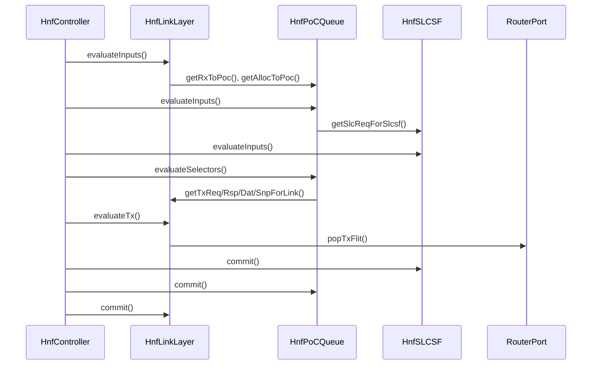
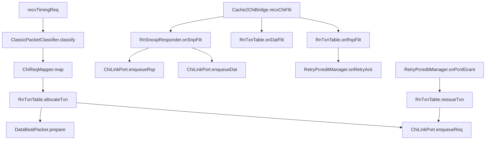

# HNF Gem5 C++ 类函数表与调用关系

## 1. 顶层调用关系

### 1.1 每周期 evaluate/commit 顺序

### 1.2 Bridge 调用关系

---

## 2. 类函数表

### 2.1 Top-level

| Class | Function | MVP/Full | Called by | Calls | 输入 | 输出/副作用 |
|---|---|---:|---|---|---|---|
| `HnfController` | `startup()` | MVP | gem5 | `schedule(tickEvent)` | none | 启动周期事件 |
| `HnfController` | `reset()` | MVP | gem5/config | `link.reset()`, `poc.reset()`, `slcsf.reset()` | none | 清空内部状态 |
| `HnfController` | `tick()` | MVP | eventq | `link.evaluateInputs`, `poc.evaluateInputs`, `slcsf.evaluateInputs`, `poc.evaluateSelectors`, `link.evaluateTx`, commits | 当前 cycle 状态 | 推进 1 cycle |
| `HnfController` | `recvChiFlit(const ChiFlit&, ChiChannel)` | MVP | router | `link.recvFromRouter` | flit | 入站 flit 入 link |
| `HnfController` | `sendCredit(ChiChannel,int)` | MVP | router | `link.addTxCredit` | channel credit | 更新 TX credit |

### 2.2 Cache2ChiBridge

| Class | Function | MVP/Full | Called by | Calls | 输入 | 输出/副作用 |
|---|---|---:|---|---|---|---|
| `Cache2ChiBridge` | `recvTimingReq(PacketPtr)` | MVP | classic port | `classifier.classify`, `mapper.map`, `txns.allocateTxn`, `chiPort.enqueueReq` | classic pkt | 创建 RN txn 或 unsupported |
| `Cache2ChiBridge` | `recvChiFlit(const ChiFlit&)` | MVP | router | `txns.onRspFlit`, `txns.onDatFlit`, `snoopResponder.onSnpFlit` | CHI flit | 更新 RN txn/生成 rsp/dat |
| `Cache2ChiBridge` | `tick()` | MVP | eventq | `retryMgr.tick`, `chiPort.tick`, `completeClassicPkts` | queues | 发送 flit/完成 pkt |
| `ClassicPacketClassifier` | `classify(PacketPtr)` | MVP | bridge | none | pkt | `MemoryIntent` |
| `ChiReqMapper` | `map(const MemoryIntent&)` | MVP | bridge | `makeReqFields` | intent | `ChiReqFlit`, policy flags |
| `RnTxnTable` | `allocateTxn(intent, req)` | MVP | bridge | `allocTxnId` | intent+req | `RnTxn&` |
| `RnTxnTable` | `onRspFlit(const ChiRspFlit&)` | MVP | bridge | `retryMgr.onRetryAck`, `markDbid`, `markComp`, `needCompAck` | RSP flit | state update, optional CompAck |
| `RnTxnTable` | `onDatFlit(const ChiDatFlit&)` | MVP | bridge | `mergeData`, `completeIfDone` | DAT flit | data/beat update |
| `RnTxnTable` | `reissueTxn(TxnID)` | MVP | retryMgr | `chiPort.enqueueReq` | txn id | 重新发 REQ |
| `RetryPcreditManager` | `onRetryAck(txn, rsp)` | MVP | txns | none | RetryAck | txn -> RetryPending |
| `RetryPcreditManager` | `onPcrdGrant(rsp)` | MVP | txns | `txns.reissueTxn` | PCrdGrant | 匹配并重发 |
| `RnSnoopResponder` | `onSnpFlit(const ChiSnpFlit&)` | MVP | bridge | `lookupClassicLine`, `makeSnpResp`, `makeSnpRespData` | SNP flit | RSP/DAT flit |
| `DataBeatPacker` | `packWriteData(RnTxn&)` | MVP | bridge | none | txn data | DAT flit vector |
| `ChiLinkPort` | `enqueueReq/Rsp/Dat/Snp` | MVP | bridge/HNF | none | flit | 入 TX queue |
| `ChiLinkPort` | `tick()` | MVP | bridge/HNF | router send | queues+credit | 发 flit |

### 2.3 HnfLinkLayer

| Class | Function | MVP/Full | Called by | Calls | 输入 | 输出/副作用 |
|---|---|---:|---|---|---|---|
| `HnfLinkLayer` | `recvFromRouter(const ChiFlit&)` | MVP | HnfController | `rxReq.push`/`rxRsp.push`/`rxDat.push` | flit | 入 RX channel queue |
| `HnfLinkLayer` | `evaluateInputs()` | MVP | HnfController.tick | `rxReq.evaluate`, `reqGrouper.group`, `dynStatic.allocateRxReq`, `fvbAllocator.tryAlloc` | router flit | H1/H2 parsed signals, alloc decision |
| `HnfLinkLayer` | `evaluateTx()` | MVP | HnfController.tick | `buildTxRspFastpath`, `buildTxReq`, `buildTxDat`, `buildTxSnp` | PoC TX messages, credits | TX flit pending |
| `HnfLinkLayer` | `commit()` | MVP | HnfController.tick | submodule commits | next regs | 更新 pipeline regs |
| `HnfLinkLayer` | `getRxToPoc()` | MVP | PoC | none | internal regs | RXREQ/RXRSP/RXDAT H2 message |
| `HnfLinkLayer` | `getAllocToPoc()` | MVP | PoC | none | dyn/static/FVB decisions | PoC allocation event |
| `ReqGrouper` | `group(const ChiReqFlit&)` | MVP | Link | none | RXREQ H1 | opcode mapping hints, fastpath flags |
| `DynStaticAllocator` | `allocateRxReq(req, pocFree)` | MVP | Link | `qosPool.canAlloc`, `retryAckFifo.push` | RXREQ | dynamic alloc or retry |
| `DynStaticAllocator` | `onPocRetire(pool, markStatic)` | MVP | Link | `qosPool.free`, `retryQosBank.pick` | retire info | maybe PCrdGrant |
| `RetryAckFifo` | `push(RetryRecord)` | MVP | allocator | none | retry record | FIFO write |
| `RetryAckFifo` | `popIfSent(bool txWon)` | MVP | txrsp | none | TXRSP sent | FIFO pop |
| `RetryQosBank` | `insert(RetryRecord)` | MVP | allocator | none | retry record | pending retry |
| `RetryQosBank` | `pickForGrant(freedPool)` | MVP | allocator | `StarvationArbiter.pick` | freed pool | PCrdGrant candidate |
| `PcrdGrantQueue` | `push/popIfSent` | MVP | allocator/txrsp | none | grant record | TXRSP PCrdGrant |
| `FvbAllocator` | `tryAlloc(FvbReq, rxReqGap, poolAvail)` | Full/MVP partial | Link | none | SEQ/init req | FVB allocation event |

### 2.4 HnfPoCQueue core

| Class | Function | MVP/Full | Called by | Calls | 输入 | 输出/副作用 |
|---|---|---:|---|---|---|---|
| `HnfPoCQueue` | `acceptLinkRx(const LinkToPocRx&)` | MVP | HnfController | encoders | parsed RX | 暂存 RX events |
| `HnfPoCQueue` | `acceptLinkAlloc(const LinkAllocToPoc&)` | MVP | HnfController | `allocator.allocate` | alloc event | entry load event |
| `HnfPoCQueue` | `acceptSlcResult(const SlcToPocResult&)` | MVP | HnfController | `slcDec.decode` | SLCSF result | entry flags/busy update |
| `HnfPoCQueue` | `evaluateInputs()` | MVP | HnfController.tick | `rxReqEnc`, `rxRspEnc`, `rxDatEnc`, `hazard`, `busy` | link/slc events | entry next state |
| `HnfPoCQueue` | `evaluateSelectors()` | MVP | HnfController.tick | `selector.pickAll`, decoders | entries | TX/SLC messages |
| `HnfPoCQueue` | `commit()` | MVP | HnfController.tick | submodule commits | next regs | 更新 entries/buffers |
| `PocAllocator` | `allocate(alloc, entries)` | MVP | PoC | `findStatic`, `findDynamic` | alloc event | entry idx/load_en |
| `PocRetire` | `pickRetire(entries)` | MVP | PoC | `ageQueue.oldest`, `findFirstReady` | entries busy | retire entry |
| `PocRetire` | `ageQueueAlloc/Retire` | MVP | PoC | none | entry idx | AgeQ 更新 |
| `PocHazard` | `detectAllocationHazard` | MVP | PoC | `abuf.camLinkAddr` | new addr | hazard result |
| `PocHazard` | `applySleepWake` | MVP | PoC | none | hazard result | sleep/wake/compareEnable |
| `PocHazard` | `onRetire` | MVP | PoC | none | retire entry | wake sleeping entry |
| `PocAddressBuffer` | `writeLinkAddr(entry, addr, ns)` | MVP | PoC | none | alloc | addr reg write |
| `PocAddressBuffer` | `writeVictimAddr(entry, addr, ns)` | MVP | slcDec | none | SLCSF victim | addr reg write |
| `PocAddressBuffer` | `readSlcAddr/readMcAddr/readSnpAddr` | MVP | selector/decoder | none | entry | addr |
| `PocAddressBuffer` | `detectSlcReplayHazard` | MVP | PoC | CAM1 | slc addr | replay flag |
| `PocDataBuffer` | `writeRxDat(entry, flit)` | MVP | rxDatEnc | BE merge | DAT | data/BE update |
| `PocDataBuffer` | `writeSlcData(entry, data)` | MVP | slcDec/dbufCtl | merge | SLC data | data update |
| `PocDataBuffer` | `readForTxDat(entry)` | MVP | dbufCtl | none | entry | 64B + BE |
| `PocDataBuffer` | `readForSlcFill(entry)` | MVP | slcEnc | none | entry | low/high OW |
| `PocDataBufferCtl` | `enqueueTxDat(entry, data, be, mask)` | MVP | selector | buffer A/B | data | pocbuf update |
| `PocDataBufferCtl` | `popForLink(credit)` | MVP | txDatDec | none | credit | DAT payload |
| `PocBusy` | `setOnAlloc(entry, decodedReq)` | MVP | rxReqEnc | none | decoded req | busyMask set |
| `PocBusy` | `updateFromRxRsp/RxDat/Slc/Tx` | MVP | PoC | none | events | busyMask clear/set |
| `PocBusy` | `isRetireReady(entry)` | MVP | retire | none | entry | bool |
| `PocSelector` | `pickL3` | MVP | PoC | `oldest`, `roundRobin` | entries/busy/sleep/slcBusy | entry idx |
| `PocSelector` | `pickMcRetry` | Full/MVP simplified | PoC | PCrd match | entries | entry idx |
| `PocSelector` | `pickMc` | MVP | PoC | RR | entries/credit | entry idx |
| `PocSelector` | `pickTxDat` | MVP | PoC | RR/QW ready | entries/dbufCtl | entry idx |
| `PocSelector` | `pickTxRsp` | MVP | PoC | oldest/RR | entries | entry idx |
| `PocSelector` | `pickTxSnp` | MVP | PoC | oldest/RR | entries | entry idx |

### 2.5 PoC encoders/decoders

| Class | Function | MVP/Full | Called by | Calls | 输入 | 输出/副作用 |
|---|---|---:|---|---|---|---|
| `PocRxReqEncoder` | `encodeOnAlloc(entry, rxreq, grouping)` | MVP | PoC | `mapOpcode`, `initSlcState`, `initBusyHints` | RXREQ + alloc | entry fields |
| `PocRxReqEncoder` | `mapOpcode(orig)` | MVP | PoC | none | ReqOpcode | IntOpcode |
| `PocRxReqEncoder` | `computeQwNeeded(size, ccid)` | MVP | PoC | none | size/ccid | QW mask |
| `PocRxRspEncoder` | `decode(const ChiRspFlit&)` | MVP | PoC | `matchEntryByTxnOrDbid` | RSP | response event |
| `PocRxRspEncoder` | `updateSnoopCounter(entry, rsp)` | MVP | PoC | none | SnpResp | snoopReceived++ |
| `PocRxRspEncoder` | `updateDbidComp(entry, rsp)` | MVP | PoC | none | DBID/Comp | DBID/Comp flags |
| `PocRxDatEncoder` | `decode(const ChiDatFlit&)` | MVP | PoC | `matchEntryByTxnOrDbid`, `dbuf.writeRxDat` | DAT | data event |
| `PocRxDatEncoder` | `updateBeatCounter(entry, dat)` | MVP | PoC | none | DAT | beat masks |
| `PocRxDatEncoder` | `detectDeadCopyBack(entry, dat)` | Full/MVP optional | PoC | none | DAT Resp | dead CB flag |
| `PocSlcEncoder` | `buildSlcReq(entry)` | MVP | selector | `abuf.readSlcAddr`, `dbuf.readForSlcFill` | entry | PocSlcReq |
| `PocSlcEncoder` | `updateFillStateFromResponses(entry)` | MVP | PoC | none | RXDAT/RXRSP events | slcState update |
| `PocSlcDecoder` | `decode(SlcToPocResult)` | MVP | PoC | busy/abuf/dbuf/txsnp | SLCSF result | entry updates |
| `PocTxReqDecoder` | `buildMcReq(entry)` | MVP | selector | `abuf.readMcAddr` | entry | PocTxReqMsg |
| `PocTxReqDecoder` | `setMcReadyFromEvents(entry)` | MVP | busy/slcDec/rxDat | none | events | mc ready flags |
| `PocTxRspDecoder` | `buildRsp(entry)` | MVP | selector | none | entry | PocTxRspMsg |
| `PocTxDatDecoder` | `buildDat(entry, pocbuf)` | MVP | selector/dbufCtl | none | entry+data | PocTxDatMsg |
| `PocTxDatDecoder` | `updateQwTxOnSend(entry)` | MVP | link sent | none | sent event | QW tx mask |
| `PocTxSnpDecoder` | `buildSnp(entry)` | MVP | selector | `abuf.readSnpAddr` | entry | PocTxSnpMsg |
| `PocMisc` | `updateConfigDerivedSignals()` | MVP | PoC | none | cfg | dmt/noFill/rnfvec flags |
| `PocMisc` | `updateTraceAndErrors(entry, event)` | MVP | PoC | none | RX/SLCSF events | trace/resperr/devevent |

### 2.6 SLCSF

| Class | Function | MVP/Full | Called by | Calls | 输入 | 输出/副作用 |
|---|---|---:|---|---|---|---|
| `HnfSLCSF` | `acceptPocReq(const PocSlcReq&)` | MVP | HnfController | `slcPipe.canAccept` | L3 req | input latch |
| `HnfSLCSF` | `evaluateInputs()` | MVP | HnfController | `slcPipe.evaluate`, `sfPipe.evaluate`, replay | req/pipelines | next results |
| `HnfSLCSF` | `commit()` | MVP | HnfController | arrays/pipes commit | next regs | pipeline advance |
| `HnfSLCSF` | `getResultForPoc()` | MVP | PoC | none | H9 regs | SlcToPocResult |
| `HnfSLCSF` | `getFvbReqForLink()` | MVP | Link | seq.peek | SEQ/FVB | FVB req |
| `HnfSLCSF` | `isBusy()` | MVP | PoC selector | none | pipe regs | bool |
| `SlcPipeline` | `accept(req)` | MVP | HnfSLCSF | none | PocSlcReq | H1 reg |
| `SlcPipeline` | `evaluateTagLookup()` | MVP | HnfSLCSF | `slcTag.read` | H2/H3 | hit/miss |
| `SlcPipeline` | `evaluateStateUpdate()` | MVP | HnfSLCSF | none | hit state/opcode | upstate/write intent |
| `SlcPipeline` | `evaluateVictim()` | MVP | HnfSLCSF | `victimPolicy.pick`, `slcData.read` | miss/full | victim info |
| `SlcPipeline` | `evaluateFill()` | MVP | HnfSLCSF | `slcTag.write`, `slcData.write` | fill req/data | tag/data write |
| `SlcPipeline` | `makePocResult()` | MVP | HnfSLCSF | none | H7/H9 regs | SlcToPocResult |
| `SfPipeline` | `acceptFromSlc(req, slcResult)` | MVP | HnfSLCSF | none | req/SLC hit | H2 reg |
| `SfPipeline` | `evaluateTagLookup()` | MVP | HnfSLCSF | `sfTag.read` | H3/H5 | SF hit/miss |
| `SfPipeline` | `evaluateAllocateUpdate()` | MVP | HnfSLCSF | `sfTag.write` | H6/H9/H3 | SF state write |
| `SfPipeline` | `decideSnoop()` | MVP | HnfSLCSF | none | SF/SLC/opcode | directed/broadcast |
| `SfPipeline` | `decideSelfCancel()` | Full/MVP limited | HnfSLCSF | none | orig/int opcode + SF | selfCancel |
| `SeqBuffer` | `pushVictim(sfLine)` | MVP | SfPipeline | none | victim | seq entry or full |
| `SeqBuffer` | `popForFvb()` | MVP | Link/FVB | none | seq | FVB req |
| `SlcReplayDetector` | `check(req, pipeSetway, pocHazard)` | MVP | SlcPipeline | none | req+fifo | replay cause |
| `SfReplayDetector` | `check(req, pipeSetway, seq)` | MVP | SfPipeline | none | req+seq | replay cause |
| `SlcSfInitEngine` | `start()` | MVP direct / Full staged | reset | none | reset | init state |
| `SlcSfInitEngine` | `tick()` | Full | HnfSLCSF | seq/FVB | cycle | init req/done |
| `SlcTagArray` | `read(set, tag, ns)` | MVP | SlcPipeline | none | set/tag | hit way/state |
| `SlcTagArray` | `write(set, way, line)` | MVP | SlcPipeline | none | line | tag update |
| `SlcDataArray` | `read(set, way)` | MVP | SlcPipeline | none | set/way | 64B data with latency |
| `SlcDataArray` | `write(set, way, data, mask)` | MVP | SlcPipeline | none | 64B data | data update |
| `SfTagArray` | `read(set, tag, ns)` | MVP | SfPipeline | none | set/tag | hit way/state |
| `SfTagArray` | `write(set, way, line)` | MVP | SfPipeline | none | line | tag update |

---

## 3. 最小实现顺序

1. `chi_enums.hh`、`chi_flit.hh`、`ChiLinkPort`。
2. `Cache2ChiBridge`：先支持 RNSD/RU/MU/Evict/WBF/NoSnp basic，必须实现 Retry/PCrdGrant/DBID/CompAck/SnoopResponder。
3. `HnfLinkLayer`：RX/TX channel、credit、fastpath、dynamic/static alloc、retry FIFO/bank。
4. `HnfPoCQueue`：entry、alloc/retire、busy、hazard、selector、RX/TX encdec、abuf/dbuf。
5. `HnfSLCSF`：SLC/SF tag lookup、SLC data、state update、victim、replay、SEQ/FVB。
6. 联调事务：RNSD hit -> RNSD miss -> RU snoop -> WBF allocate/noalloc -> Evict -> Retry。

---

## 4. 函数调用中的关键断言

| 断言 | 位置 | 目的 |
|---|---|---|
| `origOpcode != Unsupported` | `PocRxReqEncoder::encodeOnAlloc` | 防止 silent wrong mapping |
| `linkCredit[ch] > 0` before TX | `HnfLinkLayer::evaluateTx` | link flow control |
| `PCrdGrant != linkCredit` | `RetryPcreditManager` | 防止 credit 混淆 |
| `entry.valid` for all RXRSP/RXDAT matches | `PocRxRspEncoder/RxDatEncoder` | 防止孤儿 response |
| `!entry.sleep` before selector win | `PocSelector` | hazard 语义 |
| `busyMask == 0` before retire | `PocRetire` | 生命周期完整 |
| `snoopReceived <= snoopExpected` | `PocRxRspEncoder/RxDatEncoder` | snoop count 正确 |
| `all required QW present before TXDAT/SLC fill` | `PocTxDatDecoder/PocSlcEncoder` | data beat 正确 |
| `replay implies no tag/data write` | `SlcPipeline/SfPipeline` | replay 取消语义 |
| `DMT implies HNF no normal CompData to RN` | `PocTxReqDecoder` | DMT data path 正确 |
