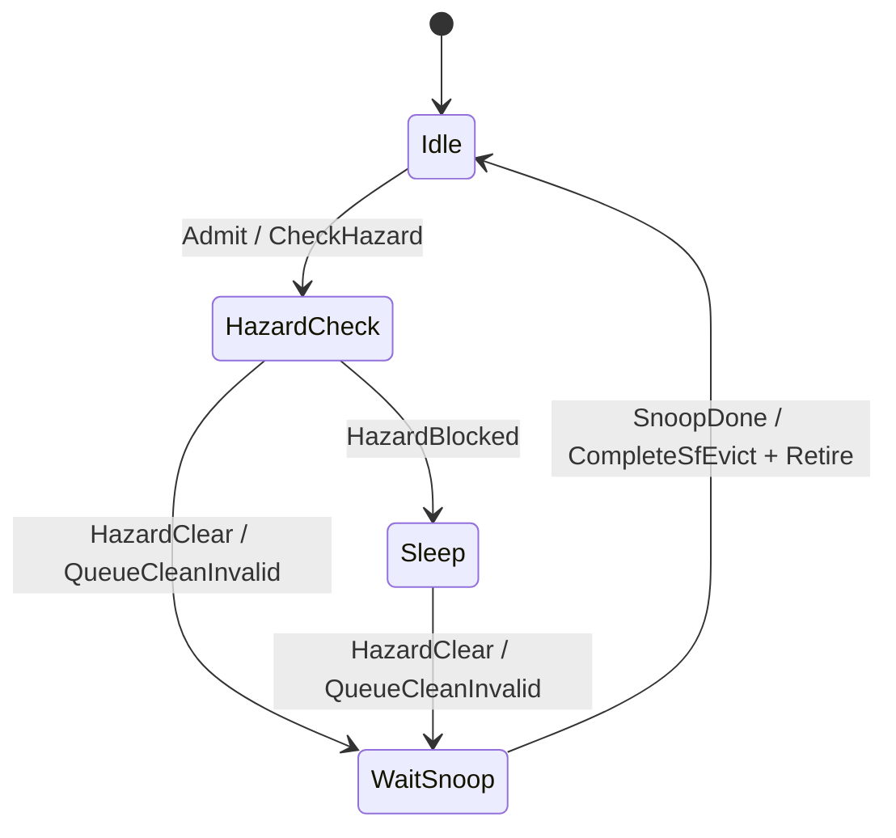

# HNF POCQ / SEQ 四核 Litmus 实现与调试案例

> 状态：已在 `kmhv2_chi_2x2_router.py` 四核配置上验证通过  
> 最后验证日期：2026-07-12  
> 适用范围：gem5 classic cache、`Cache2ChiBridge`、2x2 CHI router、HNF POCQ、功能级 SLC/SF 与 SEQ  
> 相关规格：[HNF_SLCSF_Gem5_Spec.md](HNF_SLCSF_Gem5_Spec.md)、[HNF_Gem5_Architecture_Design_Document.md](HNF_Gem5_Architecture_Design_Document.md)

## 1. 文档目的

本文记录本轮 HNF POCQ、SLC/SF、SEQ 和四核验证工作的最终实现状态，并把调试过程中遇到的问题整理成可复用的 case study。目标不是代替 CHI 或 RTL 规格，而是回答以下工程问题：

1. 当前代码新增了哪些功能，模块之间如何配合。
2. `Trans_Graph` 中的事务如何进入 POCQ 状态机并被 CC 执行。
3. SF victim 如何进入 SEQ、发送反向失效、保存 dirty data 并退休。
4. 四个 XiangShan 核如何先在 L2 wrapper xbar 汇聚，再以每核一个 bridge 接入 CHI。
5. 四核 litmus 实际覆盖了哪些一致性行为，哪些事务只能由定向测试覆盖。
6. 数据错误、资源竞争和死锁是怎样定位并修复的。
7. 当前仍有哪些已知限制，后续修改不能破坏哪些不变量。

## 2. 最终验证结论

### 2.1 整机结果

| 场景 | 关键参数 | 结果 | 退出 tick |
|---|---|---:|---:|
| 默认 SF 容量，小 L1/L2 压力 | `4 CPU, 每核 L1D=16kB, 每核 L2 wrapper=32kB` | 7/7 litmus 通过 | `593787951` |
| 强制 SF 淘汰与 SEQ 压力 | 上述参数加 `SF=64 sets x 4 ways, SEQ=4` | 7/7 litmus 通过 | `612432288` |

两次最终运行都满足：

```text
CHI_LITMUS_PASS total_errors=0
```

四个 hart 的最终数据校验完全一致：

```text
alias    = 0x50000001f0
pressure = 0x2800000000ffc000
bad line count = 0
```

当前 xbar 下游 bridge 拓扑的强制 SEQ 整机运行完整通过。另一次 `80M..150M` tick 有界 trace 记录到 2624 次 `SEQ install`、2624 次 `SEQ POCQ admit`、2624 次 `SEQ POCQ retire` 和 686 次内部 `TXSNP`。该采样运行按 150M tick 上限结束；是否正常退出以表中的完整整机回归为准。

### 2.2 单元测试结果

| 测试程序 | 数量 | 结果 |
|---|---:|---:|
| `hnf_pocq_state_graph.test.opt` | 15 | 15/15 |
| `hnf_seq_pocq_state_graph.test.opt` | 2 | 2/2 |
| `hnf_slcsf.test.opt` | 10 | 10/10 |
| `hnf_coherency_controller.test.opt` | 9 | 9/9 |
| 合计 | 36 | 36/36 |

## 3. 四核 2x2 CHI 拓扑

### 3.1 拓扑结构

目标配置是 [kmhv2_chi_2x2_router.py](../../../configs/example/kmhv2_chi_2x2_router.py)。四个 router 的逻辑位置为 `(0,0)`、`(1,0)`、`(0,1)` 和 `(1,1)`：

```text
router(0,0): 4 个 RNF bridge，每核一个
router(1,0): SN bridge -> classic SN cache -> DDR
router(1,1): HNF
router(0,1): mesh transit
```

四个 CPU 各有四个 L2 slice，但 slice 先在每核 `L2CacheWrapper` 的内部 `CoherentXBar` 汇聚，系统只创建 4 个 `Cache2ChiBridge`。连接关系为：

```text
CPU[i]
  -> L1/L2 wrapper[i]
  -> L2 slice[i][0..3]
  -> wrapper[i].xbar.cpu_side_ports[0..3]
  -> wrapper[i].xbar.mem_side_ports[0]
  -> Cache2ChiBridge[i]
  -> router(0,0).device_ports[i * 4]
  -> 2x2 CHI mesh
  -> HNF node 0x90
```

bridge 的 `mem_side` 只承担 uncacheable/functional classic bypass，直接接 `system.membus`；cacheable miss 走 CHI、HNF 和 SN cache。2x2 脚本显式关闭 classic shared L3，避免同一个 xbar 同时存在两条 cacheable downstream 路径。

### 3.2 每核 SrcID 规则

一个 CPU 只有一个外部 RNF bridge 和一个 SrcID。当前编码为：

| CPU | RNF SrcID | bridge 索引 |
|---:|---:|---|
| 0 | `0x00` | 0 |
| 1 | `0x04` | 1 |
| 2 | `0x08` | 2 |
| 3 | `0x0c` | 3 |

SrcID 表示一致性 requester。HNF 的 `rnf_slices=1`，因此 snoop 始终路由到每核 D0 endpoint；进入 bridge 后由内部 xbar 的 snoop filter 把 classic snoop 发往相关 slice：

```cpp
rnfSlices = 1;
targetRoute = targetNode; // 0x00, 0x04, 0x08, 0x0c
```

这样 SF 保存 requester SrcID，CHI 不再暴露 L2 slice 数量。

### 3.3 TxnID 与并发边界

每核只有一个 bridge，因此四核都可以使用 `txnid_base=0`；不同核由 SrcID 区分，同核由 bridge 本地 transaction table 保证 TxnID 唯一。默认 `num_txns=32` 是每核共享的外部 outstanding 上限，而不是每 slice 32 个。slice 仍可并发执行内部 hit/miss，但所有离核请求在 xbar/bridge/CHI link 上汇聚和仲裁，这更符合一个 cache wrapper 只有一个外部接口的建模目标。

相关实现：

- [xiangshan.py](../../../configs/common/xiangshan.py)
- [CacheConfig.py](../../../configs/common/CacheConfig.py)

## 4. POCQ 事务图实现

### 4.1 DrawIO 到运行时状态图

事务源图位于：

```text
src/mem/cache/CHI/StateGraph/Trans_Graph/
```

转换脚本为：

```text
src/mem/cache/CHI/StateGraph/drawio_to_pocq.py
```

目录同时包含 RN request、MC 子流程和 snoop 图。当前 HNF 主 POCQ 的运行时事务集合是 12 类 RN/HNF request；snoop 图不是作为第二个外部 RN request entry 分配，而是由主 POCQ 或内部 SEQ POCQ 产生 `TXSNP`，再由 `RXRSP/RXDAT` 事件推进原 entry。

运行时代码：

- [HnfPOCQStateGraph.hh](../../mem/cache/CHI/HnfPOCQStateGraph.hh)
- [HnfPOCQStateGraph.cc](../../mem/cache/CHI/HnfPOCQStateGraph.cc)
- [HnfCoherencyController.cc](../../mem/cache/CHI/HnfCoherencyController.cc)

### 4.2 主 POCQ 的职责分工

`POCQ_StateGraph` 只表达状态、条件和动作，不直接操作 link、SLC 或 SF。`HnfCoherencyController` 执行动作：

| POCQ action | CC 侧实现含义 |
|---|---|
| `DoSlcLookup` | 调用 SLC/SF lookup，保存 hit、state、snoop target 和 replay 信息 |
| `QueueSnoops` | 分配 snoop TxnID，并为每个 target 生成 `TXSNP` |
| `QueueTxReq` | 向真实 SN 发送下游 `ReadNoSnp` |
| `QueueCompData` | 按 data beat 生成 requester `CompData` |
| `QueueComp` | 生成 dataless `Comp` |
| `QueueCompDBIDResp` | 为写事务返回 DBID/完成信息 |
| `CommitRead` / `UpdateSlcSf` | 提交 SLC data 和 SF directory 状态 |
| `StoreWriteData` | 写入 copyback/non-copyback data |
| `RemoveSharer` | 处理 `Evict` |
| `WaitCompAck` | 保持 entry，直到 requester 返回 `CompAck` |
| `Retire` | 释放 entry、SF reservation，并唤醒同地址 waiter |

### 4.3 ReadNoSnp 特殊路径

`ReadNoSnp` 是不分配 SF/SLC 的直接下游读取：

```text
Idle
  -> IssueMcRead
  -> receive real-SN CompData
  -> TxLink / QueueCompData
  -> Retire
```

它不能复用普通 coherent read 的 `UpdateSlcSf` 动作，否则会把 non-snoop 数据错误地安装到一致性目录中。相关回归测试：

- `ReadNoSnpSkipsSlcUpdate`
- `ReadNoSnpReturnsWithoutAllocatingSlcSf`

### 4.4 当前支持的 12 类事务

| POCQ 事务 | 测试 opcode | 主要完成条件 | CPU litmus 自然触发 |
|---|---:|---|---:|
| `ReadShared` | `0x01` | data + CompAck | 是 |
| `ReadUnique` | `0x07` | snoop/data + CompAck | 是 |
| `ReadNoSnp` | `0x04` | real-SN data | 否 |
| `ReadOnce` | `0x03` | data + CompAck | 否 |
| `CleanInvalid` | `0x09` | snoop/maintenance Comp | 否 |
| `MakeInvalid` | `0x0a` | snoop/maintenance Comp | 否 |
| `MakeUnique` | `0x0c` | unique permission Comp | 通常被 bridge 提升为 ReadUnique |
| `Evict` | `0x0d` | remove requester sharer + Comp | 是 |
| `WriteBackFull` | `0x5b` | DBID + copyback data + Comp | 是 |
| `WriteCleanFull` | `0x57` | DBID + copyback data + Comp | 否 |
| `WriteUnique` | `0x59` | DBID + non-copyback data + Comp | 否 |
| `WriteEvictFull` | `0x55` | DBID + copyback data + Comp | 依赖 classic packet 状态 |

`EverySupportedTransactionCompletes` 为每一类事务构造完整的 SN data、snoop response、write data、DBID、Comp 和 CompAck 序列，并要求 entry 最终退休且 CC 无残留工作。

这里必须区分两种覆盖：

1. **控制器全事务覆盖**：12/12，使用定向输入驱动每个 POCQ 流程。
2. **CPU workload 运行时覆盖**：CPU load/store/eviction 自然产生 `ReadShared`、`ReadUnique`、`WriteBackFull` 和 `Evict`。普通 RISC-V 指令无法直接要求所有 CHI maintenance 或 write opcode。

旧拓扑的一次 bridge trace 曾采样到以下 opcode；它只用于证明路径被执行，不作为当前 xbar 下游拓扑的事务总数或性能统计：

```text
ReadShared     0x01: 15388
ReadUnique     0x07:  4233
WriteBackFull  0x5b:  2864
Evict          0x0d: 14006
```

这些数字用于证明路径被实际执行，不是性能统计，也不是完整运行的事务总数。

## 5. 功能级 SLC/SF 模型

### 5.1 存储结构

当前 [HnfSLCSF](../../mem/cache/CHI/HnfSLCSF.hh) 是 CC 内部使用的功能级 C++ 模型：

```text
SLC: slc_num_sets x slc_num_ways
SF : sf_num_sets  x sf_num_ways
SEQ: seq_entries
```

SLC 和 SF 都按 cache line 地址计算 set/tag，replacement 使用 `lastUse` 近似 LRU。SF 使用 64 位 sharer mask，bit 位置等于 RNF SrcID，因此当前 SrcID 必须小于 64。

### 5.2 状态与数据规则

主要规则如下：

1. `ReadShared` 可以在 SLC 中保留 clean/dirty data，并向 SF 增加 requester。
2. `ReadUnique` 使 requester 成为唯一 SF owner，并使 SLC copy 失效。
3. directed snoop 优先指向 unique owner，broadcast snoop 使用 sharer vector。
4. `Evict` 只移除发起者自己的 sharer bit。
5. `WriteBackFull/WriteEvictFull` 写入 SLC，并移除 copyback requester。
6. 如果 copyback requester 已不在当前 SF sharer 集合中，该回写是旧 owner 的延迟数据，不能覆盖新 owner。
7. `WriteCleanFull` 保留 requester 的 SF sharer 状态。
8. `WriteUnique` 更新 SLC 后清空 SF。

### 5.3 SF set 与 SEQ slot reservation

只在 lookup 时检查 SEQ 容量不够。两个不同 POCQ entry 可以同时看到“还有一个空位”，随后各自淘汰 SF victim，最终超额安装 SEQ。

当前实现增加两层 reservation：

```text
sfReservationOwners[set]       每个 SF set 同时只有一个修改者
reservedSeqSlots               已承诺但尚未安装的 SEQ slot 数
sfReservations[entry]          entry -> {set, blockAddr, needsSeqSlot}
```

资源判断为：

```text
seqOccupancy + otherReservedSeqSlots < seqCapacity
```

entry 自己已经持有的 reservation 不重复计数。reservation 在 read/maintenance/write commit、replay cleanup 或 entry retire 时释放。

这个设计保证：

1. 同一 SF set 的 victim 选择与写入是串行的。
2. 不同 set 的并发事务不能共同透支最后一个 SEQ slot。
3. 被阻塞的 entry 进入 `Sleep`，由 `serviceInternalWork()` 重试，不修改 SLC/SF。

回归测试：`ReservationsPreventSeqSlotOvercommit`、`SeqReservationReplayMakesProgress`。

## 6. SEQ POCQ 实现

### 6.1 为什么需要独立 SEQ POCQ

SF set 满时，新目录项不能直接覆盖旧项。旧 SF line 可能仍有 RNF sharer 或 dirty owner，必须先执行 back-invalidation：

```text
SF victim snapshot
  -> SEQ
  -> snoop every recorded sharer
  -> collect SnpResp/SnpRespData
  -> preserve dirty data in SLC
  -> invalidate old SF line
  -> release SEQ slot
```

SEQ storage 可以保存多个 victim，但当前 CC 同时执行一个内部 `SeqPocqEntry`，其余 victim 在 `seqPending` 中等待。这是有意的功能级串行实现。

### 6.2 SEQ 状态图

运行时状态图位于：

- [HnfSeqPOCQStateGraph.hh](../../mem/cache/CHI/HnfSeqPOCQStateGraph.hh)
- [HnfSeqPOCQStateGraph.cc](../../mem/cache/CHI/HnfSeqPOCQStateGraph.cc)



### 6.3 Snoop 与 dirty data

SEQ 为 victim 的每个 sharer 生成 `SnpCleanInvalid`，所有 snoop 使用同一个内部 snoop TxnID。收到响应后：

1. 清除对应 responder bit。
2. 最多允许一个 responder 返回 dirty data。
3. `SnpRespData` 按 beat offset 写入 SEQ data buffer。
4. 所有 target 完成后调用 `completeSfEvict()`。
5. 如果收到 dirty data，将其以 dirty state 安装到 SLC，再释放 SEQ。

回归测试：`SeqPocqBackInvalidatesSfVictim`、`SeqPocqPreservesDirtySnoopData`、`DirtySeqSnoopDataIsPreservedInSlc`。

### 6.4 主 POCQ 与 SEQ 的地址顺序

SEQ 必须等待已经开始执行的同地址主 POCQ，避免在主事务正在收集 snoop/data 时反向失效同一行。反过来，因 SEQ 或地址 hazard 尚未开始执行的 `Sleep` entry 不能阻塞 SEQ，否则会形成等待环。

当前不变量为：

```text
hasMainAddressHazard(addr)
    = 存在 allocated、同地址、state != Sleep 的主 POCQ entry
```

`Sleep` entry 没有持有该行的执行权，必须排在当前 SEQ 之后。回归测试：`SeqPocqSleepsForMainAddressHazard` 和 `SeqPocqIgnoresYoungerSleepingWaiters`。

## 7. Cache2ChiBridge 的 snoop/copyback 顺序

### 7.1 bridge 不只是 opcode 转换器

`Cache2ChiBridge` 同时维护：

```text
pendingReqPkts             尚未进入 CHI txn table 的 classic request
txns                       已分配 CHI TxnID 的 RN transaction
pendingRespPkts            等 classic response port retry
pendingCompAcks            classic response 接受后待发的 CompAck
snoops                     HNF TXSNP 对应的 classic snoop
pendingSnoopRetries        等待本核 transient ownership transfer 的 snoop
```

它必须处理 read data、DBID、write data、Comp、CompAck、RetryAck/PCrdGrant 和 snoop response，不能只做 `Packet -> RawReq` 字段映射。

### 7.2 pending copyback 是最新数据源

dirty line 从 classic cache 淘汰后，数据可能已经不在 tag/data array 中，但仍保存在 bridge 的 `WriteBackFull` 或 `WriteEvictFull` packet 中。如果此时 HNF 发来 snoop，向 cache 查询会得到 miss，直接返回无数据会让 HNF错误地从旧内存读取。

当前顺序为：

```text
incoming snoop
  -> search active copyback txns
  -> search queued copyback packets
  -> if found, return SnpRespData from buffered packet
  -> otherwise send classic timing snoop
```

最终 trace 实际命中了 10 次 `active copyback supplies snoop`。`queued copyback` 分支是对更窄入口窗口的防御性处理，最终 trace 没有命中，因此不能把它描述成该次失败日志直接证明的唯一根因。

### 7.3 `SNOOP_PRECEDES_MSHR` 只能按真实顺序设置

如果 bridge 中同地址 outbound transaction 尚未得到任何 CHI response，或者同地址 request 仍在 `pendingReqPkts`，HNF snoop 在全局顺序上可能先于这个 request，此时设置 `SNOOP_PRECEDES_MSHR`。

如果 outbound ReadUnique 已经得到响应并将 ownership 交给 cache MSHR，后到的 snoop 应由 MSHR deferred snoop 流程返回 pending-modified data，不能再强制标记为“snoop 更早”。

当前判断只在以下条件成立时设置该 flag：

```text
same block && !completed && !gotComp && !gotData && !hasDbid
```

或同地址 packet 尚在 bridge 入口队列。

### 7.4 xbar 下游端口契约

bridge 作为 xbar 唯一 downstream responder 后，必须完整实现 classic port 契约：

1. `cache_side.getAddrRanges()` 返回 `mem_side` 从 membus 获得的地址范围。
2. `mem_side.recvRangeChange()` 调用 `cache_side.sendRangeChange()` 向 xbar 传播变化。
3. `sendTimingResp()` 返回 false 后设置 `cacheRespBlocked`，只排队 response。
4. 收到 `recvRespRetry()` 后才清除 blocked 状态并恢复发送。

没有前两项，xbar 在第一次地址查找时会因未收齐 range 而断言；没有后两项，同一个 bridge port 会在仍位于 xbar retry queue 时重复提交 response。

### 7.5 Upgrade 与 transient snoop

classic `UpgradeReq` 在 L2 miss 或失效竞争后可能需要 CHI `ReadUnique` 获取 ownership。bridge 内部将其提升为带 data 的 ReadUnique，但记录 `respondAsUpgrade`；CHI 完成及 CompAck 规则不变，返回 classic cache 时恢复为无 data 的 `UpgradeResp`，避免向原始 Upgrade MSHR target 复制整行。

另一个边界是 dirty line 正在同核 L2 与 L1 之间转移：L2 已清 dirty、L1 MSHR 尚未接收 response 时，external snoop 可能观察到 `hasSharers=1` 但没有 responder。bridge 对这种状态做最多 32 个周期的有界重试；真正的 miss 仍立即返回 I。压力回归中的 `pressure[3][3312]` 正是由这一窗口暴露，修复后四核 checksum 都恢复为 `0x2800000000ffc000`。

## 8. 四核 Litmus workload

### 8.1 程序位置与构建

程序位于另一个工作区：

```text
/home/makenma/project/xs-gem5/nexus-am/apps/chi-litmus/
```

构建命令：

```bash
cd /home/makenma/project/xs-gem5/nexus-am/apps/chi-litmus
make ARCH=riscv64-xs \
  AM_HOME=/home/makenma/project/xs-gem5/nexus-am \
  REBUILD=1
```

输出镜像：

```text
build/chi-litmus-riscv64-xs.bin
```

### 8.2 为什么 barrier 不使用 AMO

当前 `Cache2ChiBridge` 对 `LockedRMW*`/atomic 明确报 unsupported，因此 litmus 使用每 hart 独占 cache line 的 phase slots 实现 barrier。每个 hart 只写自己的 slot，读取所有 slot，并在前后使用 RISC-V fence。

这既避免了 atomic 映射问题，也会持续产生跨核 `ReadShared`、ownership 和 dirty eviction 流量。

### 8.3 七项测试

| ID | 测试 | 目标 |
|---:|---|---|
| 0 | MP | release/acquire 下 message passing 可见性 |
| 1 | synchronized SB | 写阶段完成后，所有核必须读到对方的写 |
| 2 | WRC | 三核 write-read causality |
| 3 | IRIW | 两写者、两读者的顺序一致性检查 |
| 4 | ownership ring | 四核循环传递同一 dirty line 的 token 和 payload |
| 5 | SF alias churn | 强制大量 line 映射到同一 SF set，触发 SF victim/SEQ |
| 6 | cache pressure | 每核写 64 KiB，再由四核跨 owner 读取，触发 copyback/evict/snoop |

### 8.4 SF alias 构造

alias test 使用：

```text
ALIAS_LINES = 32
SF_ALIAS_SETS = 64
stride = 64 sets * 64 bytes = 4096 bytes
```

当 HNF 配置为 `sf_num_sets=64` 时，32 个 alias line 都映射到同一 SF set。四个 hart 分别写 `i = hart, hart+4, ...`，随后以不同排列读取全部 line，避免只检查本地写入。

### 8.5 cache pressure 与绝对 oracle

每个 hart 写：

```c
pressure[hart][i] = ((uint64_t)(hart + 1) << 48) ^ i;
```

随后每个 hart 从四个 owner 的数组中每 cache line 读取一个 word。正确 checksum 是数学上固定的：

```text
0x2800000000ffc000
```

测试不是只比较四个 hart 是否相等，而是每个 hart 都必须等于绝对期望值。失败时再进行第二遍扫描，记录：

```text
reader hart
bad count
first bad owner
first bad index
expected value
actual value
```

第二遍定位只在 checksum 已经确定后运行，不改变主压力读取的竞争时序。

## 9. 复现命令

以下命令从 `GEM5` 目录执行。

### 9.1 构建 gem5

```bash
scons build/RISCV/gem5.opt -j16
```

### 9.2 默认 SF 回归

```bash
build/RISCV/gem5.opt \
  --outdir=m5out/kmhv2_chi_2x2_router_4cpu_litmus_xbar6 \
  --listener-mode=off \
  --redirect-stdout --stdout-file=simout \
  --redirect-stderr --stderr-file=simerr \
  configs/example/kmhv2_chi_2x2_router.py \
  --num-cpus=4 \
  --generic-rv-cpt=/home/makenma/project/xs-gem5/nexus-am/apps/chi-litmus/build/chi-litmus-riscv64-xs.bin \
  --raw-cpt --no-pf \
  --l1d_size=16kB --l2_size=32kB \
  -m 2000000000
```

### 9.3 强制 SF/SEQ 回归

```bash
build/RISCV/gem5.opt \
  --outdir=m5out/kmhv2_chi_2x2_router_4cpu_litmus_xbar_seq \
  --listener-mode=off \
  --redirect-stdout --stdout-file=simout \
  --redirect-stderr --stderr-file=simerr \
  configs/example/kmhv2_chi_2x2_router.py \
  --num-cpus=4 \
  --generic-rv-cpt=/home/makenma/project/xs-gem5/nexus-am/apps/chi-litmus/build/chi-litmus-riscv64-xs.bin \
  --raw-cpt --no-pf \
  --l1d_size=16kB --l2_size=32kB \
  -P 'system.home_node[0].sf_num_sets=64' \
  -P 'system.home_node[0].sf_num_ways=4' \
  -P 'system.home_node[0].seq_entries=4' \
  -m 2000000000
```

需要生成有界 SEQ trace 时，在上述命令中加入：

```bash
--debug-flags=HnfCC,HnfSLCSF \
--debug-start=80000000 --debug-end=150000000 \
--debug-file=seq.log.gz
```

### 9.4 单元测试

```bash
build/RISCV/mem/cache/CHI/hnf_pocq_state_graph.test.opt
build/RISCV/mem/cache/CHI/hnf_seq_pocq_state_graph.test.opt
build/RISCV/mem/cache/CHI/hnf_slcsf.test.opt
build/RISCV/mem/cache/CHI/hnf_coherency_controller.test.opt
```

## 10. Debug Case Studies

### Case 1：ReadNoSnp 错误进入 SLC/SF update

**现象**

真实 SN 返回 `CompData` 后，ReadNoSnp 沿普通 read 的完成边进入 `UpdateSlcSf`，最终调用只接受 coherent read 的 `commitRead()`，可能触发 non-read/non-allocating transaction panic，或者错误地在 SF 中安装目录项。

**根因**

状态图中的 `McDataDone` 条件过宽。ReadNoSnp 和普通 SLC miss 都经过 `IssueMcRead`，但它们的 fill 语义不同：

```text
coherent read miss: MC data -> update SLC/SF -> requester data
ReadNoSnp:          MC data -> requester data -> retire
```

**修复**

增加 ReadNoSnp 专用条件 `isMcDataDoneReadNoSnp`，从 `IssueMcRead` 直接转向 `TxLink` 并执行 `QueueCompData`。真实 SN 最后一个 data beat 可以直接返回 retire info。

**回归**

```text
ReadNoSnpSkipsSlcUpdate
ReadNoSnpReturnsWithoutAllocatingSlcSf
EverySupportedTransactionCompletes/ReadNoSnp
```

**经验**

状态相同不代表 commit 语义相同。事务图的边条件必须同时包含 event kind 和 transaction kind。

### Case 2：并发 SF replacement 透支 SEQ slot

**现象**

多个不同 set 的请求在 lookup 时都观察到 SEQ 尚有空位，随后并发 commit，每个都试图安装 SF victim。极端情况下会触发：

```text
HnfSLCSF installs SF victim while SEQ is full
```

或造成请求持续 replay，无法证明前进性。

**根因**

lookup 的容量检查只是瞬时观察，没有为未来 commit 保留资源。问题本质是典型的 check-then-act race。

**修复**

在主 POCQ 开始 SLC/SF flow 前调用 `tryReserveSfResources()`：

1. 独占目标 SF set。
2. 如果 full set replacement 将产生 victim，预留一个未来 SEQ slot。
3. 资源不足时 entry 进入 replay Sleep，不修改 storage。
4. commit 或 retire 时释放 reservation。

**回归**

```text
ReservationsPreventSeqSlotOvercommit
SeqReservationReplayMakesProgress
```

**经验**

任何在 lookup 和 commit 之间可能变化的有限资源，都必须 reservation 或在 commit 时重新仲裁，不能只依赖早期布尔结果。

### Case 3：无条件 SNOOP_PRECEDES_MSHR 丢失 dirty owner data

**现象**

alias test 的正确 checksum 为：

```text
0x50000001f0
```

失败 hart 得到：

```text
0x4e000001d7
```

差值恰好是：

```text
0x200000019
```

它对应 hart1 写入的 alias index 25。目标 line 在该次链接布局中的地址为 `0x8005c000`。

trace 显示：

1. 旧 owner 的 writeback 含 word0 `0x1a`。
2. hart1 的 ReadUnique 正确取得 dirty word0 `0x1a`。
3. 后续 ReadShared snoop hart1 时，HNF 没收到 data，退回 memory data `0`。
4. hart1 更晚的 WriteBackFull 中其实仍有正确值 `0x200000019`。

**根因**

bridge 对所有 incoming snoop 无条件设置 `SNOOP_PRECEDES_MSHR`。classic cache 因而认为 snoop 在 MSHR request 之前，不执行 pending-modified/deferred snoop data 路径，即使 ReadUnique 已经在全局顺序上先于 snoop。

**修复**

只有 bridge 中存在同地址、尚未收到 Comp/Data/DBID 的 outbound request，或 request 尚在入口队列时，才设置该 flag。已经完成 ownership transfer 的 MSHR 由 classic cache 的 deferred snoop 路径返回数据。

**回归证据**

最终默认和强制 SEQ 运行中，四个 hart 的 alias checksum 都恢复为 `0x50000001f0`。

**经验**

`SNOOP_PRECEDES_MSHR` 是全局顺序声明，不是“收到 snoop 时有 MSHR”的通用提示。错误设置会直接改变一致性状态机分支。

### Case 4：pending copyback 与 stale writeback 的数据权威问题

**现象**

小 L1/L2 压力下曾出现：

```text
expected: 0x2800000000ffc000
hart2:    0x2800000000ffc000
others:   0x27fa000000ffa650
delta:    0x00060000000019b0
```

只有本地 owner 能看到完整数据，其他 reader 得到一致的旧值，说明问题不在 checksum 算法，而在 dirty data 从 owner 到 HNF 的转移窗口。

**根因类别**

dirty line 离开 classic cache 后，最新数据可能仍位于 bridge 的 copyback packet 中。此时 cache snoop miss 不代表系统没有最新数据。另一个风险是旧 owner 的延迟 writeback 在新 owner 建立后到达 HNF，如果无 generation/owner 判断，会覆盖更新的数据。

失败运行没有同时记录足够的 bridge 队列状态，因此不能严格断言 active 与 queued copyback 中哪一个是唯一直接根因。最终 trace 直接证明 active copyback snoop 路径被命中 10 次；queued 分支属于覆盖更窄窗口的防御性实现。

**修复**

1. snoop 先从 active/queued `WriteBackFull`、`WriteEvictFull` packet 返回 `SnpRespData`。
2. HNF 收到 copyback 时，如果当前 SF 存在且 requester 已不在 sharer mask 中，丢弃该 stale writeback。
3. 保留当前 owner 的合法 writeback，并将 dirty data 安装到 SLC。

**回归**

```text
CurrentOwnerWritebackPreservesLatestData
StaleWritebackCannotOverwriteNewOwner
四核 cache pressure absolute checksum
```

**经验**

一致性系统中的“最新数据权威”可能位于 cache array、MSHR、write buffer、bridge packet 或 HNF SLC。调试时必须追踪数据所有权，而不是只看 tag hit/miss。

### Case 5：只比较各核 checksum 会掩盖共同错误

**现象**

初版 pressure test 只让 hart0 比较四个 hart 的 checksum。如果所有核都读到同一个旧值，测试会错误通过。

**根因**

oracle 只验证一致性，没有验证正确性：

```text
all readers equal != all readers correct
```

**修复**

根据写入公式独立计算绝对 expected checksum，每个 hart 自己比较。如果失败，在 checksum 已经固定之后执行第二遍扫描，记录首个错误 line。

**经验**

多核测试至少需要一个与被测系统状态独立的绝对 oracle。交叉比较只能作为附加检查。

### Case 6：SEQ 与同地址 Sleep waiter 形成死锁

**现象**

强制 `SF=64x4, SEQ=4` 时，CPU commit watchdog 报告：

```text
Commit stage is stucked for more than 40,000 cycles
load address = 0x80002000
abort tick   = 119906640
```

`0x80002000` 是 litmus barrier line。HNF trace 的等待图为：

```text
SEQ id=37 owns victim 0x80002000
entry8 waits because seqContains(0x80002000)
entry12 remains Sleep on an older same-address hazard
SEQ id=37 sees entry12 as main address hazard and sleeps
```

于是形成：

```text
SEQ waits for sleeping main entry
sleeping main entry waits for SEQ
```

同时 SEQ occupancy 为 4/4，其他 replacement 也全部 replay，所以系统没有旁路进展。

**根因**

`hasMainAddressHazard()` 只排除了 `slcsfReplay` entry，没有排除普通 address-hazard `Sleep` entry。Sleep entry 尚未执行 SLC/SF lookup，不应反向阻塞已经拥有 victim 的 SEQ。

**修复**

SEQ 只把 `state != Sleep` 的同地址主 entry 视为 hazard。真正处于 Working、WaitSnoop、IssueMcRead 等状态的旧事务仍会阻塞 SEQ；所有尚未开始的 Sleep waiter 排在 SEQ 后面。

**回归**

```text
SeqPocqSleepsForMainAddressHazard
SeqPocqIgnoresYoungerSleepingWaiters
```

修复后的同一 trace：

```text
106120107: SEQ id=37 HazardCheck -> HazardClear -> WaitSnoop
106120107: queue SnpCleanInvalid to RNF 0 and 4
106129098: receive all snoop responses, including dirty data
106129098: complete and retire SEQ id=37
```

整机随后在 tick `620678034` 正常退出。

**经验**

等待图中，等待某资源的请求不能反过来阻塞该资源的释放者。对每一种 Sleep 原因都应明确“它持有哪些资源”和“它能阻塞谁”。

### Case 7：极小 `num_txns` 暴露 TxnID 跨通道复用限制

**现象**

为了强制制造 bridge 入口排队，曾临时把所有 bridge 的 `num_txns` 从默认 32 降低：

```text
num_txns=1: panic at tick 478188
num_txns=4: panic at tick 104191371
```

panic 为：

```text
HnfCC CompAck entry state is not WaitCompAck
```

**根因推断**

可用 TxnID 太少时，bridge 在旧事务的 CompAck 已进入 RSP channel、但 HNF 尚未消费之前立即复用同一个 `(SrcID, TxnID)` 发新 REQ。REQ 与 RSP 是独立通道，router/HNF 的消费顺序可能让新 REQ 先被观察，随后旧 CompAck 命中新 entry。

**当前状态**

这个问题未在本轮修复。目标配置使用默认 `num_txns=32`，正常回归和强制 SEQ 回归都不触发。

**使用约束**

在实现 TxnID quarantine、generation 或明确的跨通道复用顺序前，不要把 `Cache2ChiBridge.num_txns` 降到 1 或 4。后续修复应增加独立的低 TxnID 压力测试。

**经验**

“已发送 CompAck”不一定等于“对端已完成旧 TxnID 生命周期”。跨 channel ID 复用需要显式协议保证，不能只依赖本地 transaction table 已释放。

### Case 8：raw SB 的 `00` 结果不是本轮硬失败条件

**现象**

原始 store-buffering 观测中出现 `00` outcome，即两个 hart 都没有看到对方刚写的值。当前 XiangShan O3/fence completion 路径下，该观测不能直接作为 HNF 数据损坏证据。

**处理方法**

1. 保留 raw SB histogram，用于观察而不计入 hard error。
2. 另加 synchronized SB：两个写者完成写后经过 barrier，再分别读取对方变量。
3. synchronized SB 必须读到 `1/1`，否则计入 `TEST_SB` error。

**经验**

litmus oracle 必须与 CPU memory model 和 fence 实现匹配。协议 debug 不应把一个尚未被 CPU 模型保证禁止的 outcome 直接归因于 HNF。

### Case 9：非 CHI 配置缺少 `chi_test_mode` 属性

**现象**

为对比 CHI 与普通 classic cache 配置而实例化其他 XiangShan 脚本时，部分调用路径没有向 argparse namespace 注册 `chi_test_mode`。配置代码直接读取：

```python
if args.chi_test_mode:
```

或：

```python
if not options.chi_test_mode:
```

会在 cache 连接阶段抛出属性不存在异常，导致本来与 CHI 无关的配置也无法构建。

**根因**

`chi_test_mode` 是特定入口脚本附加的可选配置，不是所有 XiangShan parser 的公共必选字段。公共配置函数不能假设每个调用者都定义它。

**修复**

在 `xiangshan.py` 和 `CacheConfig.py` 的公共路径中统一使用：

```python
getattr(args, "chi_test_mode", False)
getattr(options, "chi_test_mode", False)
```

默认值为 `False`，因此普通配置保持原有 classic cache 连接，CHI 测试脚本显式设置为 `True` 时才创建 bridge/HNF 对象。

**经验**

公共配置层读取由特定脚本扩展的参数时，必须提供向后兼容默认值。配置失败与协议失败应在调试早期分层区分。

### Case 10：per-slice bridge 过度建模外部注入带宽

**现象**

中间版本为每个 CPU 的每个 L2 slice 创建一个 bridge：

```python
bridge_count = num_cpus * l2_slices
bridge_idx = cpu_idx * l2_slices + slice_idx
```

即使同核四个 bridge 共用 SrcID 并用不同 TxnID base 避免冲突，这仍让一个 L2 wrapper 拥有四套独立 bridge transaction table 和四个 router device ports，外部 outstanding 与注入带宽随 slice 数线性增加。

**根因**

`L2CacheWrapper` 的内部 `CoherentXBar` 本来就是 slice 的 downstream 汇聚点。slice 是地址 bank，不是独立 RNF。把 bridge 放在 slice 与 xbar 之间会绕过 wrapper 的共享出口仲裁。

**修复**

```python
bridge_count = num_cpus
bridge = chi_bridges[cpu_idx]
bridge.node_id = rnf_node_id(cpu_idx)
bridge.txnid_base = 0
for slice in wrapper.slices:
    xbar.cpu_side_ports = slice.mem_side
xbar.mem_side_ports = bridge.cache_side
router_port = cpu_idx * 4
```

职责由此分开：

```text
slice       L2 wrapper 内部地址 bank
xbar        汇聚四个 slice 并处理 snoop 路由/仲裁
bridge      每核唯一 RNF endpoint 和 TxnID allocator
SrcID       标识 CPU/RNF
```

**回归证据**

最终 `config.ini` 中存在 4 个 `Cache2ChiBridge`，node ID 和 router port 都是 `0/4/8/12`，四个 wrapper 各有 4 条 slice-to-xbar 连接和 1 条 xbar-to-bridge 连接。默认与强制 SEQ litmus 都 7/7 通过。

**经验**

cache bank 并发不等于外部接口并发。拓扑应明确区分内部 bank 带宽与 RNF 注入带宽。

### Case 11：bridge 不传播地址范围导致 xbar 启动断言

**现象**

短运行在 tick 1998 触发 `BaseXBar::findPort()` 的 `gotAllAddrRanges` 断言。

**根因与修复**

per-slice 直连时，bridge 的 `cache_side.getAddrRanges()` 固定返回空没有立刻暴露；放到 xbar 下游后，xbar 必须从唯一 responder 获得地址范围。bridge 现在从 `mem_side` 返回 ranges，并在 `recvRangeChange()` 时向 `cache_side` 传播。短运行和 `config.ini` 端口检查随后通过。

### Case 12：response 被拒绝后 bridge 忙等重发

**现象**

完整运行在 tick `162431739` 触发 xbar `waitingForLayer` 重复端口断言。

**根因与修复**

`sendTimingResp()` 返回 false 后，bridge 把 response 入队，却继续在每个 pump 周期重发，没有等待 `recvRespRetry()`。新增 `cacheRespBlocked` 后，blocked response 不再让 pump 自旋；收到 retry 才继续发送。该修复不降低未阻塞路径带宽。

### Case 13：提升后的 Upgrade 错回 ReadExResp

**现象**

运行在 tick `206647812` 于 `Cache::serviceMSHRTargets()` 复制数据时断言。trace 显示下游 packet 是 `ReadExResp`，原 MSHR target 却是无数据的 `UpgradeReq`。

**根因与修复**

bridge 为处理失效竞争，把 classic Upgrade 提升成 CHI ReadUnique，但完成时没有恢复 classic 语义。现在用 `respondAsUpgrade` 跨入口排队和 CHI transaction 保存原始类型：CHI 仍接收 ReadUnique data 并完成 CompAck，classic 返回改为 `UpgradeResp`，不向 Upgrade target 写 data。

### Case 14：dirty line 在本核层次间转移时 snoop 读到旧内存

**现象**

整机正常退出但 pressure test 报 `pressure[3][3312]` 期望 `0x4000000000cf0`、实际为 0。

**根因**

HNF 正确记录 owner SrcID 12。external ReadShared 到达时，core 3 正在把 dirty line 从 L2 传给 L1：L2 已清 dirty，L1 MSHR 尚未接收 response。classic snoop 因而返回 `hasSharers=1` 但无 data，HNF 错误回退到尚未更新的 SN。

**修复与证据**

bridge 对“有 sharer、无 responder”的 transient snoop 最多重试 32 个周期，等待 ownership transfer 落稳；无 sharer 的真实 miss 立即回 I。修复后默认回归在 tick `593787951`、强制 SEQ 回归在 tick `612432288` 均得到 `CHI_LITMUS_PASS total_errors=0`。

## 11. 调试方法总结

### 11.1 分层验证

推荐顺序：

```text
StateGraph transition test
  -> HnfSLCSF storage/invariant test
  -> HnfCoherencyController complete-flow test
  -> default-capacity four-core integration
  -> forced SF/SEQ integration
  -> targeted compressed trace
```

不要一开始就只跑全系统。POCQ 边条件、SLC/SF commit 和 bridge snoop 顺序分别属于不同层，单一 full-system timeout 很难指出责任模块。

### 11.2 有界 debug trace

全程打开 `HnfCC,HnfSLCSF,Cache2ChiBridge` 会产生非常大的日志，并显著拖慢运行。推荐：

```text
先无 debug 复现退出 tick
使用 watchdog 建议的 debug-start/debug-end
debug-file 使用 .gz
只打开与假设相关的 flag
```

常用搜索模式：

```bash
zgrep 'SEQ install\|SEQ POCQ admit\|SEQ POCQ retire' seq.log.gz
zgrep 'sleeps for SF/SEQ\|seqHit=1' seq.log.gz
zgrep 'active copyback\|queued copyback' bridge.log.gz
zgrep 'enqueue CHI REQ opcode=' bridge.log.gz
```

### 11.3 数据错误定位

对每条可疑 line 建议按以下顺序追踪：

```text
CPU writer value
classic cache state/MSHR
bridge pending packet/TxnID
HNF SF owner and sharers
SnpRespData value
HNF SLC commit value
requester CompData value
CPU reader value
```

仅统计 opcode 数量不足以证明数据正确，必须把地址、owner、事务顺序和 data word 关联起来。

## 12. 关键设计不变量

后续修改至少应保持以下不变量：

1. 同一 SF set 同时只有一个会修改其 replacement 状态的主 entry。
2. `SEQ occupancy + reserved slots` 不能超过 `seq_entries`。
3. `seqContains(addr)` 时，新主事务不能访问/重建该 SF line。
4. `Sleep` 主 entry 不阻塞负责释放其等待资源的 SEQ。
5. 同地址真正执行中的主 POCQ 与 SEQ 不能同时修改目录。
6. dirty snoop data 在 SEQ 完成前不能丢失。
7. stale old-owner writeback 不能覆盖 current owner。
8. pending copyback packet 必须被视为可能的最新数据源。
9. `SNOOP_PRECEDES_MSHR` 必须表达真实全局顺序。
10. 需要 CompAck 的事务在收到 CompAck 前不能退休。
11. 每核只有一个 bridge；slice 数量不能隐式放大 RNF outstanding 或 router endpoint 数量。
12. classic response 被拒绝后必须等待 `recvRespRetry()`，不能轮询重发。
13. HNF 认为存在 owner、classic snoop 又报告本核有 sharer时，不能在 transient transfer 窗口直接回退旧 SN 数据。
14. 每个 litmus checksum 必须与绝对 expected value 比较。

## 13. 已知限制与后续工作

1. `Cache2ChiBridge` 仍不支持 atomic/LockedRMW，litmus barrier 因此不使用 AMO。
2. 低 `num_txns` 下的 TxnID 跨通道快速复用尚未修复。
3. CPU workload 无法自然生成全部 12 类 CHI request，全覆盖依赖 CC 定向测试。
4. 当前一次只执行一个内部 SEQ POCQ，SEQ storage 中其他 victim 排队等待。
5. 当前 SLC/SF 是功能模型，不等价于完整 RTL pipeline timing。
6. dirty SLC replacement 尚需要独立 VictimBuffer 流程；当前不应把 SLC 参数缩到容易触发未实现 dirty victim 的极端值。
7. HNF 的 advanced CHI 功能，如 Atomic、DVM、Stash、DCT 和完整 CMO/Persist，不在本轮覆盖范围。
8. 2x2 目标拓扑通过 `Chi2ClassicMemBridge` 的 timing port 访问 SN cache；另一个 direct bridge 单元/直连测试路径中的 SN sink 仍使用 functional memory access，只能视为测试辅助抽象。
9. 高频 replay DPRINTF 会迅速放大日志；需要性能分析时应增加统计计数器，而不是长期全开 trace。
10. transient snoop 当前采用最多 32 个 bridge 周期的功能级重试，后续若建立显式 L2/L1 ownership-transfer handshake，应替换这一有界等待模型。

## 14. 主要代码与测试索引

| 文件 | 作用 |
|---|---|
| [HnfPOCQStateGraph.cc](../../mem/cache/CHI/HnfPOCQStateGraph.cc) | 主 POCQ 状态与边条件 |
| [HnfSeqPOCQStateGraph.cc](../../mem/cache/CHI/HnfSeqPOCQStateGraph.cc) | 内部 SEQ POCQ 状态图 |
| [HnfCoherencyController.cc](../../mem/cache/CHI/HnfCoherencyController.cc) | POCQ action、snoop、SN data、SEQ 执行与 retire |
| [HnfSLCSF.cc](../../mem/cache/CHI/HnfSLCSF.cc) | 功能级 SLC/SF、reservation、SEQ storage |
| [Cache2ChiBridge.cc](../../mem/cache/CHI/Cache2ChiBridge.cc) | classic/CHI 映射、RN transaction、snoop/copyback 顺序 |
| [Chi2ClassicMemBridge.cc](../../mem/cache/CHI/Chi2ClassicMemBridge.cc) | 2x2 拓扑的 HNF downstream ReadNoSnp timing bridge |
| [HomeLinkLayer.cc](../../mem/cache/CHI/HomeLinkLayer.cc) | RX/TX channel 与 CC 对接 |
| [CacheConfig.py](../../../configs/common/CacheConfig.py) | L2 slice -> xbar -> per-core bridge 连接 |
| [xiangshan.py](../../../configs/common/xiangshan.py) | 2x2 模式 bridge/HNF/router 对象数量 |
| [kmhv2_chi_2x2_router.py](../../../configs/example/kmhv2_chi_2x2_router.py) | 四核 2x2 CHI 运行入口与 classic L3 禁用 |
| [HnfPOCQStateGraph.test.cc](../../mem/cache/CHI/HnfPOCQStateGraph.test.cc) | 主 graph transition 测试 |
| [HnfSeqPOCQStateGraph.test.cc](../../mem/cache/CHI/HnfSeqPOCQStateGraph.test.cc) | SEQ graph transition 测试 |
| [HnfSLCSF.test.cc](../../mem/cache/CHI/HnfSLCSF.test.cc) | directory、victim、reservation 和 stale data 测试 |
| [HnfCoherencyController.test.cc](../../mem/cache/CHI/HnfCoherencyController.test.cc) | snoop、SEQ、ReadNoSnp 和 12 类事务完整退休测试 |

## 15. 验收清单

修改 POCQ、SEQ、SLC/SF、bridge 或 2x2 拓扑后，至少完成：

```text
[x] gem5.opt 构建成功
[x] 4 组 CHI 单元测试全部通过（36/36）
[x] default SF 四核 litmus 7/7 通过
[x] forced SF=64x4, SEQ=4 四核 litmus 7/7 通过
[x] 四核 alias checksum = 0x50000001f0
[x] 四核 pressure checksum = 0x2800000000ffc000
[x] 每个 CHI_LITMUS_BAD count = 0
[x] trace 中出现 SEQ install/admit/snoop/complete/retire
[x] 无 HNF panic、CPU commit watchdog 或 abs-max-tick 退出
[x] git diff --check 通过
```

只有上述项目同时满足，才能认为当前四核 POCQ/SEQ 功能路径没有明显回归。
