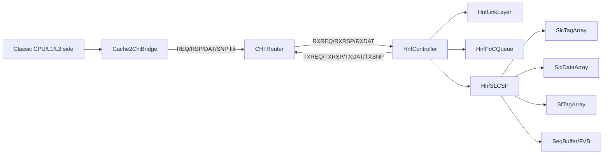
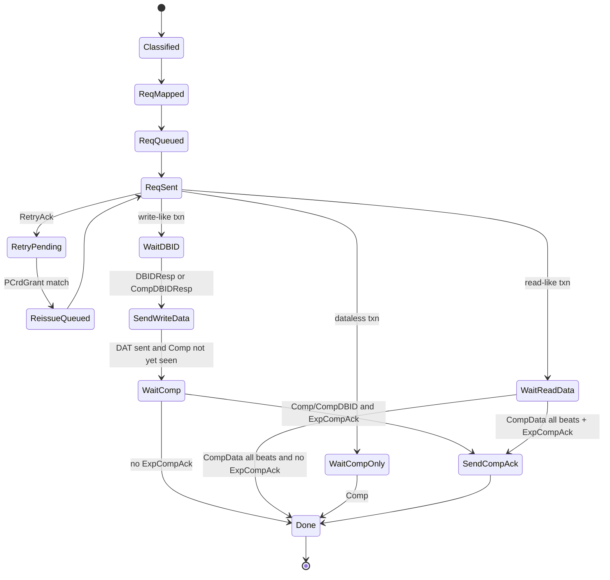

# HNF Gem5 C++ 最终架构设计

> 目标：在 gem5 classic cache 环境下，通过 `cache2chi bridge` 产生/消费 CHI flit，经已有 cycle-accurate router 连接到 HNF。本文只定义可实现的类、字段、队列、状态机、pipeline stage 和模块接口，不再扩展新微架构。
>
> 重要边界：MVP 不声称覆盖全部 CHI。MVP 覆盖 RNSD、ReadUnique、MakeUnique、Evict、WriteBackFull，以及 non-coherent ReadNoSnp/WriteNoSnp 的基本路径；其他事务必须显式 unsupported 或配置关闭。

---

## 1. 总体架构

### 1.1 对象关系



### 1.2 顶层 C++ 类

```cpp
class HnfController : public ClockedObject
{
  public:
    HnfController(const HnfParams &p);
    void startup() override;
    void reset();
    void tick();

    bool recvChiFlit(const ChiFlit &flit, ChiChannel ch);
    bool sendCredit(ChiChannel ch, int credits);

  private:
    HnfConfig cfg;
    HnfLinkLayer link;
    HnfPoCQueue poc;
    HnfSLCSF slcsf;
    ChiRouterPort routerPort;
    EventFunctionWrapper tickEvent;
    HnfStats stats;
};
```

`HnfController` 不直接处理事务状态，只负责三件事：连接 router、按周期调度三个子模块、收集统计。

### 1.3 每周期两阶段调用原则

为了避免 C++ 顺序依赖造成“组合逻辑穿透”，所有模块都采用两阶段：

```cpp
void HnfController::tick()
{
    link.evaluateInputs();       // 读 router 入站 flit / credit
    poc.evaluateInputs();        // 读 link RX 输出、SLCSF 上周期返回
    slcsf.evaluateInputs();      // 读 PoC 本周期发起的 SLC/SF request

    poc.evaluateSelectors();     // L3/MC/TXRSP/TXDAT/TXSNP 仲裁
    link.evaluateTx();           // TX channel credit gating + pack flit

    slcsf.commit();
    poc.commit();
    link.commit();

    schedule(tickEvent, clockEdge(Cycles(1)));
}
```

实现时每个模块内部使用 `next_*` pipeline register，`evaluate()` 只写 next，`commit()` 才更新当前寄存器。这样可以稳定复现 RTL H-stage 的因果关系。

---

## 2. MVP 与完整版本范围

### 2.1 MVP 支持矩阵

| 功能 | MVP | 完整版本 |
|---|---:|---:|
| RNF bridge 发 REQ/RSP/DAT | 支持 | 支持 |
| RNF bridge 接 TXSNP 并返回 SnpResp/Data | 支持基本 SnpUnique/SnpMakeInvalid/SnpNotSharedDirty | 覆盖所有 spec-supported SNP |
| ReadNotSharedDirty | 支持 L3 hit、L3 miss + MC、L3 miss + SF snoop | 补齐 partial/DMT/DCT/stash 细节 |
| ReadUnique | 支持 L3 hit/miss、SF hit snoop、MC read | 补齐所有 DMT、Fwd、force_s 组合 |
| MakeUnique | 支持 SF miss 直接 Comp、SF hit 发 SnpMakeInvalid | 补齐完整 self-cancel/force invalidate |
| Evict | 支持更新 SF + Comp | 补齐所有 SF victim/SEQ 组合 |
| WriteBackFull | 支持 Allocate / NoAlloc 两条路径 | 补齐 Dead CopyBack、WriteClean、WriteEvict |
| ReadNoSnp/WriteNoSnp | 仅 non-coherent/device | 支持文档定义的 NoSnp self-cancel 与 allocate |
| Partial write / BE | 可配置关闭；默认只 64B full-line | 完整 BE/QW/OW/RMW |
| RetryAck/PCrdGrant | 支持；bridge synthetic reissue | 支持真实 requester reissue 或 synthetic 可切换 |
| QoS pool | per-priority cap + round-robin | RTL 防饿死 block 机制 |
| PoC entry | 32 默认，可配 | 可配 + RTL 同步参数 |
| SLC/SF replay | 支持 setway/SEQ full/victim addr replay | 支持所有 RTL replay，包括预留 ECC 开关 |
| SLC/SF init | 启动时直接清 tag，或固定 init latency | 每 8 周期一组 set 的 cycle-accurate init |
| L3 bypass | 关闭 | 仅在 RTL 证明支持后打开 |
| Stash/DCT/DVM/CMO/Atomic/Persist | unsupported | 按文档/RTL 补齐 |
| SF M 态/CML | unsupported | 仅 CML 配置打开时支持 |

### 2.2 MVP 不支持时的行为

```cpp
enum class UnsupportedPolicy {
    Panic,          // 调试阶段默认：发现未支持事务直接 panic
    NackToClassic,  // bridge 返回失败给 classic side
    ForceNoSnp,     // 仅允许明确配置的 non-coherent fallback
};
```

MVP 默认 `Panic`，否则很容易把协议 bug 误当成性能现象。

---

## 3. 共享数据结构

### 3.1 CHI flit 类型

```cpp
enum class ChiChannel { REQ, RSP, DAT, SNP };

enum class ReqOpcode {
    ReadShared, ReadClean, ReadNotSharedDirty, ReadUnique,
    MakeUnique, Evict, WriteBackFull,
    ReadNoSnp, WriteNoSnpFull, WriteNoSnpPtl,
    WriteUniqueFull, WriteUniquePtl,
    CleanInvalid, CleanShared,
    Unsupported
};

enum class RspOpcode {
    Comp, CompAck, SnpResp, SnpRespFwded,
    RetryAck, DBIDResp, CompDBIDResp,
    PCrdGrant, ReadReceipt
};

enum class DatOpcode {
    SnpRespData, CopyBackWrData, NonCopyBackWrData,
    CompData, SnpRespDataPtl, SnpRespDataFwded,
    WriteDataCancel
};

enum class SnpOpcode {
    SnpUnique, SnpMakeInvalid, SnpNotSharedDirty,
    SnpCleanInvalid, SnpCleanShared,
    SnpOnce, Unsupported
};

struct ChiReqFlit {
    ReqOpcode opcode;
    NodeID srcId, tgtId, retNid;
    TxnID txnId, returnTxnId;
    Addr addr;
    uint8_t qos, size, order, memAttr, snpAttr, pcrdType;
    uint8_t ccid, lpid, lid, srcType, rsvdc;
    bool ns, expCompAck, trace, dynCredit, dmt, dmtOrder;
};

struct ChiRspFlit {
    RspOpcode opcode;
    NodeID srcId, tgtId;
    TxnID txnId;
    DBID dbid;
    uint8_t qos, resp, respErr, pcrdType, deviceEvent;
    bool trace;
};

struct ChiDatFlit {
    DatOpcode opcode;
    NodeID srcId, tgtId;
    TxnID txnId;
    DBID dbid;
    uint8_t qos, resp, respErr, ccid, dataId, chunkV, dataSource;
    std::array<uint8_t, 32> data;  // MVP: 256-bit flit
    uint32_t be;                   // 32B BE for one flit
    bool trace;
};

struct ChiSnpFlit {
    SnpOpcode opcode;
    NodeID srcId, tgtId, fwdNid;
    TxnID txnId, fwdTxnId;
    Addr addr;
    uint8_t qos, ns, retToSrc, doNotDataPull;
    bool trace;
};

struct ChiFlit {
    ChiChannel channel;
    std::variant<ChiReqFlit, ChiRspFlit, ChiDatFlit, ChiSnpFlit> payload;
};
```

### 3.2 内部 opcode 与状态

必须同时保存 `origOpcode` 和 `intOpcode`。`origOpcode` 是 RXREQ 原始 CHI opcode；`intOpcode` 是 HNF 内部 mapping 后的 opcode，例如 `ReadNoSnp -> ReadOnce`、`WriteNoSnp* -> WriteUniquePtl`、部分 StashOnce* -> ReadOnce/RU/RNSD。

```cpp
enum class IntOpcode {
    ReadShared, ReadClean, ReadSharedClean,
    ReadNotSharedDirty, ReadUnique, ReadOnce,
    MakeUnique, Evict, WriteBackFull,
    WriteUniquePtl, CleanInvalid, CleanShared,
    SeqCleanInvalid, SlcInit, SfInit,
    Unsupported
};

enum class SlcState { I, EU, EN, SU, SN, MU, MN };
enum class SfState  { I, EU, EN, SU, SN, MU, MN /* only full/CML */ };

enum BusyBit : uint32_t {
    BusyCompAck     = 1 << 0,
    BusySlcLookup   = 1 << 1,
    BusySlcFillData = 1 << 2,
    BusySlcEvict    = 1 << 3,
    BusySlcFill     = 1 << 4,
    BusySnoop       = 1 << 5,
    BusyMcRead      = 1 << 6,
    BusyMcWrite     = 1 << 7,
    BusyDataBuffer  = 1 << 8,
    BusySleep       = 1 << 9,
    BusyComp        = 1 << 10,
    BusyReadReceipt = 1 << 11,
    BusyMcRdReceipt = 1 << 12,
    BusyAllocPulse  = 1 << 13
};
```

---

## 4. cache2chi bridge 设计

`cache2chi bridge` 是 RNF-side transaction agent，不是纯 flit encoder。它负责 classic packet 与 CHI 请求/响应/数据/snoop 的完整事务闭环。

### 4.1 顶层类

```cpp
class Cache2ChiBridge : public ClockedObject
{
  public:
    bool recvTimingReq(PacketPtr pkt);       // from classic cache side
    bool recvChiFlit(const ChiFlit &flit);   // from router/HNF
    void recvReqRetry();                     // classic backpressure
    void tick();

  private:
    BridgeConfig cfg;
    ClassicPacketClassifier classifier;
    ChiReqMapper mapper;
    RnTxnTable txns;
    RetryPcreditManager retryMgr;
    RnSnoopResponder snoopResponder;
    DataBeatPacker beatPacker;
    ChiLinkPort chiPort;

    Queue<PacketPtr> classicReqQ;
    Queue<ChiReqFlit> reqOutQ;
    Queue<ChiRspFlit> rspOutQ;
    Queue<ChiDatFlit> datOutQ;
};
```

### 4.2 Bridge 子模块接口

| 模块 | 输入 | 输出 | 职责 |
|---|---|---|---|
| `ClassicPacketClassifier` | `PacketPtr`、addr range、cacheability、line state hint | `MemoryIntent` | 识别 load/store/evict/writeback/uncacheable/partial/full-line |
| `ChiReqMapper` | `MemoryIntent` | `ChiReqFlit` + policy flags | 生成 CHI opcode、MemAttr、Order、ExpCompAck、Size、CCID、BE/QW mask |
| `RnTxnTable` | 发出的 REQ/DAT、收到的 RSP/DAT/SNP | `RnTxn` 状态更新 | 维护 TxnID、DBID、Retry、CompAck、data beat、classic packet completion |
| `RetryPcreditManager` | RetryAck、PCrdGrant、pending txn | reissue REQ | 匹配 PCrdType/SrcID/TgtID，触发 synthetic reissue |
| `RnSnoopResponder` | TXSNP flit、classic cache state/data | SnpResp/SnpRespData | 作为 RNF 响应 HNF snoop |
| `DataBeatPacker` | Packet data、BE、DataID/ChunkV | DAT flit sequence | 64B line 拆成 2 个 256b flit；完整版本支持更多 data width |
| `ChiLinkPort` | req/rsp/dat out queues, router credit | flit to router | 管 link credit，与 PCrdGrant 解耦 |

### 4.3 MemoryIntent

```cpp
struct MemoryIntent {
    enum Kind {
        ReadMiss, ReadForOwnership, UpgradeOnly,
        CleanEvict, DirtyEvict, FullLineWrite,
        PartialWrite, NonCoherentRead, NonCoherentWrite,
        Unsupported
    } kind;

    Addr lineAddr;
    unsigned size;
    uint64_t byteEnableMask;
    bool cacheable;
    bool device;
    bool allocate;
    bool needsData;
    bool expCompAck;
    PacketPtr pkt;
};
```

### 4.4 MVP opcode mapping

| Classic intent | MVP CHI opcode | 限制 |
|---|---|---|
| cacheable read miss | `ReadNotSharedDirty` | 默认读共享/干净；如果上游能区分 ReadClean/ReadShared，可扩展 |
| read for ownership / store miss needing data | `ReadUnique` | 需要拿数据 + 唯一权限 |
| upgrade-only, full-line overwrite before data needed | `MakeUnique` | 仅当 classic 明确不需要旧数据 |
| clean eviction | `Evict` | 只更新 HNF/SF，不带数据 |
| dirty eviction full-line | `WriteBackFull` | DAT 使用 CopyBackWrData |
| non-coherent read | `ReadNoSnp` | 仅 non-cacheable/device range |
| non-coherent write full | `WriteNoSnpFull` | 仅 non-cacheable/device range |
| partial write | unsupported by default | 完整版本映射 `WriteUniquePtl` or `WriteNoSnpPtl` |

### 4.5 RNF transaction FSM



### 4.6 Bridge 最小字段

```cpp
struct RnTxn {
    TxnID txnId;
    DBID dbid;
    ReqOpcode opcode;
    PacketPtr pkt;
    Addr lineAddr;
    uint8_t pcrdType;
    NodeID homeNid;
    uint32_t beatNeededMask;
    uint32_t beatReceivedMask;
    uint32_t beatSentMask;
    bool expCompAck;
    bool retried;
    bool dbidReceived;
    bool compReceived;
    bool dataComplete;
    enum State state;
};
```

---

## 5. HnfLinkLayer

### 5.1 职责

`HnfLinkLayer` 负责 CHI flit 拆包/组包、link credit、TXRSP fastpath、dynamic/static allocation、RetryAck/PCrdGrant、FVB/SEQ 内部请求注入。它不处理 L3/SF 事务语义，只产生 PoC allocation 事件和 TX flit。

```cpp
class HnfLinkLayer
{
  public:
    void evaluateInputs();
    void evaluateTx();
    void commit();

    bool recvFromRouter(const ChiFlit &flit);
    std::optional<ChiFlit> popTxFlit();

    LinkToPocRx getRxToPoc() const;
    LinkAllocToPoc getAllocToPoc() const;
    LinkCreditState getCreditState() const;

    void acceptPocTxReq(const PocTxReqMsg &m);
    void acceptPocTxRsp(const PocTxRspMsg &m);
    void acceptPocTxDat(const PocTxDatMsg &m);
    void acceptPocTxSnp(const PocTxSnpMsg &m);
    void acceptSlcFvbReq(const FvbReq &m);

  private:
    ChannelRx<ChiReqFlit> rxReq;
    ChannelRx<ChiRspFlit> rxRsp;
    ChannelRx<ChiDatFlit> rxDat;
    ChannelTx<ChiReqFlit> txReq;
    ChannelTx<ChiRspFlit> txRsp;
    ChannelTx<ChiDatFlit> txDat;
    ChannelTx<ChiSnpFlit> txSnp;

    ReqGrouper reqGrouper;
    DynStaticAllocator dynStatic;
    RetryAckFifo retryAckFifo;
    RetryQosBank retryQosBank;
    PcrdGrantQueue pcrdGrantQ;
    FvbAllocator fvbAllocator;

    PipelineReg<RxReqH1> rxreqH1;
    PipelineReg<RxReqH2> rxreqH2;
    PipelineReg<TxRspH2> txrspFastH2;
};
```

### 5.2 输入/输出/职责

| 接口 | 输入 | 输出 | 说明 |
|---|---|---|---|
| Router RX | RXREQ/RXRSP/RXDAT flit + valid | parsed H1/H2 fields | H0 接收，H1 拆字段 |
| Router TX credit | TXREQ/TXRSP/TXDAT/TXSNP credit | channel credit counter | 决定能否发 flit |
| PoC allocation | dynamic/static/FVB alloc result | PoC load event | 资源够则动态入 PoC；资源不够 Retry |
| Retry path | no resource event, retired pool | RetryAck、PCrdGrant | RetryAck 快速发；PCrdGrant 等资源释放后发 |
| PoC TX | TXREQ/TXRSP/TXDAT/TXSNP message | packed flit | H-stage 对齐后发 router |
| SLCSF FVB | SEQ/back-invalidation/init req | FVB alloc event | 在 RXREQ 空隙注入 PoC |

### 5.3 Link pipeline stage

| 路径 | Stage | 行为 |
|---|---|---|
| RXREQ | H0 | 从 router 接收 flit，检查 RX credit/load enable |
| RXREQ | H1 | 拆包：opcode/srcid/txnid/addr/memattr/qos/order/size 等 |
| RXREQ | H1 | dynamic/static allocation 判断，req grouping，opcode mapping 预分类 |
| RXREQ | H2 | 输出给 PoC load；若 dynamic fail 则 RetryAck 入 FIFO；fastpath 候选进入 TXRSP |
| RXRSP | H0/H1 | 拆 response，立即返 RX credit |
| RXRSP | H2 | 输出到 PoC RXRSP encoder，用 TxnID/DBID 匹配 entry |
| RXDAT | H0/H1 | 拆 data/BE/DataID/ChunkV，立即返 RX credit |
| RXDAT | H2 | 写 PoC data buffer / 更新 data beat counter |
| TXRSP fastpath | H2 | RetryAck/PCrdGrant/ReadReceipt/DBID/CompDBID 仲裁 |
| TXRSP fastpath | H3 | 若有 TXRSP credit，发 router |
| TXRSP PoC | H4 | 接 PoC scheduled response |
| TXRSP PoC | H5 | pack + credit gating + 发 router |
| TXREQ | H12 | 接 PoC MC request |
| TXREQ | H13/H14 | pack，可能经过 2-entry buffer，credit gating |
| TXDAT | H11 | 接 PoC data buffer controller 输出 |
| TXDAT | H12 | pack + credit gating |
| TXSNP | H13 | 接 PoC snoop request |
| TXSNP | H14/H15 | pack，可能经过 2-entry buffer，credit gating |

### 5.4 Dynamic/static allocator

```cpp
struct QosPool {
    unsigned capacity[4];    // L/M/H/HH
    unsigned used[4];
};

class DynStaticAllocator {
  public:
    AllocDecision allocateRxReq(const RxReqH1 &req, bool pocHasFreeEntry);
    void onPocRetire(PoolClass pool, bool markStatic);
    std::optional<PcrdGrantInfo> pickPcrdGrant();

  private:
    QosPool qosPool;
    unsigned fvbUsed, fvbCapacity;
    StarvationArbiter starvation;
};
```

MVP 可把 `RetryQosBank` 简化成 `std::deque<RetryRecord> perQos[4]`；完整版本保留 RN × QoS × outstanding 三维 bank，以及连续高优先级获胜 block 机制。

---

## 6. HnfPoCQueue

### 6.1 顶层类

```cpp
class HnfPoCQueue
{
  public:
    void evaluateInputs();
    void evaluateSelectors();
    void commit();

    void acceptLinkRx(const LinkToPocRx &rx);
    void acceptLinkAlloc(const LinkAllocToPoc &alloc);
    void acceptSlcResult(const SlcToPocResult &rsp);

    std::optional<PocSlcReq> getSlcReqForSlcsf() const;
    std::optional<PocTxReqMsg> getTxReqForLink() const;
    std::optional<PocTxRspMsg> getTxRspForLink() const;
    std::optional<PocTxDatMsg> getTxDatForLink() const;
    std::optional<PocTxSnpMsg> getTxSnpForLink() const;
    PocRetireInfo getRetireInfo() const;

  private:
    std::array<PocEntry, MaxPocEntries> entries;
    PocAllocator allocator;
    PocRetire retire;
    PocHazard hazard;
    PocAddressBuffer abuf;
    PocDataBuffer dbuf;
    PocDataBufferCtl dbufCtl;
    PocBusy busy;
    PocSelector selector;
    PocRxReqEncoder rxReqEnc;
    PocRxRspEncoder rxRspEnc;
    PocRxDatEncoder rxDatEnc;
    PocTxReqDecoder txReqDec;
    PocTxRspDecoder txRspDec;
    PocTxDatDecoder txDatDec;
    PocTxSnpDecoder txSnpDec;
    PocSlcEncoder slcEnc;
    PocSlcDecoder slcDec;
    PocMisc misc;
};
```

### 6.2 PoCEntry 字段

```cpp
struct PocEntry {
    bool valid;
    bool staticReserved;
    PoolClass pool;
    uint8_t qos;

    ReqOpcode origOpcode;
    IntOpcode opcode;
    NodeID srcId;
    TxnID origTxnId;
    TxnID txnId;
    DBID dbid;
    Addr lineAddr;
    bool ns;
    uint8_t size, ccid, order, memAttr, snpAttr, srcType;
    bool expCompAck, trace, dynCredit;

    // Stash / ID fields
    NodeID stashNid;
    uint8_t lid, lpid, stashLpid;
    bool stashNidValid, stashLpidValid;

    // MC fields
    NodeID mcTgtId;
    ReqOpcode mcOpcode;
    bool dmt, dmtOrder;
    bool mcRetToRequester;

    // Transaction flags
    bool nonCoherent;
    bool noFill;
    bool selfCancel;
    bool forceS;
    bool replayPending;
    bool fvb;
    bool sfBackInvalidate;
    bool slcInit, sfInit;

    // State snapshots
    SlcState slcState;
    SlcState slcHitState;
    SlcState slcUpdateState;
    SfState sfState;
    bool slcHit, sfHit, sfHitUnique, sfHitNonUnique;

    // Snoop accounting
    uint8_t snoopExpected;
    uint8_t snoopReceived;
    uint32_t snoopTargetVec;
    NodeID snoopDirectedNid;
    bool snoopBroadcast;
    bool snoopDirected;
    bool gotIwb;
    bool gotPartialIwb;
    bool gotFwded;

    // Data accounting
    uint8_t qwValidMask;
    uint8_t qwTxMask;
    uint8_t qwRxMask;
    uint8_t qwNeededMask;
    bool partialBe;
    bool anyBe;
    bool deadCopyBack;
    bool allWriteBeatsReceived;
    bool allMcBeatsReceived;
    bool allIwbBeatsReceived;

    // Busy and FSM
    uint32_t busyMask;
    PocTxnState fsmState;

    // Hazard
    bool sleep;
    bool wake;
    int wakeEntry;
    bool compareEnable;
};
```

### 6.3 PoC allocation / retire

```cpp
class PocAllocator {
  public:
    AllocResult allocate(const LinkAllocToPoc &alloc,
                         const std::array<PocEntry, N> &entries);
    void markStatic(int entry);
    void clearOnRetire(int entry);
};

class PocRetire {
  public:
    std::optional<int> pickRetire(const std::array<PocEntry, N> &entries);
    void ageQueueAlloc(int entry);
    void ageQueueRetire(int entry);
    int oldest() const;
};
```

Retire 条件：`valid && busyMask == 0`。MVP 不允许 `sleep` entry retire；full version 需要处理 wake bit 清理和 static bit 转换。

### 6.4 PoC hazard

```cpp
class PocHazard {
  public:
    HazardResult detectAllocationHazard(const Addr &newAddr, bool ns,
                                        int newEntry,
                                        const PocAddressBuffer &abuf,
                                        const std::array<PocEntry, N> &entries);
    void applySleepWake(HazardResult r, std::array<PocEntry, N> &entries);
    void onRetire(int entry, std::array<PocEntry, N> &entries);
    bool detectSlcReplayHazard(const Addr &slcAddr, const PocAddressBuffer &abuf);
};
```

语义要求：新请求先分配 entry，再 sleep；sleep entry 占用 PoC 资源但不参与 L3/MC/TX 仲裁。不要把同地址 hazard 简化成入口 stall，否则 entry 占用、Retry、AgeQ、wake timing 都会错。

### 6.5 PoC busy bits

| Busy bit | Set 时机 | Clear 时机 |
|---|---|---|
| `BusyCompAck` | ExpCompAck 事务分配时 | RXRSP 收到 CompAck |
| `BusySlcLookup` | 需要 SLC/SF lookup/fill/replay 时 | L3 request 仲裁成功或 replay 后重新置位 |
| `BusySlcFillData` | 可能需要 fill 且数据未齐 | RXDAT/SnpRespData/MC data 收齐或 nofill |
| `BusySlcEvict` | SLC dirty victim | victim writeback data 进入 dbuf/MC path |
| `BusySlcFill` | fill data ready 后要写 SLC | SLCSF fill 完成 |
| `BusySnoop` | 可能需要 snoop 的请求分配时 | SLCSF 判定不发 snoop，或所有 SnpResp/Data 收齐 |
| `BusyMcRead` | SLC miss / partial write RMW / snoop no data | MC CompData 收齐，DMT 时按 DMT completion 清 |
| `BusyMcWrite` | WriteBack noalloc、dirty victim、IWB writeback | MC Comp/SnpDone/dead CB |
| `BusyDataBuffer` | 需要接收/发送/填充数据 | TXDAT 全 beat 发送或 no-dbuf |
| `BusySleep` | allocation hazard | wake entry retire |
| `BusyComp` | 需要 Comp/CompDBID | TXRSP 发出 |
| `BusyReadReceipt` | ordered read fastpath lost | TXRSP 发出 ReadReceipt |
| `BusyMcRdReceipt` | MC DMT read receipt | RXRSP 收到 MC ReadReceipt |

### 6.6 PoC transaction FSM

PoC 真实实现以 busy bits 为主，但为了 Gem5 调试建议保留派生 FSM：

```cpp
enum class PocTxnState {
    Free,
    AllocatedActive,
    AllocatedSleep,
    WaitSlcLookup,
    WaitSnoopIssue,
    WaitSnoopResp,
    WaitMcReqIssue,
    WaitMcResp,
    WaitRxData,
    WaitTxData,
    WaitCompIssue,
    WaitCompAck,
    ReplayWait,
    RetireReady
};
```

状态更新是由 busy bits 派生，不作为唯一事实源。这样既能贴 RTL 的 busy 行为，又便于 debug。

### 6.7 PoC pipeline stage

| 子路径 | Stage | 行为 |
|---|---|---|
| Allocation | H1 | Link allocation event 到 PoC，选择 dynamic/static/FVB entry |
| Allocation | H2 | valid/static/load_en 置位，写 entry 基本字段 |
| AgeQ | H3 | 新 entry 进入 AgeQ，更新 oldest pointer |
| Hazard | H1 | H1 vs H2 collision + H1 CAM 比较 |
| Hazard | H2 | 输出 hazard result，置 sleep/wake/compareEnable |
| Hazard wake | Hx/Hx1/Hx2 | retire 唤醒 sleep entry |
| ABUF write0 | H1/H2 | 写 link/FVB address |
| ABUF write1 | H10/H11 | 写 SLC victim address |
| ABUF read0 | H0/H1/H3 | L3/SF request address 读取并对齐 SLCSF |
| ABUF read1 | H11/H12 | MC address 输出到 TXREQ |
| ABUF read2 | H12/H13 | SNP address 输出到 TXSNP |
| DBUF RXDAT | H2/H3 | RXDAT data/BE 写入 data buffer |
| DBUF SLC data | H9/H11/H12 | SLC hit/victim data 写入 data buffer |
| DBUF TXDAT | H9/H10/H11 | TXDAT selection 后读 dbuf，进入 pocbuf A/B |
| DBUF Fill | H2/H4/H5/H6 | SLC fill 读 data buffer，低/高 OW 错拍输出 |
| L3 selector | H2/H3 | 选择一个 entry 发 SLC/SF request |
| L3 req | H4/H5 | 向 SLCSF 发 req/opcode/state/entry/addr |
| SLCSF result | H9/H10/H11 | 接收 hit/miss/victim/snoop/replay/self_cancel |
| MC selector | H10/H11 | 选择 MC request entry，检查 TXREQ credit |
| MC TXREQ | H12 | 输出到 Link TXREQ |
| TXDAT selector | H9/H10 | 选择 QW/OW ready entry |
| TXDAT link | H11-H14 | data buffer controller 输出，Link 发 DAT |
| TXRSP selector | H3/H4 | 选择 DBID/CompDBID/ReadReceipt/Comp |
| TXRSP link | H4/H5 | 输出到 Link TXRSP |
| TXSNP selector | H11/H12/H13 | 选择 snoop entry，输出到 Link TXSNP |
| Retire | Hx/Hx1/Hx2 | busy 全清 entry 出队，AgeQ 移位，pool 释放 |

### 6.8 PoC selectors

`PocSelector` 维护 6 类独立仲裁：

```cpp
struct PocSelectResult {
    std::optional<int> l3Entry;
    std::optional<int> mcRetryEntry;
    std::optional<int> mcEntry;
    std::optional<int> txdatEntry;
    std::optional<int> txrspEntry;
    std::optional<int> txsnpEntry;
};
```

MVP 策略：每类 selector 实现 `oldest first + round robin`，并保证每类每周期最多一个。完整版本再拆 HH/H/M/L、find-first、rotating pointer、TXRSP 特殊 oldest 规则、MC Retry PCrdType/SrcID 匹配队列。

---

## 7. HnfSLCSF

### 7.1 顶层类

```cpp
class HnfSLCSF
{
  public:
    void acceptPocReq(const PocSlcReq &req);
    void evaluateInputs();
    void commit();

    SlcToPocResult getResultForPoc() const;
    std::optional<FvbReq> getFvbReqForLink() const;
    bool isBusy() const;

  private:
    SlcPipeline slcPipe;
    SfPipeline sfPipe;
    SlcTagArray slcTag;
    SlcDataArray slcData;
    SfTagArray sfTag;
    SeqBuffer seq;
    SlcReplayDetector slcReplay;
    SfReplayDetector sfReplay;
    SlcVictimPolicy slcVictim;
    SfVictimPolicy sfVictim;
    SlcSfInitEngine initEngine;
};
```

### 7.2 SLC/SF line 结构

```cpp
struct SlcTagLine {
    bool valid;
    Addr tag;
    bool ns;
    bool unique;
    uint8_t rnfId;
    SlcState state;
};

struct SfTagLine {
    bool valid;
    Addr tag;
    bool ns;
    bool slcIsSource;
    bool unique;
    uint32_t rnfVec;
    uint8_t rnfId;
    SfState state;
};

struct CacheLineData {
    std::array<uint8_t, 64> data;
};
```

MVP 配置：SLC 16-way，256 sets；SF 16-way，2048 sets；SLC data 64B line，4 个 128b QW，两个 256b OW。参数化保留。

### 7.3 SLCSF 输入/输出/职责

| 模块 | 输入 | 输出 | 职责 |
|---|---|---|---|
| `SlcPipeline` | PocSlcReq、SLC tag/data | hit/miss/upstate/victim/data/replay | SLC tag 查找、状态更新、victim、fill、data return |
| `SfPipeline` | SLC result + req | SF hit/miss/state/snoop/self_cancel/replay | SF tag 查找、allocate/update、snoop directed/broadcast 判断 |
| `SlcDataArray` | read/write addr+way+OW | data OW | 64B line 读写、QW0/1 与 QW2/3 错拍 |
| `SeqBuffer` | SF victim | FVB/back-invalidation req | SF victim 暂存，SEQ full 触发 replay |
| `ReplayDetector` | pipeline setway、PoC victim hazard、SEQ 状态 | replay | 取消当前流水后续操作，通知 PoC 重提 |
| `InitEngine` | reset/startup | init req/FVB req | 完整版本按每 8 周期一组 set 清 tag |

### 7.4 SLC pipeline stage

| Stage | 行为 |
|---|---|
| H1 | 接收 PoC scheduled SLC/SF req；若 `slc_busy` 则不接收 |
| H2 | 发 SLC tag/data read address；准备 SF request 信息 |
| H3/H3a | tag RAM read latency 对齐 |
| H4 | SLC hit/miss、way full、victim candidate、data read enable for QW0/1 |
| H5 | 状态更新计算、dirty victim 判断、data read enable for QW2/3、setway hazard 记录 |
| H6 | replay 检查、SF H6 self_cancel/snoop 结果回写到 SLC pipe |
| H7 | 输出 tag read result 到 PoC：hit/miss/upstate/self_cancel/snoop/replay |
| H8/H8a | 若需要 update/fill，准备第二轮流水写 tag/data |
| H9 | SLC hit/victim data 返回 PoC data buffer；victim addr 返回 PoC |
| 第二轮 H1-H3 | 写 SLC/SF tag |
| 第二轮 H4-H6 | 写 SLC data，低 OW 与高 OW 错拍 |

### 7.5 SF pipeline stage

| Stage | 行为 |
|---|---|
| H2 | 从 SLC pipe 接收 SF opcode/set_addr |
| H3 | 访问 SF tag array |
| H5 | SF tag read result 出来，hit/miss/way full/seq hit 判断 |
| H6 | SF allocate/update/self_cancel/snoop directed/broadcast/replay 判断 |
| H7-H9/H1a | 状态打拍，生成写回 tag 信息 |
| 第二轮 H2/H3 | 写 SF tag array |

### 7.6 slc_busy 规则

MVP 实现为：

```cpp
bool HnfSLCSF::isBusy() const
{
    return slcPipe.h1Valid
        || slcPipe.updatePending
        || slcPipe.initPending
        || slcPipe.busyBubbleCounter > 0;
}
```

完整版本按 RTL 细化：进入 SLC pipe 后紧随一拍不可接收；正常 request 触发 update 时，提前连续 2 周期防止 H1 新请求进入；init/update 第二轮流水也会制造 bubble；只读不 update 的 request 也可能提前 2 周期拉 busy 以简化硬件 timing。

### 7.7 Replay 规则

```cpp
struct ReplayCause {
    bool slcSetwayHazard;
    bool sfSetwayHazard;
    bool pocVictimAddrHazard;
    bool sfVictimSeqFull;
    bool sfVictimSeqSlotConflict;
    bool eccSingleBit; // MVP false
};
```

触发 replay 后：

1. 当前 SLC/SF pipeline 后续操作全部取消。
2. 不写 tag，不读/写 data，不产生 victim，不发送 snoop。
3. `SlcToPocResult.replay = true`。
4. PoC 对应 entry 重新置 `BusySlcLookup`，延后再次参与 L3 selector。

---

## 8. 事务主流程

### 8.1 RXREQ 到 PoC

```mermaid
sequenceDiagram
  participant R as Router
  participant L as HnfLinkLayer
  participant P as HnfPoCQueue
  participant S as HnfSLCSF

  R->>L: RXREQ flit H0
  L->>L: H1 parse + grouping + dynamic allocation
  alt resource available
    L->>P: H1/H2 PoC load event
    P->>P: allocate entry + write abuf + rxreq_enc
    P->>P: hazard detect; maybe sleep
  else no resource
    L->>R: TXRSP RetryAck fastpath
    L->>L: retry bank wait retire
    L->>R: TXRSP PCrdGrant
  end
  P->>S: scheduled L3/SF req
  S->>P: hit/miss/snoop/victim/replay result
```

### 8.2 RNSD MVP 流程

1. Bridge 发 `ReadNotSharedDirty`。
2. LinkLayer 动态分配 PoC entry 或 Retry。
3. PoC 发 SLC/SF lookup。
4. SLC hit：SLCSF 返回 data，PoC TXDAT 发 `CompData`，若 ExpCompAck 等 `CompAck` 后 retire。
5. SLC miss + SF miss：PoC TXREQ 发 `ReadNoSnp` 到 SNF；DMT 开启时 RetNID/ReturnTxnID 指向 RNF；否则 SNF data 回 HNF，HNF 再发 RNF。
6. SLC miss + SF hit：PoC TXSNP 发 `SnpNotSharedDirty`；若收到 SnpRespData，PoC 发送 `CompData` 给 requester，并按状态决定是否 fill SLC；若只收到 no-data，再走 MC read。

### 8.3 ReadUnique MVP 流程

1. SLC hit + SF miss：HNF 从 SLC data 回 requester，并将 SLC 状态置 I。
2. SLC hit + SF hit：先发 `SnpUnique`，等 snoop done，再从 SLC data 回 requester，SLC 置 I。
3. SLC miss + SF hit：发 `SnpUnique`；若有 IWB data，回 requester；否则 MC read。
4. SLC miss + SF miss：MC read，DMT 可直接 SNF -> RNF；PoC 等 CompAck/MC receipt 完成。

### 8.4 MakeUnique MVP 流程

1. SF miss：直接 `Comp`，若 SLC hit 则 SLC 置 I。
2. SF hit：发 `SnpMakeInvalid`，等所有 snoop response 后 `Comp`，若 SLC hit 则置 I。

### 8.5 WriteBackFull MVP 流程

1. Link/PoC 先发 `CompDBIDResp` 或 `DBIDResp`，bridge 收到 DBID 后发 `CopyBackWrData`。
2. Allocate=1：PoC 收齐 64B 后触发 SLC fill；若 victim dirty，额外 MC writeback。
3. Allocate=0：PoC 收齐 data 后 TXREQ/TXDAT 写 SNF，不 fill SLC。
4. Dead CopyBack MVP 可先不启用；完整版本按 data Resp 判定直接 retire 或 no-fill。

---

## 9. gem5 实现落地建议

### 9.1 文件划分

```text
src/mem/chi/
  chi_flit.hh/cc
  chi_enums.hh
  chi_link_port.hh/cc

src/mem/chi/bridge/
  cache2chi_bridge.hh/cc
  classic_packet_classifier.hh/cc
  chi_req_mapper.hh/cc
  rn_txn_table.hh/cc
  rn_snoop_responder.hh/cc
  data_beat_packer.hh/cc

src/mem/chi/hnf/
  hnf_controller.hh/cc
  hnf_config.hh
  hnf_link_layer.hh/cc
  hnf_link_dynstatic.hh/cc
  hnf_poc_queue.hh/cc
  hnf_poc_entry.hh
  hnf_poc_alloc.hh/cc
  hnf_poc_retire.hh/cc
  hnf_poc_hazard.hh/cc
  hnf_poc_abuf.hh/cc
  hnf_poc_dbuf.hh/cc
  hnf_poc_busy.hh/cc
  hnf_poc_selector.hh/cc
  hnf_poc_encdec.hh/cc
  hnf_slcsf.hh/cc
  hnf_slc_tag_array.hh/cc
  hnf_slc_data_array.hh/cc
  hnf_sf_tag_array.hh/cc
  hnf_seq_buffer.hh/cc
  hnf_replay.hh/cc
```

### 9.2 参数

```cpp
struct HnfConfig {
    unsigned numPocEntries = 32;
    unsigned numRn = 3;
    unsigned slcSets = 256;
    unsigned slcWays = 16;
    unsigned sfSets = 2048;
    unsigned sfWays = 16;
    unsigned lineBytes = 64;
    unsigned datFlitBytes = 32;  // MVP 256-bit DAT

    Cycles slcTagLatency = Cycles(2);
    Cycles slcDataLatency = Cycles(2);
    Cycles sfTagLatency = Cycles(2);

    bool enableDmt = true;
    bool enablePartialWrite = false;
    bool enableStash = false;
    bool enableDct = false;
    bool enableCmo = false;
    bool enableAtomic = false;
    bool enableCycleAccurateInit = false;
    bool enableL3Bypass = false;
    bool enableEccReplay = false;

    UnsupportedPolicy unsupportedPolicy = UnsupportedPolicy::Panic;
};
```

### 9.3 统计项

| Stat | 用途 |
|---|---|
| `rxReqFlits/rxRspFlits/rxDatFlits` | link 输入流量 |
| `txReqFlits/txRspFlits/txDatFlits/txSnpFlits` | link 输出流量 |
| `retryAckCount/pcrdGrantCount/reissueCount` | Retry 行为 |
| `pocAllocCount/pocRetireCount/pocSleepCount/pocWakeCount` | PoC 生命周期 |
| `slcHit/slcMiss/sfHit/sfMiss` | L3/SF 行为 |
| `snoopDirected/snoopBroadcast/snoopRespData` | snoop 行为 |
| `slcReplay/sfReplay/seqFullReplay` | replay 行为 |
| `mcRead/mcWrite/dmtRead` | SNF 访问 |
| `txdatBeatCount/rxdatBeatCount` | data beat timing |

---

## 10. Validation 计划

### 10.1 单元测试

| 测试 | 期望 |
|---|---|
| RXREQ dynamic alloc | entry valid、AgeQ、pool used 正确 |
| RXREQ pool full | RetryAck 发出，PCrdGrant 在 retire 后发出 |
| same line hazard | 后发 entry sleep，前发 retire 后 wake |
| RNSD SLC hit | CompData 发出，等待 CompAck 后 retire |
| RU SF hit | 发 SnpUnique，等 snoop count 清零后继续 |
| WBF Allocate | DBID/CompDBID -> RXDAT -> SLC fill -> retire |
| WBF NoAlloc | DBID -> RXDAT -> MC write -> Comp -> retire |
| SLC dirty victim | victim data 写 dbuf，MC write ready |
| SF victim seq full | 触发 replay，不写 SF tag |
| TX credit zero | flit 不发，busy/queue 保持 |

### 10.2 与 RTL 对齐的 trace 字段

每个 PoC entry debug dump 至少包含：

```text
cycle, entry, valid, fsmState, busyMask, sleep, wakeEntry,
origOpcode, intOpcode, srcId, txnId, dbid, addr,
slcHit, sfHit, slcState, sfState, replay,
snoopExpected, snoopReceived, qwValid, qwTx,
mcReady, txrspReady, txdatReady, txsnpReady
```

这些字段能直接定位“事务 FSM 错了”还是“cycle timing 错了”。

---

## 11. 不能简化掉的点

1. `origOpcode` 和 `intOpcode` 必须同时保存。
2. Bridge 必须处理 HNF 发来的 TXSNP；否则 HNF snoop 流不闭环。
3. Link credit 与 PCrdGrant 必须分开建模。
4. RetryAck 后重发应在 bridge/RNF 侧发生；HNF 内部缓存旧 flit 只可作为 synthetic reissue 的实现细节。
5. PoC 同地址 hazard 必须建 sleep entry，不能只在入口 stall。
6. RXRSP/RXDAT 必须异步更新 PoC entry；不能只从 RXREQ 推进事务。
7. SLC/SF replay 必须能取消流水后续操作并重提 L3 request。
8. CompAck、DBID、snoop count、data beat count 都是 retire 条件的一部分。

---

## 12. 文档缺口在实现中的处理

| 缺口 | MVP 处理 | 完整版需要 |
|---|---|---|
| SF snoop directed/broadcast 完整真值表 | 只覆盖 RNSD/RU/MU/Evict/WBF 常见路径；其他 panic | RTL 表格或完整 spec |
| self cancel 完整条件 | 关闭 stash/NoSnp self cancel，保留字段 | 补充表后实现 |
| force_s 条件 | 只消费 SLCSF 返回的 `forceS`，不自行推断 | 补充条件表 |
| L3 bypass | 关闭 | 确认 RTL 是否支持 PoC bypass |
| SF M/CML | 关闭 | CML 配置和跨 die 状态表 |
| ECC replay | 关闭 | ECC 修复/错误注入模型 |
| partial write | 关闭或 panic | BE/QW/OW/RMW 完整规则 |
