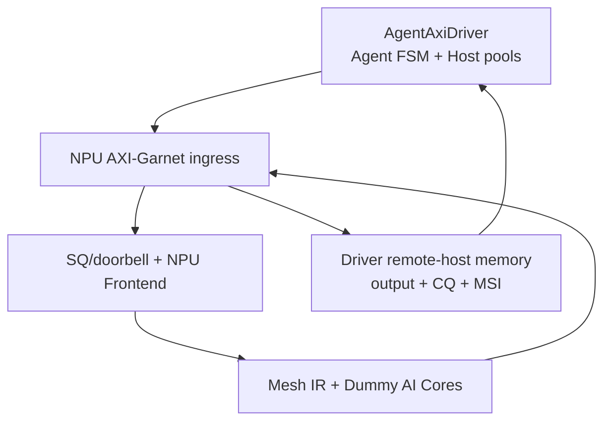

# Dummy AI Core + MoE + AgentAxiDriver Interaction

## Codex 实现规格与验收合同

> - 文档状态：Implementation Contract
> - 目标仓库：`makenma/XS-DSU-GEM5`
> - 依赖合同：`AI_MESH_MODELING_SPEC.md`
> - 网络合同：`AXI_GARNET_CODEX_SPEC.md`
> - 程序合同：`TORCH_EXPORT_MESH_IR_CODEX_SPEC.md`
> - 建议工作分支：`feature/ai-mesh-dummy-core-agent`
> - 阶段目标：实现一个不做真实 AI 数值计算、但能解释 Scheduled Mesh IR、驱动 NPU 侧 AXI-over-Garnet 流量、模拟 MoE 动态 expert 分布，并通过一个“假装流量已从 UCIe 到达”的 `AgentAxiDriver`完成 coding-agent 业务闭环的 Dummy AI Core 系统
> - 架构边界：本阶段**不实例化 CPU core、CPU Mesh、CPU Garnet、真实 UCIe gateway/tunnel 或 UCIe 协议状态机**；`AgentAxiDriver`就是 Host/CPU/UCIe 的合成替身

---

## 0. 先说清楚系统到底怎样运行

### 0.1 Dummy Core 不“跑模型”，它执行模型的时序与流量计划

`torch.export()` 编译器已经把模型的 `prefill` 和 `decode_step` 变成 `.mshb`。仿真开始前，`MeshProgramLoader` 把每个 tile 的 Scheduled Mesh IR command stream 安装进对应 `MeshDummyCore::CommandROM`。运行时 Dummy Core逐条解释命令：

- `DMA_LOAD/STORE/P2P_PUSH` 真实生成 AXI transaction，经 NPU Garnet、NPU memory endpoint或 `AgentAxiDriver`拥有的 remote-host memory target搬运数据；
- `GEMM/BMM/ELEMENTWISE/LOCAL_REDUCE`（包括由 MoE模板生成、M绑定为 expert load的 `GEMM/BMM`）不进行真实乘加，只根据 shape、dtype和配置算出占用周期；
- compute完成后只产生 validity或 deterministic content digest，不产生真实 logits、代码文本或神经网络数值；
- event、barrier、SRAM端口、engine slot、DMA outstanding、AXI credit和网络回压都真实影响时序；
- Garnet Router永远不识别 tensor、expert或 Mesh IR opcode，只传 AXI packet/flit。



### 0.2 “模拟 Agent 编程任务”不等于在 Dummy Core 内模拟编译器

Agent业务必须分为两个层次：

| 层次 | 组件 | 模拟内容 | 是否执行真实工作 |
|---|---|---|---|
| Host代理层 | `AgentAxiDriver`内的 `AgentWorkloadManager`、`HostResourceManager` | prompt、代码生成请求、compile/test/log parse、repair loop、多用户排队，并产生/接收 AXI transaction | 不执行真实 CPU 指令、CPU Mesh、编译或测试 |
| NPU执行层 | `NpuServingFrontend`、`MeshDispatcher`、`MeshDummyCore[]` | prefill/decode、KV、DMA、GEMM、MoE、collective、输出回传 | 不执行真实模型数值计算 |

Dummy Core并不知道“这次输出是 Python代码”或“上一轮编译失败”。它只看到一个带 `request_id/session_id/profile/runtime bindings` 的模型请求。`AgentAxiDriver`内部 FSM负责解释 NPU completion，启动合成 compile/test/log服务，并把 repair prompt作为下一次 NPU请求通过 AXI提交。这个职责隔离是强制要求。

`AgentAxiDriver`是一个**双角色 AXI endpoint**：作为 master向 NPU control page写 doorbell/CQ ack；作为 target响应 NPU对 Host aperture的 SQ/parameter/prompt读取，并接收 output/metadata/CQ/MSI写入。它连接在 NPU Garnet边缘，逻辑上代表“已经经过 UCIe解封装后的远端 Host”；它不是一套 UCIe模型。

术语规则：本文为兼容 Mesh IR/协议ABI保留 `HOST_SHARED`、`HOST_INPUT`、`HOST_OUTPUT`、`HOST_VISIBLE`和部分 `Host*` 名称；这些名称一律表示 `AgentAxiDriver`拥有的远端Host代理命名空间。它们不得被实现为独立Host SimObject、CPU die、CPU Garnet或UCIe组件。配置中的合成编译/测试资源也必须嵌套在 `agent_axi_driver.synthetic_host_services` 下。

### 0.3 一轮 coding-agent 请求的真实交互链

```mermaid
sequenceDiagram
    participant A as AgentAxiDriver
    participant G as NPU AXI-Garnet
    participant FE as NPU Frontend
    participant M as Dummy Core Mesh
    A->>G: AXI write SQ doorbell
    G->>FE: doorbell; FE issues AXI reads for SQ/parameter
    FE->>A: AXI AR; driver returns SQ/parameter/prompt R
    FE->>M: launch Mesh IR with HOST_SHARED bindings
    M->>A: DMA_LOAD prompt/context via NPU Garnet
    M-->>M: timed compute, MoE/P2P
    M->>A: DMA_STORE generated-code payload via NPU Garnet
    FE->>A: output metadata + CQ + MSI AXI writes
    A-->>A: synthetic compile/test/log parse timers
    A->>G: repair SQ + doorbell when failed
```

关键因果：

1. Driver先把 prompt/request parameter block写入自己拥有的 remote-host memory backing；这些是有时序的本地 store event，但不产生 CPU Mesh流量；
2. Driver写 64 B SQ descriptor，执行 modeled local release fence，再通过 NPU Garnet写 doorbell；
3. NPU CommandProcessor只读取 descriptor和小型 parameter block；Serving Frontend选择 `prefill` 或 `decode_step` concrete profile；
4. Dummy Core Mesh解释 `.mshb`，由 Mesh IR `DMA_LOAD(HOST_SHARED)`拉取 prompt/context，并产生权重、activation、KV和 P2P流量；
5. 最后一个 Mesh instance用 `DMA_STORE(HOST_SHARED)`把“生成代码的等效 payload”分块写入 Driver的 remote-host memory target；
6. Dispatcher确认 instance drain后，Frontend通过 NPU Garnet写小型 output metadata、CQ和 MSI；Driver只有在这些 AXI提交完成且 CQ可见后才启动 compile timer；
7. compile/test失败时 Driver用资源池和离散事件表示 Host本地生成、扫描 raw log，仅把 error excerpt加入下一次 repair prompt；raw log不注入 NPU Garnet；
8. repair请求由 Driver重新写 SQ/doorbell，成功后完成或进入下一任务。

### 0.4 数据真实性边界

本系统追求的是 traffic、timing、排队、依赖和资源占用真实性，不追求 AI 输出内容真实性：

- prompt/code/log使用 `bytes + tokens + digest + role` 表示；
- NPU输出不需要是真实源代码；AgentAxiDriver不读取其语义来决定成败；
- compile/test outcome只来自已校验 workload replay plan；可选离线plan生成器可用task class/repair round keyed prior生成fixture，但runtime绝不再抽样；
- 网络架构变化只能改变完成时间，不能改变同一个 workload plan的 token数、日志大小和成败；
- raw log可为 100 MB，但只存在于 Driver的 Host对象账本；只有解析后的 excerpt进入下一次 NPU可读 prompt，并产生 NPU Garnet流量；
- 小型 DMA测试可保存真实 bytes验证搬运，compute engine永远不启用 reference GEMM。

### 0.5 MoE 的随机 expert不是简单 `rand() % E`

MoE运行时路由按优先级选择：

1. token级真实 route replay；
2. source-rank × expert × window histogram replay；
3. 可配置的 correlated/skewed synthetic distribution；
4. uniform without-replacement，仅 smoke test。

随机模式必须可复现、可产生 expert hot spot、top-k复制、capacity overflow、drop/pad、weight cold miss和 all-to-all-v流量。对 `route_replay`、`correlated_synthetic`和 `uniform_smoke`，修改 Mesh尺寸、buffer深度、Driver remote-link shaping参数或 serving batch composition不能改变同一个 semantic token的 expert选择；`histogram_replay`的精确 b-matching以整个 frozen token population为约束，只有 histogram artifact与该 population都相同时才要求逐 token选择不变。

### 0.6 禁止的捷径

- 禁止让 Dummy Core调用 PyTorch、BLAS、NumPy或 C++循环执行真实 tensor算术；
- 禁止 source core直接调用 peer core对象或 `memcpy` 模拟 P2P；
- 禁止 AgentAxiDriver FSM直接调用 Dummy Core函数并在同 tick得到结果；
- 禁止将 100 MB raw log注入 NPU Garnet；
- 禁止为了本阶段验收实例化 CPU core、CPU Mesh、第二套 Garnet或真实 UCIe gateway/tunnel；
- 禁止把 `AgentAxiDriver`的 C++ callback直接当作 NPU completion；所有跨边界可见动作必须对应真实 AXI accept/response或显式 modeled local edge；
- 禁止用无限 queue或即时 completion绕过 AXI/Garnet backpressure；
- 禁止用 wall-clock sleep模拟 compile/test或 NPU compute；
- 禁止 MoE使用进程全局 RNG、C++ container迭代次序或 current tick作为抽样种子；
- 禁止把 compiler expected traffic和 runtime actual counter共享同一个状态对象来伪造一致。

---

## 1. 给 Coding Codex 的执行规则

### 1.1 开工前依赖

进入 Dummy Core真实网络集成前必须确认：

1. `AXI_GARNET_CODEX_SPEC.md` 的 AXI read/write、finite buffer、credit与 drain合同已通过；
2. `TORCH_EXPORT_MESH_IR_CODEX_SPEC.md` 至少已提供一个可验证 `.mshb` golden；
3. 一笔手写 `DMA_LOAD → GEMM timer → DMA_STORE` 已可经真实 NPU Garnet结束；
4. 记录实际 `BASE_SHA`、分支、dirty worktree和 gem5 build/test入口；
5. 不覆盖用户已有修改，不修改现有 CHI路径语义。

若依赖未完成，可以实现 mock bridge上的 core scheduler、Agent FSM或 MoE route provider，但必须标为 partial；不得声称 AgentAxiDriver–NPU Garnet–Dummy Core E2E完成。本合同没有“CPU–UCIe–NPU E2E”通过项。

### 1.2 分支与改动边界

建议从已通过 Mesh IR runtime Gate的提交创建：

```bash
git switch -c feature/ai-mesh-dummy-core-agent
```

分支已存在时先报告其 SHA和状态，不删除、不强建。未经用户授权不得 push、force-push或创建 PR。禁止 `git reset --hard`、`git clean -fd`、批量重格式化和提交 `build/`、`m5out/`、生成 trace或 workload output。

### 1.3 合同优先级

- AXI channel、ordering、buffer、credit和 packet sizing以 AXI Garnet合同为准；
- `.mshb` base ABI、command/event/tensor/allocation以 Mesh IR合同为准；
- `AI_MESH_MODELING_SPEC.md`中关于CPU fabric、双Garnet和真实UCIe tunnel的内容在本阶段被本文件明确覆盖；Codex不得把它们作为Dummy Core/AgentAxiDriver的依赖重新引入；
- 本文只定义 Dummy Core runtime、Agent交互与版本化 MoE动态扩展；
- 若本文件要求的 MoE extension未存在，必须增加 feature bit和 ABI minor version，不能静默解释旧 binary；
- 发现既有 API冲突时停止并列出冲突，不得为了跑通测试偷偷放宽 verifier。

### 1.4 通过声明

只有实际执行、退出码为 0、mandatory case无 skip/xfail/timeout、机器可读报告完整时，才能写“通过”。mock AXI不能代替 NPU Garnet，CPU Mesh/UCIe不属于完成条件；single-user不能代替12-user，uniform MoE不能代表真实分布，CQ出现不能证明 output已提交。

---

## 2. 本阶段范围

### 2.1 必须实现

1. `MeshDummyCore`、command scheduler、event scoreboard和 engine timing model；
2. Mesh IR base opcode完整适配与严格 capability检查；
3. finite CommandROM/admit queue/engine queue/DMA queue/AXI outstanding；
4. SRAM bank/port/queue/lifetime/pin/validity/digest模型；
5. DMA read/write/P2P经 AXI-over-Garnet真实传输；
6. compute只做解析周期与 digest传播，不做真实算术；
7. request/profile/runtime binding和多实例隔离；
8. NPU Serving Frontend、SQ/CQ/doorbell/completion协议；
9. prefill/decode、continuous batching、输出 chunk和 KV生命周期；
10. `AgentAxiDriver`内的 coding-agent closed-loop和可配置 Host service pools；
11. Host-local compile/test/log parse离散事件与 AgentAxiDriver↔NPU prompt/output AXI流量；
12. MoE route replay/histogram/correlated random/uniform smoke四种 provider；
13. MoE route table、dynamic token count、dispatch/expert/combination流量和时序；
14. keyed deterministic workload与 MoE RNG；
15. FULL_TIMING、FAST_EVENT和 WINDOWED_TIMING接口；
16. trace、stats、守恒、deadlock watchdog、drain/serialize；
17. 单核、多核、MoE、AgentAxiDriver交互和12-user Agent E2E。

### 2.2 明确不做

- 真实 NPU ISA、真实 RISC-V/ARM core或 Linux；
- CPU Mesh、CPU cache/DDR timing fabric、第二套 Garnet、真实 UCIe gateway/tunnel/packet/credit/replay；
- 真实 tokenizer、sampling、source-code generation、compiler或 test runner；
- GEMM、attention、softmax、activation、reduce或 expert的数值计算；
- autograd、训练、optimizer和反向传播；
- 运行整个 `model.generate()`或 Python serving framework；
- coherent Host/NPU共享内存；MVP的Driver aperture使用显式 ownership/fence/doorbell；
- in-network reduce、Garnet multicast或 router内 expert routing；
- 任何 UCIe PHY/link/protocol细节，包括 CRC/FEC、lane training、packetization和 UCIe credit/replay；
- 根据硬件拥塞改变 workload成败或 MoE route；
- 未经 trace校准就宣称 synthetic prior代表某真实产品。

### 2.3 成功标准的研究含义

完成后系统应能回答：

- Agent多轮等待 Host时，NPU Mesh为什么出现 burst/idle；
- continuous batching和 KV reuse怎样改变 prefill/decode流量；
- MoE expert倾斜怎样造成 tile、link、SRAM和 HBM hot spot；
- Host pool slot/token数量怎样改变修复请求到达分布；
- Driver的远端链路延迟/带宽/有限队列 shaping怎样影响端到端 Agent完成时间；该结果只代表边界敏感性，不代表真实 UCIe实现；
- compute/DMA overlap、buffer深度和 placement怎样影响 NPU利用率。

它不能回答生成代码质量、模型 accuracy或编译器优化优劣。

---

## 3. 总体组件与所有权

```text
AiMeshSystem
├── AgentAxiDriver
│   ├── AgentWorkloadManager[user_count] / CodingAgentFsm[]
│   ├── HostResourceManager
│   │   ├── CompilePool
│   │   ├── TestPool
│   │   └── LogParsePool
│   ├── RemoteHostMemoryBacking
│   ├── AxiControlMaster
│   ├── AxiRemoteHostMemoryTarget / AxiMsiTarget
│   └── RemoteLinkShaper (optional analytic latency/bandwidth/finite queues)
├── NpuCommandProcessor
├── NpuServingFrontend
│   ├── SQ/CQ manager
│   ├── ContinuousBatchScheduler
│   ├── KvManager
│   ├── OutputPlanner
│   └── MoERouteProvider
├── MeshProgramLoader / MeshDispatcher
├── MeshDummyCore[tile_count]
│   ├── CommandScheduler
│   ├── EventScoreboard client
│   ├── DmaReadEngine[] / DmaWriteEngine[]
│   ├── TensorEngine[]
│   ├── VectorReduceEngine[]
│   ├── LocalSramModel
│   └── AxiGarnetBridge
├── NpuAxiGarnetFabric
└── NpuMemoryEndpoint[] / PeerSramAperture[]
```

### 3.1 组件职责

| 组件 | 拥有的状态 | 不拥有的状态 |
|---|---|---|
| `AgentAxiDriver` | Agent FSM、SQ/CQ Host侧、Host remote aperture、AXI master/target、可选remote-link shaper | NPU batch、Mesh command、真实CPU/UCIe状态 |
| `AgentWorkloadManager` | task/round/outcome/think time/Host阶段 | tensor residency、core command |
| `HostResourceManager` | service queue/slot/Host token/nominal timer | NPU batch、KV和CPU指令 |
| `NpuCommandProcessor` | SQ head/tail、doorbell、descriptor fetch | model scheduling和 compute |
| `NpuServingFrontend` | request queue、batch、KV、entrypoint、output计划 | per-core engine queue |
| `MoERouteProvider` | route profile、keyed RNG、route table | AXI packet或 expert计算 |
| `MeshDispatcher` | program instance、binding、start/end | descriptor生成和 Host FSM |
| `MeshDummyCore` | command状态、engine、SRAM、DMA | compile/test成败和 global Agent阶段 |
| `AxiGarnetBridge` | AXI transaction/beat/response | tensor shape、expert policy |

`AgentWorkloadManager`、`CodingAgentFsm`、`HostResourceManager`、三个 service pool和 `RemoteHostMemoryBacking`必须由同一个 `AgentAxiDriver` SimObject拥有并调度；允许把它们拆成普通 C++ helper，但禁止注册为独立CPU/Host fabric节点。Driver对外只有挂到**同一套 NPU AXI-over-Garnet**的 master/target timing端口；合成 compile/test/log事件没有网络端口。

### 3.2 时钟与零延迟规则

- Host长任务使用离散完成 event，不做CPU每周期 tick；
- Dummy Core在 core clock edge decode/issue，engine completion用 gem5 event调度；
- AXI/Garnet按已有 cycle-level模型推进；
- AgentAxiDriver→NPU AXI endpoint、core→event→dependent core、CQ→Host stage最早下一接收方 clock edge可见；Driver-owned local memory store也至少下一Driver edge才对NPU target读取可见；
- 同一 tick内不得递归穿越两个组件完成完整 request；
- clock domain不同处使用配置的 adapter/CDC latency和整数/有理数时钟换算。

---

## 4. Mesh IR 指令适配合同

### 4.1 Base Scheduled Mesh IR opcode

Dummy Core必须对 feature manifest中声明的 opcode做闭集验证：

| 类别 | Opcode | Runtime行为 | 是否产生 NoC流量 |
|---|---|---|---:|
| lifecycle | `REQUEST_BEGIN` | 纯统计 marker；instance已由 Dispatcher建立 | 否 |
| lifecycle | `REQUEST_END` | 纯统计 marker；只受显式 wait events约束 | 否 |
| lifecycle | `HALT` | 本 core drain后停止 | 否 |
| memory | `DMA_LOAD` | HBM/host shared → local SRAM | 是 |
| memory | `DMA_STORE` | local SRAM → HBM/host shared | 是 |
| memory | `DMA_P2P_PUSH` | local SRAM → peer SRAM aperture | 是 |
| memory | `DMA_PREFETCH` | 与 LOAD相同，完成 event延后消费 | 是 |
| memory | `DMA_FILL` | pattern/zero写 local SRAM | 否 |
| memory | `AXI_FENCE` | 等待指定 scope的 AXI提交 | 否，可能等待在途流量 |
| compute | `GEMM` | tensor engine timer + SRAM read/write | 否 |
| compute | `BMM` | tensor engine timer + SRAM read/write | 否 |
| compute | `ELEMENTWISE` | vector timer + SRAM read/write | 否 |
| compute | `LOCAL_REDUCE` | reduce timer + SRAM read/write | 否 |
| compute | `SOFTMAX` | 已选 concrete local algorithm 的 phase timer | 否 |
| compute | `NORM` | 已选 concrete local algorithm 的 phase timer | 否 |
| sync | `EVENT_WAIT` | 等待 scoreboard event | 否 |
| sync | `EVENT_SIGNAL` | 下一 edge发布 event | 否 |
| sync | `RECV_WAIT` | 等待匹配 P2P bytes在目标 SRAM提交 | 否 |
| sync | `BARRIER` | participant rendezvous | 否，V1为控制面 |
| control | `REPEAT` | 有界 subrange按 generation展开 | 否 |

若现有 Mesh IR使用 `DMA_P2P`、`SEND/RECV`或单个 `REPEAT`命名，Gate 0必须建立 canonical opcode mapping；binary opcode枚举只能保留一个规范编码，不得让同义命令产生两套状态机。

生命周期 marker合同固定为：program manifest声明一个 `lifecycle_core_id/lifecycle_stream_id`，每个 program instance只在该 stream中有一个 `REQUEST_BEGIN`和一个 `REQUEST_END`；BEGIN必须支配全部 instance work，END通过显式 event等待全部 pre-output工作，不是隐式 barrier。每个 participating core另声明一个 `local_control_stream_id`，该 core所有 stream最终汇聚到此 stream中恰好一个 reachable `HALT`；其他 stream不得含 HALT。lifecycle core的 HALT必须位于 REQUEST_END之后并等待其 required local events。instance只有在所有 participating core到达各自 local HALT且 instance-owned work drain后完成，不能由 REQUEST_END单独完成。缺失、重复、不可达、错误 stream或未覆盖 local work均 loader拒绝。

`REPEAT` V1 attr是 `OP_ATTRS`中的固定16 B little-endian `RepeatAttrV1{subrange_begin_stream_ordinal:u32, subrange_command_count:u32, repeat_count:u32, flags:u32=0}`。subrange必须是同一 core/stream中紧邻 REPEAT之前的连续 commands，`subrange_count>0`、`repeat_count>=1`；generation 0是这些 static command第一次正常执行，REPEAT等待该 generation全部物理完成/drain后，顺序实例化 generation `1..repeat_count-1`，各 generation完全 drain后才开始下一代，最后 REPEAT自身完成一个 control周期。REPEAT一经 decode/admit即成为该 stream的 admit gate：该 edge先关闭 stream cursor、再考虑剩余 decode width，故 `decode_width>=2`也不能同 edge扫描到 post-REPEAT command；在其最后 generation drain且 REPEAT转为 `DONE`之前，stream cursor不得 decode/admit其后的任何 command。V1不允许 post-REPEAT command与 generation重叠。

generation `>=1`由每 stream唯一 private `RepeatReplayCursor{repeat_command_key,generation,subrange_ordinal}`重读 immutable CommandROM subrange。每个 replay command仍逐条参与普通 stream decode仲裁，消费 `decode_width`、finite admit queue、engine queue和相同 program-order/hazard资源；禁止把整代一次性塞入 ready queue或绕过 backpressure。replay cursor到 subrange末尾后只等待该 generation全部 command/event/DMA/SRAM物理 drain，再令 generation加1并从 begin重启；其他 stream可照常前进。

subrange内 event producer/consumer映射为 `{base_event_id,generation}`；wait的 producer也在 subrange时绑定当前 generation，producer在 subrange外时每代读取同一 immutable external event。subrange产生的 event禁止被其他 stream消费；同一 stream在 REPEAT之后的 consumer唯一绑定最后 generation。V1禁止 nested REPEAT、BEGIN/END/HALT、BARRIER、P2P/RECV_WAIT、Dynamic MoE insertion anchor进入 subrange，也禁止 count=0、forward range和跨 stream range。每代复用 allocation前必须因顺序 drain证明安全；logical command/traffic upper bound在 loader checked。未来 loop-carried/overlapped generation需要新 feature，不能猜 previous-generation event。

若当前 generation中任一 command触发 instance-global error/cancel latch，replay cursor立即停止实例化尚未 admit的本代 command及所有未来 generation；已 admit/issue work按第10节 error drain，REPEAT自身在 drain后进入普通 command terminal `ERROR`或 `CANCELLED`并只计入对应 terminal counter，不发布 success event、不解锁 post-REPEAT cursor。错误路径随后由 instance drain清除 gate，不要求执行 post command。额外守恒为 `repeat_planned_generations = completed_generations + live_generation + suppressed_future_generations`；普通 post-freeze **member** CANCEL不产生 instance latch，因而不截断 shared REPEAT。

### 4.2 Command record的运行时视图

```cpp
enum class RuntimeDomain : uint8_t { STATIC_PROGRAM, MOE_OVERLAY };

struct RuntimeObjectKey {
    ProgramInstanceId instanceId;
    RuntimeDomain domain;
    uint32_t regionGroupId; // static=0；overlay=layer_id
    uint32_t regionId;      // static=0；group-global overlay object=0
    uint32_t ordinal;       // 对应namespace内从1稠密
    uint32_t generation;    // 非REPEAT为0
};

using CommandKey = TypedKey<RuntimeObjectKey, CommandTag>;
using EventKey = TypedKey<RuntimeObjectKey, EventTag>;
using DescriptorKey = TypedKey<RuntimeObjectKey, DescriptorTag>;
using TransferKey = TypedKey<RuntimeObjectKey, TransferTag>;
using AllocationKey = TypedKey<RuntimeObjectKey, AllocationTag>;
using ViewKey = TypedKey<RuntimeObjectKey, ViewTag>;

struct RuntimeCommand {
    CommandKey key;
    uint32_t sourceOpId;
    uint16_t coreId;
    uint16_t streamId;
    EngineKind engine;
    ScheduledOpcode opcode;
    Span<EventKey> waits;
    Span<RuntimeOperandRef> operands; // 内含完整ViewKey及其tagged backing ref
    std::optional<EventKey> signalEvent;
    std::optional<DescriptorKey> descriptor;
    std::optional<TransferKey> transfer; // P2P sender/RECV_WAIT共享完整group key
    RuntimeAttrRef attr;
};
```

`RuntimeCommand`是 loader构造的仿真对象，不是 binary中 raw C++ struct dump。所有 ID、span、offset在 loader阶段验证。static binary ID转换成 `{instance,STATIC_PROGRAM,0,0,base_id,generation}`；overlay per-region对象转换成 `{instance,MOE_OVERLAY,layer_id,region_id,ordinal,0}`，group-global transfer/exit event使用 `region_id=0`。所有 hash map、trace、wait/signal、descriptor、allocation/view和 mutable command state必须使用完整 typed key；禁止在任一内部 API退化成裸 `uint32_t`后碰撞。

cache-owned background fill不是某个 `RuntimeCommand`，不用伪造 program instance/domain。它使用独立 `WeightFillKey`和 `CacheDmaDescriptorKey{weight_fill_key,segment_ordinal}`进入同一有限 DMA/AXI engine；该 key必须贯穿 response、stats、drain和checkpoint，不能塞进 `MOE_OVERLAY`或借用首个 subscriber的 command key。

### 4.3 Engine映射

| `engine` | 接收 opcode | 有限资源 |
|---|---|---|
| `CONTROL` | `REQUEST_BEGIN/REQUEST_END/HALT/EVENT_WAIT/EVENT_SIGNAL/BARRIER/AXI_FENCE/RECV_WAIT/REPEAT` | decode/admit width、control queue、fence snapshot与receive-wait table |
| `DMA_READ` | load/prefetch | descriptor queue、read outstanding、SRAM write queue |
| `DMA_WRITE` | `DMA_STORE/DMA_P2P_PUSH/DMA_FILL` | descriptor/fill queue、write outstanding、SRAM read/write queue；`DMA_FILL`不占AXI outstanding |
| `TENSOR` | GEMM/BMM | tensor engine count、operand queue、SRAM ports |
| `VECTOR` | ELEMENTWISE/SOFTMAX/NORM | vector lane throughput、queue、SRAM ports |
| `REDUCE` | LOCAL_REDUCE | reduce throughput、queue、SRAM ports |

opcode与 engine不匹配必须 loader拒绝，不能运行时自动重映射。`EVENT_WAIT/RECV_WAIT/AXI_FENCE`在登记 finite waiter/snapshot后释放 control issue slot，等待期间只占各自有界表项；若把等待命令长期占住唯一 control issue slot而可能阻止其 producer，属于实现错误。`DMA_FILL`必须走同一 finite DMA admit仲裁和 SRAM write port/queue，但不得伪造 AXI transaction、B response或 network bytes。

### 4.4 Command状态机

```text
NOT_DECODED
  → WAITING_DEP
  → WAITING_RESOURCE
  → ISSUED
  → READING_OPERANDS
  → EXECUTING
  → WRITING_RESULT
  → WAITING_COMMIT
  → DONE
or ERROR/CANCELLED/SUPPRESSED_DONE
```

DMA不经过 tensor `EXECUTING`，但路径必须按 opcode区分：LOAD/PREFETCH=`ISSUED→WAITING_AXI_R→SRAM_COMMIT→DONE`；STORE/P2P=`ISSUED→SRAM_READ→WAITING_AXI_B→DONE`；`DMA_FILL=ISSUED→SRAM_WRITE_QUEUED→SRAM_COMMIT→DONE`，完全没有 AXI/B state且从issue到commit至少跨一个 core edge。control命令可省略无关阶段，但 signal event始终最早下一 core edge可见。

### 4.5 Issue条件

命令只有同时满足以下条件才能 issue：

```text
wait events在本周期开始快照中全部可见
engine queue有槽且所需engine slot可预留
operand/result allocation live、bounds合法、权限正确
所需SRAM bank请求队列与pin/refcount资源可预留
DMA descriptor/segment/AXI outstanding资源可预留
MoE动态维度已由合法route table绑定
不会违反WAR/WAW/RAW或显式fence规则
```

每个未满足条件有独立 stall counter。不得通过 command ID默认推断数据依赖；依赖来自 event、allocation hazard和显式 stream admit规则。

---

## 5. Dummy Core 微架构

### 5.1 SimObject建议

```text
MeshDummyCore : ClockedObject
  Params:
    core_id, clock
    decode_width, admit_queue_depth
    control_queue_depth
    tensor_engine_count, tensor_queue_depth
    vector_engine_count, vector_queue_depth
    reduce_engine_count, reduce_queue_depth
    dma_read_engine_count, dma_write_engine_count
    dma_descriptor_queue_depth
    recv_wait_entries, fence_snapshot_entries
    max_outstanding_reads, max_outstanding_writes
    sram_bytes, sram_banks, sram_interleave_bytes
    sram_read_ports_per_bank, sram_write_ports_per_bank
    sram_bank_queue_depth
    compute_model, data_mode
    watchdog_cycles
```

所有容量通过 SimObject/config运行时设置，因此修改参数不需要重新编译 gem5 C++可执行文件；但这不代表旧 `.mshb` 可以忽略配置变化。任何会改变 allocation、合法 command/descriptor数、burst切分、可见 timing、engine capability或 deadlock resource bound的 effective 参数，都必须进入 canonical architecture digest。改变 core数、SRAM分区/bank/port、engine、queue/outstanding、AXI width/burst或 timing capability时，必须用相同 effective arch重新生成/选择 `.mshb`，或由版本化 compatibility contract证明兼容；loader遇未证明的 mismatch必须报 `E_CAPABILITY_MISMATCH`，不能警告后继续。

### 5.2 每周期/事件推进

推荐每个 core使用一个 `wakeupEvent`，只在以下条件调度下一次 wakeup：

- 新 start/request到达；
- dependency event在下一 edge可见；
- engine或 SRAM queue在某周期释放资源；
- DMA/AXI response到达；
- command decode窗口仍有可推进工作。

不要让空闲 core永久逐周期 tick。活跃时每个 edge执行顺序固定为：

```text
1. snapshot上一周期publication/response
2. commit SRAM/AXI completion
3. retire completed commands
4. arbitrate engine/SRAM queues
5. issue ready commands
6. decode/admit new commands
7. enqueue本周期新publication
8. schedule下一必要事件
```

步骤顺序必须通过测试锁定；不得因 C++容器迭代顺序改变。

### 5.3 Command scheduler与仲裁

- 每 core按 `stream_id`递增扫描，每 stream保持 program-order decode/admit；
- 非DMA ready command仲裁使用 `{oldest_ready_cycle,255-effective_qos,stream_id,object_domain,region_group_id,region_id,command_ordinal,generation}` unsigned升序；
- `DMA_READ` RuntimeCommand在 `WAITING_RESOURCE`时不先转ISSUED或占descriptor slot，而是把完整descriptor作为第7.8节typed-union candidate；只有该共享arbiter winner才原子执行 `WAITING_RESOURCE→ISSUED`、占DMA/AXI资源并计一次issue。步骤4/5对DMA委托该唯一边界，禁止command scheduler与cache-fill arbiter各issue一次；DMA_WRITE不与cache fill共享，仍走本节普通engine仲裁；
- 可选 weighted QoS必须有 starvation上限；
- 同周期 issue数量不超过 `decode_width`、各 engine issue width和 SRAM预留能力；
- 已 issue命令遇 backpressure保留原 descriptor/txnUid，不重新分配 transaction；
- retry不应重复计算 bytes或 command count。

### 5.4 Event scoreboard

event key必须使用第4.2节完整 typed key，避免连续 batch、多个 overlay region和多个用户互相唤醒：

```cpp
EventKey { instanceId, domain, regionGroupId, regionId, ordinal, generation }
```

普通 event single producer；barrier保存固定 participant和 arrival bitmap；P2P completion还保存完整 group-global `TransferKey`及 `{expected_bytes,committed_bytes}`。physical completion在周期末发生，visible cycle至少为下一个 core edge。error event取消下游命令并让 Dispatcher进入 failed drain。

### 5.5 SRAM模型

每 core SRAM实现：

- physical offset和 allocation lifetime，不在 runtime重布局；
- bank mapping：`(address / interleave_bytes) % bank_count`；
- finite bank read/write queues、port数和 bytes/cycle；
- deterministic arbitration；
- `live/pin/refcount/valid/poison/digest` metadata；
- 可选 functional byte array只用于 DMA搬运测试；
- weight、activation、KV、partial、route buffer、output分类统计。

compute命令必须显式经历 operand read、engine timer、result write。即使不做真实算术，SRAM端口冲突也要延长完成时间。allocation只有在 refcount=0且 lifetime结束后才能复用。

SRAM地址空间在 architecture manifest中固定划分为互不重叠、不可运行时借用的 partition：

| Partition | 用途 | lifetime |
|---|---|---|
| `STATIC_PROGRAM` | compiler规划的 activation/partial/output allocation | program instance |
| `WEIGHT_CACHE` | dynamic MoE expert weight cache | 可跨 instance persistent |
| `KV_STAGING_CACHE` | 外部 KV region的有限 staging/cache，不代表完整 KV容量 | session/entry |
| `RUNTIME_SCRATCH` | route table、valid mask、frontend/DMA scratch | batch/instance |

每个 partition的 `base,size,alignment`、metadata entry数、replacement policy和最大 pinned entry数都进入 architecture digest；区间必须在 SRAM内且两两不相交。静态 allocation不能溢出到 cache，cache miss也不能偷用静态 free hole。cache tag、LRU/replacement queue、miss MSHR和 eviction queue全部有限。

V1 `WEIGHT_CACHE`只支持等大 slot，避免未定义 fragmentation：`weight_cache_slot_bytes>0`且满足 partition alignment，`partition.bytes % slot_bytes == 0`，并强制 `weight_cache_metadata_entries == partition.bytes/slot_bytes`。slot `i`的唯一 destination为 `partition.base+i*slot_bytes`；cached expert必须 `0<weight_bytes<=slot_bytes`。free slot取最低 ID；否则在所有 unpinned、无 ref/outstanding的 VALID slot中按 `{last_use_epoch,weight_tag_index,slot_id}`最小者 LRU eviction。`last_use_epoch`只在 coordinator成功 commit hit/fill subscription时按 canonical batch仲裁顺序递增。weight是 read-only，V1 eviction无 writeback；slot状态闭集为 `FREE|VALID|EVICTING_RESERVED|FREE_RESERVED|FILLING|ERROR_HELD`，只有下述跨edge handoff能改变旧validity。

fill只向 slot前 `weight_bytes`写有效 bytes，`[weight_bytes,slot_bytes)`保持 INVALID且不产生 DMA/SRAM traffic；compute weight view bounds也只能覆盖有效前缀。`MoeExpertSpec.weight_region_offset`是 backing weight symbol的 source offset，绝不是 local cache destination。streamed policy不占 cache slot，其 destination必须是 overlay `RUNTIME_SCRATCH`中显式 allocation。任何 weight过大、slot count/metadata不等、非法 tail read或 eviction tie-break不一致在 start前拒绝。

cache entry只有在 `pin_count=0`、没有 command/refcount引用、其所有 fill/writeback DMA与 AXI response均 drain后才能 eviction；失效在下一合法 core edge可见。persistent entry可跨 instance保留，但 event、command generation、临时 view和 owner reference必须在 instance结束时清除。KV的逻辑容量可以位于外部 memory endpoint；这里的 `KV_STAGING_CACHE`只建模 core-local residency与端口竞争。

### 5.6 DMA engine

DMA descriptor由 Mesh IR提供逻辑 segment，runtime按 AXI data width、最大 burst和 4 KiB边界切分。完成点：

| 操作 | 完成条件 |
|---|---|
| load/prefetch | 所有 R lane写入本地 SRAM并 commit |
| store | 所有 W beat handshake，且 descriptor拆出的每个 write burst都收到并接受成功 B |
| P2P push | peer SRAM全部有效 lane commit，且 descriptor所有 write burst的 B均被 source接受 |
| local fill | exact fill bytes经 finite SRAM write queue/ports commit；不产生 AXI transaction/B/network bytes |
| fence | scope内更早 transaction全部完成 |

DMA queue、burst builder、AXI bridge FIFO和 outstanding table全部有限。收到 SLVERR/DECERR、错误 RLAST/BID或 range violation时进入 failed drain，不回滚已提交 partial write。

零长度 descriptor：`rows == 0 || row_bytes == 0`（蕴含 `useful_bytes == 0`，verifier 强制）时该 descriptor合法、零 traffic。结构校验不豁免：command/descriptor 一一对应、kind/direction/memory_space/owner/event/shard 引用、empty half-open range 的 base 必须位于所在 region 容量内、`max_burst` 与 reserved 字段照常验证。运行时仍经过 finite DMA admit、descriptor queue 和配置的 setup latency；不产生 SRAM reservation、AXI transaction、burst、beat 或任何网络 byte，LOAD/PREFETCH/STORE/FILL/P2P 全部在正常 descriptor completion point 完成，event 最早下一 core edge 可见。零长度 P2P 不安装 expectation range，其 RECV_WAIT 由该 descriptor 的零流量 completion 发布 transfer 完成，不在 loader 阶段提前通知。conservation oracle 必须覆盖零长度 descriptor（完成、零 traffic）。

`AXI_FENCE` scope枚举固定为 `DMA_READ`、`DMA_WRITE`、`P2P`、`HOST_SHARED_WRITE`或 `ALL_INSTANCE`。fence issue时对“该 instance、该 scope、在 fence之前已经被 DMA engine接受”的 transaction tag集合取快照；只等待该快照，不能等待 fence之后接受的 transaction，也不能把其他 instance或 cache-owned background transaction隐式并入。`HOST_SHARED_WRITE`覆盖 output data与显式归入该 instance的 Host-shared metadata write；第 8.6 节的 Frontend metadata/CQ还各有独立 release fence。

### 5.7 Compute timing：只算周期，不算数值

所有 compute命令执行：

```text
SRAM operand service → setup → analytic engine timer → flush → SRAM result service
```

GEMM/BMM：

\[
MACs=B\times M\times N\times K
\]

\[
T_{gemm}=T_{setup}+\left\lceil\frac{MACs}
{macs\_per\_cycle(dtype)\times efficiency\_q16/65536}\right\rceil+T_{flush}
\]

实现使用唯一整数式：

```text
engine_cycles = setup + ceilDiv(
    checked_mul(MACs, 65536),
    checked_mul(macs_per_cycle(dtype), efficiency_q16)) + flush
```

`efficiency_q16`范围 `[1,65536]`，由 compiler根据版本化 arch timing table为每个 concrete command注入 attrs，并进入 `.mshb`/arch digest；runtime不重新查表或自行估算。

Elementwise：

\[
T_{vec}=T_{setup}+\left\lceil\frac{elements\times ops\_per\_element}
{elements\_per\_cycle(dtype)}\right\rceil+T_{flush}
\]

Local reduce：

\[
T_{reduce}=T_{setup}+\left\lceil\frac{elements\times(fan\_in-1)}
{reduce\_ops\_per\_cycle(dtype)}\right\rceil+T_{flush}
\]

`SOFTMAX`和 `NORM`必须由 compiler提供 concrete algorithm/phase annotation。Runtime按声明的 vector pass、reduce pass、setup和 flush逐 phase累加解析周期并服务对应 SRAM bytes，例如 softmax可表示 `max-reduce → exp-proxy vector pass → sum-reduce → scale vector pass`。这些 phase只决定 timing和 digest，绝不执行 exp、除法或 normalization。`algorithm=AUTO`、缺 phase或 runtime自行选择算法均 loader失败。

所有中间乘法用 checked 128-bit arithmetic，超出64-bit可调度 cycle范围直接拒绝，不饱和继续。不能调用真实 kernel测时。

### 5.8 数据模式

本阶段固定不支持真实 AI compute：

| 模式 | SRAM payload | DMA | Compute结果 | 可证明内容 |
|---|---|---|---|---|
| `VALIDITY_ONLY` | interval validity | 按 bytes/地址传输 | 标记 result valid | timing/traffic/residency |
| `DIGEST_ONLY` | interval digest | 搬 metadata或确定性填充 | 派生 digest | dependency与内容流向 |
| `FUNCTIONAL_BYTES` | 小容量真实 byte array | 逐 byte lane copy | compute仍只写 digest/fill | DMA/WSTRB/P2P准确性 |

明确禁止 `REFERENCE_COMPUTE`。`semantic_content_digest`只由 `opcode,dtype,concrete valid shape,layout,ordered input digest,model/weight digest,canonical attrs`以及必要时该 token的 logical selected/assigned expert和 drop disposition计算。它不包含 `materialization_digest`、serving batch/program instance ID、physical core、chunk、command order、tick、地址或 queue delay。`execution_materialization_digest`只用于 traffic/trace/replay，因此改变 placement/chunk不会伪装成模型内容改变。

---

## 6. Request instance、复用与并发

### 6.1 实例标识

系统必须区分：

```text
user_id
task_seq
repair_round
session_id
request_id
serving_batch_id
program_instance_id             # 上游 Mesh IR文档中的 request_instance_id
program_id / entrypoint / profile_id
decode_iteration
```

这些 ID不能与 AXI ID、`txnUid`、Mesh IR command ID或 event ID复用。`request_id`是本 run内 **所有 SQ command**（GENERATE/RELEASE_SESSION/CANCEL）共享的非零 u64全局唯一 ID，退休后也不得复用；0只保留给 sequence-keyed error CQ。默认确定生成式为 `(uint64(user_id)<<32) | uint64(per_user_command_seq)`，严格要求 `user_id<=UINT32_MAX`且 `1<=per_user_command_seq<=UINT32_MAX`；compose用 checked位域验证，超界或计划内可能 wrap在 plan load失败。Workload/Control plan冻结每个 command seq，硬件参数变化不改变。AgentAxiDriver在 tentative SQ reservation前先写入 `DriverIssuedRequestIdSet`，即使 local rollback也不删除；NPU只把验证为合法新 identity的可信 SQ写入 `SeenRequestIdTable`。两表都按 scenario上限配置精确容量；重复/0/cross-op reuse或 cookie不等于 request ID不得用冲突 pair回 CQ，而按第8.3节 sequence-keyed identity error完成，且不覆盖旧映射。

V1普通 command固定 `completion_cookie=request_id`，因此同样非0且 run-lifetime unique；`SQ_SEQ_ONLY_ERROR/SQ_ABI_ERROR/SQ_IDENTITY_ERROR`例外均固定 `request_id=0,completion_cookie=absolute_sq_seq`并由互斥flag区分。Host/NPU不得另设隐式 cookie allocator。

`target_request_id`只能引用一个 GENERATE ID，不能指向 RELEASE/CANCEL、自身或0。一个 `serving_batch_id`冻结一组 GENERATE member slices；一个 `program_instance_id`对应一次具体 PREFILL/DECODE/PUBLISH Mesh program运行，可以同时服务 batch中的多个 GENERATE。所有 ID生成、查找和 trace都使用完整 u64，禁止截断或按 opcode分 namespace。

三个runtime identity各有scenario-global、nonzero、1-based、checked dense counter且退休/abort不复用：`serving_batch_id`在scheduler canonical freeze commit分配，同edge候选按第10.3节batch key排序；`program_instance_id`在同一freeze事务已选定phase/concrete profile后、provider与materializer运行前分配，同edge按`{batch_freeze_tick,serving_batch_id,phase,decode_iteration,program_id,concrete_profile_id}`numeric排序，Dispatcher arm只消费/验证该ID；`cache_reservation_token_id`在coordinator COMMIT后按`{serving_batch_id,layer_id,core_id,WeightCacheBaseKeyV1}`排序逐项分配。任何preflight failure发生在相应commit前则无ID，ID分配后prestart abort也保留历史ID。三个`next_*_id`和同edge待分配顺序必须serialize进checkpoint并写RunManifest；preflight证明reachable count不使u64 wrap。Python/C++对同edge多batch/instance/token与callback shuffle给出相同ID golden。

scenario load时必须先生成 immutable `CommandIdentityPlan`。每个user的 `per_user_command_seq`从1开始、dense且checked递增，按三段静态顺序分配：①该user所有static-reachable GENERATE按 `{task_seq,repair_round}`升序；②auto release开启时该user每task terminal RELEASE按`task_seq`升序；③control-plan actions中issuer为该user者按global `control_ordinal`升序。实际issue/terminal次序不影响这些值。checked-in exact `command_identity_plan_v1`顶层为 `{schema,version,workload_plan_digest,control_plan_digest,release_policy,records,command_identity_digest}`，递归AP=false；records按 `{user_id,per_user_command_seq}`排序，每项exact `{user_id,per_user_command_seq,request_id,command_kind,task_seq,repair_round_or_ffff,control_ordinal_or_zero,target_request_id_or_zero,session_id_or_zero,kv_handle_or_zero,generation_or_zero}`，不适用字段必须0/ffff，`request_id=(u64(user)<<32)|seq`。digest为省略自身后的canonical JSON SHA256。分配完成后才开始仿真，runtime tick、queue顺序或safe rollback都不能改变后续ID；计划容量/wrap在load时拒绝。base WorkloadPlan不含 control随机抽样，未提供control plan时不会凭超时临时造CANCEL/RELEASE。

`agent_control_plan_v1` canonical JSON递归 `additionalProperties=false`，顶层 exact `{schema:"agent_control_plan_v1",version:1,workload_plan_digest,actions}`；workload digest固定lowercase hex[64]并逐 bit匹配loaded plan。`control_plan_digest`不是JSON字段，非null plan唯一为 `SHA256(UTF8(canonical JSON bytes))`；null control plan的digest唯一为 `SHA256(UTF8("AI_MESH_NULL_CONTROL_PLAN_V1\0")||raw32(workload_plan_digest))`，CapacityPlan/run manifest保存该lowercase hex值，禁止用全0/空文件/path hash。action common exact字段为 `{control_ordinal:u32,opcode:CANCEL|RELEASE_SESSION,trigger,issuer_user_id:u32,issuer_task_seq:u32}`，ordinal从1稠密，issuer必须解析到plan user/task。它是 tagged union：CANCEL additionally且仅有 `{target_user_id:u32,target_task_seq:u32,target_repair_round:u16}`并唯一解析到可达 GENERATE；RELEASE additionally且仅有 `{target_session_id:nonzero u64-json,target_kv_handle:nonzero u64-json,target_generation:u32 (>0)}`，允许故意引用不存在的非零tuple或旧非零generation以测试NOT_FOUND/STALE。

`trigger`本身也是 exact tagged union：`{kind:SCENARIO_START}`无anchor；kind为`AFTER_SQ_ACCEPT|AFTER_SESSION_ADMISSION|AFTER_BATCH_FREEZE|AFTER_FIRST_OUTPUT_CHUNK|SAME_EDGE_AS_TERMINAL|AFTER_GENERATE_TERMINAL`时还必须且仅有 `{event_user_id,event_task_seq,event_repair_round}`并唯一锚定一个 reachable GENERATE；kind=`AFTER_RELEASE_TERMINAL`时还必须且仅有 `{after_control_ordinal}`且值小于当前ordinal并引用一条RELEASE action。CANCEL trigger也必须显式给anchor，即使与target相同也不得靠推断；trigger graph必须acyclic、所有anchor reachable，不接受裸tick。每 action都进入 CommandIdentityPlan、HostArenaObjectPlan、CapacityPlan和 control-plan digest；PROTO-23不能由test C++临时捏一个未规划 RELEASE。

这些内部anchor由test-only `ControlTriggerCoordinatorV1`转成Host action，不是Agent/NPU协议sideband，也不产生AXI/Garnet traffic。所有action在tick0占一个预分配`control_trigger_queue_entries` record；容量required恰为control action数，运行时只改state。record状态闭集为 `WAIT_TRIGGER→READY→MATERIALIZED→CONTROL_TERMINAL|LOCAL_SUBMIT_FAILED`，另有terminal `SUPPRESSED_BY_RUN_CUTOFF`；转换单调且terminal record留在固定数组中作为history，不再占ready/delivery live occupancy。authoritative event闭表：SCENARIO_START=`tick0 plan-installed barrier`；AFTER_SQ_ACCEPT=`NPU trusted SQ context commit`；AFTER_SESSION_ADMISSION=`KV admission-claim commit`；AFTER_BATCH_FREEZE=`scheduler batch-freeze commit`；AFTER_FIRST_OUTPUT_CHUNK=`该member首个PUBLISH descriptor全部segment B OK commit`；SAME_EDGE_AS_TERMINAL=`target CQ在Host按cq_seq成为HOST_VISIBLE的Host edge`；AFTER_GENERATE_TERMINAL=`该HOST_VISIBLE之后的下一Host edge`；AFTER_RELEASE_TERMINAL=`anchor RELEASE CQ HOST_VISIBLE之后的下一Host edge`。前五种global/NPU事件在事件tick snapshot，投递到第一个严格晚于该tick的Host edge；SAME_EDGE只在该Host edge的固定`CQ visibility/business FSM → trigger materialize → submit arbitration`中间相位投递，因此target completion先赢。一个anchor只触发一次，actions按control_ordinal入ready queue；checkpoint保存record state/event tick/delivery edge。若stop barrier已经永久抑制anchor对应的planned GENERATE，且该action从未READY/MATERIALIZED，则在barrier commit后的Host edge按control_ordinal零traffic转 `SUPPRESSED_BY_RUN_CUTOFF`；它仍计入CommandIdentity history但不计issued/accepted CQ守恒，不能被普通业务失败冒充。global drain要求所有record处于三种terminal之一且ready/delivery队列为空，不要求销毁固定history数组。此coordinator仅为确定性验收，不得用于真实性流量统计。

V1 control-plan loader还要求每个reachable GENERATE至多被一条CANCEL action作为target；duplicate target即tick0 `E_AGENT_PLAN`，不定义“两个command leg共享一个CancelJoin”。这使business `CancelJoin` owner唯一，其他不针对该target的control action只走standalone waiter。

### 6.2 Program复用

`.mshb`和 CommandROM immutable，可由多个 program instance共享。以下状态必须逐 program instance：

- command state和 repeat generation；
- event scoreboard namespace；
- runtime symbol/dynamic dimension binding；
- tensor allocation ownership和 valid/digest；
- DMA descriptor、AXI transaction和 error状态；
- MoE route table；
- output byte/token progress。

同一个 batch program instance内部的 member request通过编译期 batch layout和 `MemberSlice`表隔离 tensor/output/KV范围；core event namespace属于 program instance，不为每个 member复制一套相同 command。MVP可限制每 core同时一个 active program instance，但 serving queue必须有限并形成 backpressure。开放多实例时必须配置 `max_active_instances_per_core`并增加 SRAM partition/ownership验证，不能仅复制 pointer。

### 6.3 Request开始与结束

Dispatcher只有在所有参与 core、relocation、runtime parameter block、KV binding和 route provider都 armed后，才在下一个合法 edge原子 start。`REQUEST_BEGIN/REQUEST_END`只是一个 Mesh program instance的统计与生命周期边界，不是 Host通知或隐式 global barrier。一个 SQ request可执行一次 prefill和多次 decode program instance；任何 instance的 `REQUEST_END`都不等于 Host completion。最终 GENERATE完成还需：

```text
all core commands done
所有计划的 program instance完成
最后一个 instance的 output data DMA_STORE均收到全部成功B
Frontend output metadata写入并收到成功B
pre-CQ data、metadata与指定AXI fence scope drain
CQ entry committed并达到HOST_VISIBLE
```

IRQ和 CQ_HEAD_ACK属于 post-CQ obligation，在 `RETIRED`前继续 drain。V1禁止把 request-owned background prefetch在完成前转移成 cache-owned transaction：所有 request-owned prefetch必须在该 request进入 terminal-result/CQ路径前物理 drain。第7.8节从创建起就由cache拥有的 `WeightFillObligation`不属于这种转移，可独立于首个subscriber继续drain，但必须由自己的key、ledger和global-drain条件完整计账。

---

## 7. MoE 动态路由与 Mesh IR runtime specialization

### 7.1 设计结论

**MVP不允许 Dummy Core在 command执行中直接抽随机 expert。** 随机选择发生在 `NpuServingFrontend::MoERouteProvider`，时间上位于 request/batch已经形成、Mesh实例尚未原子 start之间：

```text
batch frozen
→ determine layer token population
→ sample/replay expert assignment
→ apply capacity/overflow policy
→ freeze selection subplan + selection digest
→ resolve placement and all-or-none cache reservation/subscription
→ materialize exact row views/chunks/DAG + expected traffic
→ freeze final BatchMoeRoutePlan + materialization digest
→ verify and atomically launch Dummy Cores
```

这样同时满足：

- expert选择可以随机且贴近真实 skew；
- Dummy Core仍只执行第 4.1 节 base opcode；
- Router仍只看到普通 AXI P2P；
- 启动前可验证命令/descriptor/queue上限；
- actual traffic可与冻结 route plan精确对账；
- 改变 NoC参数不会反向改变 route。

### 7.2 ABI extension

Dynamic MoE使用 Mesh ABI `1.1`；base静态程序是 `1.0`。required feature bit和 section type冻结，不能在实现时重编号：

```text
MESH_FEATURE_DYNAMIC_MOE_V1 = 0x0000000000000001  # required_features u64 bit 0
MOE_LAYER_SPECS             = 0x4000
MOE_EXPERT_SPECS            = 0x4001
MOE_DYNAMIC_REGIONS         = 0x4002
MOE_KERNEL_SPECS            = 0x4003
```

Mesh ABI 1.2对既有128 B `.mshb` header作唯一、向后兼容的版本化解释：offset `104..111`为 little-endian `required_features:u64`，offset `112..127`仍为全0 reserved。ABI 1.0 writer必须令旧 reserved范围 `104..127`全部为0；ABI 1.1 writer只可在 `104..111`写 registry中的 required bit。1.2 在 attr registry中新增 `FENCE_V1`（16 B payload：`fence_scope:u16` 闭集枚举 `DMA_READ/DMA_WRITE/P2P/HOST_SHARED_WRITE/ALL_INSTANCE` + 12 B zero reserved），并把 `AXI_FENCE` 命令改为必须携带恰好一个 FENCE_V1 attr。1.0/1.1 reader对 `AXI_FENCE` 携带 attr的 binary按 unknown attr kind fail closed。任何 reader对任一未知 required bit fail closed。本文此合同是对依赖 Spec §9.2 的 required amendment；Gate 0必须同步修改唯一 `mesh_ir_abi.yaml`及生成的 C++/Python/docs，禁止只在 Dummy Core手写 offset。header仍为128 B，checksum范围不变。

Gate 0必须与仓库 `mesh_ir_abi.yaml` registry核对这些值；任一已被其他语义占用就报告 ABI blocker并停止，禁止自动找新值。feature bit存在时上述四个 section和 base optional `CONTENT_DIGESTS`都是 **conditional-required**；缺失、重复、record version/bytes不匹配均拒绝。它们加入现有唯一 `mesh_ir_abi.yaml`并由同一生成器产生 compiler/runtime/Python reader、offset constants和 static assertions。所有 record little-endian、无隐式 padding、reserved/unknown flags必须0：

| Record | bytes | 固定字段（声明顺序即 wire offset顺序） |
|---|---:|---|
| `MoeLayerSpecRecordV1` | 80 | `layer_id:u32, kernel_spec_index:u32, expert_first:u32, expert_count:u16, top_k:u16, token_bytes:u32, output_token_bytes:u32, capacity_factor_q16:u32, overflow_policy:u16, transport_mode:u16, dynamic_region_first:u32, dynamic_region_count:u32, max_tokens_per_frozen_batch:u32, max_requests_per_batch:u32, max_routes:u32, max_materialized_commands:u32, max_materialized_descriptors:u32, max_materialized_transfers:u32, max_dynamic_allocations:u32, flags:u32, max_materialized_events:u32, reserved1:u32` |
| `MoeExpertSpecRecordV1` | 40 | `layer_id:u32, expert_id:u16, flags:u16, core_id:u16, reserved_core:u16=0, weight_symbol_id:u32, weight_region_offset:u64, weight_bytes:u64, weight_digest_index:u32, reserved:u32=0` |
| `MoeDynamicRegionRecordV1` | 72 | `region_id:u32, layer_id:u32, core_id:u16, stream_id:u16, insert_after_command_id:u32, resume_before_command_id:u32, entry_event_id:u32, scratch_offset:u64, scratch_bytes:u64, scratch_alignment:u32, max_overlay_commands:u32, max_overlay_events:u32, max_overlay_descriptors:u32, max_overlay_transfers:u32, max_overlay_allocations:u32, flags:u32, reserved:u32` |
| `MoeKernelSpecRecordV1` | 88 | `layer_id:u32, expert_opcode:u16, input_dtype:u16, accum_dtype:u16, output_dtype:u16, batch:u32, n:u32, k:u32, transpose_flags:u16, combine_kind:u16, algorithm_id:u32, efficiency_q16:u32, tensor_setup_cycles:u32, tensor_flush_cycles:u32, input_token_bytes:u32, output_token_bytes:u32, reserved0:u32, weight_operand_bytes:u64, expert_result_alignment:u32, max_m:u32, combine_setup_cycles:u32, combine_flush_cycles:u32, flags:u32, reserved1:u32` |

V1 enum固定：`overflow_policy={DROP:0,PAD_TO_CAPACITY:1,FAIL:2}`、`transport_mode={VARIABLE_ALL_TO_ALL_V:0}`、`expert_opcode={GEMM,BMM}`复用 base opcode值、`combine_kind={NONE:0,LOCAL_REDUCE:1}`。kernel的唯一动态 shape是 `M=accepted+padded`且必须 `<=max_m`；B/N/K、dtype、transpose、algorithm、efficiency/setup/flush均来自 record并参与 architecture/program digest。record中的 token bytes、weight bytes和 concrete dtype/shape必须相互验证。

Mesh ABI V1的 physical core namespace以 base `Command.core_id:u16`为权威，合法 core ID范围固定为 `0..0xfffe`，`0xffff`只作 `INVALID_CORE` sentinel。architecture core list、placement、command、tensor shard、dynamic region和expert placement必须解析到同一合法集合；任一 JSON/u32 frontend值在写 binary前必须 checked-narrow。大于`0xfffe`、sentinel作实体 core、不在 architecture集合或窄化不一致均在 load时拒绝，禁止截断。runtime可为算术临时提升为u32，但持久 key/比较/wire必须保持同一u16身份。

所有名字以 `_index/_first`结尾的字段都是目标 flat section的 **zero-based record index**，没有 sentinel；所有 semantic `layer_id/region_id`从1稠密，`expert_id`在每 layer内从0到 `expert_count-1`稠密。引用合同固定为：

- `kernel_spec_index`索引 `MOE_KERNEL_SPECS`，目标 `layer_id`必须相等且每 layer恰好一个 kernel record；
- `expert_first/expert_count`索引 `MOE_EXPERT_SPECS`的半开连续区间，记录按 expert ID升序且 layer相等；
- `dynamic_region_first/dynamic_region_count`索引 `MOE_DYNAMIC_REGIONS`的半开连续区间，记录按 core ID升序；participating core集合精确等于该 concrete profile可能产生 valid source token的 core与本 layer全部 expert placement core的并集，每 core恰好一个 record，record `region_id=core升序ordinal+1`；V1 region-group ID唯一等于 `layer_id`，同一 program中一个动态 site必须分配唯一 layer ID；
- `weight_digest_index`索引 fixed 32 B `CONTENT_DIGESTS` record，禁止 `UINT32_MAX`；Dynamic MoE V1的 `weight_symbol_id`必须解析到 `WEIGHT_EXTERNAL`、read-only、persistent且列入每个reachable request profile `REQUEST_BINDABLE` requirements的 relocation symbol，`weight_region_offset/weight_bytes`是相对该 external backing region的 checked半开范围；internal tensor在本feature中明确拒绝，避免绕过 `BatchWeightBindingTable`，未来支持需新required feature；
- 任一 `first+count`、offset+bytes、u32→size_t转换溢出、空 mandatory slice、目标 section错误或 layer/core不匹配都在 loader fail closed。

layer record中的 `max_routes/max_materialized_{commands,events,descriptors,transfers}/max_dynamic_allocations`是整个 `{instance,layer_id}` group的 aggregate bound；region record中的 `max_overlay_*`是该 core region的 per-region bound。commands/descriptors/allocations的 group actual为各 region owner count之和；events为各 region local event之和再加恰好一个 group `OVERLAY_EXIT`；transfer的 group actual是 unique TransferKey数，而每个 region的 `max_overlay_transfers`约束该 region sender/receiver incident reference数（同一 transfer在两个 remote endpoint各计一次 region ref）。actual必须同时满足 per-region与 group bound。`max_tokens_per_frozen_batch/max_requests_per_batch`同样是 layer aggregate。

ABI 1.1未另加view wire bound，故V1从现有record派生显式保守bound。令 `R=max_routes,T=max_tokens_per_frozen_batch,C=max_materialized_commands,D=max_materialized_descriptors,A=max_dynamic_allocations,X=max_materialized_transfers`，并以该layer最大tokens代入第7.7节公式得`Cmax`，`P=expert_count*Cmax`仅在PAD_TO_CAPACITY否则0。group固定：`max_view_records=4R+2P+3T+3C+2D+A+2X`，`max_view_refs=8R+4P+4T+6C+4D+2X`；每项u64 checked。含义依次覆盖每route的source/expert/combine views、padding、token output、每command最多6个operand/wait refs、descriptor双端及transfer端点。每region为安全起见使用同一group bound，instance配置required为所有同时active `{layer,region}`这些bound之和；虽保守但唯一，不依赖实际route。materializer每个view record与每个ref分别占fixed槽，即使range相同也只有显式dedup规则才可共享；artifact actual同时受region/group bound。topK最大、全local、max-padding及bound±1必须测试，禁止临时vector。

Failure/cache tag不增加 wire字段，而由现有字段唯一派生。每个 expert先构造 fixed 84 B little-endian：

```text
WeightFillTagTupleV1 =
  program_semantic_digest[32]
  weight_symbol_id:u32
  weight_region_offset:u64
  weight_bytes:u64
  resolved_content_digest[32]
```

scenario load时，对每个 physical core收集所有 reachable loaded program的 tuple，按84 B unsigned lexicographic顺序排序、exact-byte去重并分配 dense zero-based `weight_tag_index`；完整 tuple而非其 hash是身份，SHA-256只用于 trace。相同 `{program_digest,symbol,offset}`却 size/content digest不同必须拒绝。program digest故意使 V1不跨不同 `.mshb`去重；同 program中 exact alias可共享。C++与Python loader必须输出相同 per-core tag manifest和 golden，failure table容量按 unique tuple数验证。

#### 7.2.1 静态 program与 overlay是两个 ID domain

`COMMANDS/COMMAND_WAITS/OPERANDS/EVENTS/DMA_DESCRIPTORS/ALLOCATIONS/STREAMS`完全保持 Mesh IR 1.0：每个 namespace仍从1稠密、每个静态 command属于一个 stream且可达、每 core一个 designated HALT，不塞 template、不预留 hole，也不增加 command flag。Dynamic overlay不序列化成 base `COMMANDS`，而由 Frontend根据上述 macro spec和 frozen route plan生成独立 runtime对象：

```text
OverlayObjectKey = {
  program_instance_id, region_group_id=layer_id, region_id,
  object_kind: COMMAND|EVENT|DESCRIPTOR|TRANSFER|ALLOCATION|VIEW,
  ordinal:u32                 # 每kind从1稠密
}
```

static ID与 overlay ordinal即使数值相同也不冲突；所有 lookup/trace/wait key必须携带完整 domain+group+region。per-core `COMMAND/DESCRIPTOR/ALLOCATION/VIEW`和 local `EVENT`在各自 region namespace从1稠密；跨 core `TRANSFER`与 group `OVERLAY_EXIT` event由 `{program_instance_id,layer_id}` coordinator拥有，使用 `region_id=0`并在 group namespace从1稠密。每个 overlay command仍是第4.1节 base opcode的 `RuntimeCommand`，走同一 scheduler/engine/DMA状态机。overlay没有 `REQUEST_BEGIN/REQUEST_END/HALT/REPEAT`；生命周期由静态 program和 region gate拥有。feature-aware verifier分别证明 static domain稠密/可达，以及每个 materialized region/group namespace稠密、dependency无环、event单 producer、descriptor/allocation/view/transfer有唯一 owner；unused runtime capacity只是 record中的上限，不是 ID hole。

#### 7.2.2 insertion gate与 lifecycle

Dynamic MoE V1要求该 entrypoint在每个 participating core恰好一个静态 executable stream。每个 `{layer,core}` region的 `insert_after`与 `resume_before`必须是同一 stream中相邻的静态 command，位于唯一 `REQUEST_BEGIN`之后、`REQUEST_END`和 local HALT之前；`insert_after.signal_event`必须等于 `entry_event_id`。同一 layer恰好一组 region group，group key固定 `{program_instance_id,layer_id}`、coordinator固定为 participating core中最小 core ID；每个 participating core恰好一个 region，所有 core的 layer group顺序完全相同。region禁止位于 `REPEAT` subrange内。

static decoder admit `insert_after`后停在 gate，不能 decode `resume_before`。全部 region entry event物理可见、overlay已materialize/armed，且 `cached` policy所需 WeightFill subscription全部 `WOKEN`或已是 VALID hit后，coordinator才在下一各 core合法 edge同时释放 overlay command stream；`streamed` policy不使用此 cache gate，其 load属于 overlay。overlay全部 command/event/DMA/SRAM commit drain后发布 `OVERLAY_EXIT`，下一 edge才解除所有 core的 resume gate。因而 overlay显式位于 BEGIN与END/HALT之间，不能不可达或让 HALT提前。overlay release/core start之后的任一 core/overlay/cache fill失败进入第10.6节 `INSTANCE_ERROR_DRAINING`；若失败发生在任何 core start之前，则走 `BATCH_PRESTART_ABORTING→BATCH_PRESTART_DRAINED`，原子 disarm全部 region gate、销毁未启动 overlay对象并释放或转移 cache token，所有 core保持 `PROGRAM_READY`，不得伪造已启动 instance或等待 HALT。

#### 7.2.3 canonical overlay对象和 scratch布局

materializer先构造完整 logical overlay，再按以下 key排序。`ALLOCATION/VIEW/DESCRIPTOR/COMMAND`和非group event先按 owner region分桶，再在每桶各kind分配从1开始的 ordinal；`TRANSFER`和 `OVERLAY_EXIT`在 `region_id=0`的 layer-group桶分配 ordinal：

`ViewKindV1`数值闭集冻结为 `ROUTE_METADATA=0,MEMBER_INPUT=1,DISPATCH_BUFFER=2,PAD_BUFFER=3,WEIGHT=4,EXPERT_OUTPUT=5,COMBINE_BUFFER=6,REDUCE_ACCUMULATOR=7,MEMBER_OUTPUT=8`；`ViewAccessV1{READ=0,WRITE=1,READ_WRITE=2}`。`ValiditySliceV1`是 fixed wire `{rank:u8,reserved[7]=0,offset[8]:u64,extent[8]:u64}`，rank范围0..8，索引`>=rank`的offset/extent必须全0，索引`<rank`的extent必须positive；比较按rank后逐维numeric offset/extent，禁止hash代替身份。view kind、access或validity不同时就是不同view，不能dedup。

```text
ALLOCATION: (core, allocation_kind, expert_or_ffff, source_core_or_ffff, phase)
VIEW:       (owner_core, view_kind, access, validity_slice,
             backing_ref_kind,
             backing_ref_typed_key, offset, bytes,
             semantic_owner_kind, semantic_owner_typed_key,
             token_discriminator)
TRANSFER:   (phase[DISPATCH=0,COMBINE=1], src_core, dst_core, expert, chunk_ordinal)
DESCRIPTOR: (moe_descriptor_kind[ROUTE_FILL=0,STREAMED_WEIGHT=1,PAD_FILL=2,
             DISPATCH=3,COMBINE=4,DROPPED_TOKEN_FILL=5], owner_core,
             phase, src_core, dst_core, expert, chunk_ordinal, token_discriminator)
EVENT:      (event_phase[ENTRY,FILL,DISPATCH,WEIGHT,EXPERT,COMBINE,REDUCE,EXIT],
             owner_core, phase, src_core, dst_core, expert, chunk_ordinal, event_role,
             token_discriminator)
COMMAND:    (command_phase[ROUTE_FILL,STREAMED_WEIGHT_LOAD,DISPATCH_PUSH,DISPATCH_WAIT,
             PAD_FILL,EXPERT_COMPUTE,COMBINE_PUSH,COMBINE_WAIT,
             DROPPED_TOKEN_FILL,COPY_THROUGH,LOCAL_REDUCE,EXIT_SIGNAL], owner_core, src_core, dst_core,
             expert, chunk_ordinal, command_role, token_discriminator)
```

allocation不按 chunk拆；`chunk_ordinal`来自第7.9.1节 greedy pack且从0稠密。command phase数值按上述顺序固定为0..11，即 `DROPPED_TOKEN_FILL=8,COPY_THROUGH=9,LOCAL_REDUCE=10,EXIT_SIGNAL=11`；全DROP command固定 `{opcode=DMA_FILL,phase=DROPPED_TOKEN_FILL,command_role=DROPPED_TOKEN_FILL}`，empty-region marker固定 `{opcode=EVENT_SIGNAL,phase=EXIT_SIGNAL,command_role=EMPTY_REGION_TERMINAL}`。`token_discriminator`固定为 `{has_semantic_token:u8,reserved[7]=0,semantic_token_uid[32]}`：非 token-local对象为全0；每个 `DROPPED_TOKEN_FILL` command/descriptor、`COPY_THROUGH`、`LOCAL_REDUCE`及其 token output-ready event必须置 `has_semantic_token=1`并带第7.3节 exact UID，比较顺序先按 has bit，再用 `SemanticTokenUidLessV1`，禁止对 little-endian UID做 `memcmp`。每个 ROUTE/PAD/DROPPED local `DMA_FILL`恰好有一个 finite descriptor；前两类discriminator全0并由owner/expert区分，DROPPED按UID区分。字段不适用时使用 frozen `INVALID_U16=0xffff`或 `chunk_ordinal=0`；`event_role/command_role` enum和 discriminator wire都由 `mesh_ir_abi.yaml`生成。同 key出现两次直接失败，不能靠 insertion/callback order消歧；两个同 source core的全 DROP token或 reduce token必须得到不同 typed key和稠密 ordinal。
`ViewBackingKindV1`固定为 `OVERLAY_ALLOCATION=0,STATIC_ALLOCATION=1,INSTANCE_MEMBER_BINDING=2,WEIGHT_CACHE_SLOT=3,KV_RUNTIME_VIEW=4`。backing typed key分别是完整AllocationKey、`{core_id,static_allocation_id}`、`{member_ordinal,binding_role,symbol_id}`、`{WeightCacheBaseKeyV1,slot_id}`、`{request_id,kv_handle,generation,view_epoch}`；persistent cache line/view绝不引用fill incarnation，因为warm/replay HIT没有active fill，full WeightFillKey只属于ATTACH/NEW_FILL obligation诊断。semantic owner kind固定`MEMBER=0,EXPERT=1,TOKEN=2,REGION=3`并使用对应完整member identity/expert ID/SemanticTokenUid/region ID。每个RuntimeViewRecord自身携完整 `{domain,group,region,view_ordinal}`以及参与key的exact `view_kind/access/ValiditySliceV1`；所有command/descriptor operand只引用该ViewKey，不得只存allocation ordinal，因为每region都可有ordinal 1。相同key再次出现时要求整个record逐字段相同才允许引用同一view；任一不同即 `E_MOE_KEY_COLLISION`。Python/C++ collision/ordinal golden必须覆盖access差异、validity差异、两个region ordinal1以及cold-fill后hit/replay-warm hit，并解析到稳定对象。
这里首字段是独立 `MoeDescriptorKindV1`，不是第10.5节通用 `TrafficClass`。每个overlay descriptor同时携带两者且mapping唯一：`ROUTE_FILL→ACTIVATION`、`STREAMED_WEIGHT→WEIGHT`、`PAD_FILL→ACTIVATION`、`DISPATCH→MOE_DISPATCH`、`COMBINE→MOE_COMBINE`、`DROPPED_TOKEN_FILL→PARTIAL_RESULT`；unknown或不匹配即materializer invariant error。oracle按kind决定canonical key/role、按TrafficClass对账bytes，禁止复用一个wire enum。

`TRANSFER`是 group-global对象，sender descriptor与receiver `RECV_WAIT`引用同一 `{instance,MOE_OVERLAY,layer_id,region=0,transfer_ordinal}`；owner固定为该 layer coordinator，不能各 core各分一个 ID。`OVERLAY_EXIT`同样是 group event，只有 coordinator在所有 region terminal event和 group transfer drain后发布。其他对象按 region record的 core owner执行。allocation在每个 region内按上述顺序，从相对 `RUNTIME_SCRATCH` partition base的该 record `scratch_offset`执行 `alignUp(cursor,max(object_alignment,scratch_alignment))` bump placement；size来自 checked route/kernel公式，最后 cursor不得超过该 region `scratch_offset+scratch_bytes`且整个 interval落在 partition内。所有同 core region scratch interval还必须两两不交叠；不做 free-list搜索、hole复用或地址相关 tie-break。

V1 route metadata安装方式唯一为 `CONTROL_PLANE_LOCAL_FILL`：每个 source core生成一个 `DMA_FILL`，把 canonical route digest/pattern写入 `RUNTIME_SCRATCH`并计 local SRAM write；不允许“metadata write二选一”，也不产生 NoC metadata traffic。未来 explicit route transport需要新 feature。生成后独立 verifier重算 overlay hash、scratch layout、dependency/traffic；任何 count/size差1、overflow或 collision在原子 program start前返回 `E_MOE_MATERIALIZE_CAPACITY`。

Dynamic MoE V1强制 `max_active_instances_per_core=1`，同一 core scratch只在前一 instance `INSTANCE_DONE/INSTANCE_ERROR_DRAINED`且 generation清理后复用；queued batch可持有限 cache reservation但不能提前写 scratch。旧 reader看见 required feature必须拒绝，所有 bound必须为具体整数且不得 runtime扩容。

### 7.3 RoutePlan

```cpp
struct TokenRoute {
    SemanticTokenUid tokenUid;
    NpuRequestId memberRequestId;
    uint32_t sourceRank;
    uint32_t tokenOrdinal;
    uint16_t topkSlot;
    uint16_t selectedExpertId; // capacity前稳定选择
    uint16_t assignedExpertId; // ACCEPT时等于selected，DROP时为INVALID
    uint16_t destinationCore;
    RouteDisposition disposition; // ACCEPT, DROP
};

struct SelectedTokenRoute {
    SemanticTokenUid tokenUid;
    NpuRequestId memberRequestId;
    uint32_t sourceRank;
    uint32_t tokenOrdinal;
    uint16_t topkSlot;
    uint16_t selectedExpertId;
};

struct MemberSlice {
    NpuRequestId requestId;
    uint32_t logicalSourceRank;
    CoreId sourceCore;
    uint32_t firstSemanticToken;
    uint32_t validTokenCount;
    AllocationId inputAllocationId;
    uint64_t inputOffsetBytes, inputBytes;
    AllocationId outputAllocationId;
    uint64_t outputOffsetBytes, outputBytes;
    AllocationId kvAllocationId;
    uint64_t kvOffsetBytes, kvBytes;
    AllocationId validMaskAllocationId;
    uint64_t validMaskOffsetBytes, validMaskBytes;
    uint32_t profilePaddedTokenBegin, profilePaddedTokenCount;
    uint32_t layoutId, requiredAlignment;
};

struct BatchMoeRoutePlan {
    ServingBatchId batchId;
    ProgramInstanceId programInstanceId;
    uint32_t layerId;
    uint8_t batchEffectiveQos;
    uint32_t totalTokenCount;
    uint16_t expertCount;
    uint16_t topK;
    std::vector<NpuRequestId> memberRequests;
    std::vector<MemberSlice> memberSlices; // 与memberRequests同序，含token/tensor/output范围
    std::vector<TokenRoute> routes;       // canonical sorted order
    std::vector<uint32_t> expertLoads;
    std::vector<uint32_t> sourceExpertCounts;
    std::vector<uint32_t> paddedSlotsByExpert;
    std::vector<Digest256> memberSelectionDigests; // 与memberRequests同序
    Digest256 selectionDigest;       // 只描述 token→expert 选择
    Digest256 materializationDigest; // capacity/placement/chunk 后执行计划
};
```

`BatchMoeSelectionPlan`是 provider唯一返回值，只含 frozen semantic members、`SelectedTokenRoute`、source histogram、provider/profile digest和 selection/member digests；它没有 assigned/destination/disposition、placement、capacity、cache outcome、command/transfer或 materialization digest。Frontend应用 capacity并取得 all-or-none cache reservation后，只有 `MoeRouteMaterializer::finalize`可产生上述 final `BatchMoeRoutePlan`。

所有 provider共用一个、且必须在 capacity/cache reservation/materialization之前运行的 freeze validator：对 frozen population中每个 exact `SemanticTokenUid`要求恰好 `top_k`条 selection、`topk_slot`恰好稠密覆盖 `0..top_k-1`，并且该 UID的 `selected_expert_id`集合大小恰好为 `top_k`。因此 without-replacement同样约束 `route_replay`，不能只约束 synthetic/histogram provider；重复 expert固定报 `E_MOE_TOPK_DUP`，missing/extra slot报 `E_MOE_ROUTE_REPLAY`，两者均零 cache/core/traffic副作用。

wire/runtime enum冻结为 `RouteDisposition{ACCEPT=0,DROP=1}`、`INVALID_U16=0xffff`。所有 `selectedExpertId<expert_count`且不得为 INVALID；ACCEPT要求 `assignedExpertId==selectedExpertId`、`destinationCore`等于 placement且均非 INVALID；DROP要求 `assignedExpertId=destinationCore=INVALID_U16`。unknown disposition、expert/core实际取0xffff或 DROP仍带 destination均 fail closed。

canonical顺序固定为 `{semantic_token_uid, logical_source_rank, topk_slot, selected_expert_id}`。`BatchMoeRoutePlan`覆盖一个 frozen serving batch在一个 MoE layer的全部 member request token，immutable并在 trace/manifest保存两个 batch digest、逐 member selection digest和 histogram；只在显式 `--dump-moe-routes`时输出 token级表，避免大型 trace。batch aggregate `selectionDigest`会随 member集合改变。跨不同 batch composition时，`route_replay`、`correlated_synthetic`和 `uniform_smoke`必须比较共同 `SemanticTokenUid`的 selection或 `memberSelectionDigests`，不能直接比较 aggregate digest；`histogram_replay`只有在 source histogram与完整 frozen token population都相同的 batch replay中才做逐 token/digest等值比较。

`MemberSlice`中的 offset都相对对应 allocation，不能解释为裸 SRAM地址。loader/materializer验证 owner instance/session、partition、bounds、layout和 alignment；除 compiler显式标记的 read-only weight/KV alias外，不同 member的 writable input/output/valid-mask/KV view不得重叠。`profilePaddedToken*`只描述 concrete serving profile的 batch padding；第7.7节 expert-capacity padding是 expert-local scratch slot，不属于任何 member或 semantic token。

`MemberSlice.firstSemanticToken`与 `TokenRoute.tokenOrdinal`使用同一个 frozen-batch flat ordinal：member按 artifact/canonical member顺序拼接 valid token，每个 member占半开区间 `[firstSemanticToken,firstSemanticToken+validTokenCount)`。每条 route必须唯一落入其 member区间，`member_local_token_ordinal = checked_sub(route.tokenOrdinal,firstSemanticToken)`并满足 `<validTokenCount`；UID中的 `token_ordinal/sequence_ordinal`仍是 request-local semantic identity，二者按 MemberSlice/WorkloadPlan映射验证。profile padding和 expert padding都不分配 TokenRoute或 flat semantic ordinal。

`logicalSourceRank`不是 batch内重新 dense 编号。每个 concrete serving profile manifest固定 `source_rank_count:u32`和按 rank索引的 `source_core_by_rank[]:u16`；WorkloadPlan每 round冻结 `logical_source_rank`，范围必须小于该 profile的 count，`MemberSlice`只复制它并令 `sourceCore=source_core_by_rank[logicalSourceRank]`。不同 member允许同 rank并共享 source core；改变 batch成员或排序不能改变共同 member的 rank。provider histogram按完整固定 rank范围编码（没有 token的 rank行全0），route replay/RNG cross-check同一稳定 rank。runtime按当前 batch dense重编号、按 arrival顺序分rank或窄化 source core都属于 invariant error。

`SemanticTokenUid`固定32 B little-endian：

```text
workload_plan_item_id:u64
user_id:u32, task_seq:u32
repair_round:u16, phase:u8, reserved0:u8
sequence_ordinal:u32       # prefill为0；decode为全局生成token ordinal
token_ordinal:u32          # PREFILL为full-context absolute ordinal；DECODE固定0
reserved1:u32              # 必须0
```

PREFILL的 absolute ordinal与KV path无关：INITIAL/REPREFILL实际执行区间为`[0,full_input_tokens)`，KV_REUSE delta suffix实际执行区间为`[expected_cached_tokens,full_input_tokens)`，后者第i个DMA row的 UID token ordinal是`expected_cached_tokens+i`而不是i。token-local provider因此对 reuse与reprefill共同suffix使用相同key。`correlated_synthetic`为保持 sticky同样path-independent，先对该round完整虚拟 ordinal链`0..full_input_tokens-1`按slot递推 selection/predecessor，随后只把实际执行区间加入 SelectionPlan/capacity/materialization/traffic；虚拟prefix不产生route entry、capacity load、command或bytes。`route_replay`全场景union按absolute ordinal覆盖所有可达path。`histogram_replay`仍是population-coupled，使用实际执行population digest，不承诺两path相同assignment。

DECODE的 semantic identity只用从0开始、跨所有decode chunks连续的 `sequence_ordinal=generated_token_ordinal`；`token_ordinal`固定0。chunk-local row/position只存在 `MemberSlice` flat ordinal和 concrete descriptor中，不进入 UID/RNG。因而同一输出token在`decode_chunk_tokens=1`或4、以及最后partial chunk中具有相同 UID/route key。

`SemanticTokenUidLessV1`唯一比较器是对已验证字段按 `{workload_plan_item_id,user_id,task_seq,repair_round,phase,sequence_ordinal,token_ordinal,reserved1}`做 **unsigned numeric ascending lexicographic**；比较前要求两个reserved字段均0。禁止对32 B little-endian wire做 `memcmp`、按hex字符串排序或使用struct padding。本文所有“按 SemanticTokenUid 排序/词典序”、histogram b-matching、capacity前C项、route/digest/member排序都引用此比较器；Python/C++必须用大小端敏感golden证明一致。

V1 parameter block把 `workload_plan_item_id`编码为 u32，而 UID字段为 u64：编码时必须 zero-extend，UID高32 bit必须为0；WorkloadPlan loader要求同一 plan内 item ID全局唯一且 `<=UINT32_MAX`，禁止截断或按 user局部复用。未来扩到完整 u64必须提升 Agent ABI major。workload plan digest位于 route artifact header，因此 UID与 plan共同构成全局语义身份。batch member唯一 canonical顺序为 `{workload_plan_item_id,user_id,task_seq,repair_round,request_id}`的unsigned numeric tuple；normal scheduler冻结后排序，batch replay artifact也必须已是此序，否则loader拒绝，绝不保留任意artifact输入序。`memberRequests/memberSlices/firstSemanticToken`和所有oracle都使用该序。`sourceExpertCounts`固定 flatten为 pre-capacity `[logical_source_rank][expert_id]` row-major，`expertLoads`是 post-capacity accepted count `[expert_id]`，`paddedSlotsByExpert`同样按 expert ID。所有 vector长度由 header/spec验证。

### 7.4 Provider类型

| Provider | 输入 | 用途 | 正式实验等级 |
|---|---|---|---|
| `route_replay` | token→expert记录 | 复现真实模型路由 | 首选 |
| `histogram_replay` | layer/window/source×expert counts | 无 token级 trace时复现流量 | 正式可用 |
| `correlated_synthetic` | probability、hot set、correlation参数 | 敏感性实验 | 必须标记 synthetic |
| `uniform_smoke` | expert count/top-k | 功能冒烟 | 不可代表真实 MoE |

provider缺少所需 layer/window时的策略必须配置为 `FAIL`或显式 fallback；默认 `FAIL`。任何 fallback写入 manifest和 stats。

V1 histogram replay只接受 pre-capacity histogram，并要求 `sum(H)=tokens×topK`。materializer用稳定、精确的 assignment/b-matching实现 source×expert count；不得对每个 token独立 categorical后只做到“统计上接近”。post-capacity histogram和不可实现的表必须失败，避免二次 capacity或无法构造 selection digest。

provider的确定性合同分两类：`route_replay`、`correlated_synthetic`和 `uniform_smoke`是 token-local，给定 semantic token identity与 provider artifact即可跨 batch composition保持逐 token selection；`histogram_replay`是 population-coupled，精确配额会让一个 token的可行匹配依赖同 source的其他 token。后者只保证“相同 provider artifact + 相同完整 frozen token population + 相同版本算法”得到相同 assignment；batch composition变化时只要求新 batch精确满足 histogram、结果可复现且保存新的 digest，禁止声称共同 token仍选相同 expert。需要跨 composition逐 token复现时必须提供 `route_replay`，需要跨硬件严格相同 histogram流量时必须使用 batch replay。

#### 7.4.1 Provider artifact wire/schema

所有 provider JSON使用 canonical JSON、`additionalProperties=false`，`route_profile_digest=SHA256(canonical object with digest field omitted)`。`route_replay/histogram_replay`携带的 workload/mesh digest不匹配直接失败；correlated profile故意可跨 workload/program复用，因此不携带这两个 digest，只能在 expert/top-k/source-rank/layer/phase/window coverage全部匹配时使用：

- `moe_route_replay_v1` required顶层 `{schema,version,workload_plan_digest,mesh_program_digest,layers,entries,route_profile_digest}`。`layers[]`按layer ID严格升序，每项exact `{layer_id,expert_count,top_k}`且与 binary逐 bit相等；entry fixed为 `{layer_id,semantic_token_uid字段展开,logical_source_rank,topk_slot,selected_expert_id}`，按第7.3节 canonical tuple排序且不重复。scenario load从已验证 WorkloadPlan与全部 reachable Mesh phase/layer枚举全 run语义需求 union `{layer_id,SemanticTokenUid,source_rank,topk_slot}`，artifact必须对该 union exact no-missing/no-extra；每次 frozen batch只投影属于当前 member/token/layer的子集，artifact中其他未来或其他 batch的可达 entry不算 extra。expert范围、source/member映射和公共 without-replacement validator按对应 layer E/K逐项验证。
- `moe_histogram_replay_v1` required顶层 `{schema,version,workload_plan_digest,mesh_program_digest,route_window_tokens,layers,records,route_profile_digest}`；layers registry同上。record fixed为 `{layer_id,phase,window_ordinal,population_digest,source_token_counts,source_expert_counts}`；source arrays按 rank从0稠密，expert row长度等于该layer E、所有 count为u64。对当前 frozen batch的每个 semantic window，runtime先把该 window population按 `SemanticTokenUidLessV1`排序，编码每项 `uid[32]||LE32(source_rank)`，计算 `population_digest=SHA256(UTF8("MOE_HIST_POPULATION_V1\0")||LE32(layer)||phase:u8||zero[3]||LE32(window)||LE32(count)||entries)`，再按 exact `{layer,phase,window,population_digest}`查唯一 record；current source token counts必须 exact match，并逐 source验证 `sum_e H[s,e]=tokens_s*layer.top_k`。records按该四元组排序且不重复，允许不同 batch/request在相同 layer/phase/window拥有不同 population records；missing population才走 configured missing policy。
- `moe_correlated_profile_v1` required顶层 `{schema,version,route_window_tokens,layers,route_profile_digest}`。每 layer record先给 `{layer_id,expert_count,top_k}`，再按phase/window记录 exact Q32 base vector、已排序无重复 hotset、按 source-rank稠密的 Q16 bias matrix和两个 boost；所有 resolved arrays直接进入 digest，文件路径不进入。layer/window schedule必须 nonempty且与binary E/K exact。
- `uniform_smoke`无外部 artifact；每 layer profile digest由 canonical `{schema=uniform_smoke_v1,rng_schema_version,master_seed,layer_id,expert_count,top_k}`计算，并强制实验 manifest `representative=false`。scenario provider digest再按layer ID连接各32 B digest做domain-separated hash；不同E/K层不能共享一个未带layer的digest。

provider path与 `missing_policy={FAIL,FALLBACK_CORRELATED,FALLBACK_UNIFORM}`来自 scenario config；默认 FAIL。fallback目标 artifact也必须完整校验，且每个 fallback事件记录原 provider/layer/window/reason。Python/C++ reader必须对上述 coverage、sort、digest和 count产生相同结果。

### 7.5 Keyed deterministic RNG

synthetic provider使用 counter-based/keyed PRNG，抽样 key：

```text
hash(
  rng_schema_version,
  master_seed,
  workload_plan_id,
  user_id,
  task_seq,
  repair_round,
  phase,
  semantic_token_ordinal,
  layer_id,
  logical_source_rank,
  topk_slot,
  draw_id
)
```

抽象的 `semantic_token_ordinal`对 PREFILL是第7.3节 full-context absolute `token_ordinal`，对 DECODE是全局生成 `sequence_ordinal`；wire仍分别编码两个字段并令另一字段取该节固定值。它不随 continuous batch或decode chunk组合变化。key中禁止出现 runtime `serving_batch_id`、`program_instance_id`、tick、core完成次序、物理 core、Router数、link latency、buffer深度、线程 ID或对象地址。PRNG算法、hash和 integer-to-probability mapping必须版本化并有 golden vector，不能依赖标准库 `uniform_real_distribution`、`discrete_distribution`或 `rand()`的跨实现行为。

MVP key serialization固定80 B little-endian；抽象的 `workload_plan_id`在线上编码中唯一表示为 canonical WorkloadPlan的 SHA-256 digest：

```text
rng_schema_version:u32, reserved_version:u32=0
master_seed:u64, workload_plan_digest[32]
user_id:u32, task_seq:u32, repair_round:u16, phase:u8, reserved0:u8=0
sequence_ordinal:u32, token_ordinal:u32, layer_id:u32
logical_source_rank:u32, topk_slot:u16, draw_id:u16
```

`rng_schema_version=1`。`seed64=le64(SHA256(key_bytes)[0:8])`，`r=splitmix64_once(seed64)`，随后使用 Q32/integer threshold sampler。每个 selected top-k slot只消费 `draw_id=0`的一次 draw；不存在隐式重抽。输入80 bytes、SHA结果、SplitMix输出和 categorical结果必须有 checked-in golden vectors。未来更换任一字段、长度、hash、PRNG或映射会改变 route，因此必须提升 `rng_schema_version`。

`splitmix64_once`不是库函数别名，V1逐步冻结为以下 unsigned u64 wrap arithmetic：

```text
z = seed64 + 0x9e3779b97f4a7c15
z = (z ^ (z >> 30)) * 0xbf58476d1ce4e5b9
z = (z ^ (z >> 27)) * 0x94d049bb133111eb
r = z ^ (z >> 31)
```

每次加/乘都取mod `2^64`，右移是logical shift；禁止signed overflow、把seed直接finalize而省略首个gamma、调用stateful SplitMix或标准库随机实现。

`uniform_smoke`的 without-replacement映射也冻结：每 token先建立升序 `remaining=[0..expert_count-1]`；对 `topk_slot=0..top_k-1`用该slot、`draw_id=0`的上述key得到 `r`，令 `idx=high64(r * uint64(remaining.size()))`，选择 `remaining[idx]`并稳定删除该元素。禁止 `% remaining_count`、rejection sampling、shuffle或额外draw。top_k大于expert count在任何draw前拒绝；Python/C++ exact sequence进入RNG golden。

`selection_digest`只覆盖稳定 token UID及其 top-k expert选择，不包含 expert placement、capacity disposition、batch ID或 chunk。逐 member digest的唯一 projection为 `{schema,workload_plan_digest,layer_id,member_workload_identity,routes[{token_uid,source_rank,topk_slot,selected_expert}]}`，routes按 canonical tuple排序；不包含 runtime request ID。scenario结束时把所有 layer/member projection按 `{layer_id,token_uid,source_rank,topk_slot}`合并，计算 `scenario_selection_digest`。token-local providers可用它做跨不同 batch composition的 A/B；histogram provider只有 token population冻结相同时可比较该 digest，否则比较 histogram精确性、provider artifact digest和可复现性。

`materialization_digest`的 V1 projection字段全集冻结为：`projection_schema_version`、workload plan digest、Mesh program semantic digest、layer ID、`batch_effective_qos`、concrete profile的 **schedule semantic digest**、按 semantic member identity排序的 MemberSlice逻辑 owner/offset/valid范围、selection、capacity disposition/padding、expert→core placement、cache hit/miss或 streamed outcome与 shared fill ref、按 typed canonical ordinal排序的 overlay allocation/view/command/event/descriptor/transfer、以及 logical/local/per-peer/per-link expected bytes所需的 topology/routing/packetization digest。它明确排除 artifact header中的 `effective_architecture_digest/program_weight_registry_digest/model_weight_image_digest`、`serving_batch_id`、`program_instance_id`、runtime request ID、tick、queue delay、临时绝对物理地址、buffer/VC/queue深度、clock/latency/throughput、actual counters、diagnostics、stats、wall-clock字段和两个 digest字段本身。artifact仍携带并逐 bit校验三个header digest，但不能把它们整体塞进 hash projection。

因此只改变 buffer深度或 timing参数、且 **实际 frozen batch、cache decision、placement、routing、packetization和profile outcome也逐项相同** 时，materialization digest必须相同；改变 placement、routing、packetization、concrete schedule、cache outcome或 chunk才必须改变。若 timing改变 batch composition、cache hit/miss、attach-inflight/miss选择、victim或 materialized weight load，materialization可改变但必须报告。

`batch_replay`与 `cache_state_replay`分别只冻结 batch序列和 run/window初始 cache状态；它们 **不冻结** 后续 reservation/fill完成顺序。normal concurrent mode允许 queued batch持 reservation，因此相同初态在不同 NoC/AXI timing下仍可能得到不同 hit/attach/miss/victim，不能仅凭这两个 artifact断言 materialization或traffic相同。V1严格同流量 A/B唯一允许额外启用 `strict_replay_serial_batches=true`：每个对比 run/window只在开始时安装一次相同 initial/checkpoint cache snapshot，随后 cache状态连续演化，但 batch必须按 `batch_ordinal`串行，前一 batch的 instance、cache obligation、subscriber和fill全部 terminal后才允许仲裁下一 batch；禁止每 batch重装初态。strict模式还在任何core start前把该batch全部reachable Dynamic-MoE layer demand按 `{layer_id,core_id,WeightCacheBaseKeyV1}`收集，在一个edge-start cache snapshot上做一次batch-wide shadow reservation/decision并原子COMMIT。跨layer只dedup物理line/obligation/fill，既有owner结构不合并：每个 `{batch,layer,base_key}` occurrence仍各有subscriber、reservation token和pin。若snapshot为VALID，所有occurrence都记HIT、同slot、无fill/victim；若snapshot已有in-flight obligation，所有occurrence都记ATTACH并引用同一full fill ID；若snapshot无line/obligation，canonical最早occurrence记NEW_FILL，其他occurrence记ATTACH、同slot/full fill ID且victim只出现在NEW_FILL。每个layer token在其最后相关command drain后各自释放，physical fill只发一次。任一core/layer资源不足整个batch RESOURCE_WAIT、零partial side effect；tick0必须证明strict最坏cold union的line/MSHR/obligation容量和按全部layer occurrence计的subscriber/token/pin均可一次满足，否则`E_CAPACITY_PLAN`。这样provider/materializer仍是既有prestart一次性流程，不引入运行中reentrant materialization，fill latency也不能改后层decision。此模式进入 architecture/experiment manifest，不能冒充正常 concurrent serving结果。未来若要保留并发又冻结逐 batch cache outcome，必须新增版本化 `cache_decision_replay` feature，V1 reader不得猜。Python/C++ hash projection必须由独立 schema生成并有逐 byte golden，禁止直接 hash整个 `moe_route_plan.json`。

### 7.6 Synthetic分布

`AllocationValidityKindV1{FULL_PREFIX=0,ROW_BITMAP=1}`。materialization artifact的`validity_shape`唯一指exact tagged `AllocationValidityV1`：FULL_PREFIX=`{kind:FULL_PREFIX,valid_bytes:u64}`且不超过allocation bytes；ROW_BITMAP=`{kind:ROW_BITMAP,row_bytes:u64>0,row_count:u32>0,bitmap_bytes:u32,bitmap_lowerhex}`，要求checked`row_bytes*row_count==allocation.bytes`、`bitmap_bytes=ceil(row_count/8)`、hex长度恰2×bytes、bit i是byte`i/8`的LSB-first且尾部unused high bits为0。compare/hash按kind numeric、numeric fields、raw bitmap；unset row是hole且永远INVALID，view/descriptor不得覆盖。full-prefix和local/remote交错hole必须有Python/C++ round-trip/collision/read-reject golden。

`correlated_synthetic`至少支持：

```yaml
moe:
  provider: correlated_synthetic
  correlated_profile_artifact: route_profiles/correlated_v1.json
  provider_missing_policy: FAIL
  master_seed: 20260901
  layer_assertions:
    - {layer_id: 1, capacity_factor_q16: 81920, overflow_policy: drop}
```

这里 `layer_assertions`只校验 `.mshb`，不覆盖 binary record；缺失时仍以 binary为权威。

V1 runtime不计算 `pow/zipf/exp`或浮点归一化。高层 Zipf/hotset参数只能由离线 profile生成器转换为 canonical Q32 weight tables；表、生成器版本和 digest进入 workload manifest。每个 concrete `{layer,phase,window,logical_source_rank}` base weight vector长度等于 expert count、每项用 u64承载 `[0,2^32]` 的 Q32权重、总和必须恰好 `2^32`。

每个 semantic token对每个 top-k slot按以下唯一循环从 base重算 adjusted integer weights：

```text
already_selected = {}
for s in 0 .. top_k-1:
  for e in 0 .. expert_count-1:
    w[e] = base_weights_q32[e]
    w[e] = checked_round_q16(w[e] * hotset_boost_q16) if e in hotset
    w[e] = checked_round_q16(w[e] * source_bias_q16[src][e])
    w[e] = checked_round_q16(w[e] * sticky_expert_boost_q16)
             if e == predecessor_expert[s]
    if e in already_selected: w[e] = 0
  total = checked_sum(w[e])
  key_bytes = serialize_rng_key(..., topk_slot=s, draw_id=0) # exact 80 B
  seed64 = le64(SHA256(key_bytes)[0:8])
  r = splitmix64_once(seed64)
  threshold = high64(r * total)
  selected = lowest e with cumulative_weight(e) > threshold
  already_selected.insert(selected)
```

`checked_round_q16(x)=floor((x+32768)/65536)`，中间值使用 u128，`total`必须落在 `[1,UINT64_MAX]`。`route_window_tokens`是 provider schema中的 mandatory positive u32并进入 provider/workload digest；`route_linear_ordinal = token_ordinal`用于 PREFILL，`=sequence_ordinal`用于 DECODE；`window_ordinal=floor(route_linear_ordinal/route_window_tokens)`。hotset JSON必须是 nonempty schedule，故 `schedule_length>0`，取 `window_ordinal % schedule_length`的已排序 expert ID列表。`predecessor_expert[s]`只取同一 session/request、前一 `route_linear_ordinal`、相同 slot s的冻结/虚拟 selected expert；ordinal 0无 sticky boost。每个slot必须从base重算，不能沿用slot0 sticky-adjusted weights；draw consumption固定每 top-k slot一次。route_window=0、空 schedule、拒绝采样、重抽和实现自定 fallback均禁止。

相关性含义：

- token window共享一个 hot set，形成时间突发；
- source rank可偏向一组 expert，形成空间 hot spot；
- V1 session stickiness只关联同一 request/repair round内相邻 prefill/decode ordinal；跨 repair相关性若需要，必须在 WorkloadPlan/route replay中显式冻结 predecessor expert，runtime不能从完成时间相关的历史 cache偷偷继承；
- hot set可按固定 window旋转，而不是每 token完全独立；
- base distribution和 correlation仅决定 route，不直接决定网络延迟。

histogram provider使用精确 b-matching：source内 token按 `SemanticTokenUid`排序，构造 `source→token(cap=topK)→expert(cap=1)→sink(H[source,expert])`。输出必须是词典序最小 feasible assignment：按 `{token_uid,expert_id}`边序依次尝试固定为1，仅当剩余图仍存在完整 max-flow时保留；feasibility oracle使用 adjacency同序的 integer Dinic。完整边集合确定后，对每个 token把 assigned expert ID升序排列并依次赋 `topkSlot=0..topK-1`；histogram本身不携带 slot。不能满流则 profile失败。这样同一 token top-k无重复、slot唯一且 histogram精确。

每次 materialize输出 canonical `moe_route_plan.json`，使用 Mesh IR Spec的 canonical JSON规则。`schemas/ai_mesh/moe_route_plan.schema.json`的 V1顶层 `additionalProperties=false`，required property集合精确为：

```text
schema, schema_version, rng_schema_version
workload_plan_digest, route_profile_digest, mesh_program_digest, effective_architecture_digest
program_weight_registry_digest, model_weight_image_digest
serving_batch_id, program_instance_id, layer_id, concrete_profile_id
batch_effective_qos
members, selection, member_selection_digests
capacity, placement, cache_residency
allocations, views, events, descriptors, transfers, commands, expected_traffic
selection_digest, materialization_digest
```

唯一 optional顶层字段是 `diagnostics`对象，且明确不参与 hash；其他未知字段拒绝。nested schema同样 `additionalProperties=false`：`members`逐项包含全部 `MemberSlice`字段；`selection`逐项包含32 B UID的字段展开、semantic member identity、source rank、top-k slot和 selected expert；`capacity`包含 factor、`C_e`、按 canonical route key排序的 accepted/dropped记录和按 expert排列 padding；`placement`按expert ID排列。`cache_residency`是exact `{cached_entries,streamed_entries}`：cached policy只允许前者非空，每个base key恰好一项，按 `WeightCacheBaseKeyLessV1`排序，record exact `{outcome:HIT|ATTACH|NEW_FILL,core_id,cache_partition_id,weight_tag_index,cache_generation,expert_ids,slot_id,victim_weight_tag_index_or_null,fill_traffic_id_or_null,valid_bytes}`，`expert_ids[]`严格升序非空且exact等于本batch alias引用集合；HIT无fill ID/victim，ATTACH/NEW_FILL有full fill ID，只有NEW_FILL可有victim。streamed policy只允许 `streamed_entries`，按 `{expert_id,core_id}`排序且每expert一项 `{outcome:STREAMED,expert_id,core_id,allocation_ordinal,valid_bytes}`，不伪造cache base/slot/fill。victim/slot/allocation是logical materialization并参与digest，绝对address仍排除。

`allocations`逐项携 `{domain,region_group_id,region_id,ordinal,owner_core,kind,relative_offset,bytes,alignment,validity_shape}`；`views`携完整 `{domain,region_group_id,region_id,ordinal,owner_core,view_kind,backing_ref_kind,backing_ref_typed_key,semantic_owner_kind,semantic_owner_typed_key,offset,bytes,access,validity_slice,token_discriminator}`，backing/owner按第7.2.3节tagged schema展开且AP=false；`events`携完整typed semantic key ordinal、role、token discriminator和唯一producer command/ref；`descriptors`携完整typed key、`MoeDescriptorKindV1`与通用TrafficClass、owner、source/destination完整ViewKey或external binding ref、valid bytes、transfer ref和token discriminator；`transfers`使用 canonical ordinal、phase/src/dst/expert/logical bytes和ordered chunks；`commands`携完整domain/group/region/ordinal、base opcode semantic fields、kernel spec ID、wait/signal event ordinals、descriptor/transfer/ViewKey refs，不复制runtime C++ pointer或绝对instance ID。所有cross-ref必须解析唯一且数组按第7.2.3节canonical key排序。`expected_traffic`包含local/peer/link分栏及topology/routing/packetization digest。所有integer必须在schema声明的unsigned/signed范围内，digest为小写64hex，禁止float、NaN和隐式null。由此Python可只从artifact重建完整overlay DAG、bounds、validity和hash；双全DROP、streamed weight及两个region都ordinal1的nonempty multi-region必须round-trip byte-identical。

`selection_digest=SHA256(canonical(batch selection projection))`，projection只含 schema/workload/profile digests、layer和按 token UID排序的 selection；`materialization_digest=SHA256(canonical(materialization projection))`，projection采用上一节的 semantic member identity/canonical ordinal排除规则。diagnostics、stats、runtime ID和 tick不得进入 hash。MemberSlice显式给出 logical source rank→source core和每个 member的 input/output/KV/valid-mask allocation view。Python/C++独立 reader必须依据 checked-in exact JSON Schema拒绝缺字段/非法额外字段，并从 artifact重算 batch/member/scenario selection digest、materialization digest、per-peer/per-link bytes和 command overlay hash。RoutePlan内存对象只是该 canonical artifact的验证后投影。

#### 7.6.1 Batch replay与 cache-state replay

strict A/B replay artifact由 scenario config预加载，不通过 SQ搬大对象。`schemas/ai_mesh/serving_batch_replay.schema.json` V1顶层固定 `{schema,version,workload_plan_digest,mesh_program_digest,batches}`；每个 batch fixed字段为：

```text
batch_ordinal:u64, phase:PREFILL|DECODE|PUBLISH, decode_iteration:u32
concrete_profile_id:u32
members[] in exact frozen order:
  workload_plan_item_id:u32, user_id:u32, task_seq:u32, repair_round:u16
  sequence_ordinal_begin:u32, valid_token_count:u32
  logical_source_rank:u32
```

`batch_ordinal`从0稠密；members按 artifact顺序绑定 source rank且 identity不重复。scheduler等待该 ordinal全部 member达到 eligible，再原子 freeze exactly该集合；未列出的 ready request等待其未来 ordinal，任一 listed member提前 terminal/缺失、phase/token/profile不符、artifact结束仍有 replay-flag request或额外 member均是 `E_BATCH_REPLAY_DIVERGENCE`，默认不 fallback。PUBLISH record要求每 member `valid_token_count=0`，`decode_iteration`等于其已成功完成的 DECODE instance数，且每个 GENERATE最终恰好出现一次 PUBLISH。replay覆盖普通 phase选择/batch-wait，但不绕过 READY、KV pin或 exact profile验证。SQ `BATCH_REPLAY` flag只表示该 GENERATE必须绑定 artifact：scenario必须配置 replay path，parameter `WORKLOAD_ID_DIGEST` TLV必须匹配 artifact workload digest；一个 batch内 flag必须全有或全无。flag authority唯一来自 `RoundPlan.batch_replay`：true时 Host必须置bit且该round的PREFILL、全部DECODE和最终PUBLISH在artifact中各exact覆盖一次，false时Host必须清bit且artifact不得包含该round；同一 artifact batch不得混合true/false member。artifact路径非null并不自动把所有request置bit，null路径则要求所有reachable round的该字段为false。该字段进入WorkloadPlan digest和 Host/NPU cross-check，runtime不得按是否找到artifact成员猜flag。artifact不保存 runtime request/batch ID或 tick。

`schemas/ai_mesh/cache_state_replay.schema.json` V1顶层固定 `{schema,version,effective_architecture_digest,program_weight_registry_digest,model_weight_image_digest,weight_tag_manifest_digest,cores}`。cores必须按architecture physical core ID严格升序且exact覆盖所有配置core。每 core记录 `{core_id,cache_generation,next_fill_incarnation,slots[],failure_tombstones[]}`；`next_fill_incarnation:u32`必须非0，表示下一次新cold obligation要分配的值。slots必须按 `slot_id=0..slot_count-1`稠密exact覆盖；每 slot fixed为 `{slot_id,state:INVALID|VALID,weight_tag_index,valid_bytes,lru_rank}` tagged object：INVALID必须逐项为 `{null,0,null}`，VALID必须 `{nonnull manifest tag,exact manifest weight bytes,nonnull rank}`。replay `INVALID`唯一映射runtime `FREE`，且只允许在global-quiescent边界序列化；runtime `EVICTING_RESERVED/FREE_RESERVED/FILLING/ERROR_HELD`一律不可出现在 canonical `cache_state_replay` artifact。gem5内部mid-run checkpoint若启用，则必须逐字段保存全部runtime slot state、bound fill key、active obligation/subscriber/MSHR、DMA outstanding和next-edge handoff相位，不能套用此简化replay schema；上游不支持这些对象serialize时必须先drain到合法边界并报告能力限制。VALID ranks从0到N-1稠密且tag不重复、bytes `<=slot_bytes`。rank语义唯一为 `0=oldest/LRU victim first`、`N-1=newest`；安装时令每个VALID slot `last_use_epoch=lru_rank`、INVALID slot无epoch，并把core-global `next_use_epoch=N`。之后每个reservation COMMIT中的hit/fill按canonical coordinator顺序赋 `last_use_epoch=next_use_epoch++`，新cold obligation还分配 `fill_incarnation=next_fill_incarnation++`，所有加法checked；WorkloadPlan preflight必须证明本run最大commit/fill数不会使u64/u32 wrap。failure tombstone fixed为下述带source的exact record，必须按tag严格升序、无duplicate、tag属于该core cacheable manifest，且error code属于ABI生成的 `WEIGHT_FILL_FAILURE_DETAIL_SET`；tombstone tag集合必须与VALID slot tag集合完全不交，避免同base key同时hit/fail的不可达状态。初态禁止FILLING、pin、subscriber、MSHR、eviction或in-flight DMA。dirty INVALID、missing/extra core/slot、非法fault code或任一tagged mismatch均load fail，reader不得忽略字段。replay只可在run start或global-quiescent timing-window边界原子安装；四个digest、slot数、generation或bounds不匹配即失败。`cache_initial_state:cold`等价于全部slot INVALID、generation0、空failure table、`next_use_epoch=0`和`next_fill_incarnation=1`。

同时提供两 artifact只证明 replay batch和初始 cache状态相同；缺文件、missing key、unknown field、digest mismatch均 fail closed。只有再启用上一节 `strict_replay_serial_batches=true`并满足逐 batch terminal barrier，才可把 materialization/traffic逐 bit相同作为验收要求；normal concurrent mode只比较 selection与显式归因后的 cache outcome。Python/C++ reader、canonical JSON hash、scheduler/cache安装及 serial barrier必须有 golden。`BATCH_REPLAY`不改变 workload outcome，`cache_state_replay`不改变 route selection。

规范性覆盖：`cache_state_replay_v1`、`moe_route_plan_v1` header和`cache_fill_traffic_report_v1`顶层exact required字段都必须显式包含`effective_architecture_digest,program_weight_registry_digest,model_weight_image_digest`并逐bit匹配已验证三步projection；前述简写top-level集合不得解释为省略这些字段。Python traffic oracle只从该registry/image解析source address/home/content。

同理，cache replay中的failure tombstone exact record必须是`{weight_tag_index,first_error:{tick:u64-json,source_key_wire:lowerhex[80],error_code:u32}}`，而不是丢失source的二字段简写。source wire解析为ErrorSourceKeyV1后必须是合法WEIGHT_FILL/DMA_AXI/SRAM cache-fill shape，其aux full WeightFillKey的core/tag/generation匹配本tombstone、fill_incarnation非0且小于`next_fill_incarnation`；error code在failure detail set。original→serialize→replay→fanout的status、diagnostic和first key必须逐bit相同。

### 7.7 Capacity、overflow和 padding

每 expert容量：

Q16 capacity用 checked integer唯一计算：

```text
numerator   = checked_mul(total_valid_tokens, topK, capacity_factor_q16)
denominator = checked_mul(expert_count, 65536)
C_e         = ceilDiv(numerator, denominator)
```

`expert_count>0`、`1<=topK<=expert_count`、`capacity_factor_q16>0`；`total_valid_tokens=0`时 `C_e=0`。overflow不得饱和继续运行，必须报错。expert过载时 accepted/drop选择顺序固定为 `SemanticTokenUid → topk_slot`，不依赖 source/core arrival。

必须明确 capacity是 per source、per expert、per layer还是 per batch；MVP固定为 per expert、per layer、per frozen batch，并在所有 source route收集完成后全局一次性处理。禁止按 source/core到达次序先到先得，否则网络 timing会改变 drop。支持：

| 策略 | 行为 | 流量 |
|---|---|---|
| `drop` | 超额 token copy不 dispatch | 只计 accepted copy |
| `pad_to_capacity` | accepted后补 dummy slots至容量 | padding必增 compute；是否增网络由 transport mode决定 |
| `fail` | 任一 expert overflow使整个 frozen batch prestart错误 | 不进入成功对账 |

令 `L_e`为 capacity前选中 expert e的 copy数，并按 `{SemanticTokenUid,topk_slot,logical_source_rank}`排序。V1逐策略唯一公式：

```text
DROP:
  accepted_e = min(L_e, C_e); dropped_e = L_e - accepted_e; padded_e = 0
PAD_TO_CAPACITY:
  accepted_e = min(L_e, C_e); dropped_e = L_e - accepted_e
  padded_e = C_e - accepted_e; M_e = C_e
FAIL:
  if any L_e > C_e: whole frozen batch prestart failure
  else accepted_e = L_e; dropped_e = 0; padded_e = 0
```

DROP/PAD保留排序前 `accepted_e`项，其余 drop；PAD在 overload时不会“再加C个pad”，在 underload时才补到C。不得实现 reroute或不同 padding解释。

守恒：

```text
selected_token_copies
  = accepted_copies + dropped_copies
accepted_copies
  = dispatched_real_copies
expert_compute_slots
  = accepted_copies + padded_slots
combine_real_copies
  = accepted_copies
```

V1 transport固定为 `VARIABLE_ALL_TO_ALL_V`：padding只占 expert compute/SRAM slot，不在 dispatch/combine网络中发送。fixed-capacity padded transport需要定义 padding source/return owner和 per-peer mapping，留给未来 ABI feature，V1必须拒绝。

一个 dynamic MoE instance属于 frozen batch而不是单 request：`fail` overflow、route artifact错误或 materialize bound失败时，整个 batch不得原子 start；该 batch中每个仍 live member GENERATE都得到各自 obligation的 `PROGRAM_ERROR` CQ和同一 batch diagnostic关联，已 terminal member不重复完成。不得只失败“触发 overflow的 token所属 request”，因为 capacity与expert command是 batch-global。drop/pad路径才继续共享执行。

padding slot单独保存在 `paddedSlotsByExpert`，不得伪装成带 semantic token UID的 `TokenRoute`，否则 token守恒和 combine匹配会被污染。

### 7.8 Expert placement与 weight residency

每 expert映射到一个 core：

```text
expert_id → {core_id, weight_region, weight_bytes}
```

V1固定一个 logical expert映射一个 core，允许一个 core承载多个 expert；不支持 replica或跨 core expert sharding。placement来自 compiler/arch配置并进入 materialization digest。V1只支持两种可完整绑定的策略：

- `cached`：命中时复用，miss时由 cache obligation显式 `DMA_LOAD`到 `WEIGHT_CACHE` slot；
- `streamed`：每个 layer invocation由 batch overlay显式 `DMA_LOAD`到 `RUNTIME_SCRATCH/STREAMED_WEIGHT` allocation；
- finite expert weight cache和 LRU/固定 replacement；
- cold/warm统计。

`resident`在 V1 **必须拒绝**：当前 ABI没有为 pre-resident local/near-memory weight定义独立 backing symbol、local allocation/view和 operand traffic，接受它会使 GEMM/BMM weight operand悬空。未来支持必须新增 required feature和 wire binding；不得把 cached warm hit伪称 resident。

weight cache state可以受时间和历史请求影响，因此硬件参数可能改变 cache timing、eviction和 materialized weight-load命令；但 cache状态本身不得反向影响 route选择。token-local providers对相同 semantic token保持 selection subplan；histogram provider在 population变化时可按第7.4节重新 assignment。batch composition变化可改变 capacity disposition和 batch materialization。若需要 route与 cache locality联合选择，必须由 workload plan显式给定，不能让 runtime偷偷改 expert。

materialization不能先观察一个 cache hit、等到执行时该 entry又被别的 batch驱逐。Frontend把该 batch涉及的全部 core/cache demand提交给唯一 finite `CacheReservationCoordinator`；coordinator按 exact key `{batch_freeze_tick,255-batch_effective_qos,canonical_member_sequence,layer_id,batch_id}` unsigned lexicographic仲裁 batch。`canonical_member_sequence`是第7.3节已排序semantic member identity tuple vector，比较为逐tuple lexicographic、共同prefix后较短vector先；runtime request/callback顺序不参与。coordinator在一个 edge上按 core ID升序对 shadow state检查全部 tag entry、pin、miss MSHR、eviction slot、`WeightFillObligation`槽和 subscriber槽。reservation结果闭集固定为 `COMMIT | RESOURCE_WAIT | DETERMINISTIC_PRESTART_FAIL`：只有所有 core均可满足且无 failure tombstone/failed obligation时才一次性 COMMIT并返回一组不可伪造的 `CacheReservationToken`；纯资源不足返回 RESOURCE_WAIT、同 edge丢弃全部 shadow change且 batch整体排队；任一 demand命中已知 failure则返回 DETERMINISTIC_PRESTART_FAIL、丢弃整个跨 core shadow并对 batch恰好一次 prestart failure fanout，零 pin/MSHR/eviction/fill/subscriber/token/traffic且不得排队。禁止 batch A持有 core0等core1、batch B持有core1等core0。

每个 `{serving_batch,layer}`在freeze后、provider完成前先all-or-none取得一个 `cache_reservation_queue_entries`槽；同batch多layer是不同item。RESOURCE_WAIT保留原slot和immutable仲裁key，COMMIT/DETERMINISTIC_PRESTART_FAIL在token handoff/fanout完成后释放，abort也exactly-once释放；queue满反压freeze且不创建半个BatchContext。required=`max_active_sequences*max reachable MoE layers per instance`，global drain要求0，少1在tick0失败。

每个 coordinator尝试的 shadow算法必须是以下两相，不能按 expert遍历顺序边查边 evict：先按 `WeightCacheBaseKeyV1{core_id,cache_partition_id,weight_tag_index,cache_generation}` numeric lexicographic排序并 exact去重全部 demand；Phase H按 core ID/key顺序识别所有当前 VALID hit，在 shadow中先增加其 batch pin并把这些 slot从本次 victim集合永久排除；Phase M再按同一顺序处理其余 key，先按base key attach现有 `RESERVED/ISSUING/IN_FLIGHT` obligation，否则取最低 free slot，最后才从未被 Phase H保护且 unpinned/refcount/outstanding均0的 VALID slot按 `{last_use_epoch,weight_tag_index,slot_id}`取 victim，并 shadow预留 MSHR/eviction/obligation/subscriber及一个待分配fill incarnation。所有 core两相及容量检查全成功后才一次 COMMIT并按 canonical key更新 use epoch/分配incarnation；任一步 RESOURCE_WAIT/known failure/overflow都丢弃整个 shadow，包括 Phase H临时 pin、LRU及incarnation变化。满 cache中同 batch同时请求 VALID A与 miss C时，A必先受保护，C不能因 tag/expert顺序先把A逐出。

COMMIT时，victim slot必须原子 `VALID→EVICTING_RESERVED`，free slot必须原子 `FREE→FREE_RESERVED`；两者都立即从 hit lookup、victim集合和free集合隐藏，并绑定唯一 new `WeightFillKeyV1`，但此时不得把fill descriptor放入DMA eligible queue。下一次cache edge对victim清 tag/valid/prefix并令其 `FILLING`（free reserved直接令 `FILLING`）；只有这个状态提交完成后，descriptor才在 **再下一次合法DMA engine edge**进入eligible queue。仲裁key仍保留原 `reservationCommitTick/QoS/fill key`，不能改成handoff tick。任何core/cache/DMA异相edge都不允许同时观察old tag hit与new fill write；old-hit、新reservation和new-fill同slot golden必须遍历相位排列。fill failure在slot release前使用`ERROR_HELD`，成功才原子 `FILLING→VALID`。

构造 weight demand前先计算每 expert `M_e=accepted_copies_e+padded_slots_e`；只有 `M_e>0`才需要 cached或 streamed weight，`M_e=0`不得产生weight demand、fill、pin、subscriber或load。一个batch/layer内多个active expert若因exact alias解析为同一 `WeightCacheBaseKeyV1`，必须先按字段numeric排序去重：每 `{batch,base_key}`恰好一个subscriber/token/pin，token内部保存该batch引用它的已排序expert集合，并直到这些expert中最后一个相关command drain才释放。logical per-expert weight demand可分别统计，但physical fill/pin/subscriber只能按base key一次，禁止alias倍增资源。

`cached` policy的每个 cold miss由 cache拥有，而不是由最先命中的 batch拥有。cache line/active-map/failure-tombstone lookup使用上述 base key；同一base key任一时刻最多一个active obligation，但合法的 `A fill → A被逐出 → A再次miss`必须产生第二个obligation，expert/layer只作为subscriber诊断：

`WeightFillKeyV1` canonical wire固定16 B little-endian：`core_id:u16,cache_partition_id:u16,weight_tag_index:u32,cache_generation:u32,fill_incarnation:u32`。`cache_partition_id=1`唯一表示WEIGHT_CACHE，generation禁止u32 wrap；每core `next_fill_incarnation`从1开始，只在new-cold obligation的canonical reservation COMMIT中分配后checked递增，0非法且不得回收。active dedup先查base key，failure tombstone也只按base key，因此并发A仍single-fill、失败A同generation不重试；正常A被逐出后再miss则取得新incarnation。`WeightFillKeyLessV1`唯一比较器按五字段unsigned numeric lexicographic，16 B little-endian wire只用于serialization/hash，禁止memcmp；0x00ff/0x0100 endian golden mandatory。`fill_traffic_id=SHA256(UTF8("AI_MESH_WEIGHT_FILL_V1\0") || key_bytes)`。V1每 obligation恰好一个 logical `CacheDmaDescriptorKey{key,segment_ordinal=0}`，source为tag tuple解析出的backing symbol base+offset，destination为第5.5节selected slot base，valid bytes恰好weight_bytes；DMA engine再唯一按AXI width/max burst/4 KiB切bursts，tail lane由WSTRB/R lane规则处理。

```cpp
struct WeightFillSubscriber {
    ServingBatchId batchId;
    uint32_t layerId;
    CacheReservationTokenId reservationToken;
    enum { WAITING, WOKEN, FAIL_NOTIFIED,
           TERMINAL_TOMBSTONED, RELEASED } state;
};

struct WeightFillObligation {
    WeightFillKey key;
    uint64_t reservationCommitTick;
    uint8_t creationBatchEffectiveQos;
    enum { RESERVED, ISSUING, IN_FLIGHT, COMMITTED,
           FAILED_DRAINING, FAILED_RETIRED, RETIRED } state;
    BoundedVector<CacheDmaDescriptorKey> descriptors;
    BoundedVector<WeightFillSubscriber> subscribers;
    uint64_t acceptedBytes;
    uint64_t committedBytes;
    std::optional<ErrorCandidateV1> firstError; // {tick,ErrorSourceKeyV1,error_code}
};
```

每次 scenario最终写 canonical `cache_fill_traffic_report.json`，schema required顶层 `{schema,version,effective_architecture_digest,program_weight_registry_digest,model_weight_image_digest,weight_tag_manifest_digest,fills}`。fills按 `WeightFillKeyLessV1`排序，每项 required `{key_fields,fill_traffic_id,slot_id,source_addr,destination_addr,valid_bytes,descriptor_key,expected_bursts,subscriber_semantic_ids,outcome,actual_read_bytes,actual_sram_commit_bytes,discarded_error_bytes}`；subscriber ID使用 workload semantic identity而非 runtime batch ID。Python oracle从 arch/tag manifest/replay counter重算 ID、slot/source/destination、4 KiB burst/WSTRB和 expected bytes，C++ actual独立填充 outcome/counters；duplicate full fill ID、字段缺失或 physical bytes被多个 fill/batch ledger重复归属均失败。A-B-A eviction golden必须出现两个incarnation/traffic ID且各计一次physical bytes。

coordinator在 all-or-none reservation commit时，若 key不存在则原子保留 cache line、MSHR、eviction slot、obligation槽和首个 subscriber；若 key已处于 `RESERVED/ISSUING/IN_FLIGHT`则只增加有界 `WAITING` subscriber；若 obligation已 `COMMITTED`且 line VALID，即使旧 subscriber尚未释放，新 batch也按普通 hit取得独立 pin且不加入旧 obligation。若 key处于 `FAILED_DRAINING/FAILED_RETIRED`或 failure tombstone已发布，整个 batch返回 `DETERMINISTIC_PRESTART_FAIL`，绝不 attach新 subscriber、排队、占任一资源或创建/重发 fill。不得创建“batch fill owner”，也不得重复 `DMA_LOAD`。subscriber表满或任何所需资源不足都返回 RESOURCE_WAIT并反压整个 batch reservation。hit/miss outcome在 token中冻结并进入 materialization projection，token保持到该 batch最后一个相关 expert command drain。cache-state replay只保存初始 tags/LRU/generation和 failure tombstone；active obligation/MSHR只属于 gem5 checkpoint state，不能出现在 replay artifact。

obligation一旦在 reservation commit中建立，即使最早 subscriber的 program instance随后 fault，也不能取消、转移 owner或重发该 fill；未接受的 fill由 cache按正常仲裁继续 issue，已接受的 segment必须走真实 AXI并 drain。creation tick/QoS在创建时冻结，后来高QoS subscriber不得改写。**单个或全部 member的 post-freeze CANCEL只改变 MemberSlice tombstone，绝不改变 batch级 fill subscriber**；该 subscriber仍保持 `WAITING/WOKEN`，fill成功后 shared instance仍按第8.7节原计划执行并 drain。只有 instance-global fault或 materialize/prestart batch abort才把该 batch在仍 pending obligation中的 subscriber转 `TERMINAL_TOMBSTONED`，且不影响其他 subscriber。

cache fill与普通 Runtime `DMA_LOAD`共享finite DMA_READ/AXI engine时使用唯一typed-union issue arbiter。每个engine edge先snapshot全部已eligible且queue-resident descriptor，按 `{eligible_tick,255-effective_qos,source_kind,typed_key}` unsigned lexicographic选取到issue width：普通runtime descriptor的eligible tick/QoS来自其command ready snapshot、`source_kind=0`、typed key按完整RuntimeObjectKey字段numeric比较；cache fill取 `reservationCommitTick`/`creationBatchEffectiveQos`、`source_kind=1`、typed key按 `WeightFillKeyLessV1`再segment ordinal。共同prefix后较短字段无此处歧义。该edge新变eligible者下一engine edge才参选；资源不足保持原eligible key，不重新打tick。不同source容器迭代、late subscriber或callback不得改变次序，Python/C++ golden覆盖普通DMA与两个RESERVED fill同edge竞争。

成功只在全部 weight bytes经 DMA R/SRAM commit后发生。在同一 cache edge上必须按以下顺序：line原子转 VALID；释放该 fill占有的 MSHR和 eviction slot；按 `{batch_freeze_tick,255-batch_effective_qos,canonical_member_sequence,layer_id,batch_id}`把仍 `WAITING`的 subscriber转 `WOKEN`；对 `TERMINAL_TOMBSTONED`只记录 terminal fill，不启动 work。canonical member vector比较与reservation相同。WOKEN reservation token持有 line pin，直到该 batch最后一个相关 expert command物理 drain，或其已启动 instance达到第10.6节 `INSTANCE_OWNED_WORK_DRAINED`，随后由 `BatchCacheReservationSet::releaseToken()`转 `RELEASED`并减 pin。prestart-aborted tombstone在 `fill terminal && member completion fanout done`后释放；started-instance fault的 tombstone在 `fill terminal && instance-owned work drained && failure fanout done`后释放，两个条件无论先后都由同一 join触发。member cancel本身不是 release trigger。最后一个 subscriber `RELEASED`后 obligation转 `RETIRED`并释放 obligation/subscriber槽；VALID cache line及正常 replacement metadata继续存在，但无 MSHR/eviction/obligation owner。

任何 cache reservation之后、任何 core start/overlay release之前的 materialize/profile/bound/route abort必须调用唯一 `abortBeforeStart(batch)`并枚举 `BatchCacheReservationSet`全部 token：VALID hit或已 WOKEN token因没有 command user而当 edge释放 pin；仍 pending fill的 subscriber转 `TERMINAL_TOMBSTONED`，background fill继续，并在 `fill terminal && prestart completion fanout done`后释放；已 FAIL_NOTIFIED按失败 join清理。函数返回时 batch没有 instance-owned token，不能只处理“当前失败的 weight”。

任一 AXI/SRAM fill error把obligation转 `FAILED_DRAINING`，slot转 `ERROR_HELD`且所有validity bits为INVALID，停止接受尚未issue segment并drain全部已接受transaction，精确记discarded/drained bytes。同一cache edge对该fill全部AXI/SRAM候选按 `{tick,ErrorSourceKeyV1,error_code}`取minimum并只写一次firstError；该值唯一进入failure table及所有subscriber batch候选，后续edge不能改。DMA drain完成只清descriptor/outstanding，**不释放** line reservation、MSHR、eviction slot或obligation owner；它们一直保护原slot，直到所有subscriber/token/pin清零并在下段failure-retire原子提交中恰好释放一次。failure-table insert、active-map erase和资源释放同一原子提交中唯一执行 `ERROR_HELD→FREE`；此前任何lookup都不能把它当free或VALID。每个仍WAITING subscriber转FAIL_NOTIFIED：尚未start者在任何core start前fanout由`DetailDispositionV1(first_error_code)`唯一派生的recoverable status/detail（fill AXI的`E_AXI_RESPONSE→AXI_ERROR`，SRAM/DCORE detail→PROGRAM_ERROR），已start者各建一次BatchFailureRecord并按同表error drain；TERMINAL_TOMBSTONED不重复。此前cancel tombstone仍CANCELLED。同tickAXI+SRAM callback permutation、AXI/SRAM tombstone replay及started subscriber等待drain时另一key争同slot必须golden一致。

任一 fill失败触发 batch abort时，`BatchCacheReservationSet`必须枚举该 batch的 **全部** weight token：本失败 obligation的 subscriber保持 `FAIL_NOTIFIED`直到 prestart completion或 instance-owned work drain；其他仍 in-flight obligation上的 subscriber转 `TERMINAL_TOMBSTONED`但 background fill继续；其他已 VALID line的 pin在 prestart abort或 instance-owned work drain后释放。只有 batch侧终态和各相关 fill terminal都满足时 subscriber才转 `RELEASED`。失败 obligation在所有 subscriber释放且 descriptor/AXI/SRAM work为0后转 `FAILED_RETIRED`。同一 cache commit必须原子完成 `{key,first_error}`插入 `WeightFillFailureTable`、从 active obligation map删除该 key、释放 obligation/subscriber/MSHR/eviction槽；任一步容量/一致性检查失败即 infrastructure fatal，不能出现 table与 active map都无 key的窗口。只有该原子提交完成后，本 edge的 coordinator才可仲裁新 reservation，因此相同 generation必然看见 tombstone且不会重发 fill。

每个 cache edge的唯一相位顺序固定为：`edge-start snapshot → latch batch abort/cancel snapshot及 fill terminal（同一 fill上 error胜 success）→ 更新subscriber状态并执行所有到期 token/pin release → 原子 failure-table insert + active-map erase/normal retire → CacheReservationCoordinator arbitration → 只排队 next-edge wake/failure/gate notification`。coordinator只能看本 edge已提交的 tombstone/VALID/pin状态，不能在 callback中途 attach；edge-start尚未 cancel的 member仍按第8.7节 cancel竞态处理。一个 started instance必须先到 `INSTANCE_OWNED_WORK_DRAINED`，在随后的 cache edge exactly-once释放其 VALID/WOKEN token，确认所有 instance-owned cache token/pin为0后才可锁存 `INSTANCE_ERROR_DRAINED`。任何 prestart或 started error路径若漏掉 `BatchCacheReservationSet`中的 hit/WOKEN/WAITING条目均为 invariant fatal。

`WeightFillFailureTable`不是 obligation/MSHR：它按 loader生成的 canonical cacheable `weight_tag_index` manifest预分配有限槽，每个 core容量必须覆盖该 generation可能出现的全部 cacheable tag，因此连续不同 key fault不会耗尽 active fill资源。相同 key/generation的后续 reservation命中 tombstone后确定性 prestart失败且不产生新 traffic。V1不自动 retry或 re-owner；只有在 global quiescent边界显式 cache reset/invalidate、清空 failure table并递增 `cache_generation`后才允许新 fill。coordinator queue满时反压 batch freeze/materialization，不丢请求。

`WeightFillFailureSiteV1`与可持久化detail闭表由ABI YAML生成：`CACHE_FILL_AXI_R=0→E_AXI_RESPONSE`、`CACHE_FILL_SRAM_BOUNDS=1→E_DCORE_SRAM_BOUNDS`、`CACHE_FILL_SRAM_COMMIT=2→E_DCORE_ENGINE`、`CACHE_FILL_SOURCE_VALIDITY=3→E_DCORE_POISON_READ`；因此`WEIGHT_FILL_FAILURE_DETAIL_SET`恰为这四个DetailCode的数值集合。只有`DetailDispositionV1`标为request-recoverable的这些code可写failure tombstone/replay；任何protocol/infrastructure invariant fault直接进入FatalReducer，绝不能伪装成persistent fill failure。Python/C++逐site、非法code±1、AXI与SRAM replay status golden mandatory。

MoE/cache/KV first-error使用 `mesh_ir_abi.yaml`冻结的 `MoeErrorClassV1{WEIGHT_FILL=0,CACHE_RESERVATION=1,DMA_AXI=2,SRAM=3,COMMAND=4,EVENT=5,MATERIALIZE=6,INTERNAL=7}`和 fixed 40 B `ErrorSourceKeyV1{error_class:u16,core_id_or_ffff:u16,domain:u8,object_kind:u8,reserved:u16=0,region_group_id:u32,region_id:u32,ordinal:u32,generation:u32,aux_key[16]}`。domain enum固定 `STATIC_PROGRAM=0,MOE_OVERLAY=1,WEIGHT_FILL=2,COORDINATOR=3,KV_RUNTIME=4,INTERNAL=5`；object kind固定 `COMMAND=0,EVENT=1,DESCRIPTOR=2,TRANSFER=3,ALLOCATION=4,WEIGHT_FILL_OBLIGATION=5,CACHE_RESERVATION=6,MATERIALIZER_CHECK=7,KV_APPEND=8,INTERNAL_CHECK=9`。比较按所有数值字段unsigned lexicographic，再按aux unsigned bytes；跨typed source不能转裸u32或C++ variant index。

constructor闭表如下，N/A numeric用0、core用0xffff、aux全0，除非该行明确覆盖：

| Error class | Source constructor |
|---|---|
| WEIGHT_FILL | domain WEIGHT_FILL/object WEIGHT_FILL_OBLIGATION，core取full key，其他numeric 0，aux=16 B `WeightFillKeyV1` |
| CACHE_RESERVATION | domain COORDINATOR/object CACHE_RESERVATION，group=layer，ordinal=BatchContext在freeze时按layer ID/demand key排序分配的dense 1-based reservation-item ordinal，aux=`WeightCacheBaseKeyV1` 12 B+zero[4]；无单key的all-batch capacity fault aux全0 |
| DMA_AXI | Runtime descriptor取其STATIC/MOE domain、完整group/region/ordinal/generation、object DESCRIPTOR；cache fill使用WEIGHT_FILL行的full-key shape但error_class=DMA_AXI；KV logical descriptor取domain=KV_RUNTIME/object=DESCRIPTOR、group=phase ordinal、region=member ordinal、ordinal=该program instance内按`{member_ordinal,static_descriptor_id}`排序得到的dense 1-based logical descriptor ordinal、generation=session generation、aux=`LE64(request_id)||LE64(program_instance_id)` |
| SRAM | descriptor-owned port request按该descriptor构造；compute-owned按COMMAND；allocation verifier按ALLOCATION；cache fill SRAM commit仍使用WEIGHT_FILL full-key shape且error_class=SRAM；请求创建时冻结owner，禁止故障时任选 |
| COMMAND | Runtime command完整typed fields，object COMMAND |
| EVENT | Runtime event完整typed fields，object EVENT |
| MATERIALIZE | domain COORDINATOR/object MATERIALIZER_CHECK，group=layer、region=failed region或0、ordinal=`MaterializerCheckSiteV1{COUNT=0,KEY_COLLISION=1,BOUNDS=2,DAG=3,TRAFFIC=4,CACHE_BINDING=5}` |
| INTERNAL | domain INTERNAL/object INTERNAL_CHECK，ordinal=`InternalCheckSiteV1{CACHE_STATE=0,TOKEN_OWNER=1,KV_JOIN=2,LEDGER=3}`；KV的非descriptor append/join fault才使用domain=KV_RUNTIME/object=KV_APPEND、group=phase ordinal、region=member ordinal、ordinal=1、同一aux |

所有source必须命中恰一行；同一SRAM request不能同时报descriptor与command source，KV的两个descriptor也不能因相同phase/request碰撞。batch/KV first key=`{error_tick,ErrorSourceKeyV1,error_code}`，Python/C++ golden覆盖跨class同tick及static/overlay/cache/KV两个descriptor、cache-fill SRAM与KV_APPEND join构造。

reservation item ordinal在queue item首次创建时冻结；RESOURCE_WAIT跨任意edge保留同一值，不因仲裁retry递增，COMMIT/FAIL/abort后不重建同一`{batch,layer}` item。每BatchContext layer数的u32 bound由loader证明，因此无runtime attempt counter或wrap。

cache/coordinator同 tick相位固定：先 snapshot前一 edge已 commit的 member cancel tombstone；再由scenario-wide `InstanceFailureReducer`收集本 edge全部 fill response、普通DMA/command/event/SRAM、KV descriptor/append/join和 materializer abort候选，按上述batch first key选每 batch/instance唯一 first error并创建至多一个 `BatchFailureRecord`；随后标记 FAIL_NOTIFIED/TERMINAL_TOMBSTONED及 `abortBeforeStart` token；再提交无 error fill的 cache-line success；然后执行全部 token release，并把满足条件的 failure-table insert + active-map erase + slot release作为原子提交；**其后**才按 canonical key仲裁本 edge新 reservation，使它看到提交后的 VALID/tombstone状态；最后产生 subscriber wake/prestart-fail notification和下一 edge gate release，再处理本 edge新 CANCEL intent。因此前一 edge tombstone保持 CANCELLED，同 edge新 cancel遇 error时 error胜；同一 fill的 error与最后 success条件同 edge出现时 error胜且不得先转 VALID；同 edge fill terminal与新 reservation不会因 callback顺序在“shared subscriber”与“hit/tombstone”间摆动。该顺序不得受 callback/container迭代影响。任何request CQ fanout的status/detail/source唯一从这个全局record的first candidate派生；子系统local first-error只用于其资源/validity accounting，不能成为第二个业务权威。

### 7.9 Runtime materialization

`MoeRouteMaterializer`在有限 `InstanceCommandBuffer`中只展开 batch-owned overlay base命令；`cached` miss的 load/descriptor/traffic严格由第7.8节 cache obligation拥有，overlay只在 insertion gate等待 subscription ready。`streamed` weight才生成 batch-owned `DMA_LOAD`：

```text
source core:
  route-buffer DMA_FILL with canonical route digest pattern, only if route_count>0
  per destination DMA_P2P_PUSH(dispatch payload)

expert core:
  per remote source RECV_WAIT; local source uses direct SRAM view
  optional DMA_LOAD(expert weight), streamed policy only
  optional DMA_FILL for expert-local padded input slots
  GEMM/BMM with M = accepted token count + padded slot count for this expert
  per source DMA_P2P_PUSH(combine payload)

source core:
  per remote expert RECV_WAIT; local expert uses direct SRAM view
  optional LOCAL_REDUCE for top-k combine
```

`pad_to_capacity`时每个 expert的执行行数固定为：

```text
M_e = expertLoads[e] + paddedSlotsByExpert[e]
```

padded slot分配在该 expert的 `RUNTIME_SCRATCH` view，先用 `DMA_FILL`写入确定性 PAD digest/validity pattern；GEMM/BMM真实服务全部 `M_e`行的 input SRAM read、weight read和 output SRAM write，因此 padding增加 exact analytic cycles与 bank压力。padded result写成 invalid/discarded slot，不进入 combine、不产生 P2P且不获得 SemanticTokenUid。`expertLoads[e]=0`但 `paddedSlotsByExpert[e]>0`时仍必须执行 fill和 expert compute；仅当两者均0时，V1不生成任何该expert的weight/data/compute/marker command，禁止配置化1-cycle marker改变digest/count。

PAD与全DROP fill bytes不是实现自选零填。对每个padding row p（该expert内zero-based）构造 `pad_key=SHA256(UTF8("AI_MESH_MOE_PAD_FILL_KEY_V1\0")||program_semantic_digest[32]||workload_plan_digest[32]||LE32(layer_id)||LE32(expert_id)||LE32(p)||LE32(input_token_row_bytes))`。第i个32 B block=`SHA256(UTF8("AI_MESH_MOE_PAD_FILL_BLOCK_V1\0")||pad_key||LE64(i))`，从row absolute offset 0串接并按tail截断；descriptor/chunk不得重启block ordinal。PAD_INPUT整row标VALID，expert padded output整row标DISCARDED/INVALID且永不成为别的view source。

全DROP token先按topk_slot升序编码每项 `LE16(topk_slot)||LE16(selected_expert_id)||u8(disposition=DROP)||zero[3]`，令 `drop_projection_digest=SHA256(UTF8("AI_MESH_MOE_DROP_PROJECTION_V1\0")||LE32(item_count)||records)`；再构造 `drop_key=SHA256(UTF8("AI_MESH_MOE_DROPPED_FILL_KEY_V1\0")||program_semantic_digest[32]||workload_plan_digest[32]||SemanticTokenUid[32]||LE32(layer_id)||LE32(output_token_row_bytes)||drop_projection_digest)`。第i块=`SHA256(UTF8("AI_MESH_MOE_DROPPED_FILL_BLOCK_V1\0")||drop_key||LE64(i))`，串接/tail规则同上，写member output row并标VALID。两种key都禁止serving batch/program instance/runtime request ID、tick、physical core、address或chunk。

FUNCTIONAL_BYTES实际安装上述bytes；DIGEST_ONLY安装 `SHA256(exact concatenated functional row bytes)`和相同valid/discarded shape；VALIDITY_ONLY安装相同shape并保存该content digest作为oracle metadata但不存byte array。三种mode的command、SRAM byte count、bank/cycle和semantic digest必须一致。Python/C++ golden覆盖row 1/31/32/33 B、不同chunk、两个padding row、全top-k DROP以及同token换top-k顺序（canonical排序后不变）/换expert（必须变）。

#### 7.9.1 Exact route buffer、row view与 P2P packing

每个 source region的 route buffer按 canonical TokenRoute顺序编码 fixed 64 B `MoeRuntimeRouteEntryV1`：

```text
semantic_token_uid[32], member_request_id:u64
source_rank:u32, token_ordinal:u32
topk_slot:u16, selected_expert_id:u16, assigned_expert_id:u16
destination_core:u16, disposition:u8, reserved[7]=0
```

buffer包含该 source的全部 pre-capacity copy，包括 DROP；`route_count>0`时bytes恰好 `route_count*64`、64 B aligned。`FUNCTIONAL_BYTES`下 `DMA_FILL(ROUTE_RECORD_BYTES_V1)`按上述 bytes生成 exact records；`DIGEST_ONLY`下写相同 byte count的 validity+digest。两种模式的 route allocation、SRAM端口 traffic和 cycles必须相同。`route_count=0`时不创建0 B allocation、descriptor或 ROUTE_FILL。无论region是否为空，每个participating region都额外拥有恰好一个1-cycle base `EVENT_SIGNAL` terminal command：非空role=`REGION_TERMINAL`，完全无其他overlay work时role=`EMPTY_REGION_TERMINAL`且只等待entry event；两者phase都为`EXIT_SIGNAL`、零SRAM/weight/DMA/P2P bytes并各自产生唯一region terminal event。该命令计入per-region/group command/event bound与canonical ordinal，不是可配marker。

accepted copy先按 `{expert_id,semantic_token_uid,logical_source_rank,topk_slot}`为每 expert分配 dense `expert_row_ordinal`，padding row排在全部 real row之后。每个 expert建立 `RuntimeGatherView`：remote row指向该 expert region的 `DISPATCH_REMOTE` scratch slot，local row直接指向原 member input view，padding row指向 `PAD_INPUT` scratch；因此不需要未定义的 scatter DMA。GEMM/BMM按 row顺序逐 row服务 SRAM，结果写入 contiguous `EXPERT_OUTPUT` allocation的同 ordinal row。combine侧再按 `{semantic_token_uid,logical_source_rank,topk_slot,expert_id}`分配 source `combine_row_ordinal`：remote result写入 source region `COMBINE_REMOTE` slot，local result直接引用 expert output row。fan-in 1的 `COPY_THROUGH`或 fan-in>=2的 `LOCAL_REDUCE`消费该 gather view并显式写 member-local output view；跨 allocation的 view绝不能被当成一次隐式 copy/commit。

remote copy不能跨离散 member地址伪造成一个 contiguous DMA。materializer先按上一节 checked flat→local映射生成 atomic row move：dispatch source为 `member.inputOffset + member_local_token_ordinal*input_token_bytes`、destination为对应 expert remote slot；combine source为 expert output row、destination为 source combine slot。对每个 `{phase,src_core,dst_core,expert_id}`按 row canonical顺序做唯一 greedy coalesce：只有 source allocation相同且下一 source offset连续、destination allocation相同且下一 destination offset连续、加入后 payload不超过 `moe.p2p_chunk_bytes`时合并；否则关闭当前 chunk。单个 row禁止拆分，故 config必须 `p2p_chunk_bytes>=max(input_token_bytes,output_token_bytes)`。每个 closed chunk依次获得 zero-based `chunk_ordinal`，生成恰好一个 group-global TransferKey、一个 sender descriptor/P2P_PUSH和一个 receiver RECV_WAIT；local row永远不生成 transfer。

region scratch allocation-kind顺序固定为 `ROUTE_BUFFER=0, STREAMED_WEIGHT=1, DISPATCH_REMOTE=2, PAD_INPUT=3, EXPERT_OUTPUT=4, COMBINE_REMOTE=5, REDUCE_OUTPUT=6`，同 kind再按第7.2.3节 key排序/align bump。只有 `streamed` policy且 `M_e>0`时为该 expert建立一条 `STREAMED_WEIGHT` allocation；size恰好 `MoeExpertSpec.weight_bytes`，V1 alignment唯一为 `max(runtime_scratch.partition_alignment,AXI_bus_bytes)`（两者均positive power-of-two），不允许实现另猜dtype/symbol/cache alignment；checked interval必须完全落在该 region `RUNTIME_SCRATCH`。`STREAMED_WEIGHT_LOAD`的 destination和 GEMM/BMM weight view必须精确引用该 allocation的同一 `[0,weight_bytes)`；不得写入 cache slot、复用别的 expert scratch或读 tail padding。full-size row array允许 local row对应 hole，但 hole不计 DMA bytes且不得被读；valid row bitmap进入 allocation verifier和 materialization digest。任何 source/member token无法唯一映射、row越界、chunk中出现非连续地址或 destination alias均在 start前失败。

#### 7.9.2 Exact overlay DAG

依赖边唯一为：

1. source `ROUTE_FILL`完成后才可 issue该 source的 dispatch pushes；
2. 每个 remote dispatch `P2P_PUSH`只满足其同 TransferKey的 expert `RECV_WAIT`；local row在 entry event后 ready；
3. expert compute等待全部 real input row ready、PAD_FILL完成，以及 weight ready：cached由 insertion gate保证，streamed等待本 region `STREAMED_WEIGHT_LOAD`；V1遇到 resident policy必须在 program/config load时拒绝；
4. combine push等待对应 expert compute result commit；每个 remote combine只满足同 TransferKey的 source `RECV_WAIT`，local result由直接 view ready；
5. source combine/reduce等待该 token所有 accepted top-k result；DROP slot不等待 result。accepted fan-in为0时，materializer必须生成一个 base `DMA_FILL`（phase tag=`DROPPED_TOKEN_FILL`）向该 member-local output row写入由 semantic token UID、layer和全DROP disposition派生的 deterministic validity/digest pattern并 signal该 token output-ready event，不产生P2P；fan-in为1时必须生成一个 opcode=`LOCAL_REDUCE`、phase tag=`COPY_THROUGH`的显式 identity-copy command，读取唯一 gather row、写完整 member-local output row并 signal该 token output-ready event，禁止用跨 allocation view alias或无 command的“直接 commit”；该 command固定 `fan_in=1/reduce_ops=0`，仍服务 exact SRAM read/write且占一次 reduce setup+flush timer；fan-in>=2时 `LOCAL_REDUCE`按 `fan_in-1`计算 reduce ops并同样写 output/signal。`combine_kind=NONE`仅允许 fan-in 0走上述 fill或 fan-in 1走 mandatory COPY_THROUGH，fan-in>1在 start前拒绝；
6. 每region有 finite `RegionDrainJoin`，其owner set在materialize时冻结为除terminal signal本身外的全部本region command、descriptor、SRAM commit ref和incident transfer ref；全部terminal后才使该region唯一 `REGION_TERMINAL|EMPTY_REGION_TERMINAL` command eligible，物理完成后发布region terminal event。group coordinator的唯一 `OverlayGroupDrainJoin`是 `OVERLAY_EXIT` event producer，等待全部region terminal events与group-global transfer live/bytes为0，下一edge发布exit，之后才解除static resume gate。非空region不得依赖callback隐式发布，empty/nonempty都恰有一个producer。

不得添加隐式全局 barrier、按 callback arrival改变边，或让 receiver wait通过 sender对象直调完成。P2P按 `{phase,source_core,destination_core,expert_id,chunk_ordinal}`稳定排序。每个 materialized compute command携带 source kernel spec index，其余命令携带 layer/region ID，便于 trace和诊断。

materializer不得调用 AXI bridge；它只生成由 `ProgramInstanceId`拥有、通过 `MemberSlice`追溯到各 request的 batch-local base command/descriptor。生成后必须运行与静态 program相同的 dependency、allocation、range、partition、queue-bound和 expected traffic verifier。checked-in Python oracle与 C++ materializer必须从同一 route artifact生成 byte-identical canonical overlay JSON（完整 typed keys、row views、allocation offsets、chunk、DAG和 hash）；之后才允许 start。

### 7.10 MoE traffic oracle

冻结 BatchMoeRoutePlan后，独立 oracle计算：

```text
dispatch_all_route_bytes    = accepted_copies × input_token_bytes
dispatch_local_sram_bytes   = sum(bytes where source_core == expert_core)
dispatch_remote_dma_bytes   = dispatch_all_route_bytes - dispatch_local_sram_bytes
combine_all_route_bytes     = accepted_copies × output_token_bytes
combine_local_sram_bytes    = sum(bytes where source_core == expert_core)
combine_remote_dma_bytes    = combine_all_route_bytes - combine_local_sram_bytes
padding_compute_slots       = padded_slots
padding_fill_sram_wbytes    = padded_slots × input_token_bytes
expert_input_sram_rbytes    = (accepted_copies + padded_slots) × input_token_bytes
expert_output_sram_wbytes   = (accepted_copies + padded_slots) × output_token_bytes
padding_discarded_out_bytes = padded_slots × output_token_bytes
fully_dropped_fill_sram_wbytes = count(tokens with accepted fan-in 0) × output_token_bytes
combine_gather_sram_rbytes = sum_tokens(accepted_fan_in(token) × output_token_bytes)
combine_output_sram_wbytes = count(tokens with accepted fan-in > 0) × output_token_bytes
copy_through_commands = count(tokens with accepted fan-in == 1)
local_reduce_commands = count(tokens with accepted fan-in >= 2)
combine_reduce_ops = sum_tokens(elements_per_output_token × max(accepted_fan_in-1,0))
per_peer_logical_bytes      = sum(remote materialized P2P segments by src/dst)
per_link_wire_bytes         = packetize each peer segment and expand its canonical route hop-by-hop
```

route metadata local-fill SRAM bytes、expert weight demand、physical weight fill、dispatch bytes和 combine bytes必须分栏。source与 expert同 core时不生成 P2P或伪造 DMA：expert GEMM直接读取 route绑定的 local gather view；fan-in1 COPY_THROUGH和fan-in>=2 reduce都按上述公式真实占 reduce setup/flush及SRAM read/write。其 logical routed bytes进入 local SRAM分类，真实 SRAM端口 bytes由 operand service统计。只有 remote dispatch/combine bytes进入 DMA/AXI/Garnet。V1 route table严格使用第7.9.1节 control-plane local DMA_FILL，不支持 explicit metadata transport。

cache/shared fill使用独立 physical ledger：每个 `WeightFillObligation`的唯一ID只调用第7.8节 `WeightFillTrafficIdV1(key)=SHA256(UTF8("AI_MESH_WEIGHT_FILL_V1\0")||16B_key_bytes)`，全文不得另写无domain公式；它独占 expected descriptor、AXI/SRAM bytes和 actual counter。每个 batch report只记录 `logical_weight_demand_bytes`、hit/miss outcome和 `shared_fill_ref(fill_traffic_id)`，physical charged bytes固定0；scenario/layer汇总按 fill ID unique join一次，禁止把同一 shared fill加到每个 subscriber。`streamed` load没有 shared fill ID，直接计入该 batch overlay physical bytes。materialization digest保存 ref与residency，不保存“首 batch owner”。

上述 expert SRAM字节不含 weight operand bytes；weight读按 concrete GEMM/BMM attrs独立计入 `WEIGHT_SRAM_READ`。batch overlay actual必须与 materialized expected report精确相等，cache fill actual必须与 unique fill ledger相等，两者不能互相借数。`per-peer` logical bytes由 route artifact计算；`per-link` packet/flit/byte还必须由独立 oracle结合 canonical topology、routing、AXI burst/header、packet/flit sizing和 architecture digest逐 hop展开，不能只把 src/dst总和冒充 link bytes。route provider、cache ledger和 runtime counter不能共享同一累计变量；测试用独立解析器从 frozen route/fill artifacts重算。

---

## 8. AgentAxiDriver–NPU command、data和 completion协议

### 8.0 Control page与 ring sequence

MVP所有跨 Driver/NPU边界的通知都是普通8 B、little-endian、full-WSTRB AXI MMIO write，经唯一的 NPU Garnet传输；不存在 sideband callback或“特殊 UCIe消息”。NPU control page属于 NPU target，Agent proxy control page和 MSI target属于 `AgentAxiDriver` target。地址由 config给出两个不重叠 control page base，页内布局固定：

| 接收端 | Offset/地址 | 名称 | Payload u64 | 方向 |
|---|---:|---|---|---|
| NPU control page | `+0x000` | `SQ_DOORBELL` | 新 `sq_producer_seq` | AgentDriver→NPU |
| NPU control page | `+0x008` | `CQ_HEAD_ACK` | 新 `cq_consumer_seq` | AgentDriver→NPU |
| Agent proxy control page | `+0x000` | `SQ_HEAD_UPDATE` | 新 `sq_consumer_seq` | NPU→AgentDriver |
| Agent proxy control page | `+0x008` | `CQ_TAIL_UPDATE` | 新 `cq_producer_seq` | NPU→AgentDriver |
| configured MSI address | 独立 | `CQ_MSI` | 已发布的 `cq_producer_seq` | NPU→AgentDriver |

所有 control write只有收到匹配成功 B才算完成；unaligned、非8 B、partial WSTRB、reserved地址或 sequence非法返回 SLVERR/DECERR并且不得改变 ring状态。MSI同样是 AXI MMIO AW/W/B，不是直接 C++ event。

SQ/CQ depth均要求 2的幂且至少1。每个 ring维护绝对 u64 sequence，run内禁止 u64 wrap：

```text
slot_index(seq, depth) = seq & (depth - 1)
generation(seq, depth) = seq >> log2(depth)   # depth=1时等于seq
occupancy = producer_seq - consumer_seq
legal iff 0 <= occupancy <= depth
```

V1 fresh run的SQ/CQ全部absolute watermark固定为0且ring memory逻辑为空：SQ committed/pending producer、NPU consumer/head、Host observed/reusable head均0；CQ producer/tail、Host consumer/head、MSI issued/notified、ACK received/committed均0。只有validated gem5 restore可安装相等但非零的empty-ring producer=consumer snapshot；run preflight必须证明所有reachable increment、`CqObligationId=seq+1`及watermark checked add均不wrap。配置/YAML不得另给任意initial sequence。

`producer_seq`和 `consumer_seq`均表示“下一个将生产/消费的 entry”。Host SQ侧进一步分为 `sq_committed_producer_seq`与至多一个有界 `PendingSqPublication{base_seq,pending_tail,request_ids,doorbell_state,early_head,early_cq}`。V1 Host driver串行化 doorbell publication：只可在 `[committed,pending_tail)`写 slot和执行 release fence，不得在前一个 doorbell B terminal前启动下一 publication。doorbell payload为 `pending_tail`；只有匹配 OKAY B后才原子令 `sq_committed_producer_seq=pending_tail`。NPU严格按 expected consumer sequence读取，entry中的 `sq_seq`必须相等。

doorbell target commit与 B返程不是同一个 edge。NPU可在 B到达 Host前读取一个快速失败 request、发 `SQ_HEAD_UPDATE`甚至写 final CQ；Host必须把这些事件放进对应 `PendingSqPublication`的有限 early cache，不得视为 unmatched，也不得在 doorbell OKAY B前推进 Agent业务 FSM。普通 CQ按 `{request_id,completion_cookie}`关联；`SQ_SEQ_ONLY_ERROR/SQ_ABI_ERROR/SQ_IDENTITY_ERROR`的唯一关联键是 `{三种flag恰置对应一个,request_id=0,completion_cookie=absolute_sq_seq}`，其中 cookie必须落在该 pending `[base_seq,pending_tail)`且对应一个 slot。B成功后先 commit producer，再按正常 cq_seq顺序释放缓存事件。普通 `GENERATE/RELEASE_SESSION`和 `CANCEL`都使用同一 `SubmissionRecord`机制；early cache满只允许在配置已证明足够时作为capacity invariant fatal，否则正常ready producer必须先被有限queue反压，不能丢completion。

对明确来自 NPU control endpoint的 non-OKAY doorbell B，V1 endpoint合同是“该 write未改变 doorbell/tail状态”。AgentAxiDriver等待该 publication全部本地 write/fence/response drain后丢弃 tentative publication，`sq_committed_producer_seq`保持 `base_seq`，下一合法 submission可以用新的、不复用的 request ID覆盖同一绝对 seq/slot，因此 ring无 hole。Driver在每个 Driver clock edge先收集该 edge的全部 head/CQ/B输入，再按 `acceptance evidence → B resolution → Agent dispatch`处理；只要同 edge或更早已经观察到 pending suffix的 `SQ_HEAD_UPDATE`或 command CQ，non-OKAY B就必须 infrastructure fatal，不能因 callback先后误走 rollback。收到损坏/错ID/不可判定side-effect的 B，或显式 fault injector注入 `AMBIGUOUS_COMMIT`，同样属于 ambiguous-commit infrastructure fatal；禁止猜测重试。V1没有 protocol-level lost-B timeout：单纯长期无B与合法长延迟不可区分，最终只能由第15.5节no-progress watchdog以WATCHDOG终结。mandatory expected-fatal lost-B case必须显式注入ambiguity；仅drop response的预期只能是WATCHDOG。所有已分配 request ID即使 tentative rollback也永久不复用。

多user业务GENERATE、auto RELEASE和 control-plan action先进入 finite `DriverSqSubmitReadyQueue`，全局 `PendingSqPublication`仍最多一个。每个Driver edge严格按 `CQ visibility/business FSM → control trigger materialize → local object/parameter ready → submit arbitration`生成完整ready集合；当前publication resolved后，arbiter按 `{submission_ready_tick,issuer_user_id,per_user_command_seq,opcode_numeric,control_ordinal_or_UINT32_MAX}` unsigned lexicographic选一条，opcode数值沿SQ ABI，普通GENERATE/auto RELEASE的control ordinal取MAX。callback、user容器或对象地址不得影响次序；safe rollback也不让较晚命令改写历史ready顺序。queue满只反压产生者状态且不得丢命令，容量由CapacityPlan在tick0证明。

AgentAxiDriver分别维护 `sq_observed_head_seq`和 `sq_reusable_head_seq`。累计 `SQ_HEAD_UPDATE=new_head`可同时覆盖 committed prefix与 tentative suffix：先验证 `old_observed<=new_head<=max(committed,pending_tail)`；`[old_observed,min(new_head,pending.base_seq))`是 committed prefix，可推进 observed/reusable；与 `[pending.base_seq,pending.pending_tail)`的非空交集只推进 observed并记 pending acceptance evidence，doorbell B成功前绝不复用这些 slot。B成功后令 committed=tail并把 `reusable_head=min(observed_head,committed)`；safe rollback要求 pending suffix交集为空，否则按上一段 fatal。update跨区的拆分结果不得依赖一次或多次累计 write。

doorbell payload等于当前已见 producer时是 duplicate no-op；小于当前值是 stale no-op并计数；大于当前值时必须满足 `new_producer-consumer<=depth`，否则 ring结构错误。NPU随后逐 slot读取：sequence mismatch属于不可安全 resync的 ring fatal；CRC错误则以 expected slot sequence生成一个 `SQ_SEQ_ONLY_ERROR` obligation/CQ并推进一个 head，不阻塞后续合法 slot。不得用模 index比较新旧。

其余 control sequence窗口同样冻结，sequence side effect在目标 endpoint commit AW/W后发生，发送方只有接受匹配 B才认为 write完成。NPU维护三个 CQ notification watermark：`cq_msi_issued_seq`在 CQ entries和 tail均成功且覆盖该 tail的 MSI descriptor被 AXI master接受时推进；`cq_notified_seq`只从 MSI成功 B的**连续发行前缀**推进；`cq_ack_received_seq`记录 NPU target已接受的 cumulative Driver ACK。Driver IRQ在 MSI **AgentAxiDriver target commit**时可见，可能早于 MSI B返程，因此 `notified`不是 ACK语法上界。

所有 in-flight MSI进入 finite `MsiNotifyRob{issue_ordinal,tail,axi_id,state=ISSUED|B_OK|B_ERROR}`，tail严格递增。配置必须checked满足`msi_axi_id_count>=max_inflight_msi_writes>0`且`base+count`不超过AXI ID空间。issue在完整AW/W accept时从range取numeric最低free ID并写ROB；该ID直到matching B terminal才释放，live ROB中唯一。B只按live `axi_id`定位后更新entry，wrong/duplicate ID先由`CONTROL_BAD_ID_OR_WINDOW` classifier接管。不同ID的B可乱序更新对应entry，但只有ROB head为B_OK才逐项pop并推进`cq_notified_seq`；后tail先成功不能越过unresolved head。ROB head B_ERROR立即锁存 completion-path fatal，保留该项和所有后项/early ACK诊断，任何后项成功都不得释放 slot。以下 sequence窗口据此定义：

除 MSI外，V1 cumulative control write禁止多个 B乱序。`SQ_DOORBELL`、`SQ_HEAD_UPDATE`、`CQ_TAIL_UPDATE`、`CQ_HEAD_ACK`四类各配置一个固定且互不混淆的 `control_axi_id`；同一类任意时刻最多一个已接受但 B未 terminal的 write。producer可在该期间把更大的连续 watermark合并进一个有界 pending register，当前 B为OK后才发送最新值；当前 B为error则锁存对应 fatal/rollback合同并禁止发送 pending值。返回 B的 ID必须逐 bit等于该类固定 ID，未知/错类/重复 B为 protocol fatal。这样 target side effect、B确认和发送方 sequence推进都有唯一 issue order；禁止为了吞吐临时换 AXI ID。只有 `CQ_MSI`允许多个 in-flight ID，并且必须使用上述 `MsiNotifyRob`按 issue ordinal退休。

| Write | 合法新值 | duplicate/stale | future/越界 |
|---|---|---|---|
| `SQ_HEAD_UPDATE` | `old_observed_head <= new_head <= max(Driver committed producer, pending_tail)`；按 committed prefix/pending suffix拆分，只有 prefix推进 reusable | `==old` no-op；`<old` stale no-op | `>producer/pending_tail` protocol fatal，不释放 SQ槽 |
| `CQ_TAIL_UPDATE` | `old_tail <= new_tail <= Driver已观察到CQ entry写commit的连续watermark` | `==old` no-op；`<old` stale no-op | 超过 entry commit watermark fatal，CQ不可见 |
| `CQ_MSI` | 新通知必须 `payload==Driver已接受的cq_tail`；可重复通知当前tail | 较旧 payload只触发有限 rescan并计 stale，不重复消费 | `>cq_tail` fatal，不进入 HOST_VISIBLE |
| `CQ_HEAD_ACK` | `old_ack_received <= new_ack <= NPU cq_msi_issued_seq`；值是 Driver已完成local-read validation后的 next seq；超过 `cq_notified_seq`时进入 finite early-ack record | `==old` no-op；`<old` stale no-op | 超过 issued tail返回 DECERR，不释放 entry/obligation |

CQ/SQ update允许一次 write累计发布多个连续 entry，但禁止跳过未 commit entry。AgentAxiDriver/NPU各自保存 full u64 watermark，任何减法先检查大小避免 unsigned underflow。sequence mismatch的 SQ entry是 ring fatal：不推进 head、不发 CQ；CRC坏但 sequence正确的 slot才走 seq-only error路径。

CQ obligation在接受 SQ时只预留抽象容量，不预分配具体 `cq_seq/slot`。terminal结果按稳定升序 key `terminal_ready_tick → (255-effective_qos) → effective_request_id → sq_seq`获得下一个 `cq_producer_seq`；SeqOnlyError与SeqKeyedAbiError固定 `effective_qos=0/effective_request_id=0`，SeqKeyedIdentityError固定 `effective_qos=可信SQ.qos/effective_request_id=0`，MinimalError使用合法可信 SQ identity/QoS。因此 out-of-order或同 tick normal/error完成不会依赖容器顺序。NPU写 CQ entry并提交后更新 `CQ_TAIL_UPDATE`，再发 MSI。Driver只能按连续 `cq_consumer_seq`消费，随后用 `CQ_HEAD_ACK`发布新的 next-consumer值。ACK若早于对应 MSI B，NPU只更新有界 `cq_ack_received_seq`并正常返回 B，不释放任何 slot；MSI成功 B覆盖该 ACK后，下一 NPU edge置 semantic commit并退休/复用连续 NPU obligation/slot。ACK的返程 B只在Driver侧完成独立 `DriverAckResponseRecord`，不通过隐藏 sideband反向通知NPU。early-ack record容量至少覆盖所有 MSI in-flight tails，满时在接受 ACK AW/W前反压，不能返回伪成功。

所有 protocol enum/bit由 `agent_protocol_abi.yaml`单一生成 Python/C++定义。V1数值冻结：

```text
AGENT_ABI_MAJOR = 1
AGENT_ABI_MINOR = 0
```

reader只接受相同 major；writer minor必须 `<=` reader supported minor，且所有 required flags/TLV/record size都已知。minor reader可跳过明确 optional TLV，不能跳过 unknown required TLV；major mismatch、header/entry固定尺寸不符直接拒绝。

```text
SqOpcode: GENERATE=0x0001, RELEASE_SESSION=0x0002, CANCEL=0x0003
SqFlags: REQUIRE_KV_REUSE=0x0001, ALLOW_REPREFILL=0x0002,
         BATCH_REPLAY=0x0004
CqFlags: METADATA_VALID=0x0001, OUTPUT_BYTES_EXTENDED=0x0002,
         PARTIAL_OUTPUT=0x0004, SQ_SEQ_ONLY_ERROR=0x0008,
         CONTROL_COMMAND=0x0010, SQ_IDENTITY_ERROR=0x0020,
         DETAIL_IN_CQ=0x0040, SQ_ABI_ERROR=0x0080
CqStatus: SUCCESS=0x0000, CANCELLED=0x0001, NOT_FOUND=0x0002,
          ALREADY_TERMINAL=0x0003, BUSY=0x0004,
          STALE_GENERATION=0x0005, SQ_CRC=0x0101,
          PARAM_ERROR=0x0102, PROFILE_ERROR=0x0103,
          PROGRAM_ERROR=0x0201, AXI_ERROR=0x0202, INTERNAL_ERROR=0x02ff
SemanticPhase: PREFILL=0x01, DECODE=0x02, PUBLISH=0x03
TlvType: INPUT_DIGEST=0x0001, DEADLINE=0x0002,
         OUTPUT_CHUNK_BYTES=0x0003, WORKLOAD_ID_DIGEST=0x0004
TlvFlags: REQUIRED=0x0001
OutputTlvType: DIAGNOSTIC=0x1001, TIMING_BREAKDOWN=0x1002,
               ROUTE_DIGESTS=0x1003
BindingKind: HOST_INPUT=0x0001, HOST_OUTPUT=0x0002,
             KV_EXTERNAL=0x0003, WEIGHT_EXTERNAL=0x0004
BindingFlags: READ=0x0001, WRITE=0x0002, PERSISTENT=0x0004,
              RESOLVE_BY_HANDLE=0x0008
DiagnosticComponent: FRONTEND=0x0001, MESH_CORE=0x0002,
                     DMA_AXI=0x0003, MOE_CACHE=0x0004,
                     SERVING_KV=0x0005
RunExitReason: QUIESCENT_SUCCESS=0, INFRA_FATAL=20, WATCHDOG=21,
               TEST_ASSERTION_FAILED=22, CONFIG_ERROR=23,
               INTERNAL_ABORT=24
```

未列 bit/flags2/reserved必须为0；unknown enum或 unknown required TLV拒绝。`DIAGNOSTIC.detail_code`和 fatal manifest只能使用同一 schema冻结的 `DetailCode:u32`，V1 closed registry如下；新增名字必须提升 Agent ABI minor，不能由实现/测试临时配对：

```text
0x00000000 E_OK
0x00010001 E_DCORE_COMMAND_STATE       0x00010002 E_DCORE_DEADLOCK
0x00010003 E_DCORE_ENGINE              0x00010004 E_DCORE_EVENT
0x00010005 E_DCORE_EVENT_NAMESPACE     0x00010006 E_DCORE_OPCODE
0x00010007 E_DCORE_POISON_READ         0x00010008 E_DCORE_QUEUE_CAPACITY
0x00010009 E_DCORE_REFERENCE_COMPUTE   0x0001000a E_DCORE_SRAM_BOUNDS
0x0001000b E_DCORE_SRAM_LIFETIME       0x0001000c E_DCORE_TIMING_OVERFLOW

0x00020001 E_AXI_RESPONSE              0x00020002 E_AGENT_PROTOCOL_FATAL
0x00020003 E_COMPLETION_PATH_AXI       0x00020004 E_CQ_FULL
0x00020005 E_CQ_ORDER                  0x00020006 E_INTERRUPT
0x00020007 E_SQ_CRC                    0x00020008 E_SQ_FULL
0x00020009 E_SQ_MALFORMED              0x0002000a E_AGENT_AXI_PROXY_DRAIN
0x0002000b E_REQUEST_CONTEXT_FULL      0x0002000c E_REQUEST_BINDING
0x0002000d E_BINDING_ALIAS_MISMATCH    0x0002000e E_BINDING_ROLE
0x0002000f E_RESERVED_FIELD            0x00020010 E_PARAMETER_LENGTH_MISMATCH
0x00020011 E_REQUEST_IDENTITY          0x00020012 E_REQUEST_CANCELLED

0x00030001 E_AGENT_PLAN                0x00030002 E_AGENT_ROUND_LIMIT
0x00030003 E_BATCH_REPLAY_DIVERGENCE   0x00030004 E_WORKLOAD_CHANGED_BY_TIMING
0x00030005 E_WORKLOAD_PLAN_MISMATCH

0x00040001 E_MOE_CAPACITY              0x00040002 E_MOE_COMBINE_BYTES
0x00040003 E_MOE_DISPATCH_BYTES        0x00040004 E_MOE_MATERIALIZE_CAPACITY
0x00040005 E_MOE_PROFILE               0x00040006 E_MOE_ROUTE_DIGEST
0x00040007 E_MOE_ROUTE_REPLAY          0x00040008 E_MOE_TOPK_DUP
0x00040009 E_UNSUPPORTED_WEIGHT_RESIDENCY

0x00050001 E_HOST_IO_SIZE_MISMATCH     0x00050002 E_OUTPUT_CAPACITY
0x00050003 E_OUTPUT_CHUNK_MISMATCH     0x00050004 E_REQUEST_PROFILE
0x00050005 E_REQUEST_PROFILE_KEY       0x00050006 E_SESSION_EXISTS
0x00050007 E_KV_FLAG_COMBINATION       0x00050008 E_KV_REUSE_REQUIRED
0x00050009 E_KV_SESSION_NOT_FOUND      0x0005000a E_KV_STATE
0x0005000b E_KV_TOKEN_MISMATCH         0x0005000c E_KV_STALE_GENERATION
0x0005000d E_KV_CONTRACT_MISMATCH

0x00060001 E_HOST_POOL_CAPACITY        0x00060002 E_HOST_STAGE_ORDER
0x00060003 E_RAW_LOG_ENTERED_NPU_FABRIC 0x00060004 E_RELEASE_WAITER_STATUS
0x00060005 E_RELEASE_SUBMIT_ROLLBACK

0x00070001 E_ADDRESS_PLAN              0x00070002 E_CAPABILITY_MISMATCH
0x00070003 E_CAPACITY_PLAN             0x00070004 E_TRAFFIC_MISMATCH
0x00070005 E_GLOBAL_DRAIN
```

CQ `CqStatus`是稳定粗分类，detail code是精确原因；二者的合法组合由 schema表生成并在 Host/NPU两侧校验，不能随实现重新编号。

`agent_protocol_abi.yaml`必须在同一 registry中生成 exhaustive `DetailDispositionV1{detail_code,severity,cq_status_or_null,run_exit_reason_or_null}`。V1分组即全集如下；一个名字不得落入两组，registry新增名字但无 disposition时生成失败：

| Disposition | DetailCode exact set |
|---|---|
| `INFO,SUCCESS,null` | `E_OK` |
| `REQUEST_RECOVERABLE,CANCELLED,null` | `E_REQUEST_CANCELLED` |
| `REQUEST_RECOVERABLE,SQ_CRC,null` | `E_SQ_CRC` |
| `REQUEST_RECOVERABLE,PARAM_ERROR,null` | `E_REQUEST_BINDING,E_BINDING_ALIAS_MISMATCH,E_BINDING_ROLE,E_RESERVED_FIELD,E_PARAMETER_LENGTH_MISMATCH,E_REQUEST_IDENTITY,E_OUTPUT_CAPACITY,E_OUTPUT_CHUNK_MISMATCH,E_SESSION_EXISTS,E_KV_FLAG_COMBINATION,E_WORKLOAD_PLAN_MISMATCH` |
| `REQUEST_RECOVERABLE,PROFILE_ERROR,null` | `E_HOST_IO_SIZE_MISMATCH,E_REQUEST_PROFILE,E_REQUEST_PROFILE_KEY,E_KV_REUSE_REQUIRED,E_KV_TOKEN_MISMATCH,E_KV_CONTRACT_MISMATCH` |
| `REQUEST_RECOVERABLE,NOT_FOUND,null` | `E_KV_SESSION_NOT_FOUND` |
| `REQUEST_RECOVERABLE,STALE_GENERATION,null` | `E_KV_STALE_GENERATION` |
| `REQUEST_RECOVERABLE,PROGRAM_ERROR,null` | `E_DCORE_COMMAND_STATE,E_DCORE_ENGINE,E_DCORE_EVENT,E_DCORE_EVENT_NAMESPACE,E_DCORE_OPCODE,E_DCORE_POISON_READ,E_DCORE_SRAM_BOUNDS,E_DCORE_SRAM_LIFETIME,E_DCORE_TIMING_OVERFLOW,E_MOE_CAPACITY,E_MOE_COMBINE_BYTES,E_MOE_DISPATCH_BYTES,E_MOE_MATERIALIZE_CAPACITY,E_MOE_PROFILE,E_MOE_ROUTE_DIGEST,E_MOE_ROUTE_REPLAY,E_MOE_TOPK_DUP,E_KV_STATE` |
| `REQUEST_RECOVERABLE,AXI_ERROR,null` | `E_AXI_RESPONSE` |
| `CONFIG_FATAL,null,CONFIG_ERROR` | `E_DCORE_QUEUE_CAPACITY,E_DCORE_REFERENCE_COMPUTE,E_AGENT_PLAN,E_BATCH_REPLAY_DIVERGENCE,E_UNSUPPORTED_WEIGHT_RESIDENCY,E_HOST_POOL_CAPACITY,E_ADDRESS_PLAN,E_CAPABILITY_MISMATCH,E_CAPACITY_PLAN` |
| `BUSINESS_TERMINAL,null,null` | `E_AGENT_ROUND_LIMIT` |
| `TEST_ASSERTION,null,TEST_ASSERTION_FAILED` | `E_WORKLOAD_CHANGED_BY_TIMING,E_RAW_LOG_ENTERED_NPU_FABRIC,E_TRAFFIC_MISMATCH` |
| `INFRA_FATAL,null,WATCHDOG` | `E_DCORE_DEADLOCK` |
| `INFRA_FATAL,null,INFRA_FATAL` | `E_AGENT_PROTOCOL_FATAL,E_COMPLETION_PATH_AXI,E_CQ_FULL,E_CQ_ORDER,E_INTERRUPT,E_SQ_FULL,E_SQ_MALFORMED,E_AGENT_AXI_PROXY_DRAIN,E_REQUEST_CONTEXT_FULL,E_HOST_STAGE_ORDER,E_RELEASE_WAITER_STATUS,E_RELEASE_SUBMIT_ROLLBACK,E_GLOBAL_DRAIN` |

`agent_protocol_abi.yaml`还必须生成 fault-site→first detail闭表：`SQ_R_TRANSPORT/SEQUENCE_MISMATCH/DRIVER_CQ_READ/DRIVER_METADATA_READ→E_AGENT_PROTOCOL_FATAL`、`DOORBELL_AMBIGUOUS_OR_ACCEPTANCE_CONFLICT→E_AGENT_PROTOCOL_FATAL`、`CQ_ENTRY_B/METADATA_B/SQ_HEAD_B/CQ_TAIL_B/OUTPUT_METADATA_RELEASE_FENCE/CQ_RELEASE_FENCE/ACK_B_PROVEN_NO_TARGET_COMMIT/ACK_B_AFTER_TARGET_COMMIT→E_COMPLETION_PATH_AXI`、`CONTROL_BAD_ID_OR_WINDOW→E_CQ_ORDER`、`MSI_TARGET_OR_B→E_INTERRUPT`、`AGENT_PROXY_DRAIN→E_AGENT_AXI_PROXY_DRAIN`。global drain只允许`InvariantSiteV1.GLOBAL_DRAIN→E_GLOBAL_DRAIN`，不得另建同义FaultSite。fault injector manifest只引用这些enum；expected code由生成表派生。

B-response fault classifier互斥且先于上述映射，并就是第8.8节唯一 `ControlFaultClassifierV1`：先用edge-start outstanding表匹配 `{control_class,fixed_axi_id,issue_ordinal}`，再合并同token target的syntax/window/commit evidence。unknown ID、错类ID、无live entry的duplicate B，或target明确 `BAD_ID|BAD_WINDOW`，一律只产生 `CONTROL_BAD_ID_OR_WINDOW→E_CQ_ORDER`；其non-OKAY B只是evidence，不得再产生具体path candidate。只有ID/live entry与target syntax/window都合法时，non-OKAY BRESP或target-commit矛盾才命中 `SQ_HEAD_B/CQ_TAIL_B/ACK_B_*`等具体site；MSI matching entry仍归 `MSI_TARGET_OR_B`。一个物理token恰好命中一行，交叉fault golden覆盖 wrong-ID+non-OKAY、future ACK+DECERR、duplicate+late target evidence及callback排列。

同一可信 SQ/parameter同时损坏多个字段时，first recoverable detail也不能由C++检查顺序决定。transport/sequence trust先按第8.8节进入fatal或seq-keyed identity context；对其后可信block，ABI YAML固定以下 `RequestValidationSiteV1` **atomic subsite** 全序与唯一detail映射：

```text
SQ_CRC:E_SQ_CRC
SQ_ABI_VERSION:E_REQUEST_BINDING
SQ_IDENTITY:E_REQUEST_IDENTITY
SQ_FIXED_RESERVED:E_RESERVED_FIELD
SQ_OPCODE_OR_KIND_INVALID:E_REQUEST_BINDING
SQ_OPCODE_NONAPPLICABLE_FIELD_NONZERO:E_RESERVED_FIELD
PARAMETER_TRANSPORT:E_AXI_RESPONSE
PARAMETER_FETCH_LENGTH:E_PARAMETER_LENGTH_MISMATCH
PARAMETER_CRC_OR_BASE_LAYOUT:E_REQUEST_BINDING
PARAMETER_FIXED_RESERVED:E_RESERVED_FIELD
CANCEL_TARGET_KIND:E_REQUEST_BINDING
WORKLOAD_PLAN:E_WORKLOAD_PLAN_MISMATCH
REQUEST_PROFILE_KEY:E_REQUEST_PROFILE_KEY
REQUEST_PROFILE_SELECT:E_REQUEST_PROFILE
BINDING_ROLE:E_BINDING_ROLE
BINDING_ALIAS:E_BINDING_ALIAS_MISMATCH
TLV_STRUCTURE_UNKNOWN_DUPLICATE_OR_LAYOUT:E_REQUEST_BINDING
TLV_INPUT_DIGEST_PRESENCE_OR_VALUE:E_WORKLOAD_PLAN_MISMATCH
TLV_WORKLOAD_ID_DIGEST_PRESENCE_OR_VALUE:E_WORKLOAD_PLAN_MISMATCH
TLV_OUTPUT_CHUNK_PRESENCE_OR_VALUE:E_OUTPUT_CHUNK_MISMATCH
TLV_DEADLINE_PRESENCE_OR_VALUE:E_WORKLOAD_PLAN_MISMATCH
OUTPUT_CAPACITY:E_OUTPUT_CAPACITY
HOST_IO_SIZE:E_HOST_IO_SIZE_MISMATCH
KV_FLAG_COMBINATION:E_KV_FLAG_COMBINATION
SESSION_GENERATION:E_KV_STALE_GENERATION
SESSION_EXISTS:E_SESSION_EXISTS
SESSION_NOT_FOUND:E_KV_SESSION_NOT_FOUND
KV_REUSE_REQUIRED:E_KV_REUSE_REQUIRED
KV_TOKEN_MISMATCH:E_KV_TOKEN_MISMATCH
KV_STATE:E_KV_STATE
```

只报告最早失败subsite，status/exit由DetailDisposition表派生。`WORKLOAD_PLAN/REQUEST_PROFILE_KEY/REQUEST_PROFILE_SELECT`是后续binding、TLV value、capacity、Host-I/O和KV policy谓词的authority prerequisite：三者任一未解析时，dependent subsite固定为`NOT_EVALUABLE`且不能抢first；唯一由最早失败的authority site终结。CRC失败后其余payload字段不可信且禁止继续读取/派生第二错误；SQ_ABI_VERSION失败走专用seq-keyed ABI CQ且不读取identity；SQ_IDENTITY失败走专用seq-keyed identity CQ且不得读取parameter；parameter AR/R/RID/RLAST/lane错误在任何length/CRC/layout之前归PARAMETER_TRANSPORT。同subsite多个元素按wire offset、再symbol/type numeric升序选最早。新增检查必须在ABI YAML插入atomic site并提升生成表版本。cross-malformed golden必须覆盖bad item/program/profile同时bad binding/TLV/capacity，Python/C++都只能报告authority失败。

CQ wire本身按 completion class使用同一生成的闭矩阵：

| Completion class | status | required flags | allowed flags | `output_bytes` / metadata |
|---|---|---|---|---|
| Generate success | `SUCCESS` | `METADATA_VALID` | `METADATA_VALID|OUTPUT_BYTES_EXTENDED` | exact planned valid bytes；metadata required、SESSION_ADMITTED=1、TIMING及条件ROUTE TLV |
| Generate pre-admission error/cancel | mapped error或`CANCELLED` | `DETAIL_IN_CQ` | `DETAIL_IN_CQ` | word28为exact detail；metadata absent，session admitted=0 |
| Generate post-admission error/cancel | mapped error或`CANCELLED` | `METADATA_VALID` | `METADATA_VALID|PARTIAL_OUTPUT|OUTPUT_BYTES_EXTENDED` | exact committed Host-output bytes；metadata SESSION_ADMITTED=1且DIAGNOSTIC required |
| Trusted GENERATE/unknown-op fixed-SQ or pre-parameter error | DetailDisposition mapped `PARAM_ERROR|AXI_ERROR` | `DETAIL_IN_CQ` | `DETAIL_IN_CQ` | request/cookie保留可信identity，word28 exact detail；metadata absent；unknown opcode不得置CONTROL_COMMAND |
| Control CANCEL | `SUCCESS|NOT_FOUND|ALREADY_TERMINAL` | `CONTROL_COMMAND` | `CONTROL_COMMAND` | 0；metadata absent；SubmissionRecord opcode必须CANCEL |
| Control RELEASE_SESSION | `SUCCESS|NOT_FOUND|BUSY|STALE_GENERATION` | `CONTROL_COMMAND` | `CONTROL_COMMAND` | 0；metadata absent；SubmissionRecord opcode必须RELEASE |
| Trusted Control CANCEL/RELEASE pre-admission error | DetailDisposition mapped `PARAM_ERROR|AXI_ERROR` | `CONTROL_COMMAND|DETAIL_IN_CQ` | 同required | request/cookie保留；word28 exact detail；metadata absent；合法trusted opcode决定control kind |
| SQ CRC | `SQ_CRC` | `SQ_SEQ_ONLY_ERROR|DETAIL_IN_CQ` | 同required | word28=`E_SQ_CRC`；metadata absent；id=0,cookie=sq_seq |
| SQ unsupported ABI version（major mismatch或minor>supported） | `PARAM_ERROR` | `SQ_ABI_ERROR|DETAIL_IN_CQ` | 同required | word28=`E_REQUEST_BINDING`；metadata absent；id=0,cookie=sq_seq |
| SQ identity | `PARAM_ERROR` | `SQ_IDENTITY_ERROR|DETAIL_IN_CQ` | 同required | word28=`E_REQUEST_IDENTITY`；metadata absent；id=0,cookie=sq_seq |

`OUTPUT_BYTES_EXTENDED`当且仅当 exact committed/planned value大于`UINT32_MAX`；`PARTIAL_OUTPUT`当且仅当非SUCCESS且`0<committed_output_bytes<planned_output_bytes`。`SQ_SEQ_ONLY_ERROR/SQ_ABI_ERROR/SQ_IDENTITY_ERROR`三者至多且按对应行恰置一个；`DETAIL_IN_CQ`只允许上述pre-admission/seq-error行；`CONTROL_COMMAND`只在可信opcode恰为CANCEL/RELEASE时允许。unknown/extra flag、status-class冲突、metadata presence/SESSION bit/detail disposition不符在 Host或NPU任一侧均为 protocol fatal。completion-path infrastructure fault没有合法 completion class，也不保证还能构造CQ。

### 8.1 内存与 ownership

MVP使用映射到 `AgentAxiDriver` target的非一致性remote-host地址窗口：

| Region | 初始 owner | 访问者 | ownership转移 |
|---|---|---|---|
| SQ ring | AgentAxiDriver | Driver local store、NPU AXI read | Driver local release fence + AXI doorbell |
| prompt/input | AgentAxiDriver | Driver local store、NPU DMA AXI read | SQ发布前 local release |
| output buffer | NPU during request | NPU DMA AXI write、Driver local read | CQ发布前 NPU fence |
| output metadata | NPU Frontend | Frontend AXI write、Driver local read | CQ发布前 NPU fence |
| CQ ring | NPU | NPU AXI write、Driver local read | MSI前 release |
| KV region | NPU | NPU DMA/core | handle生命周期 |
| raw logs | AgentAxiDriver | Host service timer/local-I/O账本 | 不进入 NPU Garnet |

没有 coherence。任何 side直接读取对方尚未 release的 region都是 protocol error。

### 8.2 64 B SQ descriptor

V1 little-endian、cache-line aligned：

| Offset | Size | Field |
|---:|---:|---|
| 0 | 2 | `abi_major` |
| 2 | 2 | `abi_minor` |
| 4 | 2 | `opcode`：GENERATE/RELEASE_SESSION/CANCEL |
| 6 | 2 | flags |
| 8 | 8 | monotonic `sq_seq`，包含 wrap generation语义 |
| 16 | 8 | `request_id` |
| 24 | 8 | `session_id` |
| 32 | 8 | `parameter_block_addr` |
| 40 | 4 | `parameter_block_bytes` |
| 44 | 2 | `program_id` |
| 46 | 2 | `profile_id` |
| 48 | 8 | `completion_cookie` |
| 56 | 1 | QoS |
| 57 | 1 | flags2 |
| 58 | 2 | reserved=0 |
| 60 | 4 | CRC32 |

可变字段以及 input/output地址、大小、tokens、KV handle、runtime shape和 Agent metadata放在版本化 parameter block。地址均为 simulated 64-bit physical address，禁止 host pointer。

SQ CRC固定为 CRC32C/Castagnoli：normal polynomial `0x1EDC6F41`（reflected `0x82F63B78`）、init=`0xffffffff`、refin/refout=true、xorout=`0xffffffff`；覆盖 bytes `[0,60)`，CRC field不在 coverage。GENERATE的 `program_id/profile_id`必须在`1..65535`且匹配第10.3.1节 request profile；control opcode两者必须0。loader/Frontend必须 checked验证，不得截断上游 u32 ID。

### 8.3 Request parameter block

V1 parameter block header固定160 B，8 B aligned，little-endian：

| Offset | Size | Field |
|---:|---:|---|
| 0 | 4 | magic `AGNP` (`0x504e4741`) |
| 4 | 2 | `abi_major` |
| 6 | 2 | `abi_minor` |
| 8 | 4 | `header_bytes=160` |
| 12 | 4 | `total_bytes` |
| 16 | 4 | flags |
| 20 | 4 | reserved=0 |
| 24 | 8 | `input_addr` |
| 32 | 8 | `input_bytes` |
| 40 | 4 | `input_tokens` |
| 44 | 4 | `cached_tokens` |
| 48 | 8 | `output_addr` |
| 56 | 8 | `output_capacity_bytes` |
| 64 | 8 | `output_metadata_addr` |
| 72 | 4 | `output_metadata_capacity_bytes` |
| 76 | 4 | `max_output_tokens` |
| 80 | 8 | `kv_handle` |
| 88 | 4 | `kv_generation` |
| 92 | 4 | `moe_route_profile_id` |
| 96 | 4 | `user_id` |
| 100 | 4 | `task_seq` |
| 104 | 2 | `repair_round` |
| 106 | 1 | QoS |
| 107 | 1 | request kind，必须匹配 SQ opcode |
| 108 | 4 | `workload_plan_item_id` |
| 112 | 8 | `target_request_id`，非 CANCEL必须为0 |
| 120 | 4 | `binding_table_offset` |
| 124 | 2 | `binding_count` |
| 126 | 2 | `binding_record_bytes=24` |
| 128 | 4 | `extension_offset`，无扩展为0 |
| 132 | 4 | `extension_bytes` |
| 136 | 8 | `requested_profile_key` |
| 144 | 8 | reserved=0 |
| 152 | 4 | CRC32C |
| 156 | 4 | reserved=0 |

binding record固定24 B：

```text
symbol_id:u32, kind:u16, flags:u16, address:u64, bytes:u64
```

binding按 `symbol_id`严格递增且不重复。GENERATE时，它必须与第10.3.1节选中 request profile的 `AGENT_REQUEST_BINDING_REQUIREMENTS` exact set一一对应，而不是与全 program或 concrete batch的全部 relocation一一对应；`INSTANCE_MEMBER_SLOT` symbol若出现在 parameter中必须拒绝。额外/缺失/重复均返回 `E_BINDING_ROLE`。合法 flag组合唯一为：`HOST_INPUT=READ`、`HOST_OUTPUT=WRITE`、`KV_EXTERNAL=READ|WRITE|PERSISTENT|RESOLVE_BY_HANDLE`、`WEIGHT_EXTERNAL=READ|PERSISTENT`；unknown bit、0 bytes、permission与 opcode不符或 writable range非法 alias均拒绝。除 `KV_EXTERNAL+RESOLVE_BY_HANDLE` wire address必须为0外，其他 binding的0地址非法；该KV地址只可由 SessionKvManager在验证 handle/generation后内部替换，Host不得猜NPU物理 slot。control command要求 `binding_count=0`，且任何 request/instance relocation都不得被 control command绑定。

每个 GENERATE request profile必须声明互不相同的 `primary_input_symbol_id/primary_output_symbol_id/primary_kv_symbol_id`，分别解析为 required relocation的 `HOST_SHARED READ_ONLY`、`HOST_SHARED READ_WRITE`和 `KV_EXTERNAL READ_WRITE|PERSISTENT`。binding table中三种 primary kind各恰好一条，symbol ID必须逐 bit匹配；第二条同 kind、用另一个 symbol替代或用地址 alias冒充均拒绝。header与 binding以及 SessionKvManager view的 equality合同固定为：

```text
parameter.input_addr              == HOST_INPUT.address
parameter.input_bytes             == HOST_INPUT.bytes
parameter.output_addr             == HOST_OUTPUT.address
parameter.output_capacity_bytes   == HOST_OUTPUT.bytes
KV_EXTERNAL.wire_address          == 0
KV_EXTERNAL.bytes                 == serving.kv_session_slot_bytes
resolved_runtime_KV.address       == resolved_session_slot_base
resolved_runtime_KV owner/handle/gen == resolved {session_id,kv_handle,kv_generation}
```

output metadata不是 Mesh relocation，禁止放入 binding table。所有范围用 checked half-open `[address,address+bytes)`计算；HOST_OUTPUT、KV_EXTERNAL和metadata等 writable range两两不得重叠，也不得与 HOST_INPUT/WEIGHT_EXTERNAL重叠。只有 program manifest显式声明同一 read-only alias group、range完全相同且 content digest相同的两个 WEIGHT_EXTERNAL可以 exact alias；partial overlap和跨 kind alias一律拒绝。任一 symbol/address/bytes/owner/generation mismatch在 start前返回 `PARAM_ERROR/E_BINDING_ALIAS_MISMATCH`，零 core issue、零 payload DMA；禁止“优先信 header”或“优先信 binding”。

extension使用8 B aligned TLV：`type:u16, flags:u16, payload_bytes:u32, payload, zero padding`，type按递增排序且不重复。parameter V1 exact payload为：`INPUT_DIGEST=32 raw digest bytes`、`DEADLINE=8 B absolute simulated tick u64`、`OUTPUT_CHUNK_BYTES=8 B {chunk_bytes:u32,reserved:u32=0}`、`WORKLOAD_ID_DIGEST=32 raw digest bytes`。GENERATE必须恰好包含 REQUIRED `INPUT_DIGEST`、REQUIRED `WORKLOAD_ID_DIGEST`和 REQUIRED `OUTPUT_CHUNK_BYTES`；`DEADLINE`按 plan有则 REQUIRED存在、无则缺失。`OUTPUT_CHUNK_BYTES.chunk_bytes`必须逐 bit等于选中 request profile的 `publish_chunk_bytes`以及 `serving.output_chunk_bytes`；它只作 validation-only cross-check，绝不改变、重切或 patch任何 PUBLISH descriptor、offset、segment count或 AXI burst。任一缺失、±1或三方不等返回 `PARAM_ERROR/E_OUTPUT_CHUNK_MISMATCH`，发生在 batch/cache/core/payload DMA前。control command不得有 TLV。unknown required TLV拒绝，unknown optional可跳过并记录；known type的 size/flags不符必须拒绝。

Output TLV复用相同8 B header，但 V1所有 emitted TLV都置 `REQUIRED`且 payload固定：

| Type | payload bytes | Exact payload |
|---|---:|---|
| `DIAGNOSTIC` | 64 | `detail_code:u32, component:u16, source_core:u16, region_group_id:u32, region_id:u32, object_ordinal:u32, diagnostic_source_kind:u32, diagnostic_digest[32], reserved1:u64=0` |
| `TIMING_BREAKDOWN` | 64 | 八个u64：`request_start,terminal_ready,prefill,decode,dma,compute,network,queue` modeled ticks |
| `ROUTE_DIGESTS` | 64 | `selection_digest[32],materialization_digest[32]` |

`DiagnosticSourceKindV1`冻结为 `ERROR_SOURCE_KEY=0,REQUEST_TERMINAL=1,KV_POLICY=2`。每个允许post-admission terminal的 `(status,DetailCode)`必须在ABI YAML生成的 `DiagnosticProjectionV1`恰有一行；漏项、重复项或runtime试图输出表外pair都是`E_AGENT_PROTOCOL_FATAL`。三种canonical source wire唯一为：

```text
ERROR_SOURCE_KEY = exact 40 B ErrorSourceKeyV1
REQUEST_TERMINAL = LE64(request_id)||LE64(program_instance_id_or_zero)
                   || LE32(phase_ordinal_or_zero)||LE32(terminal_kind:CANCEL=0|PRESTART_ABORT=1)
KV_POLICY        = LE64(request_id)||LE64(session_id)||LE64(kv_handle)
                   || LE32(generation)||LE32(KvPolicySiteV1)
```

PROGRAM_ERROR、runtime data-plane AXI/SRAM/command/event/cache/KV-append fault必须引用已锁存的`ErrorSourceKeyV1`；CANCEL与无lower-level fault的prestart abort用REQUEST_TERMINAL；`E_KV_REUSE_REQUIRED/E_KV_TOKEN_MISMATCH/E_KV_STATE`等admission后policy错误用KV_POLICY。`KvPolicySiteV1{REUSE_REQUIRED=0,TOKEN_MISMATCH=1,STATE=2,CAPACITY=3,RELEASE_PENDING=4}`，表外KV detail禁止普通终结。TLV投影：ERROR_SOURCE_KEY从key取component mapping、core/group/region/ordinal；REQUEST_TERMINAL固定component=NPU_FRONTEND、source_core=0xffff、group=phase、region=0、ordinal=terminal_kind；KV_POLICY固定component=KV_MANAGER、source_core=0xffff、group=generation、region=0、ordinal=site。`diagnostic_digest=SHA256(UTF8("AGENT_DIAGNOSTIC_V1\0")||LE32(source_kind)||LE32(source_wire_bytes)||source_wire||LE32(detail_code))`。Python/C++对三种source、N/A sentinel及每个generated table row必须有hex golden；Host按同表从保存的request/batch/KV report重算，不能仅检查非零digest。

一个 GENERATE可跨 PREFILL、多个DECODE instance和多个MoE layer，故 `ROUTE_DIGESTS`绝不“取最后一层”。对包含该 member的每次 invocation建立 entry `{phase:u8,decode_iteration:u32,layer_id:u32,program_semantic_instance_ordinal:u32,member_selection_digest[32],batch_materialization_digest[32]}`；semantic instance ordinal唯一为PREFILL=0、DECODE=`1+decode_iteration`，PUBLISH无MoE。entry按前四字段 unsigned升序且不重复。TLV selection字段=`SHA256(UTF8("AGENT_GENERATE_MOE_SELECTION_V1\0")||LE32(count)||每项key wire||member_selection_digest)`；materialization字段同理使用domain `AGENT_GENERATE_MOE_MATERIALIZATION_V1\0`和batch digest。metadata `moe_layer_invocation_count`必须等于count；count=0禁止ROUTE TLV，count>0 mandatory。Python/C++从保存的per-invocation artifacts独立重算golden。

SUCCESS GENERATE必须输出 `TIMING_BREAKDOWN`；post-accept recoverable ERROR/CANCEL且 metadata binding已验证时必须输出 `DIAGNOSTIC`且不得输出伪success timing。三类terminal都严格按metadata header中的count决定是否输出aggregate `ROUTE_DIGESTS`：count>0 mandatory，count=0 forbidden。pre-accept error、control command或 metadata path fault不置 `METADATA_VALID`且无 Output TLV。Frontend在 start前按所有可能合法 terminal set计算最坏 `total_bytes`：`128 + sum(8+payload_bytes)`（每项8 B aligned），capacity不足即 `E_OUTPUT_CAPACITY`。Output TLV按 type升序、不重复，unknown required/known wrong-size由 Host拒绝。

`SQ.parameter_block_bytes`是可信 SQ给出的唯一 fetch envelope，范围固定为 `[160,min(config.max_parameter_bytes,1 MiB)]`且8 B aligned；CommandProcessor只可发覆盖 half-open range `[parameter_block_addr,parameter_block_addr+parameter_block_bytes)`的 AXI reads，不能先按 header值发第二段、向后探测或读取 envelope之外的字节。全部 bytes成功返回后，header `total_bytes`必须逐 bit等于 `SQ.parameter_block_bytes`；不等返回 `PARAM_ERROR/E_PARAMETER_LENGTH_MISMATCH`，不解析 envelope外内容且零 batch/cache/core/payload DMA副作用。Host release fence必须覆盖同一完整 range，control command两值都恰好160。

`total_bytes`范围固定为 `[160, min(config.max_parameter_bytes, 1 MiB)]`且8 B aligned；header、binding和 extension区不重叠并完全落在 block内。CRC使用同一 CRC32C参数，覆盖 `[0,total_bytes)`，计算时将 bytes `[152,156)`视为0。NPU完整读取、校验后复制进有限 `RequestContextTable`；不能在运行中继续依赖Driver对象指针。malformed、短/长 AXI返回或越界 block产生 error CQ，不能启动部分 core。

parameter `request_kind`数值固定与 SQ opcode低8 bit相同，parameter QoS必须逐 bit等于 SQ QoS；mismatch是 `PARAM_ERROR`，effective QoS仍取可信 SQ值用于 error CQ仲裁，不能挑一个更有利的值。可信 SQ在 parameter fetch前先验证 identity：`request_id!=0`、未在 `SeenRequestIdTable`、`completion_cookie==request_id!=0`；失败建立下述 sequence-keyed identity context，绝不能建立带冲突 pair的 minimal context或覆盖旧 Seen映射。

V1 header offset92的 `moe_route_profile_id`保留兼容位置但必须为0；MoE provider/profile只来自scenario已校验的 route/histogram/correlated artifact及其digest，不能由单个request覆盖。非0返回 `PARAM_ERROR/E_RESERVED_FIELD`且零batch/cache/core副作用。未来若需要per-request route profile，必须新增WorkloadPlan registry、digest cross-check和Agent ABI minor，不能启用该旧字段猜语义。

`GENERATE`在 serving accept/任何 core start之前还必须证明：output metadata capacity至少容纳128 B header和所有 mandatory Output TLV；output payload capacity至少容纳由已验证 WorkloadPlan item或 concrete profile公式得到的最坏 surrogate bytes；所有 input/output/meta区间无溢出、权限正确且不非法重叠。容量不足返回 `PARAM_ERROR/E_OUTPUT_CAPACITY`，不得先运行后截断。Mesh IR `DMA_LOAD(HOST_SHARED)`是 prompt/context payload唯一 reader，最终 Mesh instance的 `DMA_STORE(HOST_SHARED)`是 generated-code payload唯一 writer；CommandProcessor只拉 SQ和 parameter block，Frontend只写 output metadata/CQ/control，不重复搬 payload。

若SQ record自身CRC错误，则所有payload字段均不可信：NPU用ring expected sequence建立`SeqOnlyErrorContext{sq_seq,request_id=0,completion_cookie=sq_seq,effective_qos=0,opcode=INVALID}`并产生`E_SQ_CRC` CQ。CRC/sequence可信但major mismatch或writer minor大于reader supported时，layout其余字段不可信，建立`SeqKeyedAbiErrorContext{sq_seq,request_id=0,completion_cookie=sq_seq,effective_qos=0,opcode=INVALID,detail=E_REQUEST_BINDING}`，CQ为`PARAM_ERROR|SQ_ABI_ERROR|DETAIL_IN_CQ`；不得读取identity/parameter/Seen表。只有版本受支持后才验证identity；失败建立`SeqKeyedIdentityErrorContext`，成功后其余错误才建立`MinimalErrorContext`。三种compact context互斥，均不从不可信字段取QoS或identity。

`GENERATE`由 Serving Frontend根据 session/KV状态内部选择一次 prefill和后续多次 decode program instance，AgentAxiDriver不能直接提交 `PREFILL/DECODE`来绕过 serving因果。`CANCEL`是一个独立 control SQ command，拥有自己的 `request_id/completion_cookie`并产生一个 cancel-command CQ；其 `target_request_id`对应的原始 GENERATE SQ仍产生自己的 terminal cancelled/error CQ。因而 completion path健康时每个 accepted SQ恰好一个 CQ，不把两个 command的 completion合并；completion-path fatal按第8.5/8.7节 retained obligation合同。

每种 opcode字段合同固定：

| Opcode | Mandatory | 必须为0/空 | Completion |
|---|---|---|---|
| `GENERATE` | input/output/meta地址容量、max tokens、session、profile hint/flags | `target_request_id=0` | 执行 0..N Mesh instances；metadata valid；一个 terminal CQ |
| `RELEASE_SESSION` | session ID、KV handle、KV generation | input/output/meta、tokens、program/profile、target | 不执行 Mesh；control CQ，metadata invalid |
| `CANCEL` | 独立 command request/cookie、`target_request_id` | input/output/meta、tokens、program/profile | control CQ；target原 SQ另有自己的 CQ |

该摘要表由以下 exact wire矩阵收紧，任何“未使用但非0”均为 `PARAM_ERROR/E_RESERVED_FIELD`：

| Field group | GENERATE | RELEASE_SESSION | CANCEL |
|---|---|---|---|
| SQ `request_id/completion_cookie` | 二者非0、run-lifetime unique | 同左 | 同左 |
| SQ `session_id` | 非0且匹配 plan | 非0 | 0 |
| SQ flags | 仅合法 KV组合和 optional BATCH_REPLAY | 0 | 0 |
| SQ program/profile | 二者非0且选择 request profile | 二者0 | 二者0 |
| parameter total/layout | 160..max，binding+required TLV | 恰好160，binding/ext offset/count/bytes全0 | 恰好160，同左 |
| input/output/meta与token字段 | `input_addr/input_bytes/input_tokens/output_addr/output_capacity_bytes/output_metadata_addr/output_metadata_capacity_bytes/max_output_tokens`按 plan/profile exact且合法非0；`cached_tokens`按 plan/profile exact并允许 initial request为0 | 上述字段及`cached_tokens`全0 | 全0 |
| `kv_handle/generation` | 非0并匹配 plan | 非0且与SQ session组成tuple | 二者0 |
| user/task/round/item/profile key | plan exact；item/key非0 | 全0 | 全0 |
| `target_request_id` | 0 | 0 | 非0且只引用 GENERATE |
| parameter QoS/kind | QoS=SQ且等于WorkloadPlan round QoS，kind=GENERATE | SQ QoS=parameter QoS=0，kind=RELEASE | SQ QoS=parameter QoS=0，kind=CANCEL |
| `moe_route_profile_id`/header flags/reserved | 全0 | 全0 | 全0 |

所有 opcode的 parameter地址非0、8 B aligned，header CRC覆盖恰好 declared total；control虽然无 binding，`binding_record_bytes`仍固定24而 `binding_table_offset/count=0`，`extension_offset/bytes=0`。所有 standalone/auto `RELEASE_SESSION`和control-plan `CANCEL`的可信SQ与parameter QoS都冻结为0，control CQ的effective QoS也固定0；Host不得继承issuer round、target request、pool或trigger的QoS。control parameter的 `max_output_tokens/cached_tokens/input_tokens/output_capacity/output_metadata_capacity`全部0。Frontend必须对每个 nonapplicable field逐字段验证；测试把每项单独置1（control QoS则置1）并要求零 Mesh/cache/payload副作用。

`RELEASE_SESSION`语义：

- session/KV不存在：`NOT_FOUND`；
- generation不匹配：`STALE_GENERATION`；
- session存在 active/pinned GENERATE、append/DMA或 ALLOCATING/EVICTING：接受后建立第10.4节 finite `SessionReleaseWaiter`，标记 release-pending并等待 drain；不隐式 cancel，也不提前 CQ；
- RESIDENT/EVICTED/ERROR在资源归零的下一 KV edge释放 allocation/record，把 generation递增为 tombstone next-generation，再返回 `SUCCESS` control CQ；
- 同 tuple已有 release waiter或 waiter table满：`BUSY`，不得建立第二个 owner；
- 重复 release旧 generation返回 `STALE_GENERATION`，不能重复释放。

`CANCEL`语义：

- target ID在Seen/Submission history中存在但opcode不是GENERATE：在任何target state mutation前命中`CANCEL_TARGET_KIND`，cancel command返回`PARAM_ERROR|CONTROL_COMMAND|DETAIL_IN_CQ/E_REQUEST_BINDING`；不得伪装NOT_FOUND或触碰该control对象；
- target不存在：cancel command返回 `NOT_FOUND`；
- target已 terminal：返回 `ALREADY_TERMINAL`；
- target live：请求 target进入 cancel drain；target原 obligation产生 `CANCELLED` CQ，cancel command在 target达到 `TERMINAL_RESULT_READY`后产生 `SUCCESS|CONTROL_COMMAND` CQ；
- target不能等于 cancel command自己的 request ID；
- cancel command不写 output metadata，target若已有 partial output则其 CQ置 `PARTIAL_OUTPUT`。

control command的 CQ必须置 `CONTROL_COMMAND`且不置 `METADATA_VALID`。GENERATE在 output metadata地址/容量有效且 metadata写成功时置 `METADATA_VALID`；pre-accept parameter错误或 metadata写失败时该 flag为0。

### 8.4 Doorbell与 SQ接收

`AgentAxiDriver`拥有 remote-host memory backing，因此可以用**有时序且有界的 Driver local-store queue**写 prompt、parameter和64 B SQ；这些 local store不产生 CPU Mesh或 NPU Garnet transaction。所有相关 store都达到 `LOCAL_VISIBLE`并完成 modeled release fence后，Driver才可作为 AXI master经 NPU Garnet写 doorbell。NPU随后只能通过真实 AXI AR/R从 Driver target拉取这些 bytes。除 immutable binary/plan初始化外，run开始后 NPU侧 command/data/completion路径禁止 functional backdoor。

pull-ring顺序：

```text
Driver local-stores input/parameter bytes into bounded remote-host backing
→ Driver reserves tentative seq and local-stores SQ entry
→ modeled local-visibility release fence
→ Driver issues 8 B AXI doorbell/tail through NPU Garnet
→ NPU CommandProcessor observes doorbell next legal edge
→ NPU control DMA reads SQ and fixed parameter block only
→ Driver receives doorbell B and commits or safely rolls back tentative producer
```

doorbell的 B response只表示 MMIO write已接受，不表示 NPU读到 descriptor，更不表示 inference完成。重复 doorbell、tail wrap和 empty wakeup必须有明确定义；accepted SQ不能丢弃。

每个 pending publication在 doorbell issue前已把 `{absolute_sq_seq,request_id,cookie,opcode}`登记进有限 `DriverSubmissionTable`。Driver completion reader即使先看到 matching CQ也只标记 `early_cq_seen`并缓存完整验证后 bytes；只有 doorbell OKAY B把 record转 `ACCEPTED`后才能创建/确认 CQ expectation并交给 Agent/control waiter。parameter/SQ write或 release fence在 doorbell issue前失败是安全 local-submit failure；doorbell明确 no-side-effect non-OKAY按第8.0节 rollback；任何 ambiguous commit或“B error但已有 early head/CQ”是 infrastructure fatal。下一 submission必须验证同一绝对 slot已可覆盖且不会把旧 tentative request暴露给后续累计 doorbell。

ring配置必须声明 base、depth、entry bytes、producer/consumer monotonic sequence和 phase/generation。NPU验证 `sq_seq`并在成功复制 request context、预留 CQ obligation后推进 SQ head，再用 8 B `SQ_HEAD_UPDATE`写回 Host控制页；duplicate/stale doorbell只重新检查 tail，不能重复执行同一个 seq。无 CQ obligation容量时不得消费 SQ。SQ head只释放 descriptor槽，不释放 prompt/parameter/output buffer ownership；这些 buffer按 parameter block声明的 lifetime，MVP最迟在 final CQ后才允许Driver复用。

每次读取一个新 SQ slot前，CommandProcessor必须同时预留一个有限 `SqIntakeSlot`和一个 CQ obligation，不能读完再发现无错误完成容量。分类固定：

- SQ entry的任一 RRESP非OKAY、错误 RID/RLAST、short/extra beat：slot bytes与 sequence均不可信，属于 ring transport fatal；drain该 read，不推进、不发 CQ；
- `sq_seq != expected`：ring fatal，保留现场，不推进、不创建 CQ；
- sequence正确但 SQ CRC坏：把 intake slot压缩成 `SeqOnlyErrorContext{sq_seq}`，不读取 parameter，生成第8.3节 seq-only error CQ，然后推进 head；
- CRC正确但SQ major mismatch或minor>supported：压缩成`SeqKeyedAbiErrorContext{sq_seq}`，不读取identity/parameter，生成ABI error CQ，然后推进head；
- ABI可信但 request identity非法：压缩成 `SeqKeyedIdentityErrorContext{sq_seq}`，不读取 parameter，生成第8.3节 identity error CQ，然后推进 head；
- SQ可信但 parameter read任一 RRESP/RID/RLAST错误，或 parameter/profile/binding坏：保存可信 SQ字段的 `MinimalErrorContext`，生成 `AXI_ERROR`或对应 error CQ，然后推进 head；parameter partial bytes不得参与解析；
- 完整校验成功：转成 `RequestContext`并进入 serving/control状态，再推进 head。

因此推进head的非fatal闭集恰为`SeqOnlyErrorContext|SeqKeyedAbiErrorContext|SeqKeyedIdentityErrorContext|MinimalErrorContext|RequestContext`，五者都已建立可终结CQ obligation；不包括transport/sequence fatal。`SQ_HEAD_UPDATE`本身的completion-path fault按第8.7节处理，不能悄悄假定Host槽已释放。

### 8.5 32 B CQ descriptor

| Offset | Size | Field |
|---:|---:|---|
| 0 | 8 | monotonic `cq_seq` |
| 8 | 8 | `request_id` |
| 16 | 8 | `completion_cookie` |
| 24 | 2 | status/error code |
| 26 | 2 | flags |
| 28 | 4 | `output_bytes_or_detail_code`，由flags闭集判别 |

`DETAIL_IN_CQ=1`时 offset28恰好是 registry中的 exact `DetailCode:u32`，且 `METADATA_VALID/OUTPUT_BYTES_EXTENDED/PARTIAL_OUTPUT`必须全0；只允许生成矩阵中的 pre-admission、SQ CRC和SQ identity class。否则该字段是 `output_bytes`：完整 output bytes、tokens、session/task/round、digest、timing和 diagnostic存入 request预先声明的 output metadata block；值`<=UINT32_MAX`时直接编码且不置 extended flag（值恰为 sentinel也按 flag区分），更大时字段写 `UINT32_MAX`并置 `OUTPUT_BYTES_EXTENDED`，真实 u64值只从 metadata读取，禁止截断。Host先按 class/flags判 union，再用 `DetailDispositionV1`校验 status；禁止把detail数字当输出长度。

V1 output metadata固定128 B、little-endian：

| Offset | Size | Field |
|---:|---:|---|
| 0 | 4 | magic `AGNO` (`0x4f4e4741`) |
| 4 | 2 | ABI major |
| 6 | 2 | ABI minor |
| 8 | 4 | `header_bytes=128` |
| 12 | 4 | `total_bytes>=128` |
| 16 | 4 | flags |
| 20 | 4 | terminal status |
| 24 | 8 | request ID |
| 32 | 8 | session ID |
| 40 | 4 | user ID |
| 44 | 4 | task sequence |
| 48 | 2 | repair round |
| 50 | 2 | reserved=0 |
| 52 | 4 | output tokens |
| 56 | 8 | output bytes |
| 64 | 32 | semantic content digest |
| 96 | 4 | completed program instance count |
| 100 | 4 | MoE layer invocation count |
| 104 | 8 | request start tick |
| 112 | 8 | terminal-ready tick |
| 120 | 4 | CRC32C，计算时本字段视为0 |
| 124 | 4 | reserved=0 |

header的terminal字段由 `TerminalMetadataProjectionV1`唯一构造，不能在各错误分支临时填值：

| Terminal | `output_tokens` | `output_bytes` | semantic digest | completed instance count | MoE invocation count |
|---|---:|---:|---|---:|---:|
| SUCCESS | planned `output_tokens` | planned `host_output_bytes` | 完整prefix digest | 所有成功PREFILL/DECODE/PUBLISH instance数 | 所有成功到`OVERLAY_EXIT`的invocation数 |
| post-admission ERROR | 已在`InstanceKvCompletionJoin`成功commit的连续DECODE token prefix | PUBLISH B已commit的连续Host-output byte prefix | 同一token prefix digest | fatal latch前成功join的instance数；failed instance不计 | fatal latch前成功到`OVERLAY_EXIT`的invocation数；failed/aborted invocation不计 |
| post-admission CANCEL | cancel tombstone commit前已成功join的连续DECODE token prefix | descriptor级cancel规则下最终已commit的连续PUBLISH byte prefix | 同一token prefix digest | terminal latch前成功join的instance数 | terminal latch前成功到`OVERLAY_EXIT`的invocation数 |

token prefix必须从0连续，不允许按callback完成集合挑洞。prefix digest固定为 `SHA256(UTF8("AGENT_OUTPUT_PREFIX_V1\0")||workload_plan_digest[32]||LE32(workload_plan_item_id)||LE32(output_tokens)||按semantic token ordinal升序连接的32B token semantic digest)`；0 token仍hash上述空列表，禁止全0 sentinel。SUCCESS也使用同一公式，因而partial/full可用同一独立oracle。最后一个planned DECODE的`InstanceKvCompletionJoin=SUCCESS`提交后，下一Frontend edge用上述公式和planned full `output_tokens`一次性冻结RequestContext字段 `semantic_output_digest=full_prefix_digest`，随后才允许`READY_PUBLISH`；PUBLISH surrogate只能读取该字段，任何chunk/profile/descriptor划分都不得重算。失败/取消路径可为terminal metadata计算partial prefix digest，但不得写、覆盖或伪造full `semantic_output_digest`；字段一旦冻结，PUBLISH error/cancel也保持不变。`completed_program_instance_count`只在完整`InstanceKvCompletionJoin=SUCCESS`时递增；PUBLISH partial/cancel/error不计。`moe_layer_invocation_count`只在group `OVERLAY_EXIT`成功发布且所有region/transfer drain后递增。所有计数、digest和committed prefix在`TERMINAL_RESULT_READY`原子snapshot，后续drain/eviction不得改。两个token顺序交换、相同token在不同PUBLISH chunk/4KiB切分下的digest与FUNCTIONAL_BYTES payload golden mandatory。

Output TLV闭表按terminal决定：SUCCESS mandatory `TIMING_BREAKDOWN`，ERROR/CANCEL mandatory `DIAGNOSTIC`；任何terminal只要`moe_layer_invocation_count>0`就 mandatory `ROUTE_DIGESTS`，为0则禁止。故ERROR/CANCEL可以同时含`DIAGNOSTIC+ROUTE_DIGESTS`，但不得含伪success timing；此前完成过MoE invocation后再fault/cancel不能把count清0或丢route证据。

metadata `flags`的V1闭集只有 `SESSION_ADMITTED=0x00000001`，其他 bit为0。NPU只在 SessionKvManager已经验证 tuple并原子 create/hit session record的 edge锁存该 request bit；pre-admission cancel/error为0，之后即使 request失败、取消、KV转ERROR或 record在 terminal snapshot后被驱逐，该 bit仍保持1。它描述该 GENERATE是否需要 lifecycle cleanup，不由 terminal status推断；control request不写 metadata。

metadata在128 B后可追加8 B aligned Output TLV，编码规则与 parameter TLV相同；`total_bytes`不得超过 parameter声明的 capacity。CRC覆盖 `[0,total_bytes)`、计算时 CRC field视为0，并使用第8.2节相同 CRC32C参数。completion path健康时，每个 accepted SQ恰好一个 final CQ，包括 recoverable错误和 cancel；禁止一个 request多个 success CQ。若 CQ/metadata/tail/MSI/ACK等 completion path自身进入 infrastructure fatal，未退休的 CQ obligation必须按第8.8节唯一移交 FatalLedger；已退休 obligation只保留 history reference。不得在 live/retired/fatal三处重复计数或伪造第二条 CQ，也不保证损坏路径还能发布 CQ。Driver消费后写 `CQ_HEAD_ACK`，NPU在 semantic ack前不能覆盖该 entry。

Frontend只写恰好 `[metadata_addr,metadata_addr+total_bytes)`，按AXI width/max-burst/4KiB切分，最后beat WSTRB只覆盖valid tail；全部B OKAY后执行 metadata release fence，绝不写满capacity或padding。Driver metadata read固定两阶段：先在 configured local-read latency后snapshot exact 128 B header；验证magic/ABI/header/reserved、`total_bytes` 8 B aligned且 `128<=total_bytes<=SubmissionRecord.metadata_capacity`并不超过该profile最坏TLV bound；只有成功后才在下一local-read事件snapshot `[addr+128,addr+total_bytes)`，`total_bytes=128`时无第二次read。禁止预读整个capacity、探测padding或先信CQ猜长度。目标write未commit、range不完整或backing版本变化命中 `DRIVER_METADATA_READ→E_AGENT_PROTOCOL_FATAL`；header/TLV/CRC/range语义错误同样命中 `E_AGENT_PROTOCOL_FATAL`，且越界值不得触发第二阶段访问。两阶段local-read bytes必须与独立oracle精确相等，但不计入AXI/Garnet traffic。

AgentAxiDriver在任何业务 FSM转换前必须逐 bit交叉验证：`metadata.terminal_status==zeroExtend(CQ.status)`，metadata request/session/user/task/round等于对应 `SubmissionRecord+WorkloadPlan`，metadata output bytes等于 CQ u32或在 `OUTPUT_BYTES_EXTENDED`置位时等于合法u64扩展值，metadata flags只含上述bit。SUCCESS/ERROR/CANCEL都按`TerminalMetadataProjectionV1`从保存的token-prefix、instance/MoE completion records、PUBLISH segment ledger重算tokens/bytes/digest/count；再按count验证ROUTE presence/digest，并按terminal验证TIMING或DIAGNOSTIC。任一 mismatch均为 `E_AGENT_PROTOCOL_FATAL`，不得进入 compile、repair或 session release。

CQ obligation不是错误的单线性“MSI B先于Host可见”状态机，而是固定的乘积状态：

```text
result:       RESERVED → TERMINAL_RESULT_READY → CQ_POSTING → CQ_POSTED
notification: NOT_ISSUED → MSI_ISSUED → MSI_B_CONFIRMED | MSI_ERROR
driver_view:  NOT_VISIBLE → IRQ_TARGET_COMMITTED → CQ_BYTES_VALIDATED → HOST_VISIBLE
ack_received: false → true at NPU target commit
ack_semantically_committed: false → true when ack_received && MSI_B_CONFIRMED
```

业务结果在 `TERMINAL_RESULT_READY`确定。`MSI_ISSUED`允许 AgentAxiDriver target先进入 `IRQ_TARGET_COMMITTED/HOST_VISIBLE`并使 ACK到达；ACK B也可能在 MSI B前到 Driver，因此不能强制返程线性顺序。notification达到 `MSI_B_CONFIRMED`、`ack_received=true`且 `cq_notified_seq>=ack_seq`时，下一 NPU edge置 `ack_semantically_committed=true`并一起退休/复用对应 NPU CQ slot与 compact obligation。Driver为每个已发 ACK保存 finite `DriverAckResponseRecord{ack_seq,axi_id,state=WAIT_B|B_OK|B_ERROR}`直到B terminal；它只约束Driver control drain和下一同类ACK issue，不门控NPU复用。ACK B为error时无论 target是否commit都进入 `E_COMPLETION_PATH_AXI` infrastructure fatal：明确未commit只保留尚未释放的 NPU slot/obligation；已commit但返程损坏时NPU可能已合法复用，只保留 ack history/seq快照且禁止回滚新slot或伪造sideband。MSI error仍保留尚未复用的slot/obligation/early ACK诊断。AgentAxiDriver可在 `HOST_VISIBLE`启动 compile，不必等待 MSI B或 ACK B；NPU semantic commit与Driver ACK response record均清空前 global quiescence不能成立。

同一AgentAxiDriver edge可能物理commit多个MSI target write，callback顺序不能决定可见prefix。target先把本edge全部事实记录为 `{tail_payload,msi_issue_ordinal,axi_id,physical_source_token}`，按该tuple numeric升序验证ID/window/duplicate后原子插入finite IRQ target queue；随后仅从edge-start expected tail起推进无hole连续prefix并产生对应 `IRQ_TARGET_COMMITTED`，较后tail留队但不得越过hole。Driver的 CQ/metadata local-read只能在该commit相位之后按新的连续prefix、cq_seq升序创建，不能由单个IRQ callback直接启动。queue容量在接受MSI AW/W前预留，满时反压；同edge两/三MSI callback permutation、duplicate tail和hole补齐必须得到相同HOST_VISIBLE/ACK顺序。

### 8.6 输出提交顺序

```text
final Mesh instance output data DMA_STORE bursts all receive OKAY B
→ Mesh IR AXI_FENCE(HOST_SHARED_WRITE) completes
→ REQUEST_END marker with explicit waits
→ every participating core reaches local HALT and instance drain
→ Dispatcher reports final program instance done
→ Frontend output metadata AXI write receives OKAY B
→ NPU output-metadata release fence
→ CQ entry AXI write receives OKAY B
→ NPU CQ release fence
→ CQ_TAIL_UPDATE write receives OKAY B
→ interrupt/MSI traverses NPU Garnet
→ MSI AW/W commits at AgentAxiDriver target and enters finite Driver IRQ queue
→ Driver waits configured local backing-read latency and snapshots committed CQ bytes
→ Driver validates cq_seq/request_id/cookie/status
→ successful GENERATE snapshots committed output metadata bytes and verifies CRC
→ Driver declares CQ HOST_VISIBLE on next legal edge
→ Driver issues CQ_HEAD_ACK through NPU Garnet
→ MSI B may return before or after ACK; NPU commits early ACK only after matching MSI B
→ Host compile stage may start
```

output可以按 token/chunk分块 DMA，但 V1禁止中间 progress CQ；所有 chunk只汇聚到该 SQ唯一 final CQ。未来 progress CQ需要独立 obligation/flag/ring容量 ABI feature，不能复用 V1。最终 CQ不能早于最后 output data和 metadata B。

`OUTPUT_METADATA_RELEASE_FENCE`失败时不得开始CQ entry写；`CQ_RELEASE_FENCE`失败时即使CQ entry bytes已物理commit，也不得发布CQ tail或MSI。两者均立即提交对应 fatal candidate、保留CQ obligation/sequence/slot并停止后续publication；禁止把fence当0-cycle marker、隐藏retry或继续走下一箭头。Mesh instance内部 output-data `AXI_FENCE(HOST_SHARED_WRITE)`若失败仍属于该request data-plane AXI error并按instance drain，不能与这两个Frontend completion fence混名。

MSI callback只能把 `{msi_payload,tick}`放入有限 IRQ queue并唤醒 `AgentAxiDriver`；禁止 callback直接拿 `RequestContext`、CQ C++对象、metadata或 output digest。CQ/metadata只能从 Driver target已经由真实 AXI write提交的 backing bytes中按配置的 local read latency取得。generated-code payload由随后 compile HostStage timer取得一个只读 object reference；在该阶段释放引用前 output buffer不能被下一 request覆盖。error/cancel/control CQ按 flags决定是否读取 metadata，不能假装成功 output。

Driver读取 CQ entry或 metadata时若发现目标 AXI write尚未commit、range/length不完整、bytes被覆盖或 CRC/identity不一致，分别命中 `DRIVER_CQ_READ/DRIVER_METADATA_READ→E_AGENT_PROTOCOL_FATAL`：不得retry、不得写CQ_HEAD_ACK、不得置HOST_VISIBLE或推进business/session FSM；对应未退休obligation和slot在fatal cut中保留。Driver只能访问自己拥有的 backing memory，不产生CPU-local AXI R transaction；“CRC失败再读一次”同样禁止。

### 8.7 Cancel与错误

所有 scheduler/cache/core issue在一个 legal edge只读取 edge-start、由前一 edge已 commit的 member tombstone snapshot。本 tick新到达的 CANCEL intent先进入 inbox；若同 tick存在 batch quantum/core edge，则固定相位为 `previous-edge completion commit → scheduler freeze/cache reservation → core command issue → instance-error latch → new CANCEL tombstone commit`。因此 CANCEL与 freeze同 tick时先冻结原 member集合、该 CANCEL属于 post-freeze；CANCEL与 member PUBLISH store issue同 tick时 store先 issue并必须 drain，不能转 `SUPPRESSED_DONE`；只有前一 edge已 tombstone的未 issue store才 suppress。同 tick instance error仍先于新 CANCEL并按下文 error-wins分类。不同 callback排列必须得到相同 route/materialization、AXI bytes、partial flag和 CQ status。

- batch freeze前：从 serving queue移除 target，释放其未共享资源并写 cancelled CQ；
- batch freeze后（包括 overlay尚未start或已mid-flight）：只 tombstone target member；不删除 route、不重算 capacity/materialization、不取消任何 shared command/event/DMA/cache obligation；shared instance严格按原计划完整执行，其他 member不受影响；
- tombstone后尚未 issue的 target member-local final output `DMA_STORE`不得发 AXI；它在正常 command仲裁取得本地退休资源后进入唯一 `SUPPRESSED_DONE` terminal，descriptor/segments记 `SUPPRESSED_NO_ISSUE`、committed bytes=0、释放 operand/allocation refs，并在下一 core edge恰好一次发布原 command声明的 completion event，使 PUBLISH join、`REQUEST_END`和 `HALT`不会悬挂。该 event只表示 cancelled member slice已退休，不表示 payload valid；loader要求其 consumer closure只含 PUBLISH control/join/lifecycle，若还有数据 reader则 profile拒绝。已经 issue的 store全部 drain并按成功 B记录 partial committed bytes，之后走普通 completion event；两条路径互斥。suppress不触发 instance-global cancel/error，不删除静态 command/descriptor/event，也不改变其他 member或 shared compute/P2P；即使全部 member被 cancel，已 frozen instance也按原计划运行到 shared drain；
- target只有在所有可能访问其 slice的 shared work和已发 output drain后到 `TERMINAL_RESULT_READY(CANCELLED)`；不得提前释放其 allocation；
- 不回滚已写 output，CQ标记 partial bytes；
- 同一个 request仍只写一次 final CQ；
- Host收到 error后由 workload policy决定 repair、retry或 fail task，不能由 Dummy Core私自重试整个 Agent轮次。

为使该语义可执行，Dynamic MoE/serving V1要求最终 Host output descriptor按 `MemberSlice`分开，禁止一个 AXI burst混合两个 member的 output bytes；每个 descriptor带 member request ID和 output-object owner。shared activation可合并，但 member-local publish必须可单独 suppress/drain。

fault domain必须分开：

| Fault domain | V1结果 |
|---|---|
| pre-batch parameter/profile/output-capacity/member binding错误 | 只终结该 member request，不形成 shared instance |
| shared instance start后的任一 command/DMA/event/SRAM/cache/weight-fill/AXI data fault | instance-global：创建一次 `BatchFailureRecord`，所有 participating core进入 `INSTANCE_ERROR_DRAINING`；completion path健康时 fanout到所有 live member obligation |
| Host在 doorbell issue前的 prompt/parameter/SQ write或 release fence失败 | command尚未对 NPU可见；安全 rollback tentative slot，Host task提交失败，无 CQ obligation |
| doorbell返回 endpoint证明 no-side-effect的 non-OKAY B，且无 early head/CQ | 安全 rollback tentative producer；原 request ID不复用，下一 submission覆盖同 absolute seq，不留 ring hole |
| doorbell B ambiguous/lost/corrupt，或 non-OKAY前已有对应 head/CQ | infrastructure fatal；禁止 rollback、重试或继续发布下一 tail |
| CQ entry、output metadata、`SQ_HEAD_UPDATE`、`CQ_TAIL_UPDATE`、MSI或其 release fence | infrastructure/completion-path fatal；停止接受新任务，保留 sequence/尚未复用slot/obligation，安全 drain并输出结构化诊断；不保证还能通过同一损坏路径发 error CQ |
| `CQ_HEAD_ACK`/ACK B | target未commit则保留NPU slot/obligation；target已commit而返程损坏时不回滚可能已复用slot，保留DriverAckResponseRecord、ack history与first-error后fatal |

`BatchFailureRecord`固定 `{batch_id,program_instance_id,first_error_code,first_error_tick,error_source_key:ErrorSourceKeyV1,cancel_tombstone_snapshot}`；source不再假定必有RuntimeCommand，因此weight fill的16 B key不会丢失。Output DIAGNOSTIC按第8.3节`DiagnosticProjectionV1`构造，完整key保存在batch/cache report供Host/offline join。同tick先处理已发布instance error，再处理新CANCEL，故error胜。此前edge已commit tombstone的member保持CANCELLED；其他live member统一由`DetailDispositionV1(first_error_code)`派生status/detail（普通DMA/PUBLISH/weight-fill AXI的`E_AXI_RESPONSE→AXI_ERROR`，command/SRAM类才为PROGRAM_ERROR）。每个member仍只产生自己的一个CQ；已terminal member不回退。

V1不对 control/completion write做隐藏 retry，避免重复 sequence/CQ/MSI；未来若加入 retry必须是独立 ABI feature，使用相同 absolute seq和 payload的有界幂等重放。E2E-G是 single-member recoverable request fault，E2E-H覆盖 shared instance fault；两者都保证 completion path健康。completion-path fault用独立 negative tests，退出原因必须是预期 fatal而不是 watchdog/静默成功。

### 8.8 请求守恒

```text
trusted_sq_slots = full_request_contexts_created + minimal_error_contexts_created
                 + seq_keyed_identity_error_contexts_created
consumed_sq_slots = trusted_sq_slots + seq_only_error_slots + seq_abi_error_slots
created_cq_obligations = consumed_sq_slots
created_cq_obligations =
  retired_cq_obligations + live_cq_obligations
  + fatal_retained_cq_obligations

live_cq_obligations =
  preterminal_requests + terminal_cq_pending
  + posted_unacked_cq + early_ack_wait_msi_b

created_host_ack_records =
  host_ack_b_ok + host_ack_b_error + host_ack_wait_b

terminal_results = success_results + error_results + cancelled_results

for each trusted SQ slot:
  exactly one full, minimal, or seq-keyed identity-error context
  GENERATE has zero or more planned Mesh program instances
  RELEASE_SESSION/CANCEL have zero Mesh program instances
  every started instance satisfies the static BEGIN/END marker contract
  every participating core has exactly one reachable HALT in its designated local-control stream on the normal path
  an error path reaches INSTANCE_ERROR_DRAINED without requiring HALT
  completion path healthy: exactly one final CQ
  expected completion-path fatal: zero or one final CQ；未退休 obligation恰好转入 FatalLedger一次

for each seq-only error slot:
  exactly one compact SeqOnlyErrorContext；completion path healthy时一个 final CQ，fatal时按同一 retained obligation规则

for each seq-keyed ABI-error slot:
  exactly one compact SeqKeyedAbiErrorContext和PARAM_ERROR CQ with SQ_ABI_ERROR；不得读取identity/parameter或SeenRequestId

for each seq-keyed identity-error context:
  exactly one PARAM_ERROR CQ with SQ_IDENTITY_ERROR；不得创建/覆盖SeenRequestId映射
```

infrastructure fatal使用 scenario-wide `FatalReductionPhase`，不是各component自己的“edge末”。同一 simulated Tick内所有Host/NPU/core/cache/AXI/Garnet/Agent proxy validation、target-commit和B/R callback只能stage candidate与proposed transition；固定最高优先级之后的全局reduction barrier一次性收集该Tick全部candidate、完成ledger cut，再允许该Tick normal commit phase。任何component/callback不得提前锁存first或提交会释放slot/seq/owner的状态。reducer无分配，只维护lexicographic minimum、u64 candidate count和order-independent multiset digest：对每个未被source exact-dedup的candidate计算 `h=SHA256(UTF8("FATAL_CANDIDATE_V1\0")||FatalCandidateKeyV1_canonical_wire)`，把h解释为big-endian u256并累加mod`2^256`，最终输出固定32 B big-endian sum。这样不会发生fatal inbox满或event-priority遗漏；可选secondary明细只写固定大小诊断ring，满时保留总count+multiset digest而不影响first选择，故它不是correctness capacity也不进入CapacityPlan。

所有可能跨fatal cut存活的对象在 **本地reservation** 时就取得run-global、1-based、checked且不复用的稳定ID：每个SQ intake token在任何AR issue前取得`intake_id`；`read_tag:u64`不是AXI ID或opaque UID，它在SQ AR完整accept时逐 bit取该NPU master的1-based `sq_ar_issue_ordinal`，此前唯一为0。candidate issue ordinal在read_tag=0时取`UINT64_MAX`，否则取read_tag。每个`PendingSqPublication`在第一条SQ record进入本地tentative publication前取得`publication_id`，`doorbell_issue_ordinal=0`直到doorbell AW/W accept。safe rollback可退休这些ID但不能复用；fatal cut按reservation ID编码，因此pre-AR/pre-doorbell对象也总有唯一key。intake/publication allocator、SQ AR ordinal allocator及next值进入checkpoint/RunManifest，0永远只表示“尚未被外部接受”。

```text
FatalCandidateKeyV1 = (
  observed_tick,
  source_class,              # SQ_INTAKE=0, PUBLICATION_AMBIGUITY=1,
                             # CQ_OR_METADATA=2, CONTROL_UPDATE=3,
                             # MSI=4, HOST_ACK_RESPONSE=5,
                             # DATA_PLANE_INVARIANT=6, INTERNAL_INVARIANT=7
  site_domain,               # FatalSiteDomainV1: FAULT=0, INVARIANT=1
  site_id,                   # 对应FaultSiteV1/InvariantSiteV1数值
  component_kind,            # FatalComponentKindV1:u16
  component_local_id,        # u32；该kind内稳定编号
  endpoint_id,               # canonical endpoint table的u32；N/A=UINT32_MAX
  object_kind,               # agent_protocol_abi.yaml生成的FatalObjectKindV1
  canonical_object_key_len,
  canonical_object_key_bytes,# 完整typed/wire key，unsigned lexicographic
  issue_ordinal,
  error_code)                # DetailCode:u32
```

`FatalComponentKindV1`闭集固定为 `HOST_AGENT=0,NPU_COMMAND=1,NPU_FRONTEND=2,KV_MANAGER=3,DUMMY_CORE=4,MOE_CACHE=5,AXI_ENDPOINT=6,AGENT_AXI_PROXY=7,GARNET=8,INTERNAL=9`。singleton kind的local ID为0；Dummy Core用core ID，cache用core ID，AXI/Driver proxy/Garnet用各自 architecture-local stable ID。`EndpointKindV1`闭集固定为 `HOST_AXI=0,NPU_AXI=1,HOST_CONTROL=2,NPU_CONTROL=3,HOST_MEMORY=4,NPU_MEMORY=5,MSI_TARGET=6,DUMMY_CORE_P2P=7,AGENT_PROXY_PORT=8,GARNET_NI=9`。architecture loader把所有 protocol endpoint按 tuple `{domain_kind:AGENT=0|NPU=1,endpoint_kind:EndpointKindV1,local_id:u32}` unsigned升序、exact去重并分配 dense zero-based `endpoint_id`，表和digest写 manifest；旧schema若仍保留字段名 `die_kind`，其 `HOST`值语义固定为 `AGENT_PROXY`，不表示真实Host die。无 endpoint的candidate用`UINT32_MAX`。禁止实现自定“全局组件对象创建序号”。

该表的artifact/object schema `EndpointMapV1` exact为 `{schema:"endpoint_map_v1",version:1,records,endpoint_map_digest}`，递归AP=false；record exact `{endpoint_id:u32,die_kind:HOST|NPU,endpoint_kind:EndpointKindV1,local_id:u32}`，按endpoint_id从0稠密且tuple严格升序。digest为省略自身后的canonical JSON SHA256。RunManifest嵌入完整对象并另列同digest，不能只保存一个实现内部vector hash。

`FatalCandidateKeyV1`的 wire固定为 `observed_tick:u64,source_class:u16,site_domain:u16,site_id:u16,component_kind:u16,component_local_id:u32,endpoint_id:u32,object_kind:u16,canonical_object_key_len:u16,key_bytes[],issue_ordinal:u64,error_code:u32`，**全部outer integer little-endian**，key_len必须恰等实际bytes；比较按字段numeric lexicographic，仅`key_bytes` unsigned lexicographic。key length上限65535且所有integer checked，整条wire必须有cross-language hex golden。`FatalSiteDomainV1{FAULT=0,INVARIANT=1}`；`FatalObjectKindV1`闭集固定为 `SQ_INTAKE=0,PUBLICATION=1,CQ_ENTRY=2,OUTPUT_METADATA=3,CONTROL_UPDATE=4,MSI=5,HOST_ACK=6,MESH_OBJECT=7,INTERNAL=8,FAULT_CONTEXT=9`。

canonical object key是ABI YAML生成的exact tagged union，不能使用 `request_or_obligation_id`占位：

```text
SQ_INTAKE      = LE64(intake_id) || LE64(expected_sq_seq)
PUBLICATION    = LE64(publication_id) || LE64(base_seq)
                 || LE64(pending_tail) || LE64(request_id)
CQ_ENTRY       = LE64(cq_absolute_seq) || LE64(cq_obligation_id) || LE64(request_id)
OUTPUT_METADATA= LE64(cq_obligation_id) || LE64(request_id) || LE64(address)
CONTROL_UPDATE = LE16(ControlUpdateKindV1) || zero[6] || LE64(next_seq)
MSI            = LE64(msi_issue_ordinal) || LE64(tail) || LE32(axi_id)
HOST_ACK       = LE64(ack_issue_ordinal) || LE64(ack_seq) || LE32(axi_id)
MESH_OBJECT    = LE16(MeshObjectSubkindV1) || LE16(body_bytes) || body
INTERNAL       = LE32(InvariantSiteV1) || context_digest[32]
FAULT_CONTEXT  = LE16(FaultSiteV1) || zero[2] || context_digest[32]
```

V1 `max_sq_entries_per_publication=1`，所以PUBLICATION request ID唯一。`CqObligationId=checkedAdd(absolute_sq_seq,1)`，0 invalid、run内不复用；CRC/可信identity error等已消费slot同样使用该规则，sequence mismatch/intake transport fatal不创建obligation。Mesh body constructors闭集：COMMAND/EVENT/DESCRIPTOR/TRANSFER/ALLOCATION都编码 `LE64(program_instance_id)||domain:u8||zero[3]||LE32(region_group_id)||LE32(region_id)||LE32(ordinal)||LE32(generation)`；WEIGHT_FILL为完整16 B `WeightFillKeyV1`；KV_APPEND为 `LE64(request_id)||LE64(program_instance_id)||LE64(session_id)||LE64(kv_handle)||LE32(generation)||LE32(phase_ordinal)`；SESSION为 `LE64(session_id)||LE64(kv_handle)||LE32(generation)||LE32(operation_ordinal)`。body length必须与subkind固定值相等。除下述ADDRESS_ALIAS特例外，INTERNAL context唯一为 `SHA256(UTF8("FATAL_INTERNAL_CONTEXT_V1\0")||LE16(component_kind)||LE32(component_local_id)||LE32(endpoint_id)||LE64(primary_id)||LE64(secondary_id)||LE32(state_before)||LE32(state_after))`；各InvariantSite在ABI YAML定义primary/secondary/state来源及N/A sentinel，不得hash日志字符串、pointer或native struct。reserved/padding全0，checked长度先于比较。

`issue_ordinal`按fault/object适用性冻结：transaction-backedSQ intake/CQ/metadata/control/MSI/ACK/data descriptor取对应AXI master在AR或AW/W完整accept edge分配的run-global、per-master 1-based accepted-transaction ordinal；publication在doorbell已accept时取doorbell ordinal，否则取`UINT64_MAX`；Mesh command/event/allocation与pure internal invariant取`UINT64_MAX`，KV/weight descriptor fault取其DMA accepted ordinal。错误前未被target接受且无transaction identity也取MAX。ordinal一经分配不因retry/callback改变，ABI golden逐object kind校验。

`FaultSiteV1`数值冻结为：`SQ_R_TRANSPORT=0,SEQUENCE_MISMATCH=1,DOORBELL_AMBIGUOUS_OR_ACCEPTANCE_CONFLICT=2,CQ_ENTRY_B=3,METADATA_B=4,SQ_HEAD_B=5,CQ_TAIL_B=6,OUTPUT_METADATA_RELEASE_FENCE=7,CQ_RELEASE_FENCE=8,DRIVER_CQ_READ=9,DRIVER_METADATA_READ=10,ACK_B_PROVEN_NO_TARGET_COMMIT=11,ACK_B_AFTER_TARGET_COMMIT=12,CONTROL_BAD_ID_OR_WINDOW=13,MSI_TARGET_OR_B=14,AGENT_PROXY_DRAIN=15,RESERVED_16=16`；reserved reader拒绝且永不emit。生成的`FatalSiteProjectionV1`是唯一owner ACL和投影闭表：

| Fault site | source class | 唯一owner | endpoint/object | issue ordinal | detail |
|---|---|---|---|---|---|
| SQ_R_TRANSPORT / SEQUENCE_MISMATCH | SQ_INTAKE | NPU_COMMAND/0 | frozen Host-memory target / SQ_INTAKE | read_tag或MAX | E_AGENT_PROTOCOL_FATAL |
| DOORBELL_AMBIGUOUS_OR_ACCEPTANCE_CONFLICT | PUBLICATION_AMBIGUITY | HOST_AGENT/0 | frozen NPU-control target / PUBLICATION | doorbell ordinal或MAX | E_AGENT_PROTOCOL_FATAL |
| CQ_ENTRY_B | CQ_OR_METADATA | NPU_FRONTEND/0 | CQ Host-memory target / CQ_ENTRY | failing write ordinal | E_COMPLETION_PATH_AXI |
| METADATA_B | CQ_OR_METADATA | NPU_FRONTEND/0 | metadata Host-memory target / OUTPUT_METADATA | failing write ordinal | E_COMPLETION_PATH_AXI |
| SQ_HEAD_B | CONTROL_UPDATE | NPU_COMMAND/0 | Host-control / SQ_HEAD_UPDATE | write ordinal | E_COMPLETION_PATH_AXI |
| CQ_TAIL_B | CONTROL_UPDATE | NPU_FRONTEND/0 | Host-control / CQ_TAIL_UPDATE | write ordinal | E_COMPLETION_PATH_AXI |
| OUTPUT_METADATA_RELEASE_FENCE / CQ_RELEASE_FENCE | CQ_OR_METADATA | NPU_FRONTEND/0 | fenced Host-memory / matching CONTROL_UPDATE，key next_seq=protected tail | MAX | E_COMPLETION_PATH_AXI |
| DRIVER_CQ_READ | CQ_OR_METADATA | HOST_AGENT/0 | Driver CQ backing / CQ_ENTRY | local read ordinal或MAX | E_AGENT_PROTOCOL_FATAL |
| DRIVER_METADATA_READ | CQ_OR_METADATA | HOST_AGENT/0 | Driver metadata backing / OUTPUT_METADATA | local read ordinal或MAX | E_AGENT_PROTOCOL_FATAL |
| ACK_B_PROVEN_NO_TARGET_COMMIT / ACK_B_AFTER_TARGET_COMMIT | HOST_ACK_RESPONSE | HOST_AGENT/0 | NPU-control / HOST_ACK | ACK issue ordinal | E_COMPLETION_PATH_AXI |
| CONTROL_BAD_ID_OR_WINDOW | CONTROL_UPDATE | validating AXI_ENDPOINT/local ID | observation endpoint / FAULT_CONTEXT | matched ordinal或MAX | E_CQ_ORDER |
| MSI_TARGET_OR_B | MSI | NPU_FRONTEND/0 | configured MSI target / MSI | MSI issue ordinal | E_INTERRUPT |
| AGENT_PROXY_DRAIN | DATA_PLANE_INVARIANT | AGENT_AXI_PROXY/local ID | failing optional shaper port / FAULT_CONTEXT | origin ordinal或MAX | E_AGENT_AXI_PROXY_DRAIN |

所有control write fault先进入唯一 `ControlFaultClassifierV1` evidence join，而不是target和B callback各自stage candidate。join key在matched时取原transaction token、orphan时取response-observation token；evidence exact为 `{response_match:NONE|MATCHED|UNKNOWN_ID|WRONG_CLASS|DUPLICATE_NO_LIVE,target_syntax:UNKNOWN|VALID|BAD_ID|BAD_WINDOW,target_commit:UNKNOWN|NO|YES,b_terminal:NONE|OKAY|ERROR,response_token_wire:null|lowerhex[64]}`。在FatalReduction barrier按该优先级恰好emit一次：`UNKNOWN_ID|WRONG_CLASS|DUPLICATE_NO_LIVE`或`BAD_ID|BAD_WINDOW→CONTROL_BAD_ID_OR_WINDOW`（B ERROR只作为同record evidence）；只有response MATCHED、target syntax VALID且B ERROR时，HOST_ACK按target_commit选择 `ACK_B_PROVEN_NO_TARGET_COMMIT|ACK_B_AFTER_TARGET_COMMIT`，MSI选`MSI_TARGET_OR_B`，SQ_HEAD/CQ_TAIL/CQ_ENTRY/METADATA分别选其冻结site；B OKAY且target不合法仍由CONTROL_BAD处理。target/response observer只能补join evidence，不能另emit；terminal B存在而response_match仍NONE，或matched transaction所需target evidence永久UNKNOWN，到watchdog/global drain为invariant fatal。SQ_HEAD/CQ_TAIL等累计control update及ACK都用此classifier；合法payload future/stale被target拒绝时不得再由Host把matching DECERR重复分类为ACK_B。Python/C++对target-first/B-first、orphan/wrong-class/duplicate、BAD_WINDOW+DECERR和合法target+B_ERROR排列验证candidate count=1、site/first key一致。

`SQ_DOORBELL` live publication是唯一例外：其matched B与target evidence只进入第8.1节 `PendingSqPublication` safe-rollback/ambiguity classifier，选择safe local rollback、commit resolution或 `DOORBELL_AMBIGUOUS_OR_ACCEPTANCE_CONFLICT`，不能再走普通control path。只有doorbell wrong-ID/orphan/duplicate response因为无法匹配live publication时，才用 `AXI_RESPONSE_OBSERVATION` token进入 `CONTROL_BAD_ID_OR_WINDOW`。一个doorbell物理response仍至多一个candidate。

Invariant投影同样闭合：DCORE_STATE→`DATA_PLANE_INVARIANT,DUMMY_CORE/core_id`；LEDGER_OWNERSHIP→`INTERNAL_INVARIANT,NPU_FRONTEND/0`；RING_SEQUENCE按SQ/CQ分别→`INTERNAL_INVARIANT,NPU_COMMAND/0|NPU_FRONTEND/0`；KV_PIN→`DATA_PLANE_INVARIANT,KV_MANAGER/0`；CACHE_TOKEN→`DATA_PLANE_INVARIANT,MOE_CACHE/owner_core_id`；ADDRESS_ALIAS→`DATA_PLANE_INVARIANT,NPU_FRONTEND/0`；GLOBAL_DRAIN→`INTERNAL_INVARIANT,INTERNAL/0`。七者endpoint=N/A、object=INTERNAL、issue=MAX；前六detail=E_AGENT_PROTOCOL_FATAL，最后为E_GLOBAL_DRAIN。

只有表中owner可调用生成的`stageFault<site>`/`stageInvariant<site>`。正常有限队列full只形成backpressure且**不产生DetailCode**；只有CapacityPlan已证明足够却发生ownership/overflow破坏时，才分别用下述SQ/CQ/REQUEST_CONTEXT capacity invariant产生`E_SQ_FULL/E_CQ_FULL/E_REQUEST_CONTEXT_FULL`。用户malformed SQ由RequestValidation的recoverable detail覆盖；`E_SQ_MALFORMED`仅表示decoder内部不可能状态并走专用invariant。Host/release三种fatal同样只能走下述生成site，禁止表外stage。

`PhysicalSourceTokenV1` fixed 32 B wire为`kind:u16,channel_or_subkind:u16,producer_component:u16,reserved0:u16=0,component_local_id:u32,endpoint_id:u32,primary_ordinal:u64,sub_ordinal:u32,reserved1:u32=0`；kind闭集`AXI_TRANSACTION=0,FENCE=1,PROXY_TRANSFER=2,INTERNAL_EDGE=3,AXI_RESPONSE_OBSERVATION=4`。AXI transaction token只由接受transaction的master创建；response observation token由每个response-ingress在接受每个R/B时无条件创建，故orphan/wrong-ID response也有不可伪造identity；fence只由fence scheduler创建；启用可选 `RemoteLinkShaper`时，proxy token只由其 ingress transfer ledger创建，关闭时不得生成该token；internal edge只由对应state owner创建。target/callback/bridge observer只能附evidence。`FAULT_CONTEXT.context_digest`闭表：CONTROL_BAD_ID_OR_WINDOW=`SHA256("FATAL_CONTROL_CONTEXT_V1\0"||token_wire||LE16(control_class)||LE32(observed_axi_id)||LE32(window_state))`；AGENT_PROXY_DRAIN=`SHA256("FATAL_AGENT_PROXY_CONTEXT_V1\0"||token_wire||LE16(queue_kind)||LE16(port_state)||LE32(outstanding_count))`。AXI ID全程u32，禁止LE16截断；N/A必须用MAX/0 sentinel。一个物理事实恰好一个token，双observer golden验证candidate count仍为1。

token逐kind投影同样由ABI YAML生成，不能只靠注释猜字段：`AxiTransactionSubkindV1{READ_AR=0,WRITE_AW_W=1}`，primary是对应master完整AR或AW/W accept edge分配的1-based transaction ordinal，sub是产生事实的zero-based R beat或write burst segment ordinal（整transaction事实取0）；producer component/local ID和endpoint必须是发起master。`AxiResponseObservationSubkindV1{R=0,B=1}`，primary是per-response-ingress checkpointed 1-based accept ordinal，sub直接保存observed AXI ID u32，producer/endpoint是response接收方；matched response join同时保存原transaction token与observation token，fatal candidate用原token作canonical source、snapshot保存observation evidence，orphan/duplicate无live transaction时只用observation token。`FenceSubkindV1{OUTPUT_METADATA_RELEASE=0,CQ_RELEASE=1}`，primary是fence scheduler的1-based fence ordinal、sub=0。`ProxyTransferSubkindV1{DATA=0,CONTROL=1}`只在 optional shaper开启时使用，primary是per-direction 1-based admitted-transfer ordinal、sub固定0；它不是UCIe packet/flit。`InternalEdgeSubkindV1{STATE_COMMIT=0}`，primary是该owner checkpointed 1-based state-transition ordinal、sub=0。所有counter nonzero/nonwrap；不适用endpoint用`UINT32_MAX`，不适用sub只用0。`producer_component`直接编码`FatalComponentKindV1`。另外冻结`ControlClassV1=ControlUpdateKindV1`、`ControlWindowStateV1{UNKNOWN=0,STALE=1,EXPECTED=2,FUTURE=3,DUPLICATE=4}`、`ProxyQueueKindV1{TO_NPU=0,TO_AGENT=1}`、`ProxyPortStateV1{IDLE=0,DRAINING=1,BANDWIDTH_BLOCKED=2,ERROR=3}`；context字段只能来自transaction/token建立时保存的这些enum，不能从日志字符串反推。

这些子enum同样由ABI YAML冻结：`ControlUpdateKindV1{SQ_DOORBELL=0,CQ_HEAD_ACK=1,SQ_HEAD_UPDATE=2,CQ_TAIL_UPDATE=3,CQ_MSI=4,OUTPUT_METADATA_RELEASE_FENCE=5,CQ_RELEASE_FENCE=6}`；`MeshObjectSubkindV1{COMMAND=0,EVENT=1,DESCRIPTOR=2,TRANSFER=3,ALLOCATION=4,WEIGHT_FILL=5,KV_APPEND=6,SESSION=7}`；`InvariantSiteV1{DCORE_STATE=0,LEDGER_OWNERSHIP=1,RING_SEQUENCE=2,KV_PIN=3,CACHE_TOKEN=4,ADDRESS_ALIAS=5,GLOBAL_DRAIN=6,HOST_STAGE_ORDER=7,RELEASE_WAITER_STATUS=8,RELEASE_SUBMIT_ROLLBACK=9,SQ_CAPACITY_OWNERSHIP=10,CQ_CAPACITY_OWNERSHIP=11,REQUEST_CONTEXT_CAPACITY_OWNERSHIP=12,SQ_MALFORMED_INTERNAL=13}`；`SessionOperationV1{CREATE=0,CLAIM=1,PIN=2,APPEND=3,EVICT=4,RELEASE=5,RESTORE=6}`，unknown值非法。KV_APPEND phase ordinal固定PREFILL=0、DECODE=`checkedAdd(1,decode_iteration)`、PUBLISH非法；SESSION body的operation ordinal恰为上述SessionOperation数值。

INTERNAL context projection中N/A为`UINT64_MAX/UINT32_MAX`，`{primary_id,secondary_id,state_before,state_after}`唯一为：DCORE_STATE=`{program_instance_id,runtime_object_ordinal,old_command_state,new_command_state}`；LEDGER_OWNERSHIP=`{cq_obligation_id,absolute_sq_seq,old_ledger_state,new_ledger_state}`；RING_SEQUENCE=`{observed_absolute_seq,proposed_absolute_seq,ring_kind,relation_code}`；KV_PIN=`{request_id,kv_handle,pin_count,owner_set_size}`；CACHE_TOKEN=`{reservation_token_id,fill_incarnation,old_token_state,new_token_state}`；ADDRESS_ALIAS四项全部取N/A sentinel并使用下述专用wire；GLOBAL_DRAIN=`{live_object_count,next_future_event_tick_or_MAX,component_kind,drain_reason}`；HOST_STAGE_ORDER=`{host_task_id,stage_ordinal,expected_state,observed_state}`；RELEASE_WAITER_STATUS=`{request_id,session_id,waiter_state,status}`；RELEASE_SUBMIT_ROLLBACK=`{request_id,publication_id,doorbell_state,evidence_state}`；三个CAPACITY_OWNERSHIP=`{capacity_name_id,attempted_count,configured_count,live_count}`；SQ_MALFORMED_INTERNAL=`{intake_id,expected_sq_seq,decoder_state,reason}`。若site所需identity不存在必须改用更具体FatalObjectKind，不能用任意0。

`AddressIntervalKindV1`闭集为 `HOST_INPUT=0,HOST_OUTPUT=1,OUTPUT_METADATA=2,KV_SLOT=3,WEIGHT_EXTERNAL=4,AGENT_OBJECT=5,CONTROL_OR_RING=6,RESERVED_GENERIC_HOST=7`；`AddressAccessV1{READ=0,WRITE=1,READ_WRITE=2}`。access映射唯一为HOST_INPUT/WEIGHT_EXTERNAL=READ，HOST_OUTPUT/OUTPUT_METADATA=WRITE，KV_SLOT/AGENT_OBJECT/CONTROL_OR_RING=READ_WRITE；V1 writer不得emit RESERVED_GENERIC_HOST。`AddressOwnerKeyKindV1`闭集为 `HOST_ARENA_RECORD=0,RUNTIME_VIEW=1,KV_SESSION_SLOT=2,PROGRAM_WEIGHT=3,ARCH_STATIC=4,AGENT_OBJECT=5,RESERVED_HOST_GENERIC_STREAM=6`，最后一项同样只为旧数值保留。

`AddressIntervalKeyV1` canonical wire唯一为 `kind:u16,access:u16,base:u64,end_exclusive:u64,owner_key_kind:u16,reserved:u16=0,owner_key_bytes_len:u32,owner_key_bytes[]`。owner bytes逐kind唯一为：HOST_ARENA=`workload_plan_digest[32]||LE32(user)||LE32(task)||LE16(round_or_ffff)||command_kind:u8||arena_kind:u8||LE32(per_user_command_seq)||LE64(request_id)`；RUNTIME_VIEW=第7.2.3节完整ViewKey canonical wire；KV=`LE64(session)||LE64(handle)||LE32(generation)||LE32(slot_id)`；PROGRAM_WEIGHT=`program_semantic_digest[32]||LE32(symbol_id)`；ARCH_STATIC=`domain_kind:u16||endpoint_kind:u16||LE32(local_id)||aperture_kind:u16||zero:u16`，其中`ArchitectureApertureKindV1{CONTROL_PAGE=0,SQ_RING=1,CQ_RING=2,HOST_MEMORY=3,NPU_MEMORY=4,MODEL_WEIGHT=5,KV_REGION=6,RESERVED_7=7,RESERVED_8=8}`；AGENT_OBJECT=第9.6节AgentObject semantic sort wire。reserved owner/aperture writer一律不得emit；禁止把含base/end的native record再次序列化进owner造成循环。

range必须`base<end`且owner bytes长度逐kind exact。两条key先按所有numeric字段再按owner raw bytes排序为lower/higher；ADDRESS_ALIAS的 `context_digest=SHA256(UTF8("FATAL_ADDRESS_ALIAS_CONTEXT_V1\0")||LE32(lower_wire_len)||lower_wire||LE32(higher_wire_len)||higher_wire)`，fatal snapshot直接保存两个lowercase full wire和decoded对象，禁止table-local `alias_interval_id`、dense ordinal或pointer。Host/KV/weight/runtime interval都走同一constructor与比较器，cross-table相同ordinal collision golden必须得到不同context。

写入上述u32 state字段前统一zero-extend以下ABI enum：`RuntimeCommandStateV1{NOT_DECODED=0,WAITING_DEP=1,WAITING_RESOURCE=2,ISSUED=3,READING_OPERANDS=4,EXECUTING=5,WRITING_RESULT=6,WAITING_AXI_R=7,WAITING_AXI_B=8,SRAM_COMMIT=9,WAITING_COMMIT=10,DONE=11,ERROR=12,CANCELLED=13,SUPPRESSED_DONE=14}`；`FatalLedgerStateV1{NONE=0,PRETERMINAL=1,TERMINAL_PENDING=2,POSTED_UNACKED=3,EARLY_ACK_WAIT_MSI_B=4,RETIRED=5,MOVED_TO_FATAL=6}`；`RingKindV1{SQ=0,CQ=1}`；`SequenceRelationV1{STALE=0,EQUAL=1,FORWARD_LEGAL=2,FORWARD_ILLEGAL=3,WRAP_ERROR=4}`；`CacheTokenStateV1{NONE=0,WAITING=1,WOKEN=2,FAIL_NOTIFIED=3,TERMINAL_TOMBSTONED=4,RELEASED=5}`；`DrainReasonV1{NORMAL_STOP=0,EXPECTED_FATAL=1,WATCHDOG=2,CONFIG_ABORT=3}`。unknown值非法；七条context wire+digest golden直接使用这些数值。

其余INTERNAL context enum也闭合：`HostStageStateV1{WAIT_HOST_ENQUEUE=0,WAIT_POOL=1,RUNNING=2,WAIT_LOCAL_IO=3,ERROR_DRAINING=4,TERMINAL=5}`；这里的 `HostStage*` 只是 `AgentAxiDriver`内部合成服务的ABI命名，不表示真实CPU或Host fabric。`ReleaseWaiterStateV1{WAIT_OWNERS=0,WAIT_DMA=1,READY_COMMIT=2,CQ_PENDING=3,TERMINAL=4}`；status字段是SQ/CQ ABI `CqStatus`数值zero-extend；`DoorbellStateV1{RESERVED=0,AW_W_ACCEPTED=1,TARGET_COMMITTED=2,B_OK=3,B_ERROR=4}`；`ControlEvidenceStateV1`是u32 bitmask `TARGET_COMMIT=1,B_OK=2,B_ERROR=4,PROVEN_NO_TARGET_COMMIT=8`且未知bit非法；`SqDecoderStateV1{WAIT_ENTRY=0,HEADER_DECODED=1,VALIDATING=2,CONTEXT_BUILD=3}`；`SqMalformedReasonV1{IMPOSSIBLE_LENGTH=0,IMPOSSIBLE_ENUM=1,RESERVED_AFTER_VALIDATION=2,INTERNAL_TABLE_MISMATCH=3}`。`capacity_name_id`不取C++ enum顺序：schema生成 `capacity_name_registry_v1`，把CapacityVector中所有canonical JSON pointer（数组索引写`/*/`）按UTF-8 raw bytes严格升序，ID=`1+index`、0 invalid；registry与digest写RunManifest并由Python/C++ golden逐项比较。unknown state/reason/bit/name ID在stage candidate前就是ABI invariant。

InvariantSite→DetailCode也唯一：`DCORE_STATE,LEDGER_OWNERSHIP,RING_SEQUENCE,KV_PIN,CACHE_TOKEN,ADDRESS_ALIAS→E_AGENT_PROTOCOL_FATAL`；`GLOBAL_DRAIN→E_GLOBAL_DRAIN`；`HOST_STAGE_ORDER→E_HOST_STAGE_ORDER`；`RELEASE_WAITER_STATUS→E_RELEASE_WAITER_STATUS`；`RELEASE_SUBMIT_ROLLBACK→E_RELEASE_SUBMIT_ROLLBACK`；`SQ_CAPACITY_OWNERSHIP→E_SQ_FULL`；`CQ_CAPACITY_OWNERSHIP→E_CQ_FULL`；`REQUEST_CONTEXT_CAPACITY_OWNERSHIP→E_REQUEST_CONTEXT_FULL`；`SQ_MALFORMED_INTERNAL→E_SQ_MALFORMED`。owner依次为原表、INTERNAL/0、HOST_AGENT/0、HOST_AGENT/0、HOST_AGENT/0、NPU_COMMAND/0、NPU_FRONTEND/0、NPU_FRONTEND/0、NPU_COMMAND/0；endpoint均N/A、object=INTERNAL、issue=MAX。同一site不得任选另一code。

callback到达顺序、C++ pointer、container iteration和线程调度均不在 key中。coordinator不得仅凭 `object_kind+object_key`启发式去重，因为同一对象可在同 tick发生不同 fault site/error；每个 candidate都馈入reducer，只有同一 source显式携带逐 bit相同的 canonical fault token时才能在source端exact去重。Python/C++ golden必须覆盖同 tick CQ B error、MSI error、ACK返程 error和 SQ intake error的所有 callback排列，并验证minimum/count/multiset digest一致。

ledger cut的global Tick相位固定为：先取得三本ledger及pending intake/publication的tick-start snapshot；收集本Tick物理target commit/B/R/IRQ事实并计算proposed normal transitions，把全部fatal candidates馈入reducer但尚不修改ledger分类；若count非0，fatal优先并丢弃本Tick全部proposed `RETIRED/slot reuse/normal intake/publication resolution`转换。唯独**产生该fatal的terminal response事实**及同token的target-commit事实作为evidence-only transition不可丢：retained HostAck/MSI/control record仍保存tick-start `state_at_cut=WAIT_B|ISSUED`，另存`terminal_evidence=NONE|B_OK|B_ERROR`和`target_commit_evidence=UNKNOWN|NO|YES`，绝不把业务state假装推进到已退休。minimum原子建立`fatal_cut_state`，把tick-start所有非RETIRED CQ obligation以及本Tickprovisional intake/publication移交/保留到FatalLedger。每个unresolved `PendingSqPublication`恰好转成`FatalPublicationRecord{publication_id,doorbell_issue_ordinal_or_zero,base_seq,pending_tail,request_ids,state_at_cut,evidence}`并加入`fatal_publication_ids`；仅满足下段ambiguity predicate者再加入`ambiguous_publication_ids` subset，pre-doorbell record不得加入。每个tick-start`live_normal_intake`恰好转成`FatalSqIntakeRecord{intake_id,expected_sq_seq,read_tag_or_zero,state_at_cut,...}`；post-cut callback只可单调补同record evidence。count=0才提交normal transitions；cut后停止新intake/publication且不再移动ownership集合。summary中`host_ack_b_error`计 `terminal_evidence=B_ERROR`，`host_ack_wait_b`只计 `terminal_evidence=NONE`，两者互斥；不得按state_at_cut把同一B_ERROR误计WAIT_B。MSI retained entries总数独立计，B evidence在fatal snapshot逐项核验。

必须实现互不重叠的三本 ledger：

1. `CqObligationLedger`状态闭集 `PRETERMINAL|TERMINAL_PENDING|POSTED_UNACKED|EARLY_ACK_WAIT_MSI_B|RETIRED|MOVED_TO_FATAL`。只有 NPU观察 ACK target commit且 matching MSI B连续确认，下一 NPU edge才 RETIRED/复用 slot；Host是否收到 ACK返程 B不门控它。fatal前若未退休，原子 MOVED_TO_FATAL并从 live移除；退休后 ACK返程 fault只能引用 history，不能复活 obligation。
2. `DriverAckLedger`每 issue ACK建立 `DriverAckResponseRecord{issue_ordinal,ack_seq,axi_id,target_commit_observed,state=WAIT_B|B_OK|B_ERROR}`，只控制下一 ACK、Driver drain和诊断。expected-fatal snapshot额外冻结上述`state_at_cut/terminal_evidence/target_commit_evidence`，正常路径仍按state推进。它绝不能计入 `live_cq_obligations`、反向通知 NPU或回滚已复用 CQ slot。
3. `FatalLedger`第一次 infrastructure fatal按 `FatalCandidateKeyV1`建立唯一 `RunFatalRecord{fatal_id,first_error_code,first_error_tick,component,first_candidate_key,first_edge_candidate_count,first_edge_candidate_multiset_digest[32],owned_fatal_cq_obligation_ids[],fatal_sq_intake_ids[],fatal_publication_ids[],ambiguous_publication_ids[],host_ack_history_ids[],retained_seq_slot_rob_snapshot}`；V1 `fatal_id=1`且最多一个record。五个ID数组都numeric ascending/unique：owned CQ用上述`CqObligationId`，intake用reservation-time `intake_id`，publication用reservation-time `publication_id`，ACK history用ACK issue ordinal。`ambiguous_publication_ids`必须是`fatal_publication_ids`子集，只含cut时doorbell已accept但尚无proven-no-side-effect resolution、已有target evidence或acceptance conflict者；pre-doorbell retained publication不叫ambiguous。后续edge使用独立累计secondary count/digest，不能改写first-edge字段。owned CQ ID必须从Cq ledger原子移交且不能同时live/retired；`ambiguous_publications` ledger summary恰等subset长度。

SQ R transport error或 sequence mismatch发生在 slot尚不可信时，预留 intake token转 `FatalSqIntakeRecord{intake_id,expected_sq_seq,read_tag_or_zero,publication_evidence,first_error}`：不推进 head、不创建 CQ obligation、不计 consumed slot。intake capacity另满足 `reserved_intake_capacity=released_intake_tokens+live_fatal_sq_intakes+live_normal_intakes`。因此 expected-fatal检查的是具体 retained record/ledger snapshot，不是笼统“恰好一个 fatal_unpublished_obligation”。pre-AR fatal的read tag为0但intake ID非0，pre-doorbell fatal的doorbell ordinal为0但publication ID非0；golden必须各覆盖一条。

reservation ID守恒必须逐edge成立：`created_intake_ids = released_intake_ids + live_normal_intake_ids + fatal_sq_intake_ids`；`created_publication_ids = safe_rolled_back_publication_ids + committed_resolved_publication_ids + live_pending_publication_ids + fatal_publication_ids`。各集合互斥，post-cut callback只单调补evidence，不能改`state_at_cut`、移动集合或现场合成ID。

`GENERATE`只有在 request已通过完整 ABI/profile/output-capacity/binding验证并被 serving接纳后才可 start第一个 Mesh instance；accept后仍可能因明确 fault在零 instance处终结。`RELEASE_SESSION/CANCEL`是 control request，不得为了满足计数伪造 Mesh instance。

`terminal_results`是 outcome分类，不能与 `retired_cq_obligations`相加做 accepted守恒，否则 CQ posted但未 ack会被双计或漏计。

SQ/CQ/context/output buffer和 CQ obligation均有限，满时必须 backpressure。SQ overflow不能覆盖未消费 entry，CQ full时 NPU保留完成 context并反压新 request。`sq_seq/cq_seq`必须通过 depth=1/2、多次 wrap、stale doorbell和 delayed ack测试。

---

## 9. Agent coding workload状态机

### 9.1 Closed-loop

```mermaid
stateDiagram-v2
    [*] --> Think
    Think --> SubmitNpu: Initial prompt
    SubmitNpu --> WaitNpu: doorbell B OKAY
    SubmitNpu --> BusinessFailed: safe submit rollback
    SubmitNpu --> InfraFatal: ambiguous submit
    WaitNpu --> CompileQueue: GENERATE SUCCESS
    WaitNpu --> BusinessFailed: GENERATE ERROR
    WaitNpu --> CancelSubmitting: cancel intent
    CancelSubmitting --> CancelJoin: doorbell B success
    CancelSubmitting --> WaitNpu: safe local rollback
    CancelSubmitting --> InfraFatal: ambiguous submit
    CancelJoin --> CompileQueue: both CQ; target SUCCESS
    CancelJoin --> BusinessFailed: both CQ; target ERROR/CANCELLED
    CompileQueue --> Compiling
    Compiling --> TestQueue: Compile success
    Compiling --> ParseQueue: Repairable compile failure
    Compiling --> BusinessFailed: Repair limit
    Compiling --> HostStageErrorDraining: Driver local-I/O/object error
    TestQueue --> Testing
    Testing --> BusinessDone: Test pass
    Testing --> ParseQueue: Repairable test failure
    Testing --> BusinessFailed: Repair limit
    Testing --> HostStageErrorDraining: Driver local-I/O/object error
    ParseQueue --> ParsingLog
    ParsingLog --> SubmitNpu: Repair prompt
    ParsingLog --> HostStageErrorDraining: Driver local-I/O/object error
    HostStageErrorDraining --> BusinessFailed: HOST_STAGE_ERROR_DRAINED / INFRA_FAILED
    BusinessDone --> ReleaseSubmitting: auto && session admitted
    BusinessFailed --> ReleaseSubmitting: auto && session admitted
    BusinessDone --> TaskLifecycleFinal: !auto || !session admitted
    BusinessFailed --> TaskLifecycleFinal: !auto || !session admitted
    ReleaseSubmitting --> ReleaseWaitCq: doorbell B OKAY
    ReleaseSubmitting --> InfraFatal: rollback or ambiguous
    ReleaseWaitCq --> TaskLifecycleFinal: RELEASE SUCCESS
    ReleaseWaitCq --> InfraFatal: other status/path fault
    TaskLifecycleFinal --> Think: next Host edge
    InfraFatal --> [*]
```



standalone control不属于上图business state：它在正交的有限 waiter中只走 `STANDALONE_CONTROL_SUBMITTING→WAIT_CQ→CONTROL_TERMINAL`，或 safe rollback到`LOCAL_SUBMIT_FAILED`、ambiguous到global `InfraFatal`；其 CQ绝不能写 business state、`TASK_LIFECYCLE_FINAL`、next-task或completed-task计数。

只有 `GENERATE/SUCCESS`且 output metadata CRC有效才能进入 compile。GENERATE error/cancel使当前 Agent task terminal failed，不运行 compile；RELEASE_SESSION和 standalone CANCEL command CQ只唤醒 control waiter，不进入业务 compile。Initial/repair GENERATE在 doorbell issue前 local failure或 proven-no-side-effect B error时，唯一结果是当前 task `INFRA_FAILED`、释放未发布 object/ref、无 NPU CQ obligation且不自动重提；ambiguous commit进入 scenario `InfraFatal`。standalone RELEASE_SESSION/CANCEL的 safe rollback只以 local submit error终结对应 control waiter，不改变业务 target；使用新 request ID的上层重试留给未来 policy，V1不做。

AgentAxiDriver每个 edge先按 cq_seq处理已完成的 CQ visibility，再处理当 edge新 cancel intent；因此已消费并推进业务 FSM的 target completion获胜，之后的 cancel是 standalone control。对仍 live target，先进入 `CANCEL_SUBMITTING`并建立 finite record；该 record同时缓存 target leg与 cancel-command leg，因为两种 CQ都可能在 Driver local-store/SQ/doorbell AXI提交期间、甚至 doorbell B返程前到达。只有 doorbell收到成功 B才置 `command_cq_expected=1`并把已缓存 command CQ交给 `CancelJoin`。doorbell issue前的本地提交失败，或明确 no-side-effect且没有 command-side acceptance证据的 non-OKAY B，才可安全销毁未提交 command leg（该 control request ID仍永久不复用）；若已缓存 target CQ则立即按 target outcome推进，否则回 `WaitNpu`。B失败但已看到 cancel-command CQ/SQ head，或 B结果不明确，按第8.0节 infrastructure fatal，不能假定无 command CQ。

`CancelSubmitting/CancelJoin`共同保存 `{target_request_id,cancel_command_request_id,target_cookie,command_cookie,target_status,command_status,target_cq_seen,command_cq_seen,doorbell_state,pending_sq_seq}`；B成功只改变 doorbell/expectation状态，不清空任一 early leg。两 CQ任意顺序只更新对应 leg；两者都 HOST_VISIBLE后校验组合：`command SUCCESS ⇒ target CANCELLED`；target CANCELLED在本 command赢得竞态时配 SUCCESS，若 target已被更早 cancel/terminal动作锁存则可配 ALREADY_TERMINAL；`command ALREADY_TERMINAL`也允许 target SUCCESS/ERROR。已知 live target却返回 NOT_FOUND或 status/cookie不一致是 protocol fatal。最终业务分支只看 target：SUCCESS→CompileQueue，ERROR/CANCELLED→BusinessFailed。cancel command单独出现永远不能开始下一业务 task。

compile/test失败时，仅当 `repair_round < max_repair_rounds`且 WorkloadPlan存在下一 round才进入 parse→repair；达到上限直接 terminal failed且不创建 parse/repair。测试失败后的 repair必须回到 NPU生成修复代码，再重新 compile，不能直接 test。每个用户默认最多一个 active task和一个 outstanding business GENERATE；针对该 request允许额外一个 control CANCEL obligation，不视为业务 pipeline。其他 pipeline实验必须是独立 feature。

每个TaskContext维护task级`cleanup_required`，初值false：该task任一GENERATE健康metadata报告`SESSION_ADMITTED=1`时set true；同tuple任一standalone或auto `RELEASE_SESSION/SUCCESS`时clear；后续request的bit0、pre-admission failure或cancel都不得clear。它与per-request metadata bit不同，跨repair round保持并进入checkpoint。若中途standalone release已clear，后续repair只有重新成功admit才可再次set。golden覆盖“round0 admitted→repair pre-admission fail仍auto release”及“round间standalone release成功后task terminal不重复release”。

若 `agent.release_session_on_task_terminal=true`，SUCCESS/FAILED只先锁存business outcome。NPU full context还冻结每request内部`session_admitted`，并只通过第8.5节metadata bit传给Host；Host禁止从CQ status猜测。`METADATA_VALID=1`时必须验证该bit并按上一段更新task级flag，`METADATA_VALID=0`的pre-admission CQ解释为0且不clear既有flag。只有`cleanup_required=true`、business GENERATE/CancelJoin、HostStage及AgentObject全部terminal/drained且不会再repair，才使用CommandIdentityPlan tuple创建SessionReleaseWaiter并走`BusinessDone|BusinessFailed→ReleaseSubmitting→ReleaseWaitCq→TaskLifecycleFinal→Think`；false直接进入TaskLifecycleFinal。自动RELEASE的SUCCESS clear flag；其他status/rollback/ambiguous按原fatal合同。standalone RELEASE SUCCESS也按tuple clear matching task flag。关闭auto release时不创建waiter，session只可按persistent manifest留下。

`TaskLifecycleFinal`（ABI日志同义名`TASK_LIFECYCLE_FINAL`）是每个business task唯一计数点：进入该state的Host edge原子锁存final outcome、递增completed/failed task计数、释放task-owned非persistent对象并记录`lifecycle_final_tick`；其他state不得递增。next task think-time只以该tick为基准。auto cleanup关闭、`cleanup_required=false`和RELEASE SUCCESS三条正常路径都汇入同一节点，不能从BusinessDone/BusinessFailed直接跳Think。`BUSINESS_OUTCOME_LATCHED/RELEASE_SUBMITTING/RELEASE_WAIT_CQ/TASK_LIFECYCLE_FINAL/THINK`仅是上述CamelCase状态的ABI trace别名，不是第二套FSM enum。

### 9.2 WorkloadPlan：业务随机数先于硬件运行冻结

所有 binary/plan/config必须在 `simulate()`前安装；V1 `scenario_start_tick=0`并写入 run manifest。task arrival再向上对齐到不早于目标值的 Host edge，`deadline_tick`因此就是 plan中逐 bit保存的绝对 simulated Tick。

`replay_plan`模式下 WorkloadPlan是业务时间、大小、outcome和 Driver local-I/O的唯一 authority。每个 user的 task 0目标为 `ceil_ns_to_ticks(think_time_ns)`；后续 task目标为该 user上一 task lifecycle-final edge加同一转换值；实际 arrival统一取不早于目标的第一 AgentAxiDriver edge。repair round之间没有额外 think time，只经过 plan声明的 NPU/compile/test/log_parse阶段。ns→Tick使用 checked `ceil(ns*ticks_per_second/10^9)`。`deadline_tick`是绝对 Tick，不随前一阶段完成时间平移。

V1 runtime schema只允许 `mode=replay_plan`：`workload_plan` mandatory，`plan_generation`、`generate_plan`及 `initial_arrival_jitter_us/raw_log_default_bytes/excerpt_default_bytes`全部禁止。离线工具可生成候选JSON，但它不属于runtime ABI；只有生成结果通过本节schema/canonical digest、checked in并作为普通 replay fixture重新加载后才可仿真，因此不同离线生成器不影响同一fixture。`agent.users`必须等于plan user数，V1 user ID按 `0..users-1`稠密。runtime/master seed可影响明确注册的address/MoE random stream，但不得改变plan、到达因果、stage outcome或digest。

每个 task/round预先确定或 replay：

```text
workload_plan_item_id, logical_source_rank
prompt_tokens/bytes or delta_prompt_tokens/bytes
full_context_tokens/bytes, expected_cached_tokens/expected_cached_context_bytes
input_content_digest
output_tokens/generated_code_bytes
output_capacity_bytes/output_metadata_capacity_bytes
session_id/kv_handle/generation, kv policy/required tokens
program_id/profile_id/request profile key, QoS/deadline
compile/test/log_parse HostStagePlan and local traffic
raw_log_bytes
excerpt_tokens/bytes
think_time
max_repair_rounds
```

WorkloadPlan header的 `max_repair_rounds`是业务真相；每 task可声明不超过该值的可选 `max_repair_rounds`，effective cap=`task value if present else header value`。runtime YAML `agent.max_repair_rounds`只作防误配校验，必须与 plan header完全相等；禁止 runtime min/clamp/override。缺失或 mismatch在 run开始前 `E_AGENT_PLAN`失败，不能改变 replay路径。

#### 9.2.1 Exact JSON schema、identity与 digest

必须 checked-in `schemas/ai_mesh/agent_workload_plan_v1.schema.json`，所有 object递归 `additionalProperties=false`，所有 required array有 `minItems=1`。顶层 required且仅允许：

```text
schema="agent_workload_plan_v1", version=1, plan_id, max_repair_rounds, users
```

类型/范围固定为 `plan_id:nonempty UTF-8 string`、`max_repair_rounds:u16`、`users:[UserPlan]`且nonempty；`schema/version`必须逐 bit等于上值。string还必须通过 canonical JSON UTF-8/NFC规则，禁止空白归一后为空。

`plan_digest` **不是 JSON字段**，避免自引用；canonical WorkloadPlan digest唯一为 `SHA256(UTF8(canonical JSON bytes))`，canonical规则沿用 Mesh IR JSON规范并包括 `plan_id`。`WORKLOAD_ID_DIGEST` TLV、MoE route/replay artifact、run manifest和所有 Host object key必须使用该32 B值。loader必须先做 schema验证、再 canonicalize/hash；禁止 hash原始空白文本、文件路径或解析器插入的默认值。

expected output不得放入WorkloadPlan，避免“oracle改变plan digest→改变route/output”的自引用。可选 checked-in `workload_output_oracle_v1`是独立 exact artifact `{schema:"ai_mesh_workload_output_oracle_v1",version:1,workload_plan_digest,items,oracle_digest}`，两个digest均lowercase hex[64]、items `minItems=1`且所有object递归`additionalProperties=false`；items按`workload_plan_item_id`严格升序且exact `{workload_plan_item_id:u32,expected_semantic_output_digest:lowercase hex[64]}`，只能覆盖plan中存在item、无duplicate。`oracle_digest=SHA256(canonical JSON with oracle_digest omitted)`；runtime只通过optional `agent.workload_output_oracle` path在tick0加载并验证两个digest，null则不校验。oracle path/content/digest都不进入WorkloadPlan、RNG、route、semantic execution或Host object key，mismatch只产生测试assertion；WorkloadPlan出现同名property因AP=false直接拒绝。

嵌套 exact schema固定为：

```text
UserPlan required:
  user_id:u32, tasks:[TaskPlan]

TaskPlan required:
  task_seq:u32, task_class:nonempty string, think_time_ns:u64-json
  session_id:nonzero u64-json, kv_handle:nonzero u64-json
  initial_kv_generation:u32 (=1), rounds:[RoundPlan]
TaskPlan optional:
  max_repair_rounds:u16

RoundPlan common required:
  workload_plan_item_id:u32 (>0, plan-global unique)
  program_id:u16 (>0), profile_id:u16 (>0)
  batch_replay:bool
  repair_round:u16, logical_source_rank:u32
  full_context_tokens:u32 (>0), full_context_bytes:u64-json (>0)
  expected_cached_tokens:u32, expected_cached_context_bytes:u64-json
  input_content_digest:lowercase hex[64]
  output_tokens:u32 (>0), generated_code_bytes:u64-json (>0)
  output_capacity_bytes:u64-json, output_metadata_capacity_bytes:u32
  kv_required_tokens_after_round:u32
  kv_policy:INITIAL|REQUIRE_REUSE|ALLOW_REPREFILL
  requested_profile_key:u64-json (>0), qos:u8
  compile:HostStagePlan
RoundPlan optional:
  deadline_tick:u64-json
  test:HostStagePlan, log_parse:HostStagePlan
Round 0 additionally required:
  prompt_tokens:u32 (>0), prompt_bytes:u64-json (>0)
Round >0 additionally required:
  delta_prompt_tokens:u32 (>0), delta_prompt_bytes:u64-json (>0)
```

Schema用互斥 `oneOf/if-then-not`表达 round variant：`repair_round=0`必须有prompt两字段且禁止delta两字段；`repair_round>0`必须有delta两字段且禁止prompt两字段，四者不能同时出现或靠runtime忽略。property名还约束 stage kind：`compile.kind`必须为`COMPILE`、`test.kind`必须为`TEST`、`log_parse.kind`必须为`LOG_PARSE`；错误kind即使其他字段合法也在schema阶段拒绝。

`u64-json`使用唯一iff编码：值`<=2^53-1`必须是JSON integer，值`>2^53-1`必须是规范字符串`0x`加16个小写hex；同一小值的hex字符串和大值的JSON number都拒绝。canonical parser先验证表示和值，再按同一规则重写后参与digest，禁止保留输入token形式。round 0要求 `kv_policy=INITIAL`、`expected_cached_tokens=0`、`expected_cached_context_bytes=0`、`full_context_tokens=prompt_tokens`、`full_context_bytes=prompt_bytes`；repair round要求 policy为另外两者之一，并精确满足 `full_context_tokens==expected_cached_tokens+delta_prompt_tokens`且 `full_context_bytes==expected_cached_context_bytes+delta_prompt_bytes`。Host把 policy唯一映射为SQ flags `{INITIAL:0, REQUIRE_REUSE:REQUIRE_KV_REUSE, ALLOW_REPREFILL:ALLOW_REPREFILL}`。`output_capacity_bytes>=generated_code_bytes`，metadata capacity按第8.3节最坏 TLV精确检查，`kv_required_tokens_after_round==full_context_tokens+output_tokens`且转换为KV bytes不溢出。任一“多出来但暂时不用”的 token/byte都不是 padding，而是 plan error。

相邻round还必须闭合：对 repair round r，`expected_cached_tokens[r]==kv_required_tokens_after_round[r-1]`，`expected_cached_context_bytes[r]==full_context_bytes[r-1]`，且同一TaskPlan全部round的`program_id`逐 bit相同（profile_id可变化）。前两者分别描述KV token prefix与Host input byte prefix，单位不同不能互换。若业务意图让上一round NPU失败而无KV可复用，必须以另一TaskPlan/outcome schema feature显式建模，V1不能让一个schema-valid normal repair计划靠运行时PROFILE_ERROR跳过mandatory Host stages；同token数换另一program/model也不能偷用旧KV。

user ID全局唯一且 V1必须按 `0..users-1`稠密排序；每个 user的 `tasks`数组同样必须按 `task_seq=0..N-1`稠密升序，array order就是唯一 arrival/“next task”顺序，禁止只检查unique后由实现自行按数字重排。`{session_id,kv_handle}`各自在 plan内全局一一且非0，generation固定1。rounds必须从0连续递增、item ID在整个 plan内不重复且不超过u32。outcome路径由schema排他oneOf：COMPILE/TEST outcome只能SUCCESS或FAIL、绝不允许NONE；compile FAIL时test必须禁止，未达cap则log_parse与下一round都required，达cap则二者都禁止；compile SUCCESS时test required，test FAIL未达cap同样要求log_parse+下一round，test FAIL达cap或test SUCCESS都禁止二者。LOG_PARSE唯一outcome=NONE。compile FAIL+test、任一SUCCESS后的多余repair branch或只给log_parse/next一半都在tick0拒绝。失败发生在cap轮时直接以业务失败终结，不能为了“解析最后日志”额外占Host pool。HostStagePlan exact字段见下文，缺失stage不得由runtime补抽样。

Host构造 GENERATE parameter时，必须定位唯一 `{user_id,task_seq,repair_round,workload_plan_item_id}`并逐项交叉验证：SQ `program_id/profile_id`、`BATCH_REPLAY` bit、TLV workload digest、session/handle/generation、logical source rank、full input tokens/bytes、expected cached tokens、output tokens/bytes/capacities、requested profile key、QoS和 optional deadline。`{program_id,profile_id}`必须唯一解析到loaded bundle内该request profile且其generated `profile_key`逐bit等于plan key；不能仅凭program-local key猜program。`INPUT_DIGEST`必须等于该 round digest；plan无 deadline则 DEADLINE TLV必须缺失，有 deadline则 TLV必须存在且逐 bit相等。任一 mismatch返回 `PARAM_ERROR/E_WORKLOAD_PLAN_MISMATCH`并在任何 batch/cache/core/payload DMA前终结；禁止只凭 item ID信任其他 parameter字段。

每个存在的 `compile/test/log_parse` stage必须完整给出 exact `HostStagePlan`；所有 object递归 `additionalProperties=false`，缺字段或 extra字段都在 tick 0前失败：

```text
HostStagePlan common required and only:
  kind: COMPILE|TEST|LOG_PARSE
  nominal_ns:u64-json (>0)
  host_tokens_required:u16 (>0)
  outcome:SUCCESS|FAIL|NONE
  local_io:HostLocalIoPlan

HostLocalIoPlan required and only:
  read_bytes:u64-json
  write_bytes:u64-json

COMPILE/TEST + SUCCESS: no raw_log/excerpt fields
COMPILE/TEST + FAIL: raw_log_bytes:u64-json (>0), no excerpt fields
LOG_PARSE: outcome=NONE and requires raw_log_bytes:u64-json (>0),
           excerpt_bytes:u64-json (>0), excerpt_tokens:u32 (>0)
```

`host_tokens_required<=agent_axi_driver.synthetic_host_services.compute_tokens`。COMPILE的 `local_io.read_bytes`必须至少包含本round的generated-code valid bytes；失败COMPILE/TEST的 `local_io.write_bytes`必须至少包含exact raw log；LOG_PARSE的read/write分别至少包含同一RAW_LOG和exact EXCERPT。local-I/O字段只进入第9.5节analytic delay和字节账本，不产生AXI/Garnet descriptor。stage存在性完全遵循上一段cap规则，runtime不得补默认或额外解析cap轮失败日志。
synthetic抽样 key：

```text
hash(master_seed,user_id,task_seq,repair_round,stage,draw_id)
```

token长度、Host时间、失败概率和 log大小应按 task class与 repair round相关，不能每项完全独立。任何 network/mesh参数不得进入 key。

每个 round的 `input_content_digest`是 mandatory 32 B lower-hex，标识完整 `full_context_bytes` Host input surrogate。`FUNCTIONAL_BYTES`下第i个32 B block唯一为 `SHA256(UTF8("AI_MESH_INPUT_V1\0") || input_content_digest || LE64(block_ordinal))`并按尾长截断；因此 KV_REUSE可从规范suffix真实DMA读取而不另要delta digest。`DIGEST_ONLY`对任意descriptor range用同一seed、offset、length派生ordered range digest。它初始化 prompt/context SRAM validity并进入第5.8节 ordered input digest；独立 `workload_output_oracle_v1`若配置则只在runtime派生完成后校验，不得提供或覆盖authoritative output digest。output filler统一使用第10.3.1节`AI_MESH_OUTPUT_BYTES_V1`的32B block/LE64 ordinal公式，旧的逐byte`AI_MESH_FILLER_V1`写法禁止。

最小 replay-plan示例：

```json
{
  "schema": "agent_workload_plan_v1",
  "version": 1,
  "plan_id": "coding_1u_seed_7",
  "max_repair_rounds": 6,
  "users": [{
    "user_id": 0,
    "tasks": [{
      "task_seq": 0,
      "task_class": "coding",
      "think_time_ns": 1000000,
      "session_id": 1,
      "kv_handle": 1,
      "initial_kv_generation": 1,
      "rounds": [{
        "workload_plan_item_id": 1,
        "repair_round": 0,
        "batch_replay": false,
        "logical_source_rank": 0,
        "prompt_tokens": 2048,
        "prompt_bytes": 32768,
        "full_context_tokens": 2048,
        "full_context_bytes": 32768,
        "expected_cached_tokens": 0,
        "expected_cached_context_bytes": 0,
        "input_content_digest": "1111111111111111111111111111111111111111111111111111111111111111",
        "output_tokens": 640,
        "generated_code_bytes": 24576,
        "output_capacity_bytes": 32768,
        "output_metadata_capacity_bytes": 512,
        "kv_required_tokens_after_round": 2688,
        "kv_policy": "INITIAL",
        "program_id": 1,
        "profile_id": 1,
        "requested_profile_key": 4097,
        "qos": 4,
        "compile": {
          "kind": "COMPILE",
          "nominal_ns": 810000000,
          "host_tokens_required": 2,
          "outcome": "FAIL",
          "local_io": {"read_bytes": 33554432, "write_bytes": 109051904},
          "raw_log_bytes": 104857600
        },
        "log_parse": {
          "kind": "LOG_PARSE",
          "nominal_ns": 180000000,
          "host_tokens_required": 1,
          "outcome": "NONE",
          "local_io": {"read_bytes": 104857600, "write_bytes": 16384},
          "raw_log_bytes": 104857600,
          "excerpt_bytes": 16384,
          "excerpt_tokens": 2048
        }
      }, {
        "workload_plan_item_id": 2,
        "repair_round": 1,
        "batch_replay": false,
        "logical_source_rank": 0,
        "delta_prompt_tokens": 2304,
        "delta_prompt_bytes": 16384,
        "full_context_tokens": 4992,
        "full_context_bytes": 49152,
        "expected_cached_tokens": 2688,
        "expected_cached_context_bytes": 32768,
        "input_content_digest": "2222222222222222222222222222222222222222222222222222222222222222",
        "output_tokens": 320,
        "generated_code_bytes": 12288,
        "output_capacity_bytes": 16384,
        "output_metadata_capacity_bytes": 512,
        "kv_required_tokens_after_round": 5312,
        "kv_policy": "ALLOW_REPREFILL",
        "program_id": 1,
        "profile_id": 2,
        "requested_profile_key": 4098,
        "qos": 4,
        "compile": {
          "kind": "COMPILE",
          "nominal_ns": 760000000,
          "host_tokens_required": 2,
          "outcome": "SUCCESS",
          "local_io": {"read_bytes": 25165824, "write_bytes": 3145728}
        },
        "test": {
          "kind": "TEST",
          "nominal_ns": 1400000000,
          "host_tokens_required": 1,
          "outcome": "SUCCESS",
          "local_io": {"read_bytes": 67108864, "write_bytes": 8388608}
        }
      }]
    }]
  }]
}
```
checked-in workload fixture必须通过上述 exact JSON Schema，并包含每 task session tuple、每 round全局item ID、logical source rank、delta/full context、KV policy/容量、profile key、input digest及output payload/metadata capacity；simulated physical address由第9.6节 `HostArenaObjectPlanV1`确定分配，不写进 WorkloadPlan。fixture生成器必须输出 canonical JSON、独立 digest和 parameter cross-check golden。可选 expected output digest只能作 oracle；不能在运行时补抽样缺失 outcome或 local-I/O。上例是可直接通过schema的最小业务基线，示例 digest由工具对完整 canonical JSON现场计算而非手写字段。

`local_io.read_bytes/write_bytes`是Host stage的解析型本地字节总量，不是AXI traffic。每个 compile stage必须把本round的 `generated_code_bytes`包含在read bytes中并单独对账；compile/test failure必须满足 `write_bytes >= raw_log_bytes`，parse必须满足 `read_bytes >= raw_log_bytes`和 `write_bytes >= excerpt_bytes`。这些字节只能影响Host local-I/O timer和对象账本；若任何一字节被计入NPU Garnet traffic即触发 `E_RAW_LOG_ENTERED_NPU_FABRIC`或 `E_TRAFFIC_MISMATCH`。

### 9.3 NPU输出 surrogate

NPU不会真实生成代码。Serving Frontend根据 WorkloadPlan或 replay绑定：

- `output_tokens`：驱动 decode step数量；
- `generated_code_bytes`：驱动 NPU→AgentAxiDriver remote-host memory target的 DMA payload；
- `input_content_digest`：只初始化输入 surrogate，不覆盖计算结果；
- optional独立 `workload_output_oracle_v1`：只在测试中校验第5.8节 runtime派生结果，不属于WorkloadPlan；
- deterministic filler：仅由 runtime final semantic digest派生，用于 output buffer byte搬运测试。

AgentAxiDriver只从已提交的 metadata取得 size/digest；compile synthetic service随后按 HostStagePlan持有 generated-code object的只读引用，并按local-I/O analytic delay消费其valid bytes，但不发CPU-local AXI、不解析语义、不编译或执行。compile/test outcome由 WorkloadPlan决定；不能用 digest奇偶数临时决定结果。

### 9.4 Host resource pools

本阶段不从 CPU endpoint或 CPU core数量推导资源，因为不存在被仿真的 CPU Mesh。`AgentAxiDriver.synthetic_host_services`内部只有一个可配置的抽象 token池：

```text
configured_host_tokens = agent_axi_driver.synthetic_host_services.compute_tokens
global_host_tokens = floor(configured_host_tokens × host_available_fraction_q16 / 65536)

compile_slots = explicit
test_slots    = explicit
parse_slots   = explicit
```

默认参考配置：24个抽象 Host tokens，compile/test/parse slots=`4/6/4`。token只表示共享 Host服务容量，不对应一颗可发指令的CPU核，也没有 affinity、cache或memory-home。一个 Host task必须在同一仲裁点同时取得对应 service slot和全部 `host_tokens_required`；禁止先占slot再等token。

`host_available_fraction_q16`范围 `[1,65536]`，乘法用 checked integer。结果为0、任一 reachable task需求超过 `global_host_tokens`，或plan需要的service kind其slot为0时，均在tick 0前失败。

`HostStageKindV1`数值冻结为 `COMPILE=0,TEST=1,LOG_PARSE=2`。每个static-reachable HostStagePlan的 `host_task_id:u64=1+zero_based_ordinal`，按完整key `{user_id,task_seq,repair_round,stage_kind}` numeric lexicographic排序；被cutoff抑制的stage也不让后续ID前移。完整 `HostTaskIdentityPlanV1`写入RunManifest。

```cpp
struct HostTask {
    uint64_t hostTaskId;
    HostStageKindV1 kind;
    UserId userId;
    uint32_t taskSeq;
    uint16_t repairRound;
    Tick arrivalTick;
    Tick nominalDuration;
    uint16_t hostTokensRequired;
    HostLocalIoProfile localIo; // only bytes + analytic delay; never emits AXI
    PlannedOutcome outcome;
    uint64_t rawLogBytes;
    uint64_t excerptBytes;
};
```

每个pool queue有限。queue满时Agent FSM停在 `WAIT_HOST_ENQUEUE`，由中央 `HostAdmissionRegistry`按 `arrival_tick→user_id→task_seq→repair_round→kind`稳定接纳；不得丢任务、忙轮询或因callback次序改变结果。

Host task状态固定为：

```text
WAIT_HOST_ENQUEUE
→ QUEUED
→ ATOMIC_RESERVED
→ RUNNING_TIMER
→ DONE
→ RELEASED
```

slot/token从 `ATOMIC_RESERVED`一直持有到第9.5节service完成点，随后原子归还。跨类型仍使用age-aware smooth weighted round-robin，默认权重 `compile:test:parse=4:3:2`；aging target可暂停新的资源分配但不得抢占running task。算法只读取稳定key和edge-start状态。
### 9.5 Host service完成条件

compile/test/log parse不执行真实程序，也不向CPU Mesh或NPU Garnet注入“CPU本地”流量。每项合成Host服务都是 `AgentAxiDriver`内部事件，只包含 nominal timer、可选的解析型local-I/O延迟和冻结outcome：

```text
local_io_bytes = local_read_bytes + local_write_bytes
local_io_ticks =
    agent_axi_driver.synthetic_host_services.local_io_model.enabled
      ? fixed_latency_ticks + ceil(local_io_bytes / bytes_per_tick)
      : 0
actual_done_tick = max(stage_start_tick + nominal_ticks,
                       stage_start_tick + local_io_ticks)
```

完成predicate固定为 `nominal_timer_done && local_io_timer_done`。local-I/O模型只改变Host stage持续时间和对象有效性，不产生AXI transaction、Garnet packet/flit、AXI response error或CPU memory-home竞争。compile/test成败仍只来自WorkloadPlan；网络时序不得改变业务outcome。

### 9.6 Agent object、Host aperture与跨边界流量

`AgentAxiDriver`拥有一个有界 `RemoteHostMemoryBacking`。Mesh IR继续使用既有 `HOST_SHARED` relocation，以避免修改compiler ABI；在本合同中它精确定义为“映射到Driver target的非一致性remote-host aperture”，不表示cache-coherent shared memory。

tick 0前生成 `HostArenaObjectPlanV1`，record至少包含：

```text
{workload_plan_digest,user_id,task_seq,repair_round_or_ffff,
 command_kind,arena_kind,per_user_command_seq,request_id,
 base,allocation_bytes,initial_valid_bytes,alignment}
arena_kind: INPUT | PARAMETER | OUTPUT | METADATA
```

同一command的INPUT/PARAMETER由Driver local store写入；OUTPUT/METADATA初始invalid。所有arena、SQ/CQ ring、control page、NPU HBM/model-weight/KV range使用checked half-open interval并在tick 0证明不重叠。Driver backing容量不足、alias或越界均为 `E_ADDRESS_PLAN`，不得运行后扩容。

Driver维护finite `AgentObjectTable`：

```text
GENERATED_CODE  # NPU PUBLISH写入Driver OUTPUT；compile timer持有只读引用
RAW_LOG         # compile/test failure的Host-local对象；永不进入NPU fabric
EXCERPT         # log-parse产生的Host-local对象；下一repair INPUT引用其bytes
```

对象状态固定为 `RESERVED→PRODUCING→COMMITTED→CONSUMING→RELEASED`，错误路径进入 `ABORTED_POISONED→ERROR_DRAINED→RELEASED`。GENERATED_CODE只有全部planned output AXI write收到OKAY B且连续valid prefix达到planned bytes后才COMMITTED；RAW_LOG/EXCERPT由Host timer在对应stage完成edge原子commit，不生成AXI B。consumer ref释放前range不得复用。

跨 Driver/NPU边界的唯一流量闭表如下：

| TrafficClassV1 | AXI方向 | Payload |
|---|---|---|
| `AGENT_TO_NPU_CONTROL` | Driver AW/W，NPU B | SQ doorbell、CQ head ack |
| `NPU_TO_AGENT_CONTROL` | NPU AW/W，Driver B | SQ head、CQ tail、MSI |
| `NPU_READ_AGENT_MEMORY` | NPU AR，Driver R | SQ、parameter、prompt/context |
| `NPU_WRITE_AGENT_MEMORY` | NPU AW/W，Driver B | generated output、metadata、CQ |
| `NPU_LOCAL_MEMORY` | NPU↔NPU memory endpoint | weight、KV、activation |
| `NPU_P2P` | Dummy Core↔Dummy Core | MoE dispatch/combine、collective |

Driver local-store、compile/test/log-parse local-I/O和raw-log scan不属于任何AXI/Garnet traffic class。每笔跨边界actual transaction必须归入上表恰好一类；`unattributed_bytes`必须为0。

可选 `RemoteLinkShaper`只在Agent AXI boundary提供两个方向的固定延迟、bytes-per-cycle和finite queue shaping。它不生成UCIe packet/flit、CRC、credit、replay或lane状态，也不创建第二套网络。关闭时，transaction只受Agent/NPU endpoint和NPU Garnet时序；开启时，AXI accept/response completion必须包含shaper queue/serialization延迟。报告必须标记其为analytic proxy，不能把结果称为UCIe协议仿真。

### 9.7 日志规则

必须分别记录：

```text
raw_log_bytes
scanned_log_bytes
excerpt_bytes
excerpt_tokens
npu_fabric_raw_log_bytes
repair_input_excerpt_bytes
```

compile/test failure在Driver对象账本中产生raw log，LogParse Pool按 `local_io_model`计算扫描时间并产生EXCERPT。下一repair INPUT可以包含excerpt/context，但不得包含raw-log其余bytes。强制不变量：

```text
npu_fabric_raw_log_bytes == 0
repair_input_excerpt_bytes == planned_excerpt_bytes
```

mandatory case必须使用 `raw_log_bytes=100 MiB, excerpt_bytes=16 KiB`，证明NPU Garnet新增的repair input只有excerpt/context，而不是100 MiB raw log。
### 9.8 多用户与去同步

默认 12 closed-loop用户：

- 初始 arrival/think time分层错峰；
- Host service time和 token长度带独立但 keyed jitter；
- V1固定 interrupt completion，MSI是 mandatory AXI traffic；polling留给未来独立 ABI/traffic feature，V1配置必须拒绝；
- NPU continuous batching形成微突发；
- pool queue和有限 SQ提供自然反馈；
- 禁止所有用户使用相同固定 800 ms导致锁步完成。

同一个 replay plan在不同配置下任务顺序、成败和大小不变，但完成相对次序可因资源竞争变化；报告必须区分 workload identity和 observed timing。

---

## 10. Serving、prefill/decode、KV和 batch

### 10.1 Serving Frontend状态

```text
RequestContext {
  IDs and QoS
  input/cached/output token counts
  entrypoint/profile/runtime bindings
  KV handle and residency
  workload-plan output target
  current prefill/decode iteration
  MoE route contexts by layer/window
  output DMA progress
  state
}
```

状态机：

```text
FETCHING_CONTROL
→ READY_PREFILL → BATCHED
→ MATERIALIZING
→ DISPATCHED
→ WAITING_MESH
→ READY_DECODE → ... → WAITING_MESH       # 直到remaining output tokens为0
→ READY_PUBLISH → BATCHED → ... → WAITING_MESH
→ CQ_PENDING
→ COMPLETED
or ERROR_DRAINING/CANCEL_DRAINING
```

### 10.2 Prefill与 decode entrypoint

LLM分别使用：

```text
prefill(input embedding/metadata, KV handle) → KV update + first output metadata
decode_step(next-token surrogate, KV handle, position) → KV update + next output metadata
```

Serving Frontend不调用真实 tokenizer或 sampler。WorkloadPlan给定 input/output token count；每个 decode step或 chunk只决定要执行多少次 Mesh IR和输出多少 bytes。`decode_chunk_tokens=1`用于 FULL基线；FAST/WINDOWED可用 4/8，但必须记录聚合粒度。

V1每个GENERATE的 instance序列唯一：

1. 恰好一次 PREFILL。INITIAL/REPREFILL使用 `valid_tokens_per_member=full_input_tokens, kv_tokens_before=0`；KV_REUSE使用 `valid_tokens_per_member=delta_input_tokens, kv_tokens_before=expected_cached_tokens`。成功后每member cached tokens恰好为 `full_input_tokens`。
2. 令 `generated_so_far=0`。当其小于 request `output_tokens`时，下一 DECODE的 `decode_chunk_tokens=min(serving.decode_chunk_tokens, output_tokens-generated_so_far)`、`valid_tokens_per_member=decode_chunk_tokens`、`kv_tokens_before=full_input_tokens+generated_so_far`；成功后递增generated。最后partial chunk必须选择对应exact profile，禁止仍运行full chunk再裁剪。
3. generated恰好等于 output_tokens后，恰好一次 PUBLISH：`valid_tokens_per_member=0, decode_chunk_tokens=0, kv_tokens_before=kv_required_tokens_after_round`，KV R/W为0，只执行最终Host output store；成功后才生成metadata/CQ。

任一phase缺profile、额外PREFILL/PUBLISH、decode count/kv-before不连续或最终 `full_input_tokens+output_tokens != kv_required_tokens_after_round`均在下一instance start前失败。FAST/WINDOWED聚合只改变选择的预编译chunk profiles和instance数，不改变总output/KV token与Host output bytes。

### 10.3 Continuous batching

batch scheduler按固定 quantum运行，并受：

```text
max_active_sequences
max_batch_tokens
max_prefill_tokens_per_batch
max_decode_sequences_per_batch
prefill_decode_policy
batch_wait_cycles
deadline/QoS
```

V1只接受 `prefill_decode_policy=PUBLISH_THEN_DECODE_FIRST_AGED_PREFILL`。RequestContext每次进入 `READY_PREFILL/READY_DECODE/READY_PUBLISH`时冻结 `phase_ready_tick`，离开后失效；等待或 callback不得改写。每个 batch quantum只 snapshot前一 edge已ready的序列，phase选择顺序唯一为：有 READY_PUBLISH则 PUBLISH；否则任一 PREFILL满足 `now-phase_ready_tick>=prefill_starvation_cycles`则 PREFILL；否则有 DECODE则 DECODE；否则有 PREFILL则 PREFILL；否则空转。PUBLISH不受 `batch_wait_cycles`影响并在当前 quantum立即尝试，以释放 output和整条 GENERATE持有的 KV pin；较高优先 phase正在 batch-wait时也不得绕过到较低 phase。同 edge新ready最早下一 quantum可见。

`phase_ready_tick`只属于已经取得 KV pin并进入某个 READY phase的 scheduler状态，绝不能拿它给 pre-pin KV admission排序。每个通过完整 parameter/profile/session preflight、首次有资格进入 finite KV admission queue的 GENERATE另冻结一次 `kv_admission_ready_tick`；在 queue full重试、等待 eviction/slot、同 tuple冲突或 callback唤醒期间不得改写。取得 pin后离开 KV waiter，随后在进入 `READY_PREFILL`的 edge独立设置首次 `phase_ready_tick`。

选定 phase后按 unsigned tuple `(deadline_tick_or_UINT64_MAX,255-qos,phase_ready_tick,request_id)`升序，head定义基础 homogeneous key `{program_id,request_profile_id,path_kind,phase,valid_tokens_per_member,kv_tokens_before,decode_chunk_tokens}`；只考虑从 head起 key完全相同的最大连续前缀，禁止越过更高优先但不兼容的 request吸收后项。对每个候选前缀再形成按member ordinal排列的 `logical_source_rank_vector`，concrete instance profile compatibility key是基础key加该完整vector；binary中同时满足该exact profile、`n*valid_tokens<=max_batch_tokens`、PREFILL的`n*valid_tokens<=max_prefill_tokens_per_batch`、DECODE的`n<=max_decode_sequences_per_batch`或PUBLISH的`n<=max_active_sequences`的 member counts形成升序集合 `F`；每个 reachable singleton rank vector必须在 program load时证明有profile。PREFILL/DECODE的唯一 wait deadline为 `checkedAdd(head.phase_ready_tick,batch_wait_cycles)`：若 `F`仍有大于当前 prefix size的 count且 `now<deadline`则本 quantum等待；否则立即选择 `max{x in F|x<=prefix_size}`。PUBLISH总是立即选这个最大值。若 deadline已到仍无合法值，仅 head以 `E_REQUEST_PROFILE` prestart失败，其他 request保持 READY到下一 quantum。不得预测未来到达、预分配 batch/instance/route/cache ID、跳过 head或 fallback到不存在 profile。freeze成员恰为前 `x`项；同时遍历exact frozen members锁存 `batch_effective_qos=max(member.qos)`。deadline排在QoS前，故该值不保证等于prefix head；cache coordinator/reservation subscriber wake、shared overlay command和batch trace只使用计算出的max，member-local CQ仲裁仍使用各 request QoS。禁止从任意member/callback取QoS。该值进入 route artifact和 materialization projection但不进入 selection digest。之后成员、顺序、profile、token ordinal和 MoE RNG key不可因网络延迟改变。一个 instance共享 command/event namespace，各 member只通过 canonical MemberSlice/binding/KV view隔离。

Scheduled Mesh IR普通区域的 shape、tile和 command count必须 concrete。batch freeze后，Frontend只能选择 `.mshb`中已编译的 concrete profile，例如 `{phase, batch_bucket, token_bucket, kv_bucket}`：

- V1只能选择与 active member数、每 member valid token/host bytes、KV valid token和 decode chunk **exact match** 的 profile；profile内部允许编译期固定的 tensor/tile padding，但它已写入 concrete allocation/valid mask/`DMA_FILL`和 descriptor，不能由 runtime临时增减；
- padding引起的 SRAM、compute以及 profile中已固定的 DMA bytes必须进入统计；Host input padding只能先由显式本地 `DMA_FILL`产生，禁止从 Host binding越界读取；
- 超过 profile时按稳定规则 split成多个已编译 batch或退化到 singleton profile；
- 没有合法 profile时返回 `E_REQUEST_PROFILE`，不能 runtime改写普通 GEMM/BMM attrs；
- `MESH_FEATURE_DYNAMIC_MOE_V1`只允许其 bounded dynamic region把 expert GEMM的 M绑定为已验证 expert slot count，不能放宽整个 Scheduled IR。

#### 10.3.1 Agent serving profile ABI与 exact Host I/O

Agent serving新增独立 Mesh required feature；bit和 section type固定，Gate 0若 registry已被占用即报告 blocker，禁止静默换号：

```text
MESH_FEATURE_AGENT_SERVING_V1 = 0x0000000000000002  # required_features bit 1
AGENT_REQUEST_PROFILES        = 0x4004
AGENT_INSTANCE_PROFILES       = 0x4005
AGENT_SOURCE_CORE_MAP         = 0x4006
AGENT_INSTANCE_MEMBER_BINDINGS= 0x4007
AGENT_REQUEST_BINDING_REQUIREMENTS = 0x4008
AGENT_PUBLISH_SURROGATE_BINDINGS = 0x4009
```

该 bit只允许 `abi_major=1,abi_minor>=1`；ABI1.0 image出现bit或任一section必须拒绝。bit存在时上述六个 section全部conditional-required（0x4009可为count=0但section directory entry仍必须存在；有PUBLISH profile时必须nonempty）；任一 section存在而 bit未置同样拒绝。serving-only ABI1.1允许bit1置位而MoE bit0不置。它们由同一 `mesh_ir_abi.yaml`生成 wire offsets。fixed record exact为：

```text
AgentRequestProfileRecordV1 (96 B):
  program_id:u16, profile_id:u16, flags:u16, reserved0:u16=0
  requested_profile_key:u64
  delta_input_tokens:u32, full_input_tokens:u32
  expected_cached_tokens:u32, output_tokens:u32
  input_binding_bytes:u64, delta_input_dma_bytes:u64
  full_input_dma_bytes:u64, host_output_bytes:u64
  primary_input_symbol_id:u32, primary_output_symbol_id:u32
  primary_kv_symbol_id:u32
  source_rank_count:u32, source_core_map_begin:u32
  path_mask:u32, kv_bytes_per_token:u32, publish_chunk_bytes:u32

AgentInstanceProfileRecordV1 (96 B):
  instance_profile_id:u32
  request_program_id:u16, request_profile_id:u16
  path_kind:u16, phase:u16
  member_count:u16, decode_chunk_tokens:u16
  mesh_entrypoint_id:u32, mesh_profile_id:u32
  valid_tokens_per_member:u32, kv_tokens_before:u32
  local_padded_members:u32, local_padded_tokens_per_member:u32
  primary_input_symbol_id:u32, primary_output_symbol_id:u32
  primary_kv_symbol_id:u32, flags:u32
  member_binding_first:u32, member_binding_count:u32
  host_input_dma_bytes_per_member:u64
  host_output_dma_bytes_per_member:u64
  kv_read_bytes_per_member:u64, kv_write_bytes_per_member:u64

AgentSourceCoreRecordV1 (4 B): core_id:u16, reserved:u16=0

AgentInstanceMemberBindingRecordV1 (24 B):
  instance_profile_id:u32, member_ordinal:u16, reserved0:u16=0
  static_input_symbol_id:u32, static_output_symbol_id:u32
  static_kv_symbol_id:u32, expected_logical_source_rank:u32

AgentRequestBindingRequirementRecordV1 (16 B):
  request_program_id:u16, request_profile_id:u16
  binding_kind:u16, binding_flags:u16
  symbol_id:u32, reserved:u32=0
```

enum固定：`path_kind={INITIAL_PREFILL:0,KV_REUSE:1,REPREFILL:2}`、`phase={PREFILL:1,DECODE:2,PUBLISH:3}`；request `path_mask`按 path kind置 bit，V1 request flags只有 bit0 `HAS_KV`且Agent场景必须置1，instance flags/reserved目前全0。`source_core_map_begin/count`是 `AGENT_SOURCE_CORE_MAP`的checked半开区间，core合法且按rank保留顺序；同一 request profile的所有 instance primary symbol必须等于 request record或在该 phase不访问相应HOST symbol时为0。`publish_chunk_bytes`必须positive、AXI bus-byte aligned且不超过`host_output_bytes`。V1 `AgentInstanceProfile`只形成同一 `{program_id,request_profile_id,path_kind,phase,valid_tokens_per_member,kv_tokens_before}`的 homogeneous batch，`member_count`是实际 member数而不是上限；不同 profile请求不得硬塞进同一个 instance，缺少组合 profile时按 canonical request key split或 singleton。

同一 `program_id`的全部 request profile必须引用 byte-identical source-rank→core map，保证WorkloadPlan rank不因选了另一个shape/profile而重解释；若确需不同placement，必须保持rank集合不变并只让expert/materialization placement另行变化，不能改semantic source rank。每个instance profile的`member_binding_count`必须恰等member_count，member ordinal从0稠密；record的`expected_logical_source_rank<source_rank_count`，freeze后完整rank vector逐ordinal与record exact比较，再用source-core map得到该member唯一source core。交换两个member rank但沿用原profile必须在任何binding/core start前 `E_REQUEST_PROFILE`；重复rank只有binary显式给出相同expected rank且两个member的static symbol/view仍互斥时才合法，不能被runtime dedup。Python/C++ golden覆盖`[0,1]`、交换`[1,0]`和显式`[0,0]`三种profile。

Agent program的 external relocation symbol角色由上述两个表形成互斥闭集：

- `REQUEST_BINDABLE`：出现在选中 `{request_program_id,request_profile_id}`的 `AGENT_REQUEST_BINDING_REQUIREMENTS`。这恰好包括该 request的 primary input/output/KV以及其可达 static path需要的全部 `WEIGHT_EXTERNAL`；它们必须由 parameter binding table提供。
- `INSTANCE_MEMBER_SLOT`：非0 symbol出现在 `AGENT_INSTANCE_MEMBER_BINDINGS`，禁止出现在任一 request requirement或 parameter binding。base loader允许它在 program load时条件未绑定；只有 batch freeze选择 concrete instance后，Frontend才把它解析为对应 member的 request binding/RuntimeKvView。

同一 symbol不得同时属于两类；每个 Agent external relocation必须至少属于一类，未分类、跨类复用、同一 request requirement重复或 kind/flags不匹配均为 program load error。`AgentRequestBindingRequirementRecordV1`按 `{request_program_id,request_profile_id,symbol_id}`严格排序；同profile内 exact requirement set由 compiler从 entry/path closure生成，runtime不得取全 program并集或补缺。

每个 instance profile的 `member_binding_first/count`必须指向恰好 `member_count`条连续record，按`member_ordinal=0..member_count-1`稠密排序且target `instance_profile_id`相等。phase访问矩阵固定为：PREFILL=`input nonzero, output=0, KV nonzero`；DECODE=`input=0, output=0, KV nonzero`；PUBLISH=`input=0, output nonzero, KV=0`。对矩阵中 nonzero的 kind，每个 ordinal必须给出合法 `INSTANCE_MEMBER_SLOT` relocation；一个 instance profile内所有 nonzero input/output/KV symbol必须跨 kind、跨 ordinal全局 pairwise distinct，不能只在各kind内检查。program load还建立唯一 `symbol_id→slot_role(INPUT|OUTPUT|KV)`表：symbol可被不同 concrete profile按相同 role复用，但任一跨 profile role变化都报 `E_BINDING_ROLE`。矩阵中 zero的 kind record字段必须为0、instance primary同样为0，并且该 phase任何 command/descriptor不得引用该 kind。mixed zero/nonzero、unused nonzero、required zero或同 symbol广播/跨role复用都在 program load时拒绝。

Frontend按第7.3节 canonical frozen member顺序把 ordinal i的 nonzero static symbol解析到该 request parameter的对应 primary HOST_INPUT/HOST_OUTPUT或 resolved RuntimeKvView，生成 immutable `PerInstanceMemberBindingTable`；descriptor/MemberSlice只查该表，禁止按 callback顺序配member。singleton也走同一映射。base relocation verifier只对 `REQUEST_BINDABLE`要求 dispatch前来自 parameter；对 `INSTANCE_MEMBER_SLOT`要求 instance freeze后、任何 descriptor issue前来自该表，绝不能把后者当 parameter missing binding。

shared instance的 `WEIGHT_EXTERNAL`不是 member-local数据。每个 request已在第9.6.0节 session admission前与 scenario-global immutable registry逐 bit验证；freeze在 route provider、cache reservation、overlay materialization和任一 payload DMA之前，对选中 concrete entry/path closure中每个 weight symbol收集全部 frozen member值，并按 symbol ID建立唯一 immutable `BatchWeightBindingTable`。static weight descriptor、streamed overlay load、cached miss source和 traffic oracle都只能查此表，禁止“取第一个 callback/member”的地址。此时任一 member缺失或 `{address,bytes,flags,program_resolved_content_digest,read_only_alias_group}`不等已是 loader/Frontend invariant破坏，必须 `E_AGENT_PROTOCOL_FATAL`且走 admitted request的 prestart abort/metadata/session cleanup，不能伪装成 pre-admission PARAM_ERROR。

`BatchWeightBindingTable`、`PerInstanceMemberBindingTable`与下述 `FrozenBatchIntervalTable`都是fixed-array、内嵌于finite BatchContext。program load按每reachable instance profile/path计算`unique_weight_symbols`、`member_binding_entries=member_count*(input_present+output_present+kv_present)`以及`interval_entries=4*member_count+unique_weight_symbols`，写CapacityPlan并验证三个per-context配置上限；freeze前先all-or-none预留三个数组，少槽只反压、绝不先写半张表。若任何reachable profile的静态required超过配置，在tick0 `E_CAPACITY_PLAN`；runtime不得vector扩容或在admitted后因本应静态证明的容量转普通request error。

cached tag的 backing identity仍是第7.2节完整 `WeightFillTagTupleV1`，其中 resolved content digest和size/offset证明跨 batch内容等价；新 cold obligation把当次 `BatchWeightBinding`的 source address原子快照进 obligation，后续 subscriber只能在 tag tuple exact相同后 attach，不能改写已冻结 source。streamed policy则每个 invocation只用当次 batch table。V1把 immutable content digest视为 Host/model-loader合同；若运行时需要同 symbol热更新内容，必须先 global quiescent、加载新 program semantic digest并递增 cache generation，禁止只换地址或 bytes后复用旧 tag。

随后 Frontend构造 `FrozenBatchIntervalTable`，按 `{address,end,kind,member_ordinal,symbol_id}`排序，固定纳入每个member的HOST_INPUT、HOST_OUTPUT、output metadata以及受该request pin保护的session physical owned slot span `{slot_base,slot_bytes,tuple}`，再纳入batch-global WEIGHT_EXTERNAL，所有end用checked add。这里的KV interval只作全slot alias/ownership审计，不是descriptor operand，也不要求PUBLISH创建RuntimeKvViewSnapshot；当前phase descriptor仍只能引用phase nonzero role对应的immutable per-instance snapshot。HostArena plan已在tick0保证所有Host/model ranges，KV manager又保证不同live session slot唯一，因此任一writable interval（HOST_OUTPUT/metadata/KV）与其他interval有1 B overlap、或除manifest声明的exact WEIGHT alias外任一read-only overlap，均是admitted-state invariant fatal `E_AGENT_PROTOCOL_FATAL`，走prestart abort/metadata/session cleanup，不能返回普通PARAM_ERROR。所有static/PUBLISH descriptor、MemberSlice和traffic oracle必须查冻结后的member/batch表，不能重新读取mutable request binding或只依赖MoE materializer的bounds检查。

V1 request record还要求 `full_input_dma_bytes==input_binding_bytes`、`0<delta_input_dma_bytes<=full_input_dma_bytes`、`kv_bytes_per_token>0`。同一program全部request profile的KV byte值必须相同。full path读取 primary input相对区间 `[0,input_binding_bytes)`；reuse delta唯一为 suffix `[input_binding_bytes-delta_input_dma_bytes,input_binding_bytes)`。若真实 prompt布局不能把 delta/excerpt规范放在suffix，compiler必须生成不同ABI feature，不能在V1保存一组未描述 scatter ranges。

`SQ.program_id`选择已加载的 immutable model/program bundle；`SQ.profile_id`选择该 program内一个 **request-level** `AgentRequestProfileRecordV1`，并不假装同时等于后续每个 prefill/decode Mesh profile。两者都要求非0、在各自 namespace唯一且不超过u16。为避免 profile key与最终 program semantic digest自引用，compiler先计算：

```text
program_profile_key_base_digest = SHA256(
  UTF8("AGENT_PROFILE_KEY_BASE_V1\0") ||
  canonical Mesh semantic projection with every
  AgentRequestProfile.requested_profile_key=0)
```

该 projection包含 required feature/conditional section语义和所有其他profile字段，但排除 header payload SHA、section CRC/file checksum、最终program semantic digest字段及其派生值。每个 request key再定义为 `LE64(first8(SHA256(UTF8("AGENT_REQUEST_PROFILE_V1\0") || program_profile_key_base_digest || 96B_record_with_key_and_reserved_zero)))`。写入全部 keys后，最终 program semantic digest必须使用同一 canonical projection并 **包含 actual requested_profile_key values**；不得继续用 zero-key projection充当最终 digest。Python/C++必须对 base projection bytes、base digest、各key和最终digest有golden；compiler对 key=0或同program key碰撞失败，loader重算并拒绝任一篡改。parameter `requested_profile_key`必须逐 bit等于目标 record和WorkloadPlan；冲突返回 `PROFILE_ERROR/E_REQUEST_PROFILE_KEY`。

Frontend在每个 batch freeze/decode iteration按完整 selector tuple `{program_id,request_profile_id,path_kind,phase,member_count,valid_tokens_per_member,kv_tokens_before,decode_chunk_tokens}`查 `AGENT_INSTANCE_PROFILES`，要求恰好一条；零条返回 `E_REQUEST_PROFILE`，多条为 program load error。INITIAL/KV_REUSE/REPREFILL由第10.4节 session状态表唯一决定。选中的 `mesh_entrypoint_id/mesh_profile_id`才是 Dispatcher实际启动的 concrete Scheduled profile；runtime不得 patch其普通 command、descriptor、allocation、shape或 byte count。

instance profile的 `new_kv_tokens_per_member`由 phase唯一派生：PREFILL=`valid_tokens_per_member`，DECODE=`decode_chunk_tokens`，PUBLISH=0；loader要求 `kv_write_bytes_per_member == new_kv_tokens_per_member * request_profile.kv_bytes_per_token`。`kv_read_bytes_per_member`由 concrete descriptor oracle给出并必须完全落在 start时 `[slot_base,slot_base+valid_bytes)`；它可因模型schedule不同而不是简单token乘法，但runtime不可改。PUBLISH必须 `kv_read=kv_write=0`。

Host generated-code payload只允许最终 `PUBLISH` phase写：PREFILL/DECODE instance必须 `host_output_dma_bytes_per_member=0`且不能含 primary HOST_OUTPUT store；PUBLISH必须 `host_input_dma_bytes_per_member=0`、`decode_chunk_tokens=0`、KV R/W=0、Dynamic MoE invocation/region=0，每member output bytes恰好等于 request profile `host_output_bytes`。每个 GENERATE在最后DECODE完成后唯一转 `READY_PUBLISH`，scheduler按第10.3节snapshot/canonical key选择 exact homogeneous PUBLISH profile；PUBLISH成功后才可 `CQ_PENDING`，不得回到DECODE。PUBLISH concrete descriptors按member static output symbol无hole/overlap覆盖 `[0,host_output_bytes)`：除最后一段外每段恰好 `publish_chunk_bytes`，最后一段为positive remainder `<=publish_chunk_bytes`。因此每个output byte只由一次Mesh DMA_STORE写，decode iteration不会反复覆盖offset0。

PUBLISH不能读取前一DECODE已释放的临时allocation。每个member的concrete PUBLISH profile必须在同一instance内含唯一static `PUBLISH_SURROGATE_SOURCE` allocation（exact `host_output_bytes`）、一个`DMA_FILL` producer command及其completion event；所有primary HOST_OUTPUT DMA_STORE descriptor只能从该allocation读，并等待该event。arm时producer从RequestContext冻结的full semantic output digest绑定`fill_kind=AGENT_OUTPUT_SURROGATE`，先写完整local SRAM validity/digest/bytes，再允许store；禁止runtime暗写或跨instance pointer。FUNCTIONAL_BYTES第i个32B block固定为`SHA256(UTF8("AI_MESH_OUTPUT_BYTES_V1\0")||semantic_output_digest[32]||LE64(i))`并按absolute output offset slice/tail，绝不能按descriptor/chunk重启。DIGEST_ONLY/VALIDITY_ONLY用同一ordered projection。loader从普通allocation/command/event/descriptor DAG独立证明每member恰一producer、无其他writer、exact coverage；traffic计`host_output_bytes` local SRAM write（fill）+同量SRAM read（store），fill engine setup/bank冲突也计时。chunk size/4KiB重切必须产生相同bytes/digest；missing producer、dangling source或多writer在program load拒绝。

这是 `MESH_FEATURE_AGENT_SERVING_V1`的versioned runtime-binding exception，不是未版本化的新opcode。`mesh_ir_abi.yaml`冻结 `DmaFillKindV1{CONSTANT_PATTERN=0,AGENT_OUTPUT_SURROGATE=1}`、`AgentAllocationRoleV1{NONE=0,PUBLISH_SURROGATE_SOURCE=1}`、`AgentDigestSourceV1{REQUEST_SEMANTIC_OUTPUT_DIGEST=0}`以及conditional-required section `0x4009 AGENT_PUBLISH_SURROGATE_BINDINGS`。该section record固定28 B：`instance_profile_id:u32,member_ordinal:u16,reserved0:u16=0,allocation_id:u32,producer_command_id:u32,completion_event_id:u32,fill_kind:u16,allocation_role:u16,digest_source:u16,reserved1:u16=0`。每个PUBLISH instance profile按member ordinal `0..member_count-1`恰好一条并按 `{instance_profile_id,member_ordinal}`严格升序；非PUBLISH profile不得有record。static binary各kind ID在program namespace全局稠密，故allocation/command/event裸ID必须按其kind唯一解析，不按core另起namespace。record必须逐项解析到同profile内的allocation、DMA_FILL command、唯一signal event及所有等待该event的primary store，allocation bytes逐bit等于该member `host_output_bytes`。base DMA_FILL attr使用ABI冻结的runtime-bound sentinel且不携pattern bytes；旧reader因required feature/section fail closed，不能把它当CONSTANT_PATTERN。ID 0 invalid、0xffffffff合法；0xffff/0x10000 profile ID round-trip golden禁止u16截断。

Dispatcher arm时按 `PerInstanceMemberBindingTable`把record的member ordinal唯一映射到RequestContext，将其32 B `semantic_output_digest`复制到immutable `RuntimeFillBinding{program_instance_id,member_ordinal,allocation_id,producer_command_id,digest}`；只补这个runtime operand，不改opcode、shape、allocation、command/event ID或byte count。mapping在任何command admit前all-or-none完成，缺/重/跨member引用均为profile error且零core/DMA副作用。compiler/loader/Python round-trip必须覆盖record exact bytes、reserved/enum±1、两member不同digest不串扰，以及同一`.mshb`多次dispatch不遗留旧binding。

V1为每个member的primary PUBLISH stores强制 **canonical AXI burst-segment级 offset-serial commit chain**。loader先按destination offset排序descriptor，再用总线宽度/max-burst/4KiB规则展开 `PublishBurstSegment{descriptor_ordinal,segment_ordinal,offset,valid_bytes}`；segment i+1只有在i的matching B为OKAY后才可issue，同member全链任意时刻至多一个write burst已issue未terminal，故单descriptor拆burst也不能乱序commit，其他member仍可并行。descriptor只在首segment issue时计issued，全部segment OKAY才command success。

CANCEL边界严格是 **descriptor级** 而不是segment级：一个descriptor的首segment一旦issue，该descriptor就成为 `STARTED_DRAIN_TO_DESCRIPTOR_END`；随后即使前一edge已提交member tombstone，也必须继续按链issue并drain该descriptor全部剩余segment，不能留下一个永远无法完成的半descriptor。只有首segment尚未issue的后续descriptor才原子转 `SUPPRESSED_NO_ISSUE`。若started descriptor任一segment返回error，则该失败segment的已接受bytes计drained-uncommitted，该descriptor尚未issue的剩余segment以及所有后续descriptor转 `ERROR_NO_ISSUE`；error胜同edge新cancel。无error时，started descriptor正常完成并发布其原success event，之后的未开始descriptor才suppress。`SUPPRESSED_NO_ISSUE/ERROR_NO_ISSUE`都必须零AXI、零committed bytes；后者不发success event，前者只按第8.7节受限consumer closure发布退休event。compiler不得绕开链，loader独立重建。由此物理committed集合始终是offset0连续prefix；CQ/metadata/AgentObject/traffic使用同一值。mandatory golden覆盖“三segment descriptor：segment 1 B=OKAY→CANCEL commit→segment 2/3仍顺序drain，下一descriptor suppress”，并验证无悬挂event、exact prefix和exact AXI bytes。

instance-global error latch对所有member统一截断，不能只处理产生fault的member：prior-tombstoned member仍按上述descriptor级cancel drain/suppress；其余member已接受的当前segment必须drain，但无论当前segment成功或失败，当前started descriptor的所有未issue余segment和全部后续descriptor都转`ERROR_NO_ISSUE`，started descriptor终态为`ERROR_AFTER_ISSUE`且不发布success event。每个member的descriptor/segment/error-no-issue总数仍满足守恒并让PUBLISH join走error-drain终点。mandatory golden覆盖member A的B fault与member B处于三segment descriptor中段的所有callback排列。

compiler/loader必须从选中 concrete Mesh profile的普通 `DMA_DESCRIPTORS`独立重算每 member primary Host I/O：primary input loads和primary output stores各自按 offset形成不重叠区间，useful-byte总和逐 bit等于 record的 `host_*_dma_bytes_per_member`。跨一个 GENERATE实际选择的全部 instance，INITIAL_PREFILL/REPREFILL path的 Host input load区间并集必须恰好覆盖 request profile声明的 full input ranges、总和等于 `full_input_dma_bytes`；KV_REUSE path必须恰好覆盖 compiler固定的 delta suffix/ranges、总和等于 `delta_input_dma_bytes`。三者都落在同一 `input_binding_bytes`范围，不能 runtime改 offset。任一路径的 member-local Host output store区间并集必须无hole/overlap地覆盖 `[0,host_output_bytes)`且总和相等；Dynamic MoE不得改变这些区间或总和。WorkloadPlan/parameter必须满足：

```text
request_profile.delta_input_tokens   == plan prompt_tokens(round0) or delta_prompt_tokens(repair)
request_profile.delta_input_dma_bytes== plan prompt_bytes(round0) or delta_prompt_bytes(repair)
request_profile.full_input_tokens    == plan full_context_tokens
request_profile.input_binding_bytes  == plan full_context_bytes
request_profile.expected_cached_tokens == plan expected_cached_tokens
request_profile.full_input_tokens - request_profile.delta_input_tokens
                                      == plan expected_cached_tokens
request_profile.input_binding_bytes - request_profile.delta_input_dma_bytes
                                      == plan expected_cached_context_bytes
parameter.input_tokens              == request_profile.full_input_tokens
parameter.cached_tokens             == request_profile.expected_cached_tokens
parameter.input_bytes               == request_profile.input_binding_bytes
WorkloadPlan.output_tokens           == request_profile.output_tokens
WorkloadPlan.generated_code_bytes    == request_profile.host_output_bytes
parameter.max_output_tokens          == request_profile.output_tokens
parameter.output_capacity_bytes     >= request_profile.host_output_bytes
OUTPUT_CHUNK_BYTES.chunk_bytes       == request_profile.publish_chunk_bytes
request_profile.publish_chunk_bytes == serving.output_chunk_bytes
```

任一 byte/token差1、path合计不等、descriptor覆盖有 hole/overlap或 primary symbol不一致，都在任何 serving accept、MoE/cache reservation或 core start前返回 `PROFILE_ERROR/E_HOST_IO_SIZE_MISMATCH`，payload DMA计数必须为0。若 workload大小不同，只能使用另一 exact request/instance profile或在提交前拆分为另一个请求；V1禁止“选最近 bucket后改最后 descriptor”。

Session admission之前，Frontend必须对该 request所有可能 path所需的 singleton PREFILL、每个 exact DECODE chunk（含最后 partial）和 PUBLISH selector、member binding role/descriptor oracle做完整 preflight；program load还必须验证所有 reachable homogeneous key有 singleton。这保证普通 ABI/binding/profile-selector错误在 record lookup/create前完成且 `SESSION_ADMITTED=0`。但不得从粗 `PARAM_ERROR/PROFILE_ERROR`反推该bit：SessionKvManager对合法 exact tuple/generation执行唯一 `session_admission_commit`后，repair policy仍可能发现 EVICTED+REQUIRE_REUSE、cached-token mismatch或其他已列 recoverable状态，这些 CQ即使 status为PROFILE也必须 metadata valid、`SESSION_ADMITTED=1`并走cleanup。初始 tuple collision、stale generation和真正NOT_FOUND未 claim record，bit仍为0。admission commit后若再出现此前应由program preflight证明的缺profile/binding则是 `E_AGENT_PROTOCOL_FATAL`；只有第10.4节明确列出的 post-admission KV policy错误可普通终结。

### 10.4 KV manager

V1使用 NPU memory endpoint上的固定等长物理 slot，不使用未定义 page allocator或 runtime compaction。配置必须满足 checked 等式：

```text
kv_region_base % kv_slot_alignment == 0
kv_session_slot_bytes % kv_slot_alignment == 0
kv_region_bytes == kv_session_slot_bytes * kv_max_sessions
kv_tokens_per_slot == floor(kv_session_slot_bytes / kv_bytes_per_token)
```

`kv_bytes_per_token`来自第10.3.1节 `AgentRequestProfileRecordV1` mandatory concrete u32，必须与同program其他profile及runtime config逐 bit相同，不能由 runtime按任意常数猜；所有乘法用u64 checked arithmetic。slot ID为`0..kv_max_sessions-1`，物理 base唯一为 `kv_region_base + slot_id*kv_session_slot_bytes`。分配总是选择当前 bitmap中最低 free slot；V1不搬迁、不压缩、不做跨 slot allocation。一个 session恰好占一个 contiguous slot，因此 `kv_required_tokens_after_round<=kv_tokens_per_slot`必须在请求接纳前成立。

loader从program所有KV binding role、dtype/packing、head geometry、token stride及descriptor layout生成canonical `kv_layout_digest`；同program全部request/instance profile必须一致。request的 `kv_semantic_contract_digest=SHA256(UTF8("AI_MESH_KV_CONTRACT_V1\0")||program_semantic_digest[32]||model_weight_image_digest[32]||kv_layout_digest[32]||LE32(kv_bytes_per_token))`。INITIAL在record create时写入；任何KV_REUSE/REPREFILL在建立claim前必须与record逐 bit相等，否则不claim、不start并返回 `PROFILE_ERROR/E_KV_CONTRACT_MISMATCH`。这条比较先于cached-token/path判断，不能因token数相同复用另一program/model的KV。

每个 session保存：

```text
session_id:u64, kv_handle:u64, generation:u32
kv_semantic_contract_digest:[32]byte
state: ALLOCATING | RESIDENT | EVICTING | EVICTED | ERROR
slot_id: optional u32
cached_tokens:u32
valid_bytes = cached_tokens * kv_bytes_per_token
view_epoch:u64
last_use_epoch:u64, pin_count:u32, admission_claim_count:u32, outstanding_kv_dma:u32
first_error: optional {tick:u64,source_key:ErrorSourceKeyV1,error_code:u32}
diagnostic_prefix_tokens:u32, diagnostic_prefix_bytes:u64,
diagnostic_prefix_digest_or_invalid
```

`kv_max_sessions`只限制物理 slot；另有 finite `kv_session_record_entries`、`kv_session_tombstone_entries`、`kv_admission_wait_entries`和 `session_release_waiter_entries`。active/EVICTED/ERROR record占 session table；RELEASE后 active record删除并把最新 generation写入独立 tombstone table。scenario load必须证明 session records覆盖 plan全部可能同时存在的 task session，tombstone覆盖全部会 release的唯一 handle，waiter覆盖最大 KV admission/release并发；容量差1在 tick 0前 `E_CAPACITY_PLAN`失败。run内 tombstone不回收，generation不 wrap，也不靠物理 slot数推导 record容量。

KV LRU使用manager-global`next_kv_use_epoch:u64`：fresh run=1且0=N/A；每次claim→pin成功commit按本节width-1 canonical queue顺序令record`last_use_epoch=next_kv_use_epoch++`，其他callback/append不更新时间。restore要求next非0且严格大于所有RESIDENT/EVICTED/ERROR record的nonzero epoch；reachable admission数必须在tick0证明不wrap。next值和record epoch都进checkpoint/run manifest。

`session_admission_commit`不是一个无owner bit。它必须原子建立 finite `KvAdmissionClaim{request_id,tuple,kv_semantic_contract_digest,intent_path:optional INITIAL_PREFILL|KV_REUSE|REPREFILL,prior_record_snapshot,kv_admission_ready_tick}`并令该 request的 `SESSION_ADMITTED=1`。policy-error claim的intent为NONE；`prior_record_snapshot`逐bit保存claim前全部可被路径改写的record字段，至少含contract digest/state/slot/tokens/bytes/content digest/view_epoch/last_use_epoch/first_error与diagnostic prefix。INITIAL在同一提交创建一个 `slot_id=null,state=ALLOCATING,cached=valid=0`的空record、写入request contract digest并标记prior不存在；REPREFILL claim保护既有EVICTED record；成功KV_REUSE claim保护既有RESIDENT record。claim计入record的active owner集合，阻止 record teardown、eviction和另一 GENERATE claim，但不等同pin、不能建立 RuntimeKvView。不存在/旧generation/contract mismatch/初始tuple collision等未通过本节状态表的请求不建claim且bit为0。claim table与 admission waiter共用 `kv_admission_wait_entries`的静态槽，少一容量在tick0失败，不能临时分配。

prior不存在的INITIAL空record tagged defaults必须逐bit为：`kv_semantic_contract_digest=request computed nonzero digest,slot_id=null,state=ALLOCATING,cached_tokens=0,valid_bytes=0,view_epoch=0,last_use_epoch=0,pin_count=0,admission_claim_count=1,outstanding_kv_dma=0,first_error=null,diagnostic_prefix_tokens=0,diagnostic_prefix_bytes=0,content/diagnostic digest=INVALID`。取slot时才把epoch从0变1。无slotERROR必须保持这些zero/INVALID字段但保留contract digest；RESIDENT必须有slot且`valid_bytes=cached_tokens*bytes_per_token`；EVICTED必须无slot、cached/valid=0并保留contract/last-use；ERROR有slot时live prefix在cached/valid，无slot时cached/valid=0且只由diagnostic-prefix字段保存旧prefix。所有state的非法tag组合在load/checkpoint时拒绝。

每个已arm live GENERATE持有唯一 `KvRequestPin{request_id,session_id,kv_handle,generation}` owner；`pin_count`必须逐 edge等于 owner set大小。INITIAL/REPREFILL在 slot allocation commit的同一 KV edge把 admission claim原子转成 pin；resident KV_REUSE在 tuple/generation/cached验证成功的同一 edge同样 claim→pin。claim→pin提交还必须把 `intent_path+prior_record_snapshot/prior_absent`逐 bit移动到该有限 `RequestContext`内嵌的唯一 `KvAdmissionRollbackState`，claim删除后也不能丢失rollback authority；它不增加独立table容量。未 pin不得进入 READY_PREFILL、freeze或建立 RuntimeKvView。rollback state保持到该GENERATE第一个PREFILL instance的任一core在Dispatcher start commit；该commit原子清除它，之后任何DECODE/PUBLISH前错误都不得再恢复初始snapshot。pin跨该 GENERATE的 PREFILL、全部 DECODE、PUBLISH以及 instance间隙保持；post-freeze CANCEL也保持到该 member可能访问的 shared work、KV append和已接受 DMA全部 drain。正常/cancel/error只在这些 obligation terminal后的下一 KV edge exactly-once删 pin；`TERMINAL_RESULT_READY`必须等待 pin或admission claim terminal，所以 compile/test阶段无 pin/claim并允许 deterministic eviction。duplicate acquire、unknown/double release、underflow、claim与pin同时存在、rollback state重复/无pin、或 owner set不等为 infrastructure fatal。checkpoint必须逐字段保存rollback state；global drain要求它不存在。

删除某 request最后一个 pin、或终结一个尚未转pin的 admission claim时，同一原子 KV提交必须先在该 request已有的 finite `RequestContext`内写入唯一 optional immutable `KvTerminalSnapshot{request_id,session_id,kv_handle,generation,kv_semantic_contract_digest,state,cached_tokens,valid_bytes,content_digest_or_validity,status,terminal_source:PIN|ADMISSION_CLAIM}`。success在此处、record仍受owner保护时验证 contract digest及`cached_tokens/valid_bytes`等于该 round required值，不能等 eviction后再读 mutable record。它不另占全局table，也不需要新容量；同一 context第二次写snapshot是invariant fatal。snapshot由 Frontend下一合法 edge消费并在 terminal result锁存后随 RequestContext生命周期释放。snapshot一旦建立，后续同 edge或下一 edge的 eviction/release waiter可清理 record/slot而不改变 GENERATE结果；release waiter也不得修改 snapshot。Frontend只凭 snapshot锁存 `TERMINAL_RESULT_READY`，禁止再次读取可能已 EVICTED/RELEASED的 session record。

所有 `SESSION_ADMITTED=1`但尚未pin的 terminal都走同一个 `terminalizeAdmissionClaim`：从 waiter原子dequeue；若prior不存在（INITIAL新record）则留下无slot、cached/valid=0的ERROR record，否则逐 bit恢复 `prior_record_snapshot`，不得按intent猜RESIDENT/EVICTED；从仍受claim保护的record建立上述snapshot后 exactly-once释放claim。它覆盖 pre-freeze CANCEL、EVICTED+REQUIRE_REUSE、cached-token mismatch以及claim后出现的明确 KV policy error。只有成功claim→pin才要求intent非NONE。admission/create edge、slot-wait edge和claim→pin arm edge的cancel都按KV相位快照决定且只能命中一个路径；不能留下 admitted-no-pin、无snapshot的RequestContext。release-pending在新claim建立前只反压 admission，release完成后该请求按旧generation返回未admitted STALE，不得先claim再与release互锁。

KV edge相位固定为：取得edge-start cancel/release/admission快照；提交前一edge DMA/fault/append；建立terminal snapshot并释放到期pin/claim；按tuple key最多commit一个已满足RELEASE及最多完成一个前edge EVICTING；最后 **admission width=1**，只检查canonical queue唯一head `{deadline_or_MAX,255-qos,kv_admission_ready_tick,request_id}`，不可skip。若head可reuse则claim→pin；若需slot先取本edge刚释放或既有最低free slot；若无free slot，只按victim key启动最多一个EVICTING且本edge不arm，下一edge完成后仍由同head取得slot。未取得slot前不得部分安装pin/RuntimeKvView；EVICTING提交前slot不可复用。INITIAL slot commit原子产生 `{slot_id,state=ALLOCATING,pin,view_epoch=1}`；REPREFILL产生 `{slot_id,state=ALLOCATING,pin,view_epoch=checkedAdd(prior_record_snapshot.view_epoch,1)}`；两者都删除claim且把rollback字段移动到RequestContext。在下一KV edge若无fault/cancel才转RESIDENT，随后下一Frontend edge进入READY_PREFILL；直到首PREFILL core-start commit前，任何prestart terminal都使用内嵌rollback state。EVICTED epoch7的REPREFILL abort仍逐 bit恢复为7、成功为8。既有owner之后到达的release_pending只阻止新claim，绝不能阻断该owner的claim→pin、ALLOCATING→RESIDENT或完整执行；waiter必须等其terminal snapshot/pin release后再teardown。KV_REUSE claim→pin也只在下一Frontend edge进入READY。INITIAL不得跳过该ALLOCATING→RESIDENT边界。两个waiter+同edge release/eviction的callback排列，以及claim→pin后checkpoint→restore→prestart abort，必须有golden。

`RuntimeKvView`不是session record的mutable别名。每个PREFILL/DECODE instance arm时，Frontend只从前一KV edge已提交的record创建 immutable `RuntimeKvViewSnapshot{request_id,session_id,kv_handle,generation,kv_semantic_contract_digest,view_epoch,slot_id,slot_base,slot_bytes,valid_bytes_at_arm,owner}`并写入该instance的 `PerInstanceMemberBindingTable`；contract必须与request/profile逐bit相等。本instance所有KV LOAD必须落在`valid_bytes_at_arm`，本instance append只更新session record，绝不扩张已冻结snapshot。append成功commit时checked递增`view_epoch`，下一instance重新snapshot并看到新prefix；PUBLISH不创建KV view且KV binding为zero role。INITIAL的首次PREFILL合法snapshot可为valid 0。golden必须覆盖`valid=0→PREFILL append→下一DECODE看到新prefix`，以及append commit与本instance late read同edge时late read仍受旧snapshot约束。

WorkloadPlan是 session identity分配者：每 task冻结全局唯一非零 `{session_id,kv_handle}`和 `initial_kv_generation=1`，Host原样放入 SQ/parameter。KV binding wire address恒为0并带 `RESOLVE_BY_HANDLE`；NPU状态机完成下表后只解析并保护session physical slot owner。唯一可写入 `INSTANCE_MEMBER_SLOT` relocation的对象是上一段在每次PREFILL/DECODE arm创建的 immutable `RuntimeKvViewSnapshot`，且必须在任何descriptor issue前完成绑定；PUBLISH该role为zero。Host不需要、也不得获知/猜测 slot ID。

首次与 repair flag/state合同唯一为：

| Round/flags | 入口状态 | 结果/path | 失败 |
|---|---|---|---|
| round 0，`kv_flags=0` | tuple不存在且generation=1 | 分配最低free slot，`INITIAL_PREFILL`，cached从0增长 | tuple已存在→`PARAM_ERROR/E_SESSION_EXISTS` |
| repair，`REQUIRE_KV_REUSE` only | 同tuple/generation且RESIDENT、cached等于plan expected | claim后 `KV_REUSE`，只拉 delta suffix | EVICTED既有record：admitted claim→`PROFILE_ERROR/E_KV_REUSE_REQUIRED`；tuple从未存在：未admitted `NOT_FOUND/E_KV_SESSION_NOT_FOUND` |
| repair，`ALLOW_REPREFILL` only | RESIDENT且cached匹配 | `KV_REUSE` | 无 |
| repair，`ALLOW_REPREFILL` only | 同tuple/generation且EVICTED | claim；分配最低free slot，`REPREFILL`，拉完整context | slot不可得时有界等待/背压 |
| repair，`ALLOW_REPREFILL` only | tuple从未存在 | 无 start | `NOT_FOUND/E_KV_SESSION_NOT_FOUND` |
| 任意 GENERATE | generation不匹配或独立 release tombstone命中旧generation | 无 start | `STALE_GENERATION/E_KV_STALE_GENERATION`；未claim record故SESSION_ADMITTED=0 |
| repair | RESIDENT但cached tokens不等于plan expected | 无 start | `PROFILE_ERROR/E_KV_TOKEN_MISMATCH`，不得偷走REPREFILL路径 |
| GENERATE | ALLOCATING/EVICTING或active pin/DMA冲突 | 不改变状态 | finite KV admission queue等待 |
| RELEASE | tuple exact但active/pin/DMA/append或ALLOCATING/EVICTING | 标记 release-pending，阻止新 GENERATE | finite `SessionReleaseWaiter`等待 drain后释放 |
| 任意 | ERROR | 无 start | `PROGRAM_ERROR/E_KV_STATE` |

其中 `kv_flags = SQ.flags & (REQUIRE_KV_REUSE|ALLOW_REPREFILL)`；`BATCH_REPLAY`独立验证，不影响本表。round0设置 reuse/re-prefill bit、repair两个 bit皆0或同时为1均是 `PARAM_ERROR/E_KV_FLAG_COMBINATION`。repair `full_context_*` buffer始终由Host发布；KV_REUSE concrete profile只DMA读取编译期固定的 delta suffix，REPREFILL读取完整范围。因此 eviction不需要让Driver先查询NPU状态，也不会把 full buffer bytes错误计成NPU Garnet traffic。selected path必须存在第10.3.1节 exact instance profile，否则 profile error。

KV读写只能由 Scheduled `DMA_LOAD/DMA_STORE` descriptor发到 resolved slot，走真实 NPU AXI/Garnet路径。每个 PREFILL/DECODE member在 instance arm时建立 finite `KvAppendObligation{request_id,program_instance_id,tuple,base_tokens,append_tokens,base_byte,bytes,per_token_commit_bitmap,first_error}`。必须满足 `base_tokens==session.cached_tokens==instance_profile.kv_tokens_before`、`append_tokens`等于第10.3.1节 phase公式、`base_byte=base_tokens*kv_bytes_per_token`、`bytes=append_tokens*kv_bytes_per_token`；该 member全部 KV STORE descriptor的 checked interval union必须无 hole/overlap地恰好覆盖 `[slot_base+base_byte,slot_base+base_byte+bytes)`。PUBLISH不得建立 append obligation。KV LOAD必须完全落在 edge-start valid prefix，所有 read/write和 profile byte oracle exact，跨 slot/owner、未 pin或差1均 fail closed。

V1不另建不受限全局append表：每个 `RequestContext`只有一个 optional embedded obligation，因为同一request的PREFILL/DECODE phase严格串行。program/profile preflight计算 `max_kv_append_tokens_per_request=max(reachable new_kv_tokens_per_member)`并把固定 bitmap上限写入 `CapacityPlanV1`；所有 frozen members arm前必须 all-or-none确认各 context slot空闲且append tokens不超上限，任一不满足只反压整个 instance、不能先arm一部分。terminal/abort时在最后KV commit之后exactly-once清空；global drain要求所有embedded obligation absent。上限减1必须tick0 `E_CAPACITY_PLAN`，不得动态扩bitmap。

AXI B/SRAM commit可乱序，但一个 token仅在其完整 `kv_bytes_per_token`全部成功 commit后置 bitmap。成功时必须全1，并在下一 KV edge原子设 `cached_tokens=base_tokens+append_tokens`及 `valid_bytes=cached_tokens*kv_bytes_per_token`。`outstanding_kv_dma`的唯一单位是“该session已被DMA engine接受、但尚未在KV edge完成terminal accounting的KV_READ/KV_WRITE **logical descriptor** 数”：descriptor accept同edgechecked++；其全部bursts/R/B/SRAM terminal后，下一KV edge先把结果纳入read validity/append bitmap/first error，再exactly-once `--`；未accepted/error-no-issue descriptor不计，burst数不放大，retry不得重复。任一 KV R/B/RID/RLAST/SRAM或 started-instance global fault后停止接受未 issue segment并 drain已接受 work；只计算 token 0起最长连续 full-token成功前缀 `p`，提交 `cached_tokens=base_tokens+p`，partial token及其后物理脏 bytes保持 INVALID且永不被读，随后 session转 ERROR并保留 prefix仅作诊断。普通 post-freeze CANCEL不是 KV fault：shared instance仍按 frozen plan完成 append，再释放 pin。SRAM staging、KV region和 Host input/output traffic分别计数，不能把 KV bytes折进 activation。

KV local first error统一使用 `KvErrorCandidateV1{tick,ErrorSourceKeyV1,error_code}`；同一KV commit edge收集所有member/descriptor/R/B/SRAM候选，按该三元组numeric/typed-key lexicographic取唯一minimum，再同时写入session record、相关`KvAppendObligation`与`InstanceKvCompletionJoin`，并把每个原始候选（不是只把local minimum）送入上一节scenario-wide `InstanceFailureReducer`。三者不得在callback中“先到先写”，后续edge也不能改local first；但它只决定KV连续prefix、persistent ERROR诊断和append accounting，绝不能覆盖全局 `BatchFailureRecord`。两个multi-burst descriptor/多个member同tick fault的所有callback排列必须得到相同checkpoint和diagnostic digest。

Dispatcher对每个 program instance维护 exact `InstanceKvCompletionJoin{all_core_work_drained,all_member_append_terminal_committed,local_first_kv_error_or_null,batch_failure_record_id_or_zero}`。core到本地 `INSTANCE_DONE`不等于phase完成：仅当所有 participating core正常work drain且每个member embedded append obligation已在KV edge成功提交/清空（PUBLISH视为空集合）后，才锁存 instance SUCCESS；Frontend在下一 edge把各request转入下一DECODE/READY_PUBLISH/CQ路径。任一append failure先完成local prefix/error accounting，再等待所有core到 `INSTANCE_ERROR_DRAINED`及所有append的连续prefix terminal commit/清空；business fanout只读取关联 `BatchFailureRecord`的global first candidate并按其 `DetailDispositionV1`产生status/detail/source，不直接使用local first（初次KV B/R若赢全局key则`E_AXI_RESPONSE→AXI_ERROR`；若同tick更小的command PROGRAM_ERROR赢则所有member一致收到PROGRAM_ERROR）。`outstanding_kv_dma`只在最后response已纳入bitmap并完成该KV commit后递减，故 join、pin release、eviction和RELEASE都不能越过在途KV写。同tickcommand PROGRAM_ERROR与KV AXI_ERROR必须用两组反向key排列及callback shuffle验证全局winner、所有member CQ与KV persistent diagnostic各自稳定。

在任何 session allocation前发生的 parameter/profile错误不创建 record。只有 `KvAdmissionRollbackState`仍存在（即该GENERATE的首PREFILL尚无任一core start commit）时，allocation/pin后的 materialize/cache/prestart abort才按原admission path原子回滚：KV_REUSE删 pin并逐 bit恢复旧RESIDENT；REPREFILL删 pin、释放新slot并逐 bit恢复旧EVICTED snapshot；INITIAL删 pin、释放slot并保留无slot、cached=valid=0的ERROR record，使 accepted task的terminal auto RELEASE仍能exact cleanup。首PREFILL start commit清除rollback以后，任何后续DECODE/PUBLISH在core start前的materialize/cache abort也属于该GENERATE的later fault：不得释放slot或恢复旧snapshot，而是在相关work/cache token安全drain后把当前record转ERROR并保留此前已提交连续prefix与首个diagnostic。core start后发生的数据、program或KV fault同样待drain后转ERROR并保留连续prefix。completion-path CQ/MSI/ACK fault若发生在 core/KV已成功 drain之后，不反向污染 session。golden必须覆盖“首次PREFILL prestart REPREFILL恢复epoch”和“成功PREFILL后下一DECODE prestart fault保留新prefix并转ERROR”。

slot不足时只可驱逐 `state in {RESIDENT,ERROR} && slot_id!=null && pin_count==0 && admission_claim_count==0 && outstanding_kv_dma==0 && no_live_append && !release_pending`的 session；victim按 `(state_priority ERROR=0|RESIDENT=1,last_use_epoch,session_id,kv_handle,generation)`字典序最小选择。`last_use_epoch`只使用本节claim→pin成功commit时冻结的值，一个GENERATE后续PREFILL/DECODE/PUBLISH batch freeze不再刷新；wrap preflight只按reachable admission commits计。eviction先转EVICTING并保存prior state，下一KV edge记录evicted token/byte统计后清除physical validity/slot bitmap。prior RESIDENT变 `slot_id=null,cached=valid=0,digest=INVALID,state=EVICTED`；prior ERROR先把连续prefix复制到`diagnostic_prefix_*`，再令slot null/cached=valid=0/content digest INVALID并恢复state=ERROR，未来仍返回E_KV_STATE但不永久占物理slot。V1是discard eviction，`kv_eviction_dma_bytes=0`，没有隐藏writeback/compaction。后续REPREFILL必须重新取得最低free slot进入ALLOCATING；ERROR永不reprefill。active pin/claim slot永不可驱逐；compile/test期间无owner，故正常或fault session都可deterministic释放slot。长DECODE与短request在同edge释放后争victim的golden必须只由admission epoch/tuple决定。

每 round terminal success时必须满足 `cached_tokens==WorkloadPlan.kv_required_tokens_after_round`和 `valid_bytes`公式；cancel/error只保留上述连续 full-token前缀并在 metadata/traffic report记录，不能猜测完整。

`RELEASE_SESSION`要求 tuple/generation exact。可信 command被接受后，若 session为 RESIDENT/EVICTED/ERROR或正在 ALLOCATING/EVICTING/被claim/pin/DMA/append使用，则在 finite `SessionReleaseWaiter`建立唯一 release-pending owner并立即阻止该 tuple的 **新** GENERATE claim；既有owner按上一节继续前进。waiter的唯一完成predicate为 `admission_claim_count==0 && pin_count==0 && no_live_append && outstanding_kv_dma==0 && state not in {ALLOCATING,EVICTING}`；全部同一KV edge成立后才exactly-once清理slot/ref、删除record、checked increment generation并写独立 `RELEASED_TOMBSTONE`，最后返回SUCCESS CQ。EVICTED/ERROR且predicate已满足可下一edge完成。NOT_FOUND和旧generation分别返回NOT_FOUND/STALE_GENERATION；同tuple已有waiter或waiter table满时返回BUSY且不替换旧waiter。V1不隐藏retry。同一plan不允许release后复用旧tuple，generation不得wrap。

检查点/replay必须保存 slot bitmap、每条 session record、generation、`kv_semantic_contract_digest`、valid/cached token、全局 next LRU epoch与 persistent bytes digest；还必须保存完整 `RELEASED_TOMBSTONE` table的 configured capacity/occupancy以及按 `{session_id,kv_handle}`排序的 `{session_id,kv_handle,next_generation}` entries。只允许在 global-quiescent边界安装；active record与tombstone tuple必须互斥，entry无duplicate、generation nonzero/nonwrap并与 WorkloadPlan/CommandIdentityPlan一致。persistent record只允许 `RESIDENT|EVICTED|ERROR`，且必须 `admission_claim_count=pin_count=outstanding_kv_dma=0,no_live_append,!release_pending`；RESIDENT要求合法唯一slot及bytes/token/digest关系，EVICTED要求slot null/cached/valid=0，ERROR按已提交prefix验证。restore逐record重算contract并逐bit匹配当前program/image/layout；missing/extra tombstone、capacity不足、architecture/program/contract digest、region/slot geometry或 owner重复不匹配均拒绝；restore后旧generation仍必须返回STALE而非NOT_FOUND。成功退出可保留满足上述predicate的未release session并写入persistent manifest；测试场景要求显式 RELEASE时则必须无live slot。

由此规则得到的必验路径包括：

- initial prefill、resident repair delta reuse、evicted repair full re-prefill；
- compile/test期间KV可驻留或被 deterministic discard eviction；
- slot差1、token×bytes overflow、generation stale和 lowest-slot/LRU tie-break；
- pin/DMA阻止 eviction/release，最后B commit后的下一 edge才允许释放。

### 10.5 Weight与 KV traffic分类

每个 DMA descriptor必须带稳定 traffic class：

```text
PROMPT, GENERATED_CODE, WEIGHT, ACTIVATION, KV_READ, KV_WRITE,
MOE_DISPATCH, MOE_COMBINE, PARTIAL_RESULT, CONTROL, HOST_SERVICE
```

分类只用于统计/QoS，不改变地址和完成语义。不得把所有 HBM bytes归为 activation，否则无法分析 Agent repair和 MoE hot spot。

### 10.6 多次 dispatch后的 core生命周期

`HALT`终止一个 program instance的 local stream，不永久关闭 SimObject：

```text
PROGRAM_READY
→ REQUEST_ARMED
→ REQUEST_RUNNING
→ REQUEST_DRAINING
→ INSTANCE_DONE
→ PROGRAM_READY
```

scenario停止接收新请求后才进入：

```text
FINAL_DRAINING → GLOBAL_QUIESCENT
```

core返回 `PROGRAM_READY`前必须清除该实例的 command/event/DMA/SRAM临时状态，但保留合法 persistent weight/KV cache。不得清除仍被其他实例或 session拥有的 allocation。

失败实例不要求执行尚未 admit的 `REQUEST_END/HALT`，否则 fault-before-HALT会永久等待。任一 instance-global error原子 latch后进入：

```text
REQUEST_RUNNING
→ INSTANCE_ERROR_DRAINING
→ INSTANCE_OWNED_WORK_DRAINED
→ INSTANCE_ERROR_DRAINED
→ PROGRAM_READY
```

进入 error draining时停止普通新 command admit，把未 issue command generation标 `error_preissue/cancelled_preissue`，取消不会再有 producer的 waiters且不发布 success event；已经 issue的 engine、SRAM、DMA、AXI/Garnet、Agent proxy transfer和 event publication全部按错误规则 drain。`INSTANCE_OWNED_WORK_DRAINED`要求 instance-owned live command/descriptor/transaction/SRAM refcount为0，但允许尚未释放的 cache reservation token/pin；在下一 coordinator edge统一释放 VALID/WOKEN pin，并把 pending fill subscription ownership转给 cache obligation。所有 instance-owned token/pin为0后才进入 `INSTANCE_ERROR_DRAINED`，但不必等待已经独立 cache-owned的 background fill结束。两状态都不要求 local HALT或 REQUEST_END曾执行。Dispatcher只在正常路径接受所有 local HALT，在错误路径接受所有 participating core error-drained；两者不能混成成功 completion。

---

## 11. 长任务仿真模式

### 11.1 模式

| 模式 | AgentAxiDriver/Host | Dummy Core | NPU AXI/Garnet/optional shaper | 用途 |
|---|---|---|---|---|
| `FULL_TIMING` | FSM、service/local-I/O timer、真实Agent AXI endpoint | 每 command/descriptor | NPU Garnet全timing；无CPU Mesh/UCIe | 小窗口与验收 |
| `FAST_EVENT` | event-level | kernel/request解析 latency | 聚合跨边界bytes/finite queue model | 完整长任务因果链 |
| `WINDOWED_TIMING` | event-level | 选中窗口full，其余fast | 选中窗口NPU flit timing | 12-user长任务实验 |

FULL的秒级 compile仍只调度完成 event，不会每CPU cycle空转；“full”指 NPU command/DMA/AXI/Garnet与Driver端点耦合完整，不是执行真实CPU或UCIe协议。

### 11.2 Window切换

FAST与 FULL只允许在 episode边界切换：

```text
所有待切换request到达定义的program boundary
AXI outstanding为0
NPU NI/router/link与AgentAxiDriver endpoint/shaper queue drain
SRAM commit/event publication drain
aggregate model state可映射到exact state
```

禁止在 flit/transaction中途切换。window manifest记录触发条件、起止 tick、warmup、captured request、聚合粒度和近似误差。

### 11.3 推荐 timing windows

- initial prefill burst；
- 12用户 continuous batch稳定段；
- compile failures集中返回后的 repair burst；
- MoE hot expert窗口；
- KV eviction/re-prefill窗口；
- AgentAxiDriver边界双向 prompt/output竞争窗口；
- shallow VC/buffer导致的尾延迟窗口。

---

## 12. 配置合同

### 12.1 示例 YAML

```yaml
dummy_core:
  clock: 1.5GHz
  count: 25
  decode_width: 2
  admit_queue_depth: 16
  control_queue_depth: 8
  tensor_engines: 1
  tensor_queue_depth: 8
  vector_engines: 1
  vector_queue_depth: 8
  reduce_engines: 1
  reduce_queue_depth: 8
  dma_read_engines: 2
  dma_write_engines: 2
  dma_descriptor_queue_depth: 32
  max_outstanding_reads: 32
  max_outstanding_writes: 16
  max_active_instances_per_core: 1
  data_mode: DIGEST_ONLY
  reference_compute: false
  sram:
    bytes: 16777216
    banks: 16
    interleave_bytes: 256
    read_ports_per_bank: 1
    write_ports_per_bank: 1
    bytes_per_cycle_per_port: 64
    bank_queue_depth: 8
    partitions:
      static_program: {base: 0, bytes: 8388608, alignment: 4096}
      weight_cache: {base: 8388608, bytes: 4194304, alignment: 4096}
      kv_staging_cache: {base: 12582912, bytes: 2097152, alignment: 4096}
      runtime_scratch: {base: 14680064, bytes: 2097152, alignment: 4096}
    weight_cache_metadata_entries: 4
    weight_cache_slot_bytes: 1048576
    weight_cache_mshrs: 2
    kv_staging_metadata_entries: 64
    kv_staging_mshrs: 8
    eviction_queue_depth: 8
  timing:
    tensor_setup_cycles: 12
    tensor_flush_cycles: 8
    macs_per_cycle:
      int8: 4096
      fp16: 2048
    vector_elements_per_cycle: 256
    reduce_ops_per_cycle: 256
  watchdog_no_progress_cycles: 100000

moe:
  enabled: true
  provider: correlated_synthetic
  route_replay_artifact: null
  histogram_replay_artifact: null
  correlated_profile_artifact: route_profiles/correlated_v1.json
  provider_missing_policy: FAIL
  master_seed: 20260901
  rng_algorithm: splitmix64_v1
  layer_assertions:
    - {layer_id: 1, expert_count: 64, top_k: 2,
       capacity_factor_q16: 81920, overflow_policy: drop,
       transport_mode: VARIABLE_ALL_TO_ALL_V}
  max_tokens_per_batch: 4096
  instance_command_buffer_depth: 8192
  instance_descriptor_buffer_depth: 8192
  instance_view_buffer_depth: 65536
  instance_view_ref_buffer_depth: 131072
  p2p_chunk_bytes: 4096
  route_metadata_transport: CONTROL_PLANE_LOCAL_FILL
  weight_residency: cached
  weight_fill_obligation_entries_per_core: 4
  weight_fill_subscribers_per_obligation: 32
  weight_fill_failure_tombstones_per_core: 64
  cache_reservation_queue_entries: 256
  cache_initial_state: cold
  cache_state_replay: null

serving:
  program_weight_bindings_artifact: tests/gem5/ai_mesh/fixtures/program_weight_bindings_v1.json
  model_weight_image_artifact: tests/gem5/ai_mesh/fixtures/model_weight_image_v1.json
  address_map:
    npu_control_page_base: 0x0000003000000000
    host_control_page_base: 0x0000000100000000
    msi_address: 0x0000000100000100
    sq_ring_base: 0x0000000100010000
    cq_ring_base: 0x0000000100020000
    parameter_arena: {base: 0x0000000100100000, bytes: 8388608}
    input_arena: {base: 0x0000000101000000, bytes: 67108864}
    output_arena: {base: 0x0000000105000000, bytes: 67108864}
    metadata_arena: {base: 0x0000000109000000, bytes: 8388608}
    model_weight_arena: {base: 0x0000000200000000, bytes: 17179869184}
    arena_alignment_bytes: 4096
  continuous_batching: true
  batch_replay_artifact: null
  strict_replay_serial_batches: false
  batch_quantum_cycles: 100
  batch_wait_cycles: 200
  max_active_sequences: 32
  max_batch_tokens: 4096
  max_prefill_tokens_per_batch: 4096
  max_decode_sequences_per_batch: 32
  prefill_decode_policy: PUBLISH_THEN_DECODE_FIRST_AGED_PREFILL
  prefill_starvation_cycles: 1000
  decode_chunk_tokens: 1
  max_request_contexts: 64
  sq_entries: 64
  cq_entries: 64
  output_chunk_bytes: 4096
  max_parameter_bytes: 1048576
  max_sq_entries_per_publication: 1
  sq_intake_slots: 64
  cq_obligation_entries: 64
  terminal_result_queue_depth: 64
  seen_request_id_entries: 4096
  host_issued_request_id_entries: 4096
  batch_failure_record_entries: 64
  host_ack_response_entries: 1
  driver_submission_table_entries: 64
  max_pending_sq_publications: 1
  early_completion_cache_entries: 64
  max_inflight_msi_writes: 16
  early_cq_ack_entries: 16
  control_axi_ids:
    sq_doorbell: 16
    cq_head_ack: 17
    sq_head_update: 18
    cq_tail_update: 19
  msi_axi_id_base: 32
  msi_axi_id_count: 16
  kv_region_base: 0x0000004000000000
  kv_region_bytes: 68719476736
  kv_session_slot_bytes: 1073741824
  kv_max_sessions: 64
  kv_session_record_entries: 128
  kv_session_tombstone_entries: 128
  kv_admission_wait_entries: 64
  session_release_waiter_entries: 64
  kv_slot_alignment: 4096
  kv_bytes_per_token: 131072
  kv_eviction_policy: lru_deterministic
  kv_append_bitmap_tokens_per_request: 4096
  batch_weight_binding_entries_per_context: 64
  instance_member_binding_entries_per_context: 256
  batch_interval_entries_per_context: 256

agent:
  users: 12
  mode: replay_plan
  workload_plan: workloads/agent_coding_12u.json
  workload_output_oracle: null
  control_plan: null
  max_repair_rounds: 6
  release_session_on_task_terminal: true
  completion_mode: interrupt

agent_axi_driver:
  mode: REMOTE_HOST_PROXY
  clock: 1GHz
  remote_host_memory:
    base: 0x0000000100000000
    bytes: 4294967296
    target_request_queue_depth: 64
    target_response_queue_depth: 64
    local_store_queue_depth: 64
    local_store_latency_cycles: 4
    local_read_latency_cycles: 4
  control_master:
    request_queue_depth: 32
    max_outstanding_writes: 16
  remote_link_shaper:
    enabled: true
    to_npu_latency_cycles: 32
    to_agent_latency_cycles: 32
    bytes_per_cycle_per_direction: 32
    to_npu_queue_depth: 64
    to_agent_queue_depth: 64

  synthetic_host_services:
    compute_tokens: 24
    host_available_fraction_q16: 52428
    compile_slots: 4
    test_slots: 6
    log_parse_slots: 4
    service_queue_depth: 64
    sq_submit_ready_queue_entries: 4096
    control_trigger_queue_entries: 4096
    irq_queue_entries: 16
    completion_read_queue_entries: 64
    cancel_join_entries: 64
    standalone_control_waiter_entries: 4096
    scheduler_weights: {compile: 4, test: 3, log_parse: 2}
    aging_threshold_ns: 50000000
    host_admission_registry_entries: 256
    release_waiter_entries: 64
    agent_object_table_entries: 4096
    local_io_model:
      enabled: true
      fixed_latency_ns: 1000
      bytes_per_ns: 64
runtime:
  mode: WINDOWED_TIMING
  master_seed: 20260901
  stop_after_completed_tasks: 120
  stop_accepting_new_tasks_at_tick: null
  require_global_drain: true
```

`agent_axi_driver.synthetic_host_services`是 `AgentAxiDriver`的内嵌子配置，不对应独立 SimObject或另一套互连。V1 schema必须拒绝顶层 `host:`、`cpu_mesh:`、`cpu_garnet:`和`ucie:`配置；`synthetic_host_services`中的 timer、slot、token和local-I/O只由 Driver事件队列消费，绝不能创建额外 AXI endpoint或 Garnet packet。

`serving.strict_replay_serial_batches`是schema中 mandatory boolean、默认示例为false且进入配置/architecture digest。true只允许同时配置 `batch_replay_artifact`以及 `moe.cache_state_replay`或显式 `cache_initial_state:cold`，并强制上述按ordinal terminal barrier；缺任一条件在tick0 `E_AGENT_PLAN`失败。false保留正常 concurrent cache时序，测试必须证明同一 batch+initial-cache在改变fill时序后 cache/materialization可以不同且被报告；true的paired A/B golden则要求逐 batch cache decision、materialization和logical traffic相同。实验报告必须显式写该bit，禁止把serial结果标成normal serving。

`.mshb` Dynamic MoE layer/expert records是 `expert_count/top_k/capacity_factor/overflow/transport/placement/weight_bytes`的唯一执行 authority；YAML不得覆盖。可选 `moe.layer_assertions[]`只作防误配，按 layer ID逐字段 exact比较；多 layer值不同必须各有一条，scalar duplicate字段在 V1 schema中禁止。缺 assertion允许使用 binary值，不得使用 runtime default；assertion mismatch在 program load失败。

V1地址没有隐式默认。两个control page尺寸固定4096 B；NPU control page解析到NPU AXI target，Agent proxy control page、其内MSI寄存器、SQ/CQ ring和Host-shared ABI arenas全部解析到 `AgentAxiDriver` remote-host target；KV/model-weight/NPU-memory region解析到NPU memory endpoint。SQ/CQ占用字节分别恰好 `sq_entries*64`和 `cq_entries*32`。所有范围用checked half-open arithmetic并互不重叠；Driver-owned范围必须完全落在 `agent_axi_driver.remote_host_memory`，NPU-owned范围不得落入该window。control/ring至少4KiB aligned，parameter/metadata对象8B aligned，payload至少AXI data bytes aligned。

WorkloadPlan/program全部验证后，Driver allocator严格执行第9.6节key/record/alignment，在 `RemoteHostMemoryBacking`的 input/parameter/output/metadata arena内做最低地址 deterministic bump；不足在tick 0前 `E_ADDRESS_PLAN`失败，禁止借用NPU arena。model weight registry range只来自独立NPU `model_weight_arena`且不参与Driver per-command bump。本阶段不存在CPU affinity、CPU endpoint或memory-home映射；配置中出现这些旧字段必须schema拒绝。

表容量分live与run-lifetime历史，并由checked-in `CapacityPlanV1`独立计算，不能让每个C++ table自猜“最大并发”。本文所有 `reachable`都采用 **static outcome closure**：忽略runtime early-stop、fault和硬件完成顺序，遍历WorkloadPlan每个TaskPlan按冻结compile/test outcome可达的全部round/stage，并加入control-plan trigger closure及enabled auto release；`stop_after_completed_tasks/stop_accepting_new_tasks_at_tick`只抑制runtime提交，绝不改变CommandIdentityPlan、HostArena/Object/Capacity计划或digest。先定义：`U=user数`、`G=reachable GENERATE数`、`C=control-plan CANCEL数`、`L=control-plan standalone RELEASE数`、`A=auto-release启用时Task数否则0`、`Q=G+C+L+A`、`S=plan唯一session tuple数`、`T=至少被一个auto/standalone RELEASE引用的唯一session tuple数`、`O=GENERATED_CODE+RAW_LOG+EXCERPT record总数`、`H=全部HostStagePlan数`、`K=max reachable instance_profile.new_kv_tokens_per_member`、`ML=max reachable dynamic MoE layers per instance`。同user仅一条business pipeline，故 `live_context_bound=min(Q,U+C+L)`；control plan loader禁止同一control action重复实例化。所有加法/乘法checked。

`schemas/ai_mesh/capacity_plan_v1.schema.json`顶层 exact `{schema:"capacity_plan_v1",version:1,workload_plan_digest,control_plan_digest,release_policy,counts,required,configured,headroom,capacity_plan_digest}`，所有object递归`additionalProperties=false`，两个输入digest及plan digest为lowercase hex[64]，`release_policy=AUTO_PER_TASK|EXPLICIT_ONLY`。`counts` exact为 `{U,G,C,L,A,Q,S,T,O,H,K,ML,live_context_bound}`且每值用`u64-json`。

`required/configured/headroom`三者必须具有逐字段相同的 `CapacityVectorV1` shape：顶层exact `{global,service_pools,per_core,per_instance_profile}`。`global` exact key闭集如下，每项`u64-json`，不得靠“表中出现过”动态生成property：

```text
sq_entries, cq_entries, max_inflight_msi_writes, max_active_sequences,
max_request_contexts, sq_intake_slots, cq_obligation_entries,
terminal_result_queue_depth, driver_submission_table_entries,
early_completion_cache_entries, max_pending_sq_publications,
max_sq_entries_per_publication, host_ack_response_entries,
early_cq_ack_entries, sq_submit_ready_queue_entries,
control_trigger_queue_entries, irq_queue_entries,
completion_read_queue_entries, cancel_join_entries,
standalone_control_waiter_entries, seen_request_id_entries,
host_issued_request_id_entries, batch_failure_record_entries,
global_host_tokens,
kv_session_record_entries, kv_session_tombstone_entries,
kv_admission_wait_entries, cache_reservation_queue_entries,
instance_view_buffer_depth, instance_view_ref_buffer_depth,
npu_session_release_waiter_entries, host_release_waiter_entries,
host_admission_registry_entries, agent_object_table_entries,
agent_local_store_queue_entries, agent_target_request_queue_entries,
agent_target_response_queue_entries, agent_proxy_to_npu_queue_entries,
agent_proxy_to_agent_queue_entries
```

`service_pools` exact `{COMPILE,TEST,LOG_PARSE}`，每个value是exact `{slots:u64-json,queue_depth:u64-json}`。configured slots只来自显式配置；V1 YAML的 `agent_axi_driver.synthetic_host_services.service_queue_depth` 展开到三个kind。required slots为该kind存在reachable stage时1、否则0，required queue depth为`min(number_of_that_stage,U)`。SWRR weight和aging threshold进入effective configuration/architecture digest；不存在CPU topology。`global.global_host_tokens`的configured值严格等于第9.4节计算结果，required值为全部reachable HostStagePlan的`max(host_tokens_required)`（H=0时0）。Driver local-store/target/proxy queue的required值分别由最大tentative publication、AXI endpoint outstanding和shaper enable状态推导，全部有限且进入capacity-minus-one测试。

`per_core[]`按`core_id:u32`严格升序并exact覆盖architecture每core，record exact `{core_id,cache_slots,mshr_entries,eviction_entries,weight_fill_obligation_entries,weight_fill_subscriber_entries,weight_fill_failure_table_entries,cache_reservation_token_entries,overlay_command_entries,overlay_descriptor_entries,overlay_allocation_entries,overlay_view_entries,overlay_view_ref_entries}`；除ID外全是`u64-json`。`per_instance_profile[]`按 `{program_id:u16,profile_id:u16,instance_profile_id:u32}`numeric升序且exact覆盖全部reachable profile，record exact `{program_id,profile_id,instance_profile_id,batch_weight_binding_entries,instance_member_binding_entries,batch_interval_entries,kv_append_bitmap_tokens_per_request,strict_cold_line_entries,strict_subscriber_occurrences}`，容量字段为`u64-json`。下表的`*_per_context`/KV bitmap项目投影到这里而非global。configured从已解析config逐字段投影，required由本文公式/loader static maxima独立计算，headroom逐字段唯一为checked `configured-required`且ID逐 bit相同；任一configured<required在构造headroom前报`E_CAPACITY_PLAN`。`capacity_plan_digest=SHA256(UTF8(canonical JSON with capacity_plan_digest omitted))`，故counts、required、configured和headroom全参与，禁止只hash path或把self置0。

每个配置容量必须`>=required`；RunManifest保存完整CapacityPlan digest和三组projection。mandatory capacity-1测试复制一个schema-valid plan/config，只把目标configured值改为`required-1`并重算headroom前启动，必须tick0 `E_CAPACITY_PLAN`失败，不能依赖某次timing碰巧没达到峰值：

| Config/table | V1 `required_capacity` |
|---|---:|
| `sq_entries`,`cq_entries` | 1；更小深度只作为backpressure性能旋钮，不得为0 |
| `max_inflight_msi_writes` | 1；更大值只增加可并行MSI与对应ROB/IRQ容量 |
| `max_active_sequences` | 1；loader已要求每个reachable request path有singleton profile，更大的batch并发由配置决定 |
| `max_request_contexts` | `live_context_bound` |
| `sq_intake_slots` | `min(sq_entries,live_context_bound)` |
| `cq_obligation_entries` | `max_request_contexts` |
| `terminal_result_queue_depth` | `max_request_contexts` |
| `driver_submission_table_entries`,`early_completion_cache_entries` | `max_pending_sq_publications*max_sq_entries_per_publication` |
| `max_pending_sq_publications`,`max_sq_entries_per_publication`,`host_ack_response_entries` | V1恰好1 |
| `early_cq_ack_entries` | `max_inflight_msi_writes` |
| Host `sq_submit_ready_queue_entries` | `Q` |
| Host `control_trigger_queue_entries` | `C+L`；每个control-plan action在tick0预分配一个record |
| Host `irq_queue_entries` | `max_inflight_msi_writes` |
| Host `completion_read_queue_entries` | `cq_entries` |
| Host `global_host_tokens` | 全部reachable HostStagePlan的`max(host_tokens_required)`；无stage为0 |
| Host `service_pools[kind].slots` | 该kind存在reachable stage时1，否则0 |
| Host `service_pools[kind].queue_depth` | `min(number_of_that_stage,U)` |
| Host `cancel_join_entries` | `min(C,U)` |
| Host `standalone_control_waiter_entries` | `C+L`；每个control-plan action有预分配原位状态 |
| `seen_request_id_entries`,`host_issued_request_id_entries` | `Q`；run-lifetime不回收 |
| `batch_failure_record_entries` | `min(G,max_active_sequences)` |
| `kv_session_record_entries` | auto release开启为`min(S,U)`，否则`S` |
| `kv_session_tombstone_entries` | `T`；run-lifetime不回收 |
| `kv_admission_wait_entries` | `min(G,U)` |
| `kv_append_bitmap_tokens_per_request` | `K`；每个RequestContext内嵌fixed bitmap |
| `cache_reservation_queue_entries` | `max_active_sequences*ML`；queue item是 `{serving_batch,layer}` |
| `batch_weight_binding_entries_per_context` | max reachable profile path的 unique external weight symbols |
| `instance_member_binding_entries_per_context` | max reachable profile的 `member_count*(input_present+output_present+kv_present)`；phase role按第10.3.1节，freeze前all-or-none保留 |
| `batch_interval_entries_per_context` | max profile的 `4*member_count+unique_weight_symbols`；四项固定为HOST_INPUT/HOST_OUTPUT/output metadata/KV owned slot span，inactive phase range也参与alias审计 |
| `instance_view_buffer_depth` | 所有同时active `{layer,region}`的 `sum(max_view_records)` |
| `instance_view_ref_buffer_depth` | 所有同时active `{layer,region}`的 `sum(max_view_refs)` |
| NPU `session_release_waiter_entries` | `min(A+L,U+L)` |
| Host `release_waiter_entries` | `min(A+L,U+L)` |
| `host_admission_registry_entries` | `min(H,U)` |
| `agent_object_table_entries` | `O` |
| `agent_local_store_queue_entries` | 至少覆盖一个publication的INPUT/PARAMETER/SQ local-store closure |
| `agent_target_request_queue_entries`,`agent_target_response_queue_entries` | 至少为1；configured值不得小于NPU侧可能接受的endpoint outstanding closure |
| `agent_proxy_to_npu_queue_entries`,`agent_proxy_to_agent_queue_entries` | shaper关闭时required=0；开启时各至少1 |

`WeightFillFailureTable`仍恰好覆盖 per-core reachable unique tag，weight obligation/subscriber/cache/overlay command容量由 binary per-core/per-batch maxima按第7节公式写入同一 CapacityPlan required map。`CQ obligation>=CQ entries`的旧经验规则不再单独使用；真正关系是上表与所有 reachable-path mandatory ring depth各自为正，较小 ring通过backpressure工作。任何容量少1在 tick 0前 `E_CAPACITY_PLAN`失败，禁止自动扩容、unordered-map溢出或隐藏 side queue。

per-profile `strict_cold_line_entries`是strict batch-wide shadow中跨全部reachable Dynamic-MoE layer去重后的physical base-key数，`strict_subscriber_occurrences`是不去重的 `{layer,base_key}` occurrence数；strict=false时两者仍按binary计算并写plan，不能填0隐藏潜在配置。per-core required再按placement投影最坏cold union：line/MSHR/obligation按unique key计，subscriber/token/pin按occurrence计。`strict_replay_serial_batches=true`时configured必须一次覆盖对应profile最大值；false时普通all-or-none `{batch,layer}`公式仍适用。warm replay不允许降低required，因为CapacityPlan采用static cold closure。

Driver IRQ target queue满时必须在接受 MSI AW/W前反压，不能接收后drop或伪造B；completion-read queue满时Driver保留已观察tail/IRQ token且不启动新的local backing snapshot，待有槽后按cq_seq继续，两者都不改变NPU sequence。`CancelJoin`只承载绑定当前business target的CANCEL，其他control-plan action使用预分配 standalone record；任何 action不得同时占两者。上述含trigger在内的Host queue/record capacities以及 embedded KV append bitmap都进入architecture/config digest和各自capacity-minus-one test；global drain要求所有live queue零占用，ControlTrigger固定数组则按第6.1节检查全terminal而非数组size为0。

### 12.2 配置验证

启动前必须检查：

- core count与 program arch digest一致；
- 所有 mandatory queue、slot、outstanding和 buffer为正且有限；
- SRAM bank/interleave/port配置合法；
- SRAM partition完全覆盖/部分覆盖均可，但必须在物理范围内、互不重叠且满足alignment；static/cache allocation不得跨 partition；
- weight/KV cache metadata、MSHR、eviction queue、WeightFill obligation/subscriber和最大 pin bound均为正且覆盖 `.mshb` requirement；WEIGHT_CACHE slot bytes/count/metadata严格满足第5.5节且每 cached weight可容纳；failure tombstone容量至少等于 manifest逐 core canonical cacheable weight-tag数；
- 所有 dtype/opcode有 timing capability；
- `reference_compute`必须为 false；
- MoE上限覆盖 profile最大 batch/token/command数；
- `p2p_chunk_bytes`至少为所有 layer input/output token row bytes且有限，coalescing/packetization参数参与 architecture digest；
- Dynamic MoE V1开启时 `max_active_instances_per_core`必须等于1；
- runtime config不得包含 `zipf_alpha`、浮点概率或要求 runtime生成 weight table；只接受已校验 canonical Q32/Q16 profile；
- Dynamic MoE binary record是 layer语义 authority；`layer_assertions`若有必须逐 layer exact相等，旧 scalar override字段拒绝；`weight_residency`只接受 `cached|streamed`，`resident`返回 `E_UNSUPPORTED_WEIGHT_RESIDENCY`；
- 任一 SQ可能置 `BATCH_REPLAY`时必须配置并预校验 batch replay artifact；cache replay非null时必须与 architecture/tag manifest digest及slot布局一致；
- expert placement/core ID/weight region合法；
- address map全部 aperture owner/type/alignment/checked non-overlap成立；SQ/CQ address、exact size和 power-of-two要求成立；所有 Host object deterministic allocation在 tick 0前可容纳；
- 四类 non-MSI control AXI ID在端点ID宽度内、彼此唯一且与MSI ID range不重叠；同类最大in-flight固定1；
- serving policy enum已知，`max_decode_sequences_per_batch<=max_active_sequences`且 starvation阈值有限；
- 所有 reachable request profile的 `publish_chunk_bytes`必须逐 bit等于 `serving.output_chunk_bytes`；该 config只验证，runtime不得据此 patch descriptor；
- KV base/region/slot checked乘法等式成立、互不越过其他地址窗口，slot token容量覆盖所有 WorkloadPlan `kv_required_tokens_after_round`，program/config `kv_bytes_per_token`完全一致；
- `max_pending_sq_publications`在 V1必须恰好为1，HostSubmission/early completion容量不得小于最大 tentative publication和 CQ reorder需要；
- early CQ ACK容量不得小于 `max_inflight_msi_writes`，否则配置加载失败；
- `msi_axi_id_count`不得小于`max_inflight_msi_writes`，ID range不得overflow/与四个fixed control ID重叠；
- live/history table容量覆盖 loader计算的 command/session/object/concurrency bound；尤其 record/tombstone容量独立于物理 KV slot，差1即失败；
- Host slots和每task需求不超过可用global Host token，除非显式允许oversubscription；
- `agent_axi_driver.mode`只能为 `REMOTE_HOST_PROXY`；Driver AXI master/target、remote-host backing和NPU Garnet端点必须存在且地址/ID宽度一致；
- `RemoteLinkShaper`开启时两个方向的latency、bandwidth和queue depth均为正；关闭时不得创建proxy transfer token或声称UCIe timing；
- FULL/WINDOWED只依赖AgentAxiDriver、NPU AXI adapter与NPU Garnet；配置若请求CPU Mesh、第二套Garnet或真实UCIe必须拒绝；
- 相同 seed stream ID不重用。
- `stop_accepting_new_tasks_at_tick: null`唯一表示禁用 tick cutoff；整数0表示确实在 tick 0停止，不得把0暗当 disabled；
- replay mode禁止读取 plan-generation defaults，`agent.users`和 plan稠密 user ID exact；task arrival按第9.2节 think-time公式；

配置解析器把 YAML canonicalize后生成 effective architecture manifest。任何进入第 5.5/5.6/5.7 节合法性或 timing的字段都必须参与 architecture digest；不得维护一个绕过 digest的“实验 queue depth”暗门。

effective config、所有默认值、schema version和 digest必须写入 run manifest。

---

## 13. Trace、统计与对账

### 13.1 Core统计

每 core：

- program instance started/done/error/cancel；
- command issued/completed/error/cancel，按 opcode/engine；
- dependency、engine queue、DMA queue、AXI outstanding、SRAM pin/port/bank stall cycles；
- tensor/vector/reduce busy cycles、setup/timer/flush cycles；
- SRAM read/write bytes、bank conflict、queue occupancy、peak allocation；
- DMA logical bytes、descriptor/segment/burst/beat、latency histogram；
- HBM/P2P/host shared和 traffic class分类；
- digest/validity/poison错误。

### 13.2 MoE统计

- 每 layer/window/source/expert token copy count；
- top-k selected、accepted、drop、pad；
- expert load mean/max/P50/P95、coefficient of variation、load imbalance；
- route provider/fallback、batch/member/scenario selection digest和 materialization digest；
- dispatch/combine logical与 wire bytes；
- padding fill/input/output/discard SRAM bytes与 padded compute cycles；
- expert weight hit/miss/load/eviction；
- per expert compute active/idle/wait bytes；
- materialized command/descriptor count与上限利用率；
- WeightFill obligation各状态、subscriber merge/wakeup/tombstone/release、single-fill suppression、fill error/drain、MSHR/eviction/obligation槽 release、failure-table occupancy和跨 obligation reservation-token清理。

### 13.3 Agent/Host统计

- per user/task/round端到端 latency；
- NPU wait、compile queue/service、test queue/service、parse queue/service、think time；
- TTFT、decode duration、output DMA duration；
- compile/test success和 repair count（来自 plan）；
- raw log/scanned/excerpt bytes；
- each Host pool queue depth/wait/utilization/starvation；
- NPU idle原因和 request arrival burstiness；
- SQ/CQ occupancy、doorbell/CQ/interrupt latency；
- tentative/committed SQ producer、early head/CQ cache occupancy、safe rollback、ambiguous-commit fatal和 slot overwrite次数。

### 13.4 Serving/KV统计

- prefill/decode batch size/token数；
- batch wait、scheduler reject/backpressure；
- KV allocated/resident/pinned/evicted/re-prefill bytes；
- KV hit/reuse/eviction，repair delta/full context；
- weight cache与 persistent allocation。

### 13.5 Network与Driver统计

沿用AXI/Garnet合同，并增加Agent proxy边界统计：

- channel/vnet/VC/link bytes、flit、packet、occupancy、credit stall；
- `AGENT_TO_NPU_CONTROL`、`NPU_TO_AGENT_CONTROL`、`NPU_READ_AGENT_MEMORY`、`NPU_WRITE_AGENT_MEMORY`、`NPU_LOCAL_MEMORY`、`NPU_P2P`逐类bytes/transactions/latency；
- Driver target request/response queue、local-store queue、completion-local-read queue occupancy/stall；
- optional RemoteLinkShaper两个方向的payload bytes、serialization、queue stall和analytic latency；
- `driver_local_io_bytes`必须单列且不得进入AXI/Garnet bytes；
- request/traffic class/QoS可聚合，但不能让高基数字段炸毁stats内存。

不得输出UCIe packet/flit/credit/CRC统计，也不得把RemoteLinkShaper计数命名为真实UCIe traffic。

### 13.6 Trace schema

统一JSONL event：

```text
tick, clock_domain, component, event_type
user_id, task_seq, repair_round, session_id, request_id, instance_id
batch_id, decode_iteration, layer_id, expert_id
core_id, object_domain, region_group_id, region_id, command_ordinal
opcode, engine, tensor_id, transfer_ordinal
bytes, queue_depth, status, digest
```

默认仅输出request/command/MoE summary。逐burst/beat/flit trace需显式过滤 `request/core/layer/time`。相同config/seed的canonical trace hash必须相同；wall-clock timestamp和pointer不得进入trace。

### 13.7 分层对账

```text
WorkloadPlan tokens/bytes
→ AgentAxiDriver SQ/parameter/object bindings
→ Serving runtime bindings
→ Mesh commands
→ DMA descriptors
→ AXI transactions/beats
→ NPU Garnet packets/flits
→ AgentAxiDriver or NPU-memory destination commits
```

成功run每一层均需机器可读expected/actual。logical bytes不含AXI padding、disabled WSTRB lane、header、retry；wire bytes含AXI/Garnet overhead并单独计算。Host local-I/O只在Workload/Object ledger中对账，不进入DMA/AXI/Garnet层。MoE expected在route freeze后生成，Agent expected在workload plan加载后生成。
## 14. 错误码与诊断

错误名字、u32数值、CQ粗分类与 process exit reason必须全部来自第8节 `agent_protocol_abi.yaml` registry；本节不得另列一个可漂移的子集。Python/C++/manifest generator都引用生成常量，unknown detail code本身就是 `E_AGENT_PROTOCOL_FATAL`。

结构化 diagnostic至少含：

```text
code, severity, message, tick
user/task/round/request/instance
core/command/tensor/transfer/layer/expert
component state, queue occupancy, wait reason
```

出现 recoverable request错误后停止该 request新 command issue，安全 drain其已发 transaction，并在 completion path健康时写 error CQ。第8.7节 completion/control path fault属于全局 infrastructure fatal：停止整个 scenario并保留 obligation诊断，不受“一次 error CQ”保证约束。

正常 queue/ring full首先是可恢复 backpressure，不应立即给 request报错；带 `*_FULL`的 diagnostic只用于配置不可能满足、watchdog定位或显式 timeout策略。默认 mandatory run不因瞬时满队列丢 request。

---

## 15. 不变量、deadlock与全局 drain

### 15.1 Command与 engine守恒

所有以下 `*_live`是瞬时互斥状态占用，所有 `*_total`是单调累计 transition/terminal counter，禁止同名混用：

```text
instantiated_command_generations =
    not_decoded_live + waiting_dep_live + waiting_resource_live
  + issued_live + reading_operands_live + executing_live
  + writing_result_live + waiting_axi_live + sram_commit_live
  + waiting_commit_live
  + done_total + error_preissue_total + error_after_issue_total
  + cancelled_preissue_total + cancelled_after_issue_total
  + suppressed_member_store_total

issue_transition_total =
    issued_live + reading_operands_live + executing_live
  + writing_result_live + waiting_axi_live + sram_commit_live
  + waiting_commit_live
  + done_after_issue_total + error_after_issue_total
  + cancelled_after_issue_total

for each successful command generation:
  exactly one physical completion
  exactly one publication of its signal event, if declared

for each suppressed member-local PUBLISH store:
  zero AXI issue and zero committed bytes
  exactly one SUPPRESSED_DONE terminal and one retirement-event publication
```

DMA和 control可跳过不适用的 live state，但不能从等式消失；其状态归入实际所在项。`REPEAT`展开的每个 generation单独计入 instantiated，immutable static command定义本身不重复计。每次状态转换后的 debug invariant和 drain终值都必须检查上述等式。

普通 event恰好一个 producer，可多个 consumer；barrier arrival等于 participant数且每 participant一次。event key必须包含 instance/generation，跨 request同 event ID不能互相满足。

### 15.2 DMA与 memory守恒

```text
issued_dma_descriptors
  = completed_dma + failed_dma + live_dma

accepted_read_valid_bytes
  = local_sram_committed_load_bytes
  + discarded_error_read_bytes
  + live_read_bytes

accepted_write_valid_bytes
  = destination_committed_bytes
  + drained_uncommitted_error_write_bytes
  + live_write_bytes

p2p_valid_bytes_sent
  = p2p_valid_bytes_committed + p2p_valid_bytes_in_flight

for each member PUBLISH:
  planned_publish_descriptors
    = issued_at_least_one_segment_descriptors
    + never_issued_suppressed_descriptors
    + never_issued_error_descriptors
  planned_publish_bytes
    = destination_committed_publish_bytes
    + suppressed_no_issue_bytes
    + error_no_issue_bytes
    + drained_uncommitted_error_publish_bytes
    + live_publish_bytes

  planned_publish_burst_segments
    = issued_publish_burst_segments
    + suppressed_no_issue_burst_segments
    + error_no_issue_burst_segments

  destination_committed_publish_bytes
    = longest_contiguous_committed_prefix_bytes
    = AgentObject.producer_committed_valid_bytes
    = CQ/output-metadata committed_output_bytes
```

descriptor层三个集合按“首segment是否issue”互斥；一个已issue-at-least-one descriptor的未issue余段只在segment/byte层进入error-no-issue，不再把该descriptor第二次计入never-issued集合。WSTRB-disabled lane、AXI padding和header不计valid bytes。一个SUPPRESSED_NO_ISSUE或ERROR_NO_ISSUE segment的planned valid bytes恰好进入各自项且绝不进入accepted AXI；按上一段edge-start tombstone/error优先规则逐member分类。已issue segment的每byte只落committed/drained/live之一，且逐edge断言同member `publish_write_bursts_outstanding<=1`。由于burst-segment offset-serial chain，CQ `output_bytes`、metadata committed值、物理committed valid bytes与offset0连续prefix逐bit相等，任何hole-tail即invariant fatal；PARTIAL_OUTPUT按该值。retry不能重复计。成功要求全部error/suppressed项为0；recoverable fault结束时live=0且error项精确。单descriptor拆3 bursts、第二bursterror的golden必须证明第三burst从未issue。EXPECTED_INFRA_FATAL仍按上一节冻结现场规则，不混用退出判据。每个allocation live/pin/refcount不负且不超capacity。

### 15.3 MoE守恒

除第 7.7 节 token copy守恒外：

```text
sum(expert_loads) = accepted_copies
dispatch_all_route_bytes = dispatch_local_sram_bytes + dispatch_remote_dma_bytes
combine_all_route_bytes  = combine_local_sram_bytes + combine_remote_dma_bytes
dispatch_remote_dma_bytes = actual_MOE_DISPATCH_P2P_committed_bytes
combine_remote_dma_bytes  = actual_MOE_COMBINE_P2P_committed_bytes
all non-dropped accepted copies receive one combine result
each semantic token with accepted fan-in 0 receives exactly one DROPPED_TOKEN_FILL and output-ready event
```

top-k without replacement时每 token的 accepted expert ID唯一。materialize前后必须保持该 frozen plan的逐 `SemanticTokenUid` selection、member selection digest与 batch selection digest。改变网络/Host配置时，token-local providers的逐 token map和 `scenario_selection_digest`不得改变；histogram provider只有 source histogram与完整 frozen token population也相同时才有该不变量，否则只检查精确配额、确定性重放和新的 digest。batch aggregate只在 canonical member UID集合相同时比较；`materialization_digest`只有在 batch replay同时冻结 cache state/cold-start条件时才要求跨配置相同。

### 15.4 Agent守恒与因果

```text
accepted_tasks = completed_tasks + failed_tasks + live_tasks
trusted_sq_slots = full_request_contexts_created + minimal_error_contexts_created + seq_keyed_identity_error_contexts_created
consumed_sq_slots = trusted_sq_slots + seq_only_error_slots + seq_abi_error_slots
consumed_sq_slots = retired_cq_obligations + live_cq_obligations
                  + fatal_retained_cq_obligations
live_cq_obligations = preterminal + cq_pending + posted_unacked
                    + early_ack_wait_msi_b
created_host_ack_records = host_ack_b_ok + host_ack_b_error + host_ack_wait_b

compile_starts <= host_visible_success_GENERATE_CQ_consumed
test_starts <= successful_compile_completions
parse_starts <= compile_failures + test_failures
repair_submits <= parse_completions

created_cancel_intents = local_submit_failed_cancel_intents
                       + standalone_cancel_cq_retired
                       + cancel_join_retired
                       + live_cancel_submit_or_join

created_host_submission_records = doorbell_accepted_records
                                + safely_rolled_back_records
                                + live_pending_records
                                + ambiguous_commit_fatal_records
sq_committed_producer_seq = initial_sq_producer_seq
                          + slots_in_doorbell_accepted_publications
```

`completed_tasks/failed_tasks`和 `runtime.stop_after_completed_tasks`只在 `TASK_LIFECYCLE_FINAL`计数；business outcome已锁存但仍在 auto RELEASE waiter中的 task仍属于 live，不能提前停止或开始下一 task的 think time。

`CancelSubmitting/CancelJoin`的两个 leg只能在上式四类中迁移一次；单独 target CQ或单独 cancel-command CQ都不得推进下一 Agent stage。`local_submit_failed_cancel_intents`仍永久消耗其 control request ID，但不创建 CQ obligation。

safe rollback不进入 `slots_in_doorbell_accepted_publications`，因此下一 publication复用同 absolute seq不会形成累计 tail hole；request ID守恒仍把 rollback ID记入独立 `DriverIssuedRequestIdSet`，永不重发。任何 early CQ/head只属于一个 live pending record，record resolution时恰好消费一次或随 ambiguous fatal保留诊断。

全局资源还必须满足：

```text
busy_compile_slots <= compile_slots
busy_test_slots <= test_slots
busy_parse_slots <= parse_slots
busy_host_tokens = sum(host_tokens_required of reserved/running tasks)
busy_host_tokens <= global_host_tokens
atomic_acquisitions = releases + currently_reserved_or_running
tokens_acquired = tokens_released + busy_host_tokens

created_host_tasks =
    wait_host_enqueue_live + queued_live + reserved_running_or_wait_traffic_live
  + released_host_tasks_total
```

在一个已完全 drain的 workload中使用等式而非仅上界：

```text
compile_starts = host_visible_success_GENERATE_CQ_consumed
test_starts = successful_compile_completions
parse_starts = repairable_compile_failures + repairable_test_failures
repair_submits = parse_completions_requiring_repair
```

对每个 round严格验证合法状态边。repair round必须递增 1且不超过 plan上限；测试失败后下一 Host阶段不能直接是 test。queue满等待不能使等式减少。

### 15.5 No-progress watchdog

progress定义至少包括：

- command decode/issue/phase/retire；
- engine timer completion；
- SRAM queue arbitration/commit；
- AXI handshake/response；
- Garnet flit move/credit；
- optional RemoteLinkShaper transfer serialization/eject；
- event publication；
- SQ/CQ/interrupt推进；
- Host service start/nominal completion/local-I/O timer completion。

连续配置周期无 progress且存在 live work时触发 watchdog，输出 wait-for graph：

```text
request → command → dependency/event
request → command → engine/queue
DMA → AXI outstanding → bridge/vnet/VC/link/endpoint
Host task → pool/token/local-I/O timer
CQ pending → output fence/CQ space/AgentAxiDriver target
```

未来正常 Host timer不算 deadlock；watchdog应知道下一个合法 future event tick，不能因为 compile尚有 800 ms模型时间就误报。

### 15.6 全局 quiescence

成功退出必须同时满足：

```text
scenario不再接受新task
所有Agent task达到 TASK_LIFECYCLE_FINAL
所有Host pool/queue/task empty
HostAdmissionRegistry、CancelSubmitting/CancelJoin和SessionReleaseWaiter empty；ControlTriggerCoordinator全部record为 `CONTROL_TERMINAL|LOCAL_SUBMIT_FAILED|SUPPRESSED_BY_RUN_CUTOFF`且ready/delivery live queue empty（固定terminal history数组可保留）
PendingSqPublication、DriverSubmissionTable early CQ/head cache empty，Driver committed producer无 tentative gap
AgentObjectTable无 live owner/ref/poison-draining range，所有非persistent object RELEASED
WeightFillObligation无 active descriptor/owner/subscriber，cache reservation coordinator queue empty，所有 MSHR/eviction slot和 batch cache pin已释放；WeightFillFailureTable可保留无资源 persistent tombstone并写 manifest
SQ/CQ/request-context/SeqOnlyErrorContext无 live entry
CQ live/fatal-retained obligation、FatalSqIntake/FatalPublication/RunFatalRecord与 DriverAckResponseRecord均为0
MSI in-flight与 early CQ ACK record均为0
AgentAxiDriver IRQ/local-store/local-read/control-master/target request-response queues empty
Serving batch/sequence/output queue empty
KV admission claim/pin/rollback state/append obligation/release waiter均无live owner；允许的persistent session满足第10.4节无owner predicate
无 live DynamicRegionGroup、overlay object、region insertion/resume gate或 pending gate/cache notification
所有core处于 PROGRAM_READY/FINAL_DRAINED
所有command/engine/SRAM/event publication queue empty
所有DMA/AXI outstanding/bridge FIFO empty
所有Garnet NI/router/link scenario-owned buffers empty（含cache/Host/control）
optional RemoteLinkShaper两个方向queue empty且无live proxy transfer token
所有memory endpoint request/response queue empty
所有credit恢复初值
无scenario-owned future event（含cache fill、Host timer/control response）
```

至少连续两个相关 network clock edge维持该 predicate后结束。persistent weight/KV allocation可以存在，但必须无 pin、无 outstanding owner且由 manifest声明；它不允许掩盖 live transaction。

---

## 16. 建议代码目录和 API边界

Gate 0应按仓库真实结构调整路径，职责不可合并：

```text
src/dev/ai_mesh/
  MeshDummyCore.py
  MeshProgramLoader.py
  MeshDispatcher.py
  NpuServingFrontend.py
  NpuCommandProcessor.py
  MoeRouteProvider.py
  CacheReservationCoordinator.py
  AgentWorkloadManager.py
  HostResourceManager.py
  AgentAxiDriver.py
  RemoteHostMemoryBacking.py

  mesh_dummy_core.{hh,cc}
  mesh_command_scheduler.{hh,cc}
  mesh_event_scoreboard.{hh,cc}
  mesh_sram.{hh,cc}
  tensor_timing_engine.{hh,cc}
  tensor_dma_engine.{hh,cc}
  mesh_dispatcher.{hh,cc}
  npu_command_processor.{hh,cc}
  npu_serving_frontend.{hh,cc}
  continuous_batch_scheduler.{hh,cc}
  kv_manager.{hh,cc}
  moe_route_provider.{hh,cc}
  moe_route_materializer.{hh,cc}
  dynamic_cache_manager.{hh,cc}
  cache_reservation_coordinator.{hh,cc}
  weight_fill_obligation.{hh,cc}
  weight_fill_failure_table.{hh,cc}
  agent_workload_manager.{hh,cc}
  agent_object_table.{hh,cc}
  driver_submission_table.{hh,cc}
  control_trigger_coordinator.{hh,cc}
  fatal_reducer.{hh,cc}
  host_resource_manager.{hh,cc}
  agent_axi_driver.{hh,cc}
  remote_host_memory_backing.{hh,cc}
  remote_link_shaper.{hh,cc}
  agent_protocol.hh
  agent_protocol_abi.yaml
  agent_types.hh
  moe_types.hh
  stats_schema.hh

configs/example/ai_mesh/
  run_dummy_core_agent.py
  arch/
  workloads/
  routes/

schemas/ai_mesh/
  agent_workload_plan_v1.schema.json
  agent_control_plan_v1.schema.json
  program_weight_bindings_v1.schema.json
  model_weight_image_v1.schema.json
  host_arena_object_plan_v1.schema.json
  host_task_identity_plan_v1.schema.json
  capacity_plan_v1.schema.json
  endpoint_map_v1.schema.json
  moe_route_plan.schema.json
  moe_route_replay.schema.json
  moe_histogram_replay.schema.json
  moe_correlated_profile.schema.json
  cache_fill_traffic_report.schema.json
  serving_batch_replay.schema.json
  cache_state_replay.schema.json
  mandatory_manifest_v1.schema.json
  run_manifest_v1.schema.json
  run_summary_v1.schema.json
  child_scenario_report_v1.schema.json
  invariants_v1.schema.json
  traffic_v1.schema.json
  fatal_snapshot_v1.schema.json
  mandatory_results_v1.schema.json
  trace_record_v1.schema.json
  wait_for_graph_v1.schema.json

tests/gem5/ai_mesh/
  unit/
  integration/
  configs/
  fixtures/
    program_weight_bindings_v1.json
    model_weight_image_v1.json
    host_task_identity_plan_v1.json
    capacity_plan_v1.json
  golden/
    agent_protocol_abi_golden.json
    agent_serving_profile_abi_golden.json
    agent_workload_plan_golden.json
    moe_route_plan_golden.json
    rng_golden.json
    program_weight_registry_image_cycle_golden.json
    fatal_candidate_snapshot_golden.json
    mandatory_results_gate_prefix_golden.json
  mandatory_case_manifest.yaml
  test_dummy_core_agent.py
```

`agent_protocol.hh`必须由 `agent_protocol_abi.yaml`生成，Python harness也读取同一 YAML；禁止两份手写常量。ABI golden至少包含 CRC32C标准向量 `"123456789" → 0xe3069283`、一条完整 SQ、parameter、output metadata和 CQ的 exact bytes/CRC，以及每个 enum数值。

### 16.1 建议端口/API

```cpp
class MeshDispatcher {
  DispatchResult arm(const ProgramRef&, const RequestBindings&,
                     const InstanceCommandOverlay*);
  void startAtNextEdge(ProgramInstanceId);
  void cancel(ProgramInstanceId, CancelReason);
};

class MeshDummyCore {
  void installProgram(const CoreProgramView&);
  void armInstance(const CoreInstanceBindings&);
  void startInstance(ProgramInstanceId);
  void notifyEvent(const EventPublication&);
  DrainState drainInstance(ProgramInstanceId);
};

class MoeRouteProvider {
  Expected<BatchMoeSelectionPlan> makeSelection(const FrozenBatch&,
                                                 const MoeLayerSpec&,
                                                 const WorkloadIdentity&);
};

class MoeRouteMaterializer {
  Expected<BatchMoeRoutePlan> finalize(const BatchMoeSelectionPlan&,
                                        const CacheReservationSet&,
                                        const ConcreteProfile&);
};

class NpuServingFrontend {
  void submit(const AcceptedSqRequest&);
  void onMeshInstanceDone(const MeshCompletion&);
  void onOutputDmaDone(const OutputCompletion&);
};

class WeightFillObligationTable {
  Expected<FillSubscription> attachOrCreate(const WeightFillKey&,
                                             const BatchIdentity&);
  void onDmaProgress(const FillDmaProgress&);
  void onBatchInstanceAbort(ServingBatchId, InstanceAbortReason); // 非member CANCEL
  void releaseAfterBatchDrain(ServingBatchId, CacheReservationTokenId);
};

class DriverSubmissionTable {
  Expected<PendingPublicationId> reserve(const SqPublication&);
  void onEarlyHead(const SqHeadUpdate&);
  void onEarlyCq(const ValidatedCqBytes&);
  SubmissionResolution onDoorbellB(const AxiWriteResponse&);
};

class AgentAxiDriver {
  void enqueueAgentTask(const FrozenTaskPlan&);
  void localStoreSubmission(const SubmissionBytes&);
  void issueDoorbell(uint64_t nextSqSeq);
  AxiTargetResult acceptNpuRead(const AxiReadRequest&);
  AxiTargetResult acceptNpuWrite(const AxiWriteRequest&);
  void onMsiTargetCommit(const MsiWrite&);
  void onHostServiceDone(HostTaskId);
};
```

跨组件请求/响应进入有限 queue并最早下一 edge消费；不得用回调形成同 tick递归链。所有 lifetime通过 ID/owned value管理，不在 packet或 event中存裸 host pointer。

### 16.2 复用已有实现

- `AxiGarnetBridge`、AXI transaction/beat类型和 vnet mapping直接复用 AXI phase；
- `.mshb` generated ABI、loader基础和 command record直接复用 Mesh IR phase；
- Garnet通用目录不加入 Dummy Core、MoE或 Agent类型；
- 自研 CHI/HNF代码不作为本阶段 AXI endpoint；
- 若仓库已有 DMA或 memory endpoint，可通过 adapter复用，但必须满足本合同完成点、有限队列和 stats。

### 16.3 Serialize/checkpoint

所有组件实现 gem5 drain/serialize/unserialize所需状态：

- immutable program可通过 digest重新加载；
- mutable request/command/event/DMA/SRAM metadata完整保存；
- keyed RNG不保存可变全局 state，或保存明确 counter；
- Host nominal future event、pool ownership和 queue顺序保存；
- AXI/Garnet/AgentAxiDriver endpoint与optional RemoteLinkShaper按其合同先drain后checkpoint，除非已有可靠in-flight serialize；
- restore后 route/digest/trace logical序列与无 checkpoint运行一致，tick平移除外。

---

## 17. 测试计划与强制通过标准

### 17.1 测试层次

| 层级 | 目标 | 网络 |
|---|---|---|
| U0 | C++纯单元：command/event/timing/SRAM/RNG/ring/pool | mock，无 Garnet |
| U1 | Dummy Core + mock AXI：DMA和 backpressure状态机 | 有限 mock channel |
| I0 | Dummy Core +真实 AXI adapter + memory endpoint | 最小 Garnet |
| I1 | MoE route/materialize +多 core | NPU Garnet |
| I2 | AgentAxiDriver + NPU frontend | 单一NPU Garnet + bidirectional Driver AXI endpoint |
| E0 | 单/多用户 coding-agent完整闭环 | 完整系统 |
| R0 | constrained buffer、fault、determinism和 full regression | 完整系统 |

mock测试只能证明局部状态机，不能替代 I0/I1/I2/E0。所有 queue在 mandatory测试中使用有限深度。

### 17.2 Dummy Core mandatory unit cases

至少覆盖：

1. 每个 base opcode正确 decode、engine映射和 capability检查；
2. unknown opcode、unknown required feature和 engine mismatch fail closed；
3. command完整状态转换，非法跳转给稳定错误码；
4. dependency event物理完成后最早下一 edge可见；
5. 重复 signal、缺 producer、barrier少/多/重复 arrival失败；
6. 两个 program instance使用相同 event ID不串扰；同一 batch instance的两个 member共享一次 command/event执行，不为 member重复 signal；
7. admit/engine/DMA/SRAM queue满产生 backpressure，不 drop；
8. ready仲裁与 starvation bound在固定输入下完全确定；
9. GEMM/BMM/vector/reduce/softmax/norm具体 shape的 exact cycle golden；
10. zero-size op至少一个控制周期且不访问 tensor；
11. 乘法/cycle overflow被拒绝，不 wrap；
12. compute result digest对 tick、地址、queue delay和 buffer深度不敏感；
13. digest对 opcode、shape、attrs、input digest和 route selection敏感；
14. 任何配置尝试启用 reference compute均启动失败；
15. SRAM bank mapping、port吞吐、bank conflict和稳定仲裁；
16. allocation bounds、permission、lifetime、pin/refcount、reuse和 poison read；
17. DMA 1 byte、unaligned、bus width±1、4 KiB边界、max burst±1；
18. LOAD只在最后有效 R lane SRAM commit后完成；
19. STORE只在全部 W发送且 descriptor每个 burst的成功 B都被接受后完成；
20. P2P只在 peer commit且 descriptor每个 burst的 B都被 source接受后完成；
21. descriptor至少拆成3个 burst并延迟中间 B；即使最后地址 burst的 B先到也不得提前完成；
22. `RECV_WAIT`不早于 matching transfer committed bytes；
23. AXI/error event在 HALT admit前触发仍依次进入 `INSTANCE_OWNED_WORK_DRAINED→INSTANCE_ERROR_DRAINED`，已发工作安全 drain、cache token/pin在中间边释放、不发布成功 event且不要求 REQUEST_END/HALT；
24. `HALT`结束 instance后同一 CommandROM可再次 dispatch；
25. cancel不会清空已发 AXI，最终只产生一个 terminal状态；
26. drain后 command/engine/DMA/SRAM/event state和 credit归零/初值；
27. designated lifecycle stream恰好一个 BEGIN/END；每个 participating core的 local control stream恰好一个 reachable HALT并覆盖全部 local work；缺失、重复、错误 stream、不可达均拒绝；
28. `AXI_FENCE`只等待 issue时 scope内且 fence前已接受的 tag；其他 scope、其他 instance和 fence后 transaction不阻塞；
29. semantic content digest对 expert physical core、chunk、command overlay、batch/materialization digest不敏感；
30. read/write fault分别精确进入 discarded/drained-uncommitted byte项，结束时 live bytes为0；
31. SRAM partition overlap/越界/跨区 allocation拒绝，cache metadata/MSHR/eviction queue满形成 backpressure；
32. pinned或仍有 DMA/refcount的 weight/KV entry不可 eviction，最后 response drain后才可下一 edge失效；
33. persistent cache跨下一 instance保留，但旧 event、command generation、临时 allocation和 owner引用不泄漏；
34. 每种 command状态迁移后瞬时/累计守恒成立，DMA/control跳过 phase仍不漏计，REPEAT generation逐个计数；
35. `RepeatAttrV1` wire golden、count=1/3、current/final-generation event mapping和逐代 drain正确；以 `decode_width>=2`在 REPEAT后放置无 event wait的独立 command，证明 gate同 edge生效且 post command直到最后 generation drain/REPEAT DONE后才可 decode/admit/issue；浅 admit queue下 replay每代逐条消费正常 decode/backpressure；mid-generation fault停止未来实例化、已发work drain、REPEAT error counter和 suppressed-generation守恒正确；count0、nested、跨stream、P2P或非法subrange拒绝。

### 17.3 MoE mandatory cases

1. PRNG/hash/Q16 mapping golden vector跨 build一致；
2. fixed semantic token UID的 top-k expert selection golden；
3. 改变 tick、Host slots、Garnet latency、buffer深度及 batch其他成员后，WorkloadPlan冻结的共同 member `logical_source_rank`不变，token-local providers的每个共同 `SemanticTokenUid` selected expert与 member selection digest相同；histogram provider只有 source histogram和完整 frozen token population都相同时才做该比较，aggregate `selection_digest`只在 batch replay/member集合相同时比较；
4. `strict_replay_serial_batches=true`、batch replay及 cache-state replay/cold-start相同下，batch-wide single-snapshot commit后 `materialization_digest`和 logical traffic相同；以同batch两layer共享tag、MSHR=1和快/慢fill分别验证warm时两层HIT、cold时最早层NEW_FILL/后层ATTACH且同fill ID；false对照允许weight-cache outcome/materialization随时序变化但必须归因，selection/member digest仍相同；
5. route replay逐 token匹配；缺失、重复、坏 digest拒绝；
6. histogram replay精确满足 source×expert counts，不是近似 categorical；
7. infeasible histogram/top-k/expert count失败；
8. top-k without replacement无 duplicate；`top_k > expert_count`失败；
9. capacity在全 frozen batch统一处理，打乱 source到达顺序结果不变；
10. drop/pad/fail边界和 token守恒；构造一个 token的全部 top-k copy均DROP，按冻结domain/key/block算法验证恰好一个 `DROPPED_TOKEN_FILL`、exact output bytes/digest、output-ready event/SRAM bytes且无P2P或reduce下溢；pad exact验证跨1/31/32/33 B row与不同chunk的PAD bytes/digest、`M=accepted+padded`、DMA_FILL、SRAM read/write、analytic cycles、discarded result且network只含real copies；batch-global fail使所有live member各有一个error CQ且无core partial start；
11. variable all-to-all-v padding不增加 network bytes；
12. V1遇 fixed-capacity transport明确拒绝；
13. local expert只产生 SRAM traffic，remote expert产生 Garnet P2P；
14. dispatch与 reverse combine source/expert count逐 pair匹配；
15. zero-token且 padded=0的 expert不生成 data/compute/weight demand/fill/pin；zero-real但 padded>0仍执行 local fill+compute并需要weight但无 P2P；
16. materialized command/descriptor上限差 1触发 capacity错误；
17. balanced、Zipf/skew、rotating hotset产生固定 golden histogram；`route_window_tokens`的1/边界切换有 exact golden，0与空 hotset schedule拒绝；
18. hot expert的目标 core/link负载高于 balanced case；
19. cache-state replay warm hit无本次 weight DMA、cached cold miss/fill/evict、streamed scratch load流量分别正确；`resident`配置固定拒绝；
20. route oracle与 actual command/descriptor/AXI/Garnet bytes精确一致；
21. `SemanticTokenUid`跨 user/task/repair/phase/token不碰撞，reserved非0拒绝；
22. exact 80 B RNG key（含 schema version）、SHA first-8、SplitMix64和 Q32 categorical逐字段 golden；改变 version/preimage任一字节必须改变 golden；
23. canonical route JSON由独立 Python/C++ reader/materializer得到相同 selection/materialization digest、full typed-key overlay JSON/hash、64 B route records、row views、greedy chunks、DAG和 per-peer bytes；flat token位于 member区间首/末边界正确映射，underflow/等于end/profile-padding route拒绝；
24. 至少两个 member request共享一个 batch，capacity结果对 source/request arrival与 core完成顺序不敏感；
25. batch composition改变时，route replay/correlated synthetic/uniform smoke对共同 semantic token保持 selected expert/member digest；histogram replay允许共同 token重新 assignment，但必须精确满足新 population的 source×expert counts、同输入重跑一致且产生新的 digest；aggregate digest只在 batch replay中要求相同；
26. Dynamic MoE feature bit/section ID/record bytes与所有 zero-based section reference golden；缺任一 conditional-required section、bad first/count/sentinel/layer-core mismatch、base ID不稠密、overlay ordinal `count+1`或 scratch跨界均 fail closed，`count-1/count`正确；84 B WeightFillTag tuple、逐 core sort/dedupe/dense index由 Python/C++一致，alias冲突和 failure-table容量少1拒绝；
27. insertion anchors必须相邻且在 BEGIN/END/HALT之间；materialized overlay重新验证 separate-domain density、event single-producer、dependency DAG、allocation/view bounds；故意 early resume/multi-producer/cycle/alias均拒绝；
28. 两个 batch交叉需要两个 core且 MSHR/entry浅时 global cache reservation all-or-none、失败零 partial token、无ABBA deadlock；竞争同一 cold expert只建一个 cache-owned `WeightFillObligation`并只发一次 load；同batch两个active expert exact-alias同一key时只有一个subscriber/token/pin且最后相关expert drain才release；单个/全部 member cancel后 batch subscriber仍被唤醒并完成原 shared drain，instance fault只 tombstone该 subscriber且不取消/转移 fill；成功后 MSHR/eviction立即释放、最后 subscriber后 obligation槽释放；注入 fill AXI error时 accepted traffic全 drain、每个 subscribed batch恰好一次 prestart fail或 instance-global failure fanout、跨其他 fill的 token/pin清理、active槽归零且 failure table留一条 tombstone；覆盖 fill-success vs abort、fill-error vs command-error vs CANCEL同edge：前edge tombstone保留，同edge新cancel由error胜，且同 generation不 retry；
29. exact JSON Schema round-trip、非法额外字段/篡改 digest拒绝，Python/C++ projection逐 byte一致；
30. histogram assignment后 expert升序映射 topkSlot；per-peer oracle再结合 topology/routing/packet/flit规则得到逐 link golden。

概率 profile测试使用足够大、固定 token集合并对预期 Q16 bucket作确定性 tolerance检查；golden sequence才是跨版本兼容的首要 oracle，不能用偶然通过的卡方检验替代。

### 17.4 SQ/CQ/AgentAxiDriver mandatory cases

1. depth=1和 depth=2 ring的 enqueue/dequeue/wrap/generation；
2. full SQ可靠反压且不覆盖；full CQ保留 obligation/context；
3. stale/duplicate/empty doorbell不重复执行；
4. SQ AR/R error或sequence mismatch触发 ring fatal且不推进/不发 CQ；sequence正确的 SQ CRC产生seq-only CQ，parameter AR/R/CRC/bounds错误用可信 SQ字段产生一次 minimal error CQ；
5. Driver prompt/param/SQ local store未达到LOCAL_VISIBLE或local release fence未完成时不得issue doorbell；`sq_committed_producer_seq`在doorbell OKAY B前不推进；
6. doorbell B完成本身不产生 NPU completion；分别构造 normal final error CQ、`SQ_SEQ_ONLY_ERROR(request=0,cookie=absolute_sq_seq)`和累计 SQ head早于 doorbell B，Driver按 committed-prefix/pending-suffix拆分、只缓存 suffix且不推进 Agent，B成功后恰好消费一次；构造 endpoint证明 no-side-effect的 B error后下一合法 SQ用新 request ID覆盖同 absolute seq、无 hole/ghost CQ；再让 B error与 pending head/CQ同 edge及 ambiguous response发生，必须 acceptance-evidence优先 infrastructure fatal且不依 callback顺序；
7. 人为延迟 prompt R时 core不能提前 start；
8. 人为延迟最后 output B时 CQ不能写；
9. 人为延迟 CQ B时 IRQ不能发；
10. Driver只消费匹配 `cq_seq/request_id/cookie`，stale CQ拒绝；
11. 合法 CQ head ack在 NPU commit前 entry不复用；
12. target GENERATE obligation在 cancel后的 partial bytes和恰好一次 terminal CQ；frozen shared batch内取消一个 member不改变其他 member route/output且不改 frozen materialization；
13. bulk W/R饱和时 doorbell、B、CQ和 IRQ仍 forward progress；
14. 各方向 traffic精确对账：

```text
doorbell: Driver→NPU AW/W, B return
SQ/prompt pull: NPU→Driver AR, Driver→NPU R
SQ_HEAD_UPDATE: NPU→Driver AW/W, B return
output/CQ/MSI: NPU→Driver AW/W, B return
CQ_HEAD_ACK: Driver→NPU AW/W, B return
```

15. `SQ_DOORBELL/SQ_HEAD_UPDATE/CQ_TAIL_UPDATE/CQ_HEAD_ACK/MSI`逐个验证 absolute next-seq payload、full WSTRB、B完成点和非法 sequence不改变状态；四类non-MSI write强制固定ID/同类one-in-flight和pending watermark合并，错误/错ID/伪造乱序B不得让后一update越过；MSI仅按ROB连续前缀退休；
16. SQ CRC损坏使用 `request_id=0/cookie=sq_seq/SQ_SEQ_ONLY_ERROR`，parameter损坏保留可信 SQ request/cookie；
17. ABI YAML生成的 C++/Python layout、所有 enum与 CRC32C golden exact match；
18. 人为延迟最后 output metadata B时 CQ AW/W不得出现；
19. output/metadata capacity不足在任何 core start前产生唯一 error CQ；
20. CQ posted但长期不 ack时压缩 obligation/context保留、slot不复用、accepted守恒不双计；
21. live target的 CANCEL command与 target GENERATE各自产生且仅产生一个 CQ；覆盖 cancel-wins/target-success-wins/target-error-wins、两CQ两种可见顺序、same-edge CQ-before-intent、cancel-command CQ早于 doorbell B及 Host安全 local rollback，验证 submitting/join/cookie/status；
22. CANCEL的 NOT_FOUND/ALREADY_TERMINAL/self-target与 partial-output drain；
23. RELEASE_SESSION的 SUCCESS/NOT_FOUND/STALE_GENERATION、active/pin/DMA下 accepted waiter延迟成功、重复 waiter或表满BUSY、重复 release以及 generation tombstone；
24. 多 request乱序及同 tick normal+seq-only terminal-ready按 effective QoS/request arbiter连续分配 CQ seq，Driver只能顺序消费；
25. request ID为0/重复/退休后复用/cross-op collision、CANCEL指向control ID、SQ/parameter QoS mismatch、`moe_route_profile_id!=0`，三种 opcode每个 nonapplicable field单独置1，以及 parameter/binding/TLV overlap/overflow、OUTPUT_CHUNK_BYTES缺失/±1均 fail closed且无 core/cache/payload start；
26. completion-path分别注入 CQ entry、SQ head、CQ tail、MSI、CQ ack的 B error并进入预期 infrastructure fatal、不重复CQ/MSI；ACK必须拆成 `ACK_B_PROVEN_NO_TARGET_COMMIT`（保留未释放slot/seq/obligation）与 `ACK_B_AFTER_TARGET_COMMIT`（只保留ACK history/evidence，已合法复用slot不得复活或回滚）两个subcase，同tick fatal cut使用tick-start ownership并按terminal evidence计ledger；
27. 延迟Driver CQ/metadata local backing-read event时 `HOST_VISIBLE`和compile不前移；IRQ callback直接访问C++ RequestContext/metadata对象的测试hook必须失败；
28. 延迟Driver local-store visibility或release fence时，NPU Garnet上不得出现doorbell AW/W；local store本身不得产生AXI/Garnet traffic；
29. 对应 MSI B已确认后，CQ_HEAD_ACK在NPU target commit的下一edge即可semantic commit并复用CQ槽/compact obligation，即使ACK B尚在返程；DriverAckResponseRecord只进独立 ACK ledger并在B前阻止global drain/下一ACK，target未commit error保留CQ obligation，target已commit后返程fault进入expected fatal且只保留history、不回滚复用；三本ledger守恒逐 edge成立；
30. 四类 control update的 duplicate/stale/future窗口逐值验证；tail成功但人为延迟 MSI B、AgentAxiDriver target快速收IRQ并以local-read读CQ/发ACK时，ACK进入 early record且不释放 slot，MSI B后恰好提交一次；至少3个 MSI B按后→前乱序时 notified只推进连续OK前缀，前项 error时后项OK不得越过；同一Driver edge多个MSI target commit的callback排列按payload/issue/ID形成相同连续prefix、hole不越过；超过 `cq_msi_issued_seq`的 ACK返回错误，MSI B error保留 ROB/early ACK并 infrastructure fatal。该case还必须检查SimObject图恰好只有一套 `NpuAxiGarnetFabric`，不存在CPU core/CPU Garnet/UCIe SimObject，optional shaper只能是Driver helper。

### 17.5 AgentAxiDriver synthetic-service mandatory cases

1. 单用户 first-pass compile/test success；
2. compile fail→raw log→parse→repair NPU→compile→test success；
3. test fail→raw log→parse→repair NPU→compile→test success；
4. repair后直接 test被状态机拒绝；
5. max repair rounds后 terminal failure；
6. compile/test/parse同时获取 type slot+global Host token，任一不足均不部分占用；
7. task完成后 slot/token acquisition与 release守恒；
8. `actual_done=max(nominal_done,local_io_done)` exact test；local-I/O关闭时严格等于nominal done；
9. pool有限 queue、age-aware WRR和 starvation bound；
10. 100 MiB raw log只进入Driver local-I/O账本，16 KiB excerpt才进入下一repair input并被NPU拉取；
11. `npu_fabric_raw_log_bytes == 0`且 `repair_input_excerpt_bytes == 16 KiB`；
12. output digest变化不改变冻结 compile/test outcome；
13. 3用户不同固定路径的 deterministic trace；
14. 12用户、4/6/4 pool形成排队且不会锁步；
15. 4/6/4与 infinite-pool使用相同 workload identity/outcome；token-local providers保持逐 token/member selection和 scenario selection digest，histogram provider仅在 batch replay冻结 token population时要求相同；batch/cache materialization差异单独归因；
16. interrupt/MSI可靠到达；V1 polling配置明确拒绝；
17. 停止接收新 task后所有 active task完成或 terminal并 global drain；
18. WorkloadPlan exact schema/canonical digest/think-time arrival golden；任一mandatory task/session/round/HostStagePlan/local_io字段缺失或extra、旧`cpu_affinity/memory_home/traffic`字段出现、范围非法、item ID重复/超过u32、user不稠密、session/handle重复、cached token/byte与delta/full等式差1、KV terminal等式差1、cap轮多LOG_PARSE/下一round、runtime/plan mismatch、deadline/TLV/parameter/profile mismatch或outcome路径不闭合均在start前失败；
19. 一个需要大量 Host token的 aged task在持续小任务到达下触发 reservation并在有限 completion内启动；
20. reservation期间不抢占 running task、不部分占 slot/token，target启动后 SWRR state继续确定推进；
21. Host local-I/O timer按 `fixed_latency+ceil(bytes/bytes_per_tick)`精确完成；nominal先/local-I/O先两个方向都满足双条件predicate，且两种情况都不产生AXI/Garnet transaction；
22. compile/test raw-log producer满足 `local_io.write_bytes>=raw_log_bytes`，parse只在raw-log object COMMITTED后开始并读同一object，excerpt由repair input引用同一EXCERPT object；NPU Garnet只出现repair prompt内excerpt/context bytes；
23. queue-full时多个 `WAIT_HOST_ENQUEUE`按中央 canonical key接纳，同 tick arrival/queue release不因 callback顺序改变；
24. AgentObjectTable的allocation_bytes/valid_bytes、容量尾部不可读/不可复用、HostArena最低地址分配与Python golden一致；Driver local-store/target request/target response/proxy queues的capacity-1均在tick0拒绝，runtime queue full只反压；不存在HostPhysicalBurstJoin或CPU-local AXI descriptor；
25. GENERATE success/error/cancel、standalone control CQ、CancelJoin三种竞态、repair-limit及 auto SessionReleaseWaiter分别进入唯一 FSM终点；下一 task只在 release SUCCESS后开始，auto release非SUCCESS/rollback/ambiguous分别命中稳定 fatal code且不retry；普通 GENERATE/CANCEL/RELEASE early CQ在 doorbell B成功前停留 submission cache；cancel command单腿和非成功 GENERATE绝不启动 compile；
26. pre-output program error使RESERVED object直接释放；generated-code NPU output write注入B/ID fault时走request AXI error drain，Driver local object/read fault用显式fault site走Host stage error-drain；两者都验证object poison/ref释放、slot/token归还，且Host-local fault不伪造AXI response。

### 17.6 Serving/KV mandatory cases

1. initial request选择 prefill，随后按 plan执行精确 decode次数；
2. final SQ request只有一个 CQ，即使内部有多个 program instance；
3. continuous batch frozen后成员不被新 arrival修改；phase_ready_tick、PUBLISH>PREFILL-aged>DECODE>PREFILL、global head连续homogeneous prefix、batch wait deadline、token/sequence caps及 exact member-count profile与Python golden一致；禁止未来预测和跨 incompatible head吸收；
4. batch queue/full active sequence产生backpressure，prefill在持续decode下于`prefill_starvation_cycles`内获得一次服务；
5. repair KV hit只拉 delta/excerpt并保留 cached tokens；
6. compile/test期间 KV仍占容量但无 decode；
7. KV eviction后 full-context re-prefill；
8. pinned KV不可 eviction；
9. deterministic eviction tie-break；
10. KV/weight/activation/prompt/output traffic class精确；
11. request `program_id/profile_id/requested_profile_key`与含完整`logical_source_rank_vector`的每次instance selector唯一选择exact concrete profile；hint冲突、零/多匹配、两member rank交换均拒绝，显式duplicate-rank profile按独立member symbol正确执行；
12. exact active member/profile内部的编译期 padding用固定 valid mask和本地 DMA_FILL，计 SRAM/compute/descriptor bytes且不从Host越界读，valid member output不被污染；禁止runtime用“少于bucket”改descriptor；
13. 超 profile按稳定 rule split；input/full/delta/generated-code/KV descriptor bytes、parameter max_output_tokens、profile/config/required OUTPUT_CHUNK_BYTES任一 `-1/+1`、路径合计不等或缺 profile都在 core/cache/payload DMA前返回固定错误；TLV不得改变 descriptor；
14. 两个以上 member的 batch共享 command/event namespace但 input/output/KV范围互不越界；
15. 打乱 request arrival后冻结同一 replay batch，MemberSlice、MoE capacity、route artifact与 outputs一致；
16. repair期间 persistent KV/weight保留，下一 program instance没有 event/command/DMA generation泄漏；
17. output data只由 Mesh `DMA_STORE(HOST_SHARED)`写，metadata只由 Frontend写；独立 traffic oracle无重复 payload bytes；
18. fixed-slot KV最低ID、record/tombstone/waiter容量差1、request pin跨 PREFILL/DECODE/PUBLISH、claim→pin rollback snapshot转移/checkpoint/首PREFILL start清除、later-DECODE prestart fault不误恢复、exact append interval/乱序B/full-token prefix、claim-epoch LRU、EVICTED→REPREFILL、fault→ERROR、release waiter/generation tombstone均正确；同token数跨program或kv contract digest mismatch必须pre-admission拒绝；
19. REQUEST_BINDABLE与INSTANCE_MEMBER_SLOT互斥覆盖；PREFILL/DECODE/PUBLISH zero/nonzero矩阵、dense member ordinal、不同member symbol/range隔离、primary/header/binding owner mismatch或1 B overlap均在 start前拒绝且零payload DMA；
20. profile padding的 MemberSlice和 MoE expert padding ownership分离，padding不能污染任何 member output/semantic token；
21. PUBLISH descriptor以profile chunk无hole/overlap覆盖exact valid output、最后positive remainder；0x4009 surrogate binding record/u32 profile ID/enum/reserved exact，最后DECODE后冻结full-prefix semantic_output_digest并用固定block bytes搬运，跨chunk/4KiB payload不变；compile只持有generated-code valid range引用，整个allocation在consumer释放前不复用，HostStagePlan local-I/O只计一次且不产生AXI。

### 17.7 Mandatory E2E

| ID | 场景 | 必须证明 |
|---|---|---|
| E2E-A | 手写单核 `LOAD→GEMM→STORE` | Mesh IR适配、analytic timing、DMA bytes、无 reference compute |
| E2E-B | 两核 `LOAD→GEMM→P2P→REDUCE→STORE` | peer真实 Garnet流量、RECV_WAIT、event和 drain |
| E2E-C | 4×4 MoE balanced/replay/hotspot | dispatch/expert/combine、selection/materialization digest、hot spot |
| E2E-D | 单 AgentAxiDriver↔NPU→output/CQ/MSI→compile success | 单NPU Garnet上的双向AXI方向与可见顺序 |
| E2E-E | 3 users：first-pass、compile-fail repair、test-fail repair | Agent闭环与 KV reuse |
| E2E-F | 12 users、4/6/4 pools、constrained AXI/VC/Driver proxy queues | 多用户burst、backpressure、forward progress、tail latency；无CPU Mesh/UCIe实例 |
| E2E-G | request data AXI/program fault，completion path保持健康 | 一次 terminal error CQ、安全 drain、fault byte守恒、无资源泄漏 |
| E2E-H | 两个以上 member共享 instance，分别注入 shared command/weight-fill fault并包含另一个订阅同 cold weight的 batch | 每个受影响 batch至多一次 BatchFailureRecord、cancel/error precedence、每个 live member各一 CQ、全 core error drain；all-member-cancel仍完成 shared fill/work drain，fill-error后 MSHR/eviction/obligation/subscriber/pin归零且仅 failure tombstone保留 |

E2E-A/B使用 `FUNCTIONAL_BYTES`验证 DMA/WSTRB/P2P bytes；GEMM/reduce输出仍只检查 synthetic digest/fill，不与 PyTorch数值比较。E2E-C至H使用 `DIGEST_ONLY`。

### 17.8 Determinism与 A/B合同

至少重复运行同配置三次，要求：

- workload plan digest、semantic token UID和 selection digest一致；
- `strict_replay_serial_batches=true`且batch replay、cache-state replay/cold-start相同的模式下 materialization digest、logical traffic、canonical trace hash一致；normal concurrent mode只要求selection稳定并把cache outcome差异归因；
- completed task/round/outcome、command和 descriptor count一致；
- cycle timing和 stats逐项一致，除明确排除的 wall-clock build信息。

改变 buffer/latency/Host slots的 A/B：workload plan必须一致；token-local providers的逐 token/member expert selection和 `scenario_selection_digest`必须一致，histogram provider只有 batch replay冻结完整 token population时才要求一致。若不冻结 batch/cache state，histogram assignment、materialization差异必须明确归因 batch composition或 cache residency，不能混入纯网络结论。

### 17.9 运行与结果合同

`tests/gem5/ai_mesh/mandatory_case_manifest.yaml`必须逐项登记本节35个 `DC-*`、30个 `MOE-*`、30个 `PROTO-*`、26个 `HOST-*`、21个 `SERV-*`以及 `E2E-A..H`，合计150个逻辑验收 ID。一个参数化 binary可以覆盖多个 ID，但每个 ID必须在 JSON/JUnit中独立报告 pass/fail；不得用一个笼统场景吞掉缺项。Gate可按依赖运行子集，Definition of Done必须150/150 PASS。

`agent_protocol_abi.yaml`必须生成稳定 process exit ABI和字符串enum `RunExitReasonV1`：`QUIESCENT_SUCCESS=0, INFRA_FATAL=20, WATCHDOG=21, TEST_ASSERTION_FAILED=22, CONFIG_ERROR=23, INTERNAL_ABORT=24`；外层harness专用字符串 `HARNESS_FAILURE`没有process code。intentional malformed-input测试必须在测试体内证明被拒绝后以0结束，不能把 CONFIG_ERROR当通过捷径；OS signal、未知code或child report/exit不一致均由外层harness报告FAIL。

#### 17.9.1 Mandatory manifest schema

checked-in `schemas/ai_mesh/mandatory_manifest_v1.schema.json`及全部 `$defs`递归`additionalProperties=false`。manifest顶层exact为 `{schema:"ai_mesh_mandatory_manifest_v1",version:1,cases}`；YAML先按schema解析为JSON value，再按本文canonical JSON编码，`manifest_digest=SHA256(UTF8(canonical JSON bytes))`，不hash path、原YAML空白或key输入顺序。cases按 canonical ID order `DC→MOE→PROTO→HOST→SERV→E2E`及数字升序，恰好150项；每项exact `{id,earliest_gate,subcases}`，subcases非空且name在该ID内唯一，无参数场景也必须名为`default`。`id`必须匹配完整闭集中的规范大写名字；subcase `name`必须匹配`[a-z0-9][a-z0-9_-]{0,63}`，因此不能含斜杠、点路径、空白或大小写别名。

subcase exact为 `{name,terminal_class,expected_exit_reason,expected_first_fatal,expected_ledgers,timeout,artifacts,execution}`。`terminal_class=QUIESCENT_SUCCESS|EXPECTED_INFRA_FATAL`；`expected_first_fatal`是null或exact `{symbol:ABI DetailCode symbol,value:u32}`且symbol/value必须在生成registry一一匹配。`expected_ledgers` exact九个u32字段：

```text
live_cq_obligations, fatal_cq_obligations, fatal_sq_intakes,
fatal_publications, ambiguous_publications,
host_ack_wait_b, host_ack_b_error, msi_rob_entries, fatal_records
```

`ArtifactKindV1`顺序/数值冻结为 `SUMMARY_JSON=0,JUNIT_XML=1,RUN_MANIFEST=2,INVARIANTS_JSON=3,TRAFFIC_JSON=4,TRACE_MIN=5,WAIT_FOR_GRAPH=6,FATAL_SNAPSHOT=7`。artifacts是按此数值严格升序的唯一字符串数组；每个subcase至少含前四种，所有GEM5 subcase及任何声明AXI/Garnet/Agent proxy/byte oracle的unit subcase还必须含TRAFFIC_JSON，EXPECTED_INFRA_FATAL还必须含FATAL_SNAPSHOT。成功判定不得依赖TRACE/WAIT_FOR_GRAPH，它们只作诊断。

`timeout`按runner是exact union：GEM5=`{sim_ticks:u64-json (>0),wall_seconds:u32 (>0)}`；GTEST/PYTEST=`{sim_ticks:null,wall_seconds:u32 (>0)}`。gem5允许tick恰等limit的当前event及其global reduction/commit完成；在调度下一event且`next_tick>limit`时才以WATCHDOG/21终止。wall timeout由外层harness杀进程并标HARNESS_FAILURE/WALL_TIMEOUT，绝不能伪造成模拟WATCHDOG。

`execution` exact tagged union：

- GTEST：`{runner:"GTEST",binary_target:"UNITTESTS_OPT",gtest_filter:nonempty exact test name}`；filter禁止`* ? : -`等多匹配语法；
- PYTEST：`{runner:"PYTEST",node_id:fully-qualified node id}`；
- GEM5：`{runner:"GEM5",config_script:"configs/example/ai_mesh/run_dummy_core_agent.py",case_name:nonempty,args:[string]}`。

validator用gtest list、pytest `--collect-only`或checked-in gem5 case registry证明selector恰好匹配一个test；0/multiple/skip/xfail均拒绝。args逐项禁止NUL/newline及任何`--case`、outdir/stats/output、seed、timeout/watchdog、listener或harness selector前缀。suite启动时先解析唯一 absolute `suite_output_root`；每个subcase的absolute output目录唯一为`normalize(suite_output_root/id/name)`，并在创建前证明仍是root的严格后代。harness只用POSIX `execve`语义的direct argv执行、绝不经shell、glob或字符串再解析，三个runner的最终argv分别且仅为：

```text
GEM5  = [resolved_gem5,
          "--outdir=" + absolute_subcase_dir,
          config_script,
          "--case=" + case_name,
          "--master-seed=20260901",
          "--sim-tick-limit=" + canonical_decimal(sim_ticks),
          ...args]
GTEST = [resolved_unittests,
          "--gtest_filter=" + gtest_filter]
PYTEST= [resolved_python, "-m", "pytest", node_id,
          "-q", "--maxfail=1", "--disable-warnings"]
```

GTest/pytest不得自行写最终JUnit；外层harness从唯一summary生成它。child产物路径只通过下列exact环境映射传入，不能再由CLI覆盖：基础四项固定为`LC_ALL=C,TZ=UTC,PYTHONHASHSEED=0,OMP_NUM_THREADS=1`，再加入`AI_MESH_CASE_ID=id`、`AI_MESH_SUBCASE=name`、`AI_MESH_ARTIFACT_DIR=absolute_subcase_dir`、`AI_MESH_CHILD_REPORT=absolute_subcase_dir/child_report.json`。除此之外不向child传入环境键；若执行平台需要动态链接器的不可避免系统环境，harness必须在`provenance.inherited_environment`中按key排序逐项记录其name与SHA256(value)，但值不能进入日志，且正式基线必须固定该digest。child report以temp+fsync+rename原子写入规范路径，外层只读该路径一次；symlink、非regular file、越出root或第二份report均为`ARTIFACT_ERROR`。

`normalized_execution_digest=SHA256(canonical {runner,resolved executable,final argv,exact child environment,inherited-environment digest})`。它对全部manifest subcase必须injective；即使selector/args相同，case/subcase环境identity也使不同逻辑项不可冒充。RunManifest保存同一final argv和环境projection，禁止重新构造另一版本。

`QUIESCENT_SUCCESS`唯一要求 expected reason/code=`QUIESCENT_SUCCESS/0`、first fatal=null、九项ledger全0且第15.6节global quiescence为true；recoverable error CQ仍属于该类。`EXPECTED_INFRA_FATAL`唯一要求`INFRA_FATAL/20`、nonnull expected fatal、`fatal_records=1`并逐项匹配九项ledger，停止新注入、drain仍可安全drain的数据面并保留现场；global quiescence必须false且不得伪造error CQ。PROTO-26 completion-path fault按ACK target-commit subcase给不同ledger expectation；E2E-G/H的数据面request fault因completion path健康仍为QUIESCENT_SUCCESS。

#### 17.9.2 Artifact path、summary与外层 harness

每个subcase拥有独立POSIX相对目录 `<id>/<subcase>/`。`ArtifactPathV1` exact为 `{kind:ArtifactKindV1,state:AVAILABLE|MISSING,path}`：AVAILABLE要求path为非空相对路径、无`..`/反斜杠且文件存在；MISSING要求path=null且仅在最终status=FAIL时合法。SUMMARY_JSON/JUNIT_XML由外层harness原子写入，任何termination都必须AVAILABLE；其他child artifact才可在FAIL时MISSING。数组按kind数值升序，kind集合必须与manifest artifacts逐项exact相等。fixed basename为 `summary.json,junit.xml,run_manifest.json,invariants.json,traffic.json,trace_min.jsonl,wait_for_graph.json,fatal_snapshot.json`；不能用任意文件顶替另一kind。

外层harness是 `ai_mesh_run_summary_v1`和JUnit的唯一owner；child只能写 `child_scenario_report_v1`。因此spawn error、signal、wall kill、缺失/非法child report仍必须合成schema-valid FAIL summary和一个不可skip testcase。`ChildTerminationV1`是exact union：EXIT=`{kind:"EXIT",exit_code:i32,signal:null}`；SIGNAL=`{kind:"SIGNAL",exit_code:null,signal:i32 (>0)}`；其余 `{kind:"SPAWN_ERROR"|"WALL_TIMEOUT",exit_code:null,signal:null}`。`HarnessFailureKindV1`闭集为 `SPAWN_ERROR|SIGNAL|WALL_TIMEOUT|MISSING_CHILD_REPORT|INVALID_CHILD_REPORT|EXIT_REPORT_MISMATCH|ARTIFACT_ERROR`。

child report递归AP=false并exact为 `{schema:"ai_mesh_child_scenario_report_v1",version:1,id,subcase,run_exit_reason,first_fatal,watchdog_fired,ledger_summary,global_quiescence,run_manifest_digest}`；run reason只能是六个process reason，first fatal/ledger使用本节同一schema，digest lowerhex[64]。child不得写PASS/FAIL、JUnit、artifact availability或HARNESS_FAILURE；这些只由外层按manifest判定。

run summary顶层exact：

```text
{schema:"ai_mesh_run_summary_v1",version:1,
 id,subcase,status:PASS|FAIL,terminal_class,
 run_exit_reason:RunExitReasonV1|HARNESS_FAILURE,
 process_exit_code:i32|null,child_termination:ChildTerminationV1,
 harness_failure_kind:HarnessFailureKindV1|null,
 first_fatal:null|{symbol,value},watchdog_fired:bool|null,
 ledger_summary:ExpectedLedgersV1|null,global_quiescence:bool|null,
 run_manifest_digest:lowerhex[64]|null,
 normalized_execution_digest:lowerhex[64],artifact_paths:[ArtifactPathV1]}
```

只有valid child report才能填nonnull scenario fields；HARNESS_FAILURE时ledger/quiescence/watchdog可null，不能捏造零ledger。EXIT时`process_exit_code==child_termination.exit_code`，其他termination时必须null。status=PASS要求：termination=EXIT、exit code与RunExitReason ABI相符、无harness failure、所有artifact AVAILABLE、first fatal/ledger/quiescence逐bit满足manifest、child和RunManifest identity回查一致。EXPECTED_INFRA_FATAL的PASS仍是测试通过，但process exit必须20；其余exit/signal/unknown code、summary mismatch、watchdog替代fatal都FAIL。

#### 17.9.3 RunManifest、invariant、traffic与 fatal snapshot

`ai_mesh_run_manifest_v1`顶层exact `{schema:"ai_mesh_run_manifest_v1",version:1,id,subcase,manifest_digest,git,execution,provenance,scenario}`，digest为整份canonical JSON SHA256并写summary。git exact `{base_sha:lowerhex[40],dirty:bool}`；execution exact `{runner,normalized_execution_digest,final_argv,child_environment,absolute_output_dir}`，argv保持执行顺序，environment按key UTF-8 raw bytes严格升序。provenance exact `{resolved_executable_sha256,config_or_test_registry_sha256,harness_sha256,build_mode:OPT|DEBUG,inherited_environment}`；`inherited_environment`按key严格升序的 exact record数组`[{name,sha256_of_value}]`，无继承项时为空。scenario是tagged union：unit runner=`{kind:"UNIT",unit_registry_digest:lowerhex[64]}`；gem5 runner exact为：

```text
{kind:"GEM5",master_seed:u64-json,data_mode,strict_replay_serial_batches:bool,
 digests:{configuration,base_architecture,effective_architecture,
          program_weight_registry,model_weight_image,workload_plan,control_plan,
          command_identity,host_arena_object_plan,capacity_plan,endpoint_map,
          host_task_identity},
 mesh_programs:[{program_id:u16,semantic_digest,file_sha256}],
 provider_profiles:[{profile_id:u32,profile_digest}],
 identity_counters:{next_serving_batch_id,next_program_instance_id,
                    next_cache_reservation_token_id,next_intake_id,
                    next_publication_id,next_sq_ar_issue_ordinal},
 physical_source_counters:[{kind,component_kind,component_local_id,endpoint_id,next_ordinal}],
 tick_projection:{host_clock_period_ticks,npu_clock_period_ticks,core_clock_period_ticks,
                  host_tasks:[{host_task_id,nominal_ticks,local_io_ticks}]},
 endpoint_map:EndpointMapV1,
 host_arena_object_plan:HostArenaObjectPlanV1,
 capacity_plan:CapacityPlanV1,
 host_task_identity_plan:HostTaskIdentityPlanV1,
 approximation:{reference_compute:false,numeric_compute:false,
                cpu_instruction_simulation:false,cpu_mesh_simulation:false,
                ucie_protocol_simulation:false,remote_link_is_analytic_proxy:true,
                synthetic_weight_bytes:true,synthetic_output_bytes:true}}
```

所有digest lowerhex[64]；arrays按其numeric identity严格升序且exact覆盖loaded对象。RunManifest不得只写path。`HostTaskIdentityPlanV1` exact schema见第9.4节，CapacityPlan嵌入对象必须与独立artifact canonical bytes逐bit同源。UNIT不得带GEM5字段，GEM5不得省略。success report所需命令、base SHA、配置/模型/plan digest、近似标记和tick换算因此都有唯一归属。

**分阶段空表示（Gate 0..7 修订）**：`ai_mesh_run_manifest_v1` 的 GEM5 场景中，凡属于尚未在本 Gate 阶段落地的 serving/Frontend 对象（`workload_plan`、`control_plan`、`program_weight_registry`、`model_weight_image`、`capacity_plan`、`host_arena_object_plan`、`host_task_identity_plan`、`endpoint_map` 的 provider 侧条目、`identity_counters`/`physical_source_counters`/`provider_profiles`/`tick_projection.host_tasks` 的未创建条目），其 digest/object 字段允许唯一空表示：digest 字段写 `null`、数组写 `[]`、嵌套 plan 对象写 `null`，且 `approximation` 必须记录 `synthetic_weight_bytes:true` 与 `synthetic_output_bytes:true`。非空与空表示不得混用于同一对象。后续 phase 落地后该空表示对该对象永久失效（reader 按 exact schema 拒绝 null）。本修订在 Gate 1/2 阶段使 RunManifest 可完整生成并逐字段校验，不豁免其它 exact 字段。

`ai_mesh_invariants_v1` exact `{schema:"ai_mesh_invariants_v1",version:1,id,subcase,status,registry_digest,checks,first_failure}`；check exact `{name,status:PASS|FAIL,expected,observed}`，expected/observed使用tagged `InvariantValueV1{kind:U64|BOOL|DIGEST|STRING,value}`，checks按checked-in invariant registry顺序exact覆盖、不可空/skip；first_failure为null或第一个FAIL check name。artifact PASS当且仅当全部check PASS且first_failure=null。`ai_mesh_traffic_v1` exact `{schema:"ai_mesh_traffic_v1",version:1,id,subcase,status,oracle_digest,actual_digest,classes,ownership,unattributed_bytes}`；classes按TrafficClassV1数值exact覆盖本case适用类，每项 `{traffic_class,expected_bytes,actual_bytes,expected_packets,actual_packets}`；ownership按typed owner key排序，每项 `{owner_key_wire,expected_bytes,actual_bytes}`。PASS要求两个digest相等、逐项expected=actual且unattributed=0。

TRACE_MIN是JSONL，每行exact `{schema:"ai_mesh_trace_record_v1",version:1,tick:u64-json,component_kind,component_local_id,event_kind:u16,object_kind:u16,object_key_wire:lowerhex}`，按文件顺序即事件顺序，相同tick按fatal/canonical scheduler相位排序。WAIT_FOR_GRAPH exact `{schema:"ai_mesh_wait_for_graph_v1",version:1,nodes,edges}`；node exact `{node_id:u32,kind:u16,key_wire:lowerhex}`按ID从1稠密，edge exact `{from:u32,to:u32,reason:u16}`按numeric tuple升序且引用现有node。两者仅诊断，不可把“文件存在”当正确性。

`ai_mesh_fatal_snapshot_v1`顶层exact：

```text
{schema:"ai_mesh_fatal_snapshot_v1",version:1,id,subcase,run_manifest_digest,
 first_fatal,secondary,ledger_summary,
 fatal_cq_obligations,fatal_sq_intakes,fatal_publications,
 host_ack_records,msi_records,retained_sequence_slot_snapshot}
```

`first_fatal` exact `{fatal_id:u64-json (=1),error:{symbol,value},observed_tick:u64-json,site_domain:FAULT|INVARIANT,site_id:u16,component_kind:FatalComponentKindV1,component_local_id:u32,endpoint_id:u32|null,candidate_key_wire:lowerhex,candidate_count:u64-json (>0),candidate_multiset_digest:lowerhex[64],physical_source_token_wire:lowerhex[64]}`；secondary exact `{candidate_count:u64-json,multiset_digest:lowerhex[64]}`。candidate wire必须反解后逐字段等于first object，不能只存日志字符串。

`FatalSqIntakeRecordV1` exact `{intake_id,expected_sq_seq,read_tag,state_at_cut:RESERVED|AR_ACCEPTED|R_IN_PROGRESS,evidence,first_error}`；evidence exact `{ar_accepted:bool,r_terminal:NONE|OK|ERROR,sequence:NONE|MATCH|MISMATCH,response_token_wire:null|lowerhex[64]}`。`FatalPublicationRecordV1` exact `{publication_id,doorbell_issue_ordinal,base_seq,pending_tail,request_ids,state_at_cut:RESERVED|DOORBELL_ACCEPTED|TARGET_EVIDENCE|ACCEPTANCE_CONFLICT,evidence,ambiguous,first_error}`；evidence exact `{target_commit:UNKNOWN|NO|YES,b_terminal:NONE|OK|ERROR,response_token_wire:null|lowerhex[64]}`。intake/publication ID数组numeric ascending/unique；request_ids在V1恰一项。first_error exact `{tick:u64-json,error:{symbol,value},candidate_key_wire:lowerhex}`，其wire必须反解为同tick/error/object ID；不能错误复用只适用于MoE/KV的40 B ErrorSourceKey。

HostAck record exact `{issue_ordinal,ack_seq,axi_id,state_at_cut:WAIT_B,terminal_evidence:NONE|B_OK|B_ERROR,target_commit_evidence:UNKNOWN|NO|YES,transaction_token_wire:lowerhex[64],response_token_wire:null|lowerhex[64]}`；MSI record同形但identity为`{issue_ordinal,tail,axi_id,state_at_cut:ISSUED,...}`。fatal CQ obligation exact `{cq_obligation_id,absolute_sq_seq,request_id,cq_seq:u64-json|null,slot_id:u32|null,state_at_cut:PRETERMINAL|TERMINAL_PENDING|POSTED_UNACKED|EARLY_ACK_WAIT_MSI_B}`。retained snapshot exact `{sq_consumer_seq,cq_producer_seq,cq_consumer_seq,cq_notified_seq,cq_ack_received_seq,cq_msi_issued_seq,occupied_cq_slots:[{slot_id,cq_obligation_id}],early_ack_records:[{ack_seq,axi_id}]}`；arrays按numeric key排序。ledger_summary九项必须由这些arrays/evidence直接重算：`fatal_publications=len(fatal_publications)`、ambiguous是其subset、ACK ERROR/WAIT按terminal evidence互斥计数。未知state、missing owner、summary差1或post-cut改变state_at_cut均使subcase FAIL。

#### 17.9.4 Results aggregation与 Gate selector

`mandatory_results_v1`递归AP=false，顶层exact `{schema:"ai_mesh_mandatory_results_v1",version:1,manifest_digest,gate,selection,selected_logical_count,selected_subcase_count,cases,logical_pass_count,logical_fail_count,subcase_pass_count,subcase_fail_count,junit_path}`。selection exact `{mode:GATE_PREFIX|EXPLICIT_IDS,ids:[logical ID]}`；ids按manifest顺序唯一，且每项`earliest_gate<=gate`。GATE_PREFIX要求ids恰为全部满足前式的ID；EXPLICIT_IDS允许其非空子集。cases只保存selected IDs，不为未选ID制造UNSELECTED/null summary，且按manifest同序exact：`{id,status:PASS|FAIL,subcases:[{name,status:PASS|FAIL,summary_path,junit_testcase_name}]}`。选中一个logical ID就必须运行其全部subcase。

每个selected subcase在聚合JUnit中恰好一个、不可skip的 testcase，名字固定`<id>/<name>`并与summary/results一一对应；一个logical ID仅在全部subcase PASS时PASS。四个pass/fail count与arrays重算相等，`selected_logical_count=cases.length`，`selected_subcase_count`等于展开数。Gate 7 GATE_PREFIX硬断言150/150 logical PASS、0 FAIL；较早Gate只计算selected prefix，不把未选项算FAIL或PASS。

V1 mandatory manifest的 `earliest_gate`映射固定，避免倒置依赖：

| Gate | 首次成为 mandatory 的 logical ID |
|---:|---|
| 1 | `DC-1..16,24,27,29,34,35` |
| 2 | `DC-17..23,25,26,28,30..33`，`E2E-A,B` |
| 3 | `PROTO-1..11,13..20,24,26,28..30` |
| 4 | `PROTO-21,22,27`，`HOST-1..14,16..24,26` |
| 5 | `MOE-1..23,25..30`，`E2E-C` |
| 6 | `PROTO-12,23,25`，`HOST-15,25`，`MOE-24`，全部 `SERV-*`，`E2E-D,E,H` |
| 7 | `E2E-F,G` |

“首次成为mandatory”范围表达式展开后必须恰好覆盖150个ID一次；累计logical count在Gate 1..7必须逐项为 `21,37,61,88,118,148,150`，validator硬编码检查。PROTO-27依赖HOST_VISIBLE/compile，故不能提前到只有stub consumer的Gate3。Gate7 GATE_PREFIX得到全部150项full rerun；额外smoke不得计入尚未完整通过的logical ID。

Gate 0先发现仓库真实命令，再把逻辑入口映射到：

```bash
build/<ISA>/unittests.opt --gtest_filter='MeshDummyCore*:*MoeRoute*:*AgentRing*:*HostResource*'
python3 -m pytest tests/gem5/ai_mesh/test_dummy_core_agent.py -q
build/<ISA>/gem5.opt configs/example/ai_mesh/run_dummy_core_agent.py --case=<E2E-ID>
```

mandatory suite要求：

- 非交互、固定 seed、明确 watchdog/timeout；
- 外层harness始终输出 JUnit和 JSON summary，child异常也有schema-valid FAIL；
- 无 skip、xfail、未匹配测试或只看日志 `PASS`；
- harness按 `terminal_class`检查exit、exact artifacts及其schema；QUIESCENT_SUCCESS检查global quiescence，EXPECTED_INFRA_FATAL检查指定first fatal和冻结ledger；
- 失败保留最小 trace、route/workload digest和 wait-for graph；
- 任一PASS的RunManifest完整记录final argv、base SHA、全部配置/模型/plan digest、运行模式、tick换算和近似标记。

---

## 18. Codex 实现 Gate与提交边界

### Gate 0：仓库探针与合同冻结

Codex先只读：

- 阅读所有适用 `AGENTS.md`、三份依赖 Spec和仓库 build/test说明；
- 记录 base SHA、branch、dirty files；
- 定位现有Mesh IR loader/core skeleton、AXI adapter、Ruby/Garnet、memory endpoint和testlib；确认本阶段不依赖UCIe gateway或CPU fabric；
- 对齐 `DMA_P2P_PUSH/RECV_WAIT/DIGEST_ONLY/REPEAT` canonical命名；
- 逐项确认 AXI phase和 Mesh IR phase实际完成度；
- 输出 `dummy_core_agent_repo_probe.md`，列出真实 API、路径、命令、差异和 blocker。

退出条件：所有 P0接口已从代码验证；若 upstream未完成，明确可做的 mock子集和停止点。Gate 0不改功能代码、不创建分支。

### Gate 1：Dummy Core base runtime

- 创建 SimObject、scheduler、event namespace、timing engines和 SRAM；
- 适配所有 base opcode；
- 强制 `reference_compute=false`，实现 validity/digest；
- core可重复 dispatch，HALT只结束 instance；
- 完成第 17.2 节不涉及 AXI的 unit tests。

退出条件：manifest selector运行全部 `earliest_gate<=1`项目并通过，state/timing/event/SRAM/digest单测无skip。

### Gate 2：DMA和真实 NPU Garnet

- 接 `AxiGarnetBridge`、memory endpoint和 peer SRAM aperture；
- finite descriptor/outstanding/bridge queue；
- burst/4 KiB/WSTRB/response/error/drain；
- E2E-A/B和 constrained buffer。

退出条件：manifest selector运行全部 `earliest_gate<=2`项目并通过，DMA byte oracle、command/AXI/Garnet traffic守恒和 credit恢复全通过。

### Gate 3：AgentAxiDriver、SQ/CQ和 NPU frontend

- 64 B SQ、parameter block、doorbell、32 B CQ、IRQ和 head ack；
- monotonic seq/generation/CQ obligation；
- RequestContextTable、output ordering和 error CQ；
- 实现Driver local-store/backing、AXI control master、Host-memory/MSI target和optional RemoteLinkShaper；
- depth=1/2 ring及单一NPU Garnet上的双向AXI单请求。

退出条件：manifest selector运行所有 `earliest_gate<=3`项目并通过；另运行非mandatory `E2E-D protocol prefix`，prefix只到Driver从已commit backing读取/校验CQ+metadata、经NPU Garnet写CQ_HEAD_ACK并drain，使用stub consumer，不要求Host compile/pool。此Gate不得声称依赖CancelJoin、shared batch或KV的 `PROTO-12/21/22/23/25`已完整通过。Driver业务FSM的后续动作不能早于final CQ。

### Gate 4：Agent FSM和 Host pools

实施入口：[Gate 4 Coding Spec](DUMMY_AI_CORE_GATE4_CODING_SPEC.md)。

- WorkloadPlan/schema/keyed draws；
- closed-loop状态机、compile/test/parse pools和global Host tokens；
- analytic Host local-I/O timer与actual_done耦合，且验证零Host-local AXI/Garnet traffic；
- raw log/excerpt隔离；
- 1/3/12-user tests，不先加入 MoE/KV reuse；repair轮次使用显式 full-context re-prefill surrogate。

退出条件：manifest selector运行所有 `earliest_gate<=4`项目并通过；另运行 `E2E-E Agent-only subset`覆盖 first-pass/compile-fail/test-fail repair，但KV关闭或每轮full-context surrogate，不声称完整E2E-E/KV reuse。`HOST-15/25`保留到Gate6。workload identity不随硬件 timing改变。

### Gate 5：Dynamic MoE V1

- ABI minor/required feature和 sections；
- replay/histogram/correlated/uniform providers；
- versioned keyed RNG和 stable semantic token UID；
- capacity、placement、weight residency和 bounded materializer；
- selection/materialization digest及独立 traffic oracle；
- E2E-C。

退出条件：manifest selector运行所有 `earliest_gate<=5`项目并通过，dispatch/combine/weight traffic逐 route精确对账；依赖完整 shared serving batch的 `MOE-24`保留到Gate6。

### Gate 6：Serving、batch和 KV

- prefill/decode program instances；
- continuous batch、output chunk、KV reuse/eviction/re-prefill；
- request内多个 instance最终一个 CQ；
- MoE route按 frozen batch materialize；
- 17.6通过。

退出条件：manifest selector运行所有 `earliest_gate<=6`项目并通过；此时才要求 Agent repair的 KV hit/eviction/re-prefill、shared-batch cancel/fault和 serving traffic分类正确。

### Gate 7：Full 12-user regression

- E2E-F/G/H；
- shallow AXI FIFO、VC buffer、AgentAxiDriver target/proxy queue与hot expert压力；
- bulk data下 control forward progress；
- determinism、fault、watchdog、global drain；
- 旧 AXI Garnet和 Mesh IR regression不退化。

退出条件：full manifest 150/150按各自 terminal class通过，机器报告完整；成功类无残留live state，expected-fatal类保留并核对指定冻结现场。

### Gate 8：长任务和混合保真

- FAST_EVENT与 WINDOWED_TIMING；
- quiescent boundary切换；
- 选取prefill/repair/MoE/KV/Agent remote-boundary timing windows；
- 与 FULL小规模结果校准并报告误差；
- drain/serialize；如果上游 in-flight checkpoint不支持，则先完成 drain-only并明确 blocker，不能伪称 checkpoint通过。

退出条件：完整 Agent长任务可在可接受仿真成本下完成，选中窗口保持 traffic守恒。

### 18.1 每 Gate交付格式

每 Gate建议一个或多个可独立 review/revert的 commit，但不得自动 push。Codex报告：

```text
base/head SHA
修改与新增文件
关键架构决定及与Spec差异
实际执行的完整测试命令
exit code、case count、skip/xfail、耗时
invariant/traffic/drain摘要
未执行测试和原因
P0/P1问题
下一Gate精确范围
```

不允许把 AXI协议改造、Mesh compiler、Dummy Core、Agent和 MoE一次性塞进一个巨型提交。若用户只授权当前 Gate，完成后停止等待。

---

## 19. Definition of Done

只有以下条件全部满足，才可声称“Dummy AI Core + AgentAxiDriver + MoE integration完成”：

1. Dummy Core严格解释 base Scheduled Mesh IR闭集，unknown feature fail closed；
2. 所有 compute只执行 SRAM service + analytic timer + validity/digest write，`reference_compute=false`且 `numeric_checked=false`；
3. DMA load/store/P2P经真实 AXI-over-Garnet，完成点等待真实 R commit或 B；
4. finite command/engine/SRAM/DMA/AXI/SQ/CQ/Driver endpoint与optional shaper queue产生真实backpressure；
5. 同一 CommandROM支持多 program instance且 event/command/DMA/SRAM状态不串扰；
6. `HALT`只结束 instance，scenario最终 global drain后才退出；
7. Driver request严格经过local-store prompt/param/SQ→local fence→AXI doorbell→NPU pull→Mesh→output→CQ→MSI；
8. completion path健康时每个accepted SQ恰好一个terminal CQ且Driver compile timer不早于output/CQ提交；预期completion fatal时每个受影响SQ至多一个CQ，三本ledger按实际stage唯一保留CQ obligation、fatal intake、ambiguous publication或ACK history，绝不重复计账；
9. Agent first-pass、compile-fail repair、test-fail repair路径完整，repair后重新 compile；
10. Host pool同时获取slot+Host token，完成时间由nominal与analytic local-I/O两者较晚者决定，Host local-I/O不生成AXI；
11. 100 MiB raw log只在Driver对象账本/local-I/O中，NPU Garnet的raw-log bytes严格为0，只有excerpt/context进入repair input；
12. prefill/decode/final PUBLISH、continuous batch、KV request pin/reuse/eviction/re-prefill和terminal RELEASE waiter工作；
13. Dynamic MoE V1按 replay→histogram→correlated→uniform优先级工作，uniform只标 smoke；
14. token-local expert选择使用稳定 semantic token UID和版本化 provider/RNG，不依赖 runtime batch/tick/物理网络；histogram replay严格遵守 population-coupled合同且不伪称跨 composition逐 token稳定；
15. capacity/drop/pad、top-k、cached/streamed weight、dispatch和 combine均进入 timing/bytes，V1明确拒绝 resident；
16. selection/materialization digest、MoE token copy和 traffic守恒成立；
17. E2E-A至H以及 mandatory manifest 150/150实际通过，无 skip/xfail/timeout；
18. compiler/route/workload expected与runtime command/DMA/AXI/NPU-Garnet/Driver-commit actual逐层对账；
19. recoverable data fault在健康 completion path只产生一次 error CQ并安全 drain；completion-path fault按 expected infrastructure fatal保留现场，不要求损坏路径发布CQ；
20. 旧 AXI和 Mesh IR mandatory regression不退化；
21. run manifest、effective config、workload/route/program digest、stats和 trace schema完整；
22. 文档和报告没有声称模型数值、生成代码、compile/test结果或某真实产品性能已被真实执行。

如果只完成Dummy Core + mock AXI，交付名称必须是 `Dummy Core runtime prototype`；要满足本DoD必须有真实NPU Garnet、AgentAxiDriver闭环和Dynamic MoE。CPU Mesh、第二套Garnet和真实UCIe明确不属于本DoD，不能因缺少它们把实现降级为partial。

---

## 20. 推荐的第一条 Codex指令

把本文件与三份依赖 Spec放在仓库后，先执行：

```text
严格按照 DUMMY_AI_CORE_AGENT_CODEX_SPEC.md 执行 Gate 0。
先阅读仓库中所有适用 AGENTS.md，以及：
AI_MESH_MODELING_SPEC.md、AXI_GARNET_CODEX_SPEC.md、
TORCH_EXPORT_MESH_IR_CODEX_SPEC.md。

本轮只做只读仓库探针，不创建分支、不修改功能代码、不跳到 Gate 1。
输出 dummy_core_agent_repo_probe.md，必须包含：
1. 当前 branch/base SHA/dirty worktree；
2. Mesh IR loader、base opcode、Dummy Core skeleton的真实路径/API；
3. AXI bridge、NPU Garnet endpoint、memory endpoint的真实路径/API，以及可挂接AgentAxiDriver master/target的端口；明确记录没有UCIe/CPU-fabric依赖；
4. 实际可运行的 build、GTest、pytest和 gem5 config命令；
5. AXI phase、Mesh IR phase分别满足了哪些 dependency gate；
6. DMA_P2P_PUSH/RECV_WAIT/DIGEST_ONLY/REPEAT的命名差异；
7. 实现 Gate 1所需的精确文件清单与最小测试清单；
8. 所有 unresolved P0/P1问题。

任何无法从代码验证的接口标为 unresolved，不得猜测或先生成实现。
```

先做这一步，能避免Codex在AXI或`.mshb`尚未落地时生成一大批表面完整但无法接入仓库的Dummy Core代码，也能防止实现范围重新膨胀成CPU Mesh/UCIe模型。
