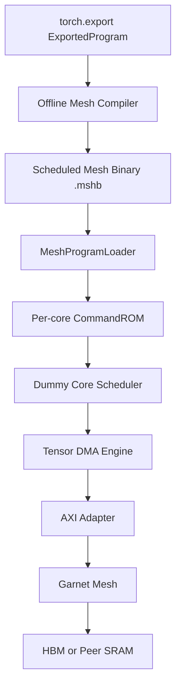
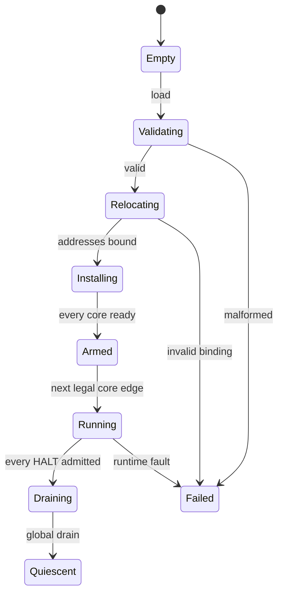

# `torch.export` → Mesh IR → Dummy Core/DMA

## Codex 实现规格与验收合同

> - 文档状态：Implementation Contract
> - 目标仓库：`makenma/XS-DSU-GEM5`
> - 上游网络合同：`AXI_GARNET_CODEX_SPEC.md`
> - 总体建模合同：`AI_MESH_MODELING_SPEC.md`
> - 建议工作分支：`feature/ai-mesh-mesh-ir`
> - 阶段目标：离线编译 `torch.export.ExportedProgram`，生成可由 gem5 Dummy Core 执行并产生真实 AXI/Garnet DMA 流量的 Scheduled Mesh IR
> - 术语修正：本文把用户所说的 `tensor.export` 解释为 PyTorch 公共入口 `torch.export.export()`

---

## 0. 先说清楚：Mesh IR 如何喂给 Dummy Core，以及 Dummy Core 如何搬数据

### 0.1 最重要的边界

**Mesh IR 是控制面程序，不是 tensor 数据，也不是运行时经过 Garnet 发送的一串 packet。**

离线编译器把 PyTorch 图变成每个 NPU tile 的静态 command stream，并编码成 `.mshb`。gem5 instantiate 时，`MeshProgramLoader` 在仿真开始前读取、校验、重定位 `.mshb`，然后把每个 core 的 command stream 安装到对应 `MeshDummyCore` 的只读 `CommandROM`。运行开始后，Dummy Core 解释命令；只有 `DMA_*` 命令才通过 AXI-over-Garnet 搬运 tensor 数据。



必须区分两条路径：

| 路径 | 内容 | 是否形成 NoC 流量 | 完成条件 |
|---|---|---:|---|
| Program load | command、tensor metadata、allocation、dependency、relocation | 否；MVP 视为预装 firmware/config | loader 校验、重定位、安装完成 |
| Tensor movement | activation、weight tile、KV tile、partial result | 是；由 Dummy Core DMA 发 AXI | 真实 R/B response 和目标 SRAM commit 完成 |

禁止为了“看起来像真实系统”把 `.mshb` 本身默认走 AXI；那会把模型加载流量和推理数据流量混在一起。未来若研究 program load，可新增独立 `program_load_traffic=true`，但它不属于本阶段通过条件。

### 0.2 从 `.mshb` 到 Dummy Core 的固定步骤

1. 编译器输出一个全局 Scheduled Mesh Program，内含 entrypoint、per-core command stream、tensor shard、SRAM allocation、event dependency、DMA segment、expected traffic 和 architecture digest。
2. gem5 配置通过 `--mesh-program=<path>.mshb` 创建一个 `MeshProgramLoader`。
3. loader 在 tick 0 之前完成纯配置工作：检查 magic/ABI/checksum、architecture digest、core 数、地址区间、SRAM 容量、所有 ID/索引和依赖图。
4. loader 根据 relocation table 把 `HBM/CORE_SRAM/PEER_SRAM/HOST_SHARED` 的 region-relative address 解析为 64-bit simulated physical address；禁止保存或解释 host pointer。
5. loader 按 `core_id` 把 immutable command range安装到对应 `MeshDummyCore::CommandROM`，并创建初始 event/tensor residency 状态。
6. `MeshDispatcher` 在第一个合法 core clock edge向所有参与 core 发同一个 `request_instance_id` 的 start event；禁止 tick 0 组合启动。
7. Dummy Core 的 `CommandScheduler` 只在 dependency、engine slot、SRAM lifetime 和队列容量同时满足时 issue command。
8. `DMA_*` command 被展开为一个或多个有限 `DmaDescriptor`；descriptor 进入 Dummy Core 自己的 DMA engine，而不是由 Dispatcher 直接生成 AXI。
9. DMA engine 按 architecture manifest 的 AXI data width、最大 burst beats 和 4 KiB 边界切分 transaction，并通过本 core 的 `AxiGarnetBridge` 发送。
10. 只有对应 AXI transaction 全部完成后，DMA 才发布 completion event；event 最早在下一 core clock edge解除下游 GEMM/reduce/store 的依赖。

### 0.3 Dummy Core 实际怎样搬 tensor

| Scheduled opcode | 数据源与目标 | AXI/Garnet 行为 | Dummy Core 完成点 |
|---|---|---|---|
| `DMA_LOAD` | HBM/共享内存 → 本 core SRAM | AR + 全部 R beats | 最后 R beat 已写入目标 SRAM，且 RLAST 被接受 |
| `DMA_STORE` | 本 core SRAM → HBM/共享内存 | AW + 全部 W beats + B | 全部 W 已发送且 OKAY B 被接受 |
| `DMA_P2P_PUSH` | 本 core SRAM → peer core SRAM aperture | AW + W + B，经 NPU Garnet | peer SRAM 已提交全部 bytes，source 收到 B |
| `DMA_PREFETCH` | HBM → 本 core SRAM | 与 `DMA_LOAD` 相同，但 completion 可只供未来 event 使用 | 全部 R beats 落入预留 buffer |
| `DMA_FILL` | 常量 pattern → 本 core SRAM | 本地 SRAM 写，不产生 NoC 流量 | 本地写端口完成 |

P2P MVP 固定使用 push：source DMA 本地读取自己的 SRAM，然后向 destination core 的 SRAM aperture 发 AXI write。`RECV_WAIT(transfer_id)` 在 destination 上只有在匹配 transfer 的全部 bytes commit 后才完成。不得在 source 和 destination 之间调用 C++ `memcpy` 或共享 tensor 指针。

运行期 backdoor 规则：

- cycle 0 前，test harness 可以把输入/权重 bytes 初始化到声明的 HBM/host memory region；
- 只有 manifest 明确标记 `PRE_RESIDENT` 的 weight shard 才可初始化到 core SRAM，并必须单独统计 skipped load bytes；
- cycle 0 后，任何跨 memory space 的 tensor residency 变化都必须由 Mesh IR command 驱动；
- 全局 quiescence 后，checker 可以 backdoor 读取结果用于验证；
- 运行中禁止 backdoor memcpy、直接改 residency bit 或直接 signal DMA completion。

### 0.4 最小真实业务链

本阶段的第一个 end-to-end golden 固定为：

```text
core 0: DMA_LOAD(input tile) ─┐
core 0: DMA_LOAD(weight tile) ├→ GEMM → DMA_P2P_PUSH(partial)
                              │
core 1: RECV_WAIT(partial) ───┴→ LOCAL_REDUCE → DMA_STORE(output)
```

其含义不是“GEMM 里隐式读 HBM”。GEMM 只能访问已驻留在本地 SRAM 的 input/weight/output allocation；如果 compiler 没插入 load 或 dependency，runtime verifier 必须失败。`LOCAL_REDUCE` 也只访问本地 SRAM；跨 core reduce 必须先 lower 为显式 P2P transfer。

### 0.5 不得声称的能力

- Dummy Core 不是 RISC-V/真实 NPU ISA core；它是事件驱动的 Scheduled Mesh IR interpreter。
- GEMM 不逐 MAC 计算数值；它用 MAC/带宽 cost model调度 completion event。
- traffic/digest 模式不证明模型数值正确；只有小规模 `FUNCTIONAL_BYTES` 测试证明 DMA byte copy正确。
- Mesh IR 不自动提供 coherence；共享 buffer 依赖显式 event/fence/ownership。
- Garnet Router 不解析 tensor、Mesh IR 或 DMA opcode；它只看到 AXI packet/flit/vnet/VC/credit。

---

## 1. 给 Coding Codex 的硬性执行指令

### 1.1 依赖与开工条件

本规格是 AXI-over-Garnet 之后的下一阶段。开始 gem5 runtime integration 前必须满足：

1. `AXI_GARNET_CODEX_SPEC.md` 的 Definition of Done 已通过；
2. 记录实际 `AXI_BASE_SHA`，不得假造或继续使用尚未实现的文档 SHA；
3. 一笔手写 AXI DMA load/store 已经可以在 Dummy endpoint 间完全 drain；
4. 工作树中即将修改的文件没有用户未提交修改；
5. Python compiler 环境与 gem5 build 环境彼此隔离。

首先执行：

```bash
git status --short
git branch --show-current
git rev-parse HEAD
git log -1 --oneline
python3 --version
```

若 AXI phase 尚未完成，可以实现和验证纯 Python compiler、schema 与 mock runtime，但不得宣称 gem5 E2E 通过。AXI runtime integration 必须停止在相应 gate。

### 1.2 分支规则

记录 `AXI_BASE_SHA` 后，从该提交创建：

```bash
git switch -c feature/ai-mesh-mesh-ir
```

若分支已存在，不得删除、覆盖或强行重建；先报告分支 SHA、相对 base 的 commit 和工作树状态。本 spec 生成阶段本身不创建分支。

未经用户授权不得 push、force-push 或创建 PR。禁止 `git reset --hard`、`git clean -fd`、批量格式化仓库和提交 build/m5out/trace/binary output。

### 1.3 本文件的优先级

本文件是实现合同，不是方向性建议：

- 遇到歧义，以本文件的 schema、状态机、不变量、错误分类和测试 oracle 为准；
- 不得为了减少代码量把 tensor 做成一个超长 Garnet packet；
- 不得为了通过测试使用无限 queue、共享 payload 指针或 runtime backdoor copy；
- 不得让 compiler expected traffic 调用 runtime 的同一 burst-split helper作为唯一 oracle；
- 若现有 AXI API 与本文件冲突，停止并列出冲突，不得在 Mesh IR 阶段偷偷改协议语义。

### 1.4 “通过”的声明规则

- 只有本次实际执行、退出码 0、无 skip/xfail/timeout、机器可读结果完整的测试才能写“通过”；
- compiler 生成文件不等于 loader/runtime 通过；
- loader 能读文件不等于 DMA traffic 正确；
- quick 不代表 full，mock bridge 不代表 Garnet E2E；
- traffic conservation 正确不代表数值正确；
- 任一 mandatory gate 未执行，结论只能是“部分实现”或“未验证”。

---

## 2. 本阶段范围

### 2.1 必须实现

1. `torch.export.ExportedProgram` importer；
2. inference-only frontend validation、decomposition 和 canonical op mapping；
3. Graph IR、内部 Kernel IR、Scheduled Mesh IR；
4. concrete shape profile specialization；
5. tensor placement、TP sharding、tile 划分和 deterministic SRAM plan；
6. `DMA_LOAD/STORE/P2P_PUSH/PREFETCH/FILL` 插入；
7. GEMM/BMM/elementwise/local reduce/softmax/normalization cost annotation；
8. ring/tree all-reduce lower 为显式 P2P + local reduce；
9. per-core command scheduling、event dependency、double buffering；
10. `.mshb` ABI、Python encoder/verifier、C++ loader/verifier；
11. `MeshDispatcher`、`MeshDummyCore`、`TensorDmaEngine` 的 runtime ABI；
12. compiler expected-traffic oracle与 gem5 logical/AXI traffic 对账；
13. deterministic compile、replay、错误诊断和机器可读报告；
14. Tiny MLP、Tiny Transformer、`DMA→GEMM→P2P→REDUCE→STORE` E2E。

### 2.2 明确不做

- 训练、autograd、optimizer、backward graph；
- 导出完整 `model.generate()`、Python serving loop 或 Agent loop；
- 任意 Python control flow、graph break fallback；
- 完整 ATen op 覆盖；
- 自动搜索最优 mapping/autotuning；
- 任意 dynamic shape 的 JIT recompile；
- tensor 数值级 GEMM/softmax/normalization 仿真；
- 真实 weight payload 打包进 `.mshb`；
- in-network reduce/multicast；
- UCIe/CPU die/Host resource pool/Agent FSM；
- MoE runtime route 的完整实现；本阶段只保留 profile ABI 和明确拒绝/占位；
- program binary 经 NoC 下载；
- 功耗、热、PPA、RTL 等价。

### 2.3 与后续阶段的接口

- Serving frontend 以后通过 `entrypoint + profile_id + symbol bindings + tensor base relocations` 启动程序；
- Agent/CPU/UCIe 以后只负责准备 input region、doorbell/request 和读取 output region；
- MoE 以后向本 compiler提供 route replay/histogram，再 lower 为 `ALL_TO_ALL_V`；
- WINDOWED/FAST 模式以后复用 Scheduled IR 的 `logical_bytes/repeat_count`，但本阶段 mandatory E2E 使用 `FULL_TIMING`。

---

## 3. `torch.export` 前端合同

### 3.1 上游事实与版本隔离

PyTorch 官方文档把 `torch.export.export()` 定义为根据 example inputs 捕获单图 `ExportedProgram`；graph 是 FX/ATen IR，`graph_signature` 区分 parameters、buffers、user inputs/outputs，`range_constraints` 保存符号范围。官方也明确说明 export 不支持 graph breaks，而且相关 API 仍可能发生兼容性变化。因此 compiler 必须 pin 精确 PyTorch 版本并隔离兼容层，不能让其对象直接泄漏进后端 pass。

参考一手资料：

- [PyTorch `torch.export` tutorial](https://docs.pytorch.org/tutorials/intermediate/torch_export_tutorial.html)
- [PyTorch export API reference](https://docs.pytorch.org/docs/stable/user_guide/torch_compiler/export/api_reference.html)
- [PyTorch export IR specification](https://docs.pytorch.org/docs/stable/user_guide/torch_compiler/export/ir_spec.html)
- [Functional/Core ATen operator set](https://docs.pytorch.org/executorch/stable/ir-ops-set-definition.html)

必须新增独立 compiler environment：

```text
util/mesh_ir/pyproject.toml
util/mesh_ir/requirements-lock.txt
util/mesh_ir/mesh_ir/torch_compat.py
```

`compile_report.json` 必须记录 Python、PyTorch、ExportedProgram schema/opset、compiler git SHA 和依赖 lock digest。任何不同版本生成的输出即使内容偶然相同，也不得复用 cache key。

### 3.2 输入方式

必须支持两个互斥入口：

```bash
# 推荐：可复现的已保存 ExportedProgram
python3 -m mesh_ir.compile \
  --exported-program model_prefill.pt2 \
  --arch arch/mesh_5x5.yaml \
  --config compile.yaml \
  --output out/prefill

# 开发便利：compiler 进程内调用 torch.export.export()
python3 -m mesh_ir.export_and_compile \
  --module examples.tiny_mlp:make_model \
  --inputs examples/tiny_mlp_inputs.json \
  --dynamic-shapes examples/tiny_mlp_shapes.json \
  --arch arch/mesh_2x2.yaml \
  --config compile.yaml \
  --output out/tiny_mlp
```

第一种入口使用 `torch.export.load()` 读取由同一 pinned environment 产生的 artifact。禁止用普通 `torch.load()`/pickle 代替，也不得加载不可信 arbitrary Python object。

第二种入口必须：

- factory 返回 `torch.nn.Module`；
- 调用 `eval()`；
- 禁用 gradient；
- 固定 example input shape/dtype；
- 把 export arguments、dynamic shape declaration 和 source module digest 写入 report；
- export 后立即保存 `.pt2`，后续 passes只读取 ExportedProgram compatibility DTO。

### 3.3 ExportedProgram importer

importer 只能读取经过 `torch_compat.py` 归一化的以下内容：

```text
graph / graph_module
graph_signature
range_constraints
state_dict metadata
constants metadata
call_spec / input-output pytree spec
node.meta tensor shape/dtype/stride/source location
```

compatibility DTO 必须是本项目自己的 dataclass，不允许后端 pass 保存 FX Node、FakeTensor、SymInt 或 callable。每个 imported value/node 使用稳定整数 ID；不得使用 Python `id()`、对象地址、默认 `hash()` 或 FX 自动名字作为唯一 ABI ID。

graph signature 分类必须至少覆盖：

| Export kind | Mesh compiler 行为 |
|---|---|
| parameter | 生成 `WEIGHT` tensor metadata；默认不嵌入 bytes |
| persistent buffer | 生成 `WEIGHT` 或 `STATE` metadata |
| non-persistent buffer | 作为显式 input/state，不能静默丢失 |
| tensor constant | 生成 `CONSTANT` metadata；大常量只存 shape/bytes/digest |
| user input | 生成 entrypoint input tensor和 relocation |
| user output | 生成 entrypoint output tensor和 relocation |
| mutated buffer/input | MVP 拒绝，稳定诊断 `MESH_E_STATE_MUTATION` |
| token/custom object | MVP 拒绝，稳定诊断 `MESH_E_NON_TENSOR_IO` |

参数/常量 value 本身不是流量 oracle。compiler 以 `shape × dtype bytes`、layout、shard、residency 和 relocation决定 DMA；可选 content digest 只用于 identity/cache，不进入 timing。

### 3.4 inference 与 entrypoint 边界

LLM 不导出完整 `generate()`。至少采用：

```text
prefill(input_ids or embeddings, attention metadata, KV handles) -> output/KV updates
decode_step(next_token or embedding, past KV handles, position) -> logits/KV updates
```

MVP golden 可以先使用不带 KV 的 Tiny Transformer，但 schema 从第一版保留 `KV_CACHE` storage class 和 entrypoint state handle。任何 serving loop、sampling、stop condition、continuous batching 都在 Mesh IR 外部。

一个 `.mshb` 可以包含多个 entrypoint 和 profile；每个 `(entrypoint, profile_id)` 的 Scheduled IR 必须是 concrete schedule。

### 3.5 dynamic shape 策略

Graph IR 可以保存 bounded symbolic dimension，但 Scheduled IR MVP 不保留需要动态改变 tile 数或 command 数的 symbol。

固定规则：

1. 所有 `torch.export.Dim` 必须有 finite `min/max`；无上界 symbol 拒绝；
2. compiler config 给出有限 `shape_profiles`；
3. `SpecializeShapesPass` 为每个 profile绑定 concrete dimension；
4. 每个 Scheduled entrypoint variant 的 tensor shape、allocation、tile、DMA bytes 和 command count 全部 concrete；
5. runtime 只做 exact profile selection，不做 JIT compile；
6. 请求 shape 不匹配任何 profile时返回受控 `MESH_RUNTIME_E_NO_PROFILE`，不得选择最近 profile或越界运行。

示例：

```yaml
entrypoints:
  prefill:
    shape_profiles:
      - {profile_id: prefill_b1_s128, B: 1, S: 128}
      - {profile_id: prefill_b1_s512, B: 1, S: 512}
  decode_step:
    shape_profiles:
      - {profile_id: decode_b1_kv512, B: 1, KV: 512}
      - {profile_id: decode_b4_kv2048, B: 4, KV: 2048}
```

profile 必须满足 ExportedProgram `range_constraints` 和所有等式 guard；不满足时 compile-time 失败，不能把 guard 留给 Dummy Core猜测。

### 3.6 decomposition 与 op surface

frontend 先 functionalize，再按 versioned decomposition table归一化。不能直接调用“当前 PyTorch 默认表”而不记录 digest；默认表变化会改变图和 traffic。

输出 `decomposition_manifest.json`：

```text
torch version
source exported opset
decomposition table digest
before/after op histogram
preserved fused op list
unsupported op list
```

第一版 canonical op surface：

| 类别 | 接受的 canonical op |
|---|---|
| matmul | `MATMUL`, `BMM`, `LINEAR_BIAS` |
| tensor view | `RESHAPE_VIEW`, `TRANSPOSE_VIEW`, `PERMUTE_VIEW`, `SLICE_VIEW`, `EXPAND_VIEW` |
| data movement | `CONTIGUOUS_COPY`, `CONCAT`, `GATHER_ROWS` |
| elementwise | `ADD`, `SUB`, `MUL`, `DIV`, `RELU`, `GELU`, `SILU`, `EXP`, `RSQRT` |
| reduce | `REDUCE_SUM`, `REDUCE_MAX`, `REDUCE_MEAN` |
| normalization | `LAYERNORM`, `RMSNORM` |
| attention | `SOFTMAX`, optional verified `ATTENTION` fusion |
| embedding | `EMBEDDING_LOOKUP` |

`aten.linear/addmm` 可 canonicalize 为 matmul+bias；view op 不产生 DMA，除非 stride/layout 无法被 consumer接受，此时必须插 `CONTIGUOUS_COPY`。SDPA 只有 pattern 完全匹配且 mask/scale/causal 语义可表达时才 fuse；否则 lower 为 matmul/scale/mask/softmax/matmul。禁止只按 node name 模糊匹配。

不在表中的 op必须 compile-time 失败并报告：

```text
stable error code
ATen target and schema
node stable ID
input/output shapes and dtypes
source file/line when available
nearest supported canonical family
suggested decomposition/custom lowering hook
```

custom op 只有在 `lowerings/<namespace>.py` 显式注册、声明纯函数/shape/bytes/cost并有 golden test 时才可接受。

### 3.7 dtype 与 layout

MVP 支持：

```text
fp32, fp16, bf16, int8, int32
```

允许的 accumulation：fp16/bf16→fp32，int8→int32。其他 dtype 拒绝；不得把未知 dtype 按 4 bytes 处理。

Graph IR可保存任意已验证 stride；Kernel/Scheduled IR只支持：

```text
CONTIGUOUS_ROW_MAJOR
TRANSPOSED_2D_VIEW
BLOCKED_MNK
```

negative stride、overlapping storage、未证明安全的 `as_strided`、sparse/quantized subclass、complex dtype 在 MVP 中稳定拒绝。view alias 必须在 bufferization 前显式记录；不得为每个 view重复分配和搬运完整 tensor。

---

## 4. Architecture manifest 与编译请求

### 4.1 `arch.yaml` 是编译与运行的共同真相

compiler 不能把 5×5、32-byte bus、16 beats 或 SRAM 大小写死。所有会改变合法性、allocation、command、burst 或 timing 的参数必须来自 versioned architecture manifest；gem5 runtime 必须加载同一份语义配置，二者都记录其 canonical SHA-256。

最小 schema：

```yaml
schema_version: mesh-arch-v1
arch_name: xs_ai_mesh_5x5
clock_hz: 2000000000

mesh:
  rows: 5
  cols: 5
  endpoint_order: row_major_yx
  routing: xy
  core_ids: [0, 1, 2, 3, 4, 5, 6, 7, 8, 9,
             10, 11, 12, 13, 14, 15, 16, 17, 18, 19,
             20, 21, 22, 23, 24]

core:
  command_rom_entries: 65536
  decode_width: 1
  event_visibility_cycles: 1
  sram:
    bytes: 2097152
    banks: 16
    read_ports_per_bank: 1
    write_ports_per_bank: 1
    read_bytes_per_cycle_per_bank: 32
    write_bytes_per_cycle_per_bank: 32
    base_alignment_bytes: 64
  tensor_engine:
    queue_depth: 8
    setup_cycles: 8
    pipeline_flush_cycles: 4
    macs_per_cycle: {fp16: 256, bf16: 256, fp32: 64, int8: 512}
  vector_engine:
    queue_depth: 8
    elements_per_cycle: {fp16: 128, bf16: 128, fp32: 64, int8: 256}
  reduce_engine:
    queue_depth: 8
    setup_cycles: 4
    flush_cycles: 2
    ops_per_cycle: {fp16: 64, bf16: 64, fp32: 32, int32: 32}
  dma:
    read_engines: 1
    write_engines: 1
    descriptor_queue_depth: 16
    segment_queue_depth: 32
    read_outstanding: 16
    write_outstanding: 16
    setup_cycles: 2

axi:
  data_bytes: 32
  address_bits: 64
  id_bits: 8
  max_burst_beats: 16
  enforce_4k_boundary: true
  max_outstanding_per_id: 1
  qos_default: 0

memory_regions:
  - {name: hbm, kind: HBM, base: 0x800000000, bytes: 0x400000000}
  - {name: host_shared, kind: HOST_SHARED, base: 0x100000000, bytes: 0x10000000}
  - {name: mesh_sram, kind: CORE_SRAM_APERTURE,
     base: 0x400000000, tile_stride: 0x400000, tile_bytes: 0x200000}
```

规范约束：

- `core_ids` 必须唯一，数量等于 `rows × cols`；坐标映射固定为 `core_id_at(y,x)`，不得由 map 迭代顺序决定；
- `axi.data_bytes` 必须为 2 的幂、范围 8/16/32/64；`max_burst_beats` 范围 1–256，本项目参考值为 16；
- `tile_stride` 必须为 2 的幂且不小于 SRAM aperture；所有 region 不重叠且 `base + bytes` 不溢出 64 bit；
- 所有 queue/outstanding/bank/port 深度必须大于 0 且为有限值；
- opcode、dtype 和 timing model capability 必须显式列出或由 schema version 固定，未知 capability 不得假定支持；
- manifest 中的数值是编译期 contract，runtime 参数覆盖后如改变 digest，loader 必须在 start 前拒绝。

### 4.2 `compile.yaml`

编译请求只包含 workload 与 policy，不复制 architecture capacity：

```yaml
schema_version: mesh-compile-v1
entrypoints: [prefill, decode_step]
shape_profiles:
  prefill: [{profile_id: prefill_b1_s128, B: 1, S: 128}]
  decode_step: [{profile_id: decode_b1_kv512, B: 1, KV: 512}]

parallelism:
  tensor_parallel: 4
  pipeline_parallel: 1
  expert_parallel: 1
  data_parallel: 1

placement:
  core_order: row_major_yx
  allowed_cores: [0, 1, 5, 6]
  reserve_cores: []

tiling:
  gemm_m: 64
  gemm_n: 64
  gemm_k: 64
  double_buffer: true

collectives:
  all_reduce_algorithm: ring
  chunk_bytes: 4096

runtime_model:
  mode: FULL_TIMING
  tensor_data: DIGEST_ONLY
```

MVP 只接受显式的 `ring`/`tree`、tile size、parallel degree 和 core order；`auto` 只能存在于 Graph/Kernel IR，进入 Scheduled IR 前必须解析成具体值。若资源不可行则报错，不得悄悄降低并行度、tile size、SRAM bank 数或 outstanding。

配置合并顺序固定为：schema default < `arch.yaml` < `compile.yaml` < CLI 的显式单值覆盖。每次覆盖必须进入 `effective_config.json`；环境变量不得隐式改变语义。所有 map canonicalize 为 key 排序，所有 set canonicalize 为数值排序。

### 4.3 地址、权重与 relocation

compiler 只生成 region-relative 地址：

```text
AddressRef {
  region_id: u16
  owner_core: u16       // 非 per-core region 使用 0xffff
  offset_bytes: u64
  size_bytes: u64
  alignment_bytes: u32
}
```

`.mshb` 中禁止 host virtual pointer、Python object address 和运行时分配器 pointer。外部 input/output/weight 由 symbol name + relocation slot 绑定；相同 symbol 不得在一次 dispatch 中绑定到重叠的可写区域。

weight payload 默认另存；program 只记录 `content_sha256`、logical bytes、storage bytes 和 relocation。小于可配置阈值的 scalar/constant pattern 可编码为 `DMA_FILL`；不得把大 tensor 常量塞进 command record。

loader 做全部 64-bit checked arithmetic，并验证：region 类型、owner、alignment、bounds、访问权限、重叠、SRAM aperture 与实际 core 数。architecture digest 不匹配使用 `MESH_LOAD_E_ARCH_MISMATCH`，而不是 warning。

---

## 5. 三层 Mesh IR 与公共数据模型

### 5.1 层级边界

本文的 Mesh IR 是本项目自定义、versioned 的 IR 和 binary ABI；不要求引入 LLVM MLIR 运行时依赖。外部调试 artifact 使用 canonical JSON，运行时消费紧凑 `.mshb`。

| IR 层 | 用途 | 可以未决 | 禁止出现 |
|---|---|---|---|
| Graph IR | functional 全局 tensor SSA | bounded symbol、抽象 placement/sharding | physical address、allocation、queue、event |
| Kernel IR | tile/buffer state SSA 与异步 dependency DAG | virtual memory class、尚未选定的具体 queue | physical SRAM offset、AXI burst |
| Scheduled IR | Dummy Core 可机械执行的 program | 仅 request relocation 值 | `auto`、symbolic command count、未分配 buffer、隐式 collective |

**Dummy Core 只解析 Scheduled IR。** Graph IR/Kernel IR 不得在 runtime 临时 lowering；否则 runtime 与 compiler traffic oracle 不再独立，也无法重放同一 schedule。

每层必须携带：

```text
schema_major, schema_minor, required_features
arch_digest
source_semantic_hash
semantic_sha256
entrypoint/profile identity
```

Kernel IR 的 `source_semantic_hash` 指向 Graph IR；Scheduled IR 指向 Kernel IR。hash 不一致必须失败。

### 5.2 稳定 ID、顺序与整数

- 每个 namespace 的 ID 使用从 1 开始的稠密 `u32`；0 表示 none/invalid；
- ID 由 canonical topological order 分配；ready set 的 tie-break 是 source stable ID、opcode、operand ID tuple；
- core/placement rank 按 `(y,x)` row-major，collective participant order也使用该顺序；
- JSON 中大于 `2^53-1` 的地址/字节值以规范十六进制字符串表示；binary 中使用 little-endian `u64`；
- 禁止 Python `hash()`、对象地址、线程完成顺序、filesystem enumeration 和随机 UUID 参与输出；
- source path 先变为 repository-relative，debug sidecar 才可保存；不得进入 semantic hash。

### 5.3 Tensor、shape 与 storage

```text
TensorDesc {
  tensor_id: u32
  stable_name: string_id
  role: INPUT | OUTPUT | WEIGHT | CONSTANT | ACTIVATION | KV_CACHE | STATE
  dtype: FP32 | FP16 | BF16 | INT8 | INT32
  rank: u8
  global_shape[rank]: DimExpr
  layout_id: u32
  placement_id: u32
  sharding_id: u32
  storage_class: EXTERNAL | HBM | HOST_SHARED | CORE_SRAM | PRE_RESIDENT
  access: READ_ONLY | READ_WRITE
  content_sha256: optional bytes[32]
}
```

Graph IR `DimExpr` 闭集为 `Const`、`Symbol`、`Add`、`MulByConst`、`FloorDivByConst`、`CeilDivByConst`。symbol 包含 `min/max/multiple_of`；不能表示或不能证明安全的 expression 在 frontend失败。Scheduled IR 的 shape、stride、offset、bytes、tile count 与 command count必须全部变为 concrete `u64`。

允许 layout：

```text
CONTIGUOUS_ROW_MAJOR
TRANSPOSED_2D_VIEW
BLOCKED_MNK {block_m, block_n, block_k, minor_to_major}
```

layout 必须给出本地 footprint、alignment 和每个 owner 的 span。可写 view 必须能证明不重叠；stride 0 只允许只读 broadcast view。所有 shape/stride/byte 计算使用 checked arithmetic。

### 5.4 Placement、sharding 与 shard table

```text
Placement {
  placement_id: u32
  core_ids[]: u16       // 已按 row-major 排序
}

Sharding {
  sharding_id: u32
  dim_axes[rank]: list<MESH_X | MESH_Y>
  partial_axes[]: {axis, reduce_kind}
}

TensorShard {
  shard_id: u32
  tensor_id: u32
  owner_core: u16
  global_origin[rank]: u64
  local_shape[rank]: u64
  valid_shape[rank]: u64
  allocation_id: u32
  allocation_offset: u64
  span_bytes: u64
}
```

V1 使用均匀 sharding；不能整除时 compiler 必须显式 pad 并保留 `valid_shape`，不得让 runtime猜测尾 tile。一个 mesh axis 最多用于一个 tensor dim或一个 partial axis。K-axis GEMM sharding使输出带 `partial(SUM)`，必须在普通 consumer 前通过 collective消除。

### 5.5 Allocation、alias 与 lifetime

```text
Allocation {
  allocation_id: u32
  owner_core: u16
  memory_space: CORE_SRAM | HBM | HOST_SHARED
  offset_bytes: u64
  size_bytes: u64
  alignment_bytes: u32
  persistent: bool
}
```

Kernel IR 对可变 storage 使用 tensor-state SSA：每次写消费 `dst_old` 并产生同一 tensor object 的 `dst_new`，version 必须递增 1。view 共享同一 allocation，不创建 copy；普通不同 tensor object 在可能同时 live时禁止物理 alias。

lifetime 由所有 access command 与 event happens-before 推导。若要复用同一 byte range，必须证明 A 的所有 maximal uses happens-before B 的所有 minimal uses，或反向成立。不能证明即冲突。编译器不得在 `.mshb` 中写一个手工 lifetime 来覆盖实际 command use。

### 5.6 Graph IR op

Graph IR 使用 immutable SSA，每个 value 单定义，op 是 canonical topological order。核心 schema：

```text
GraphFunction {function_id, name, inputs[], ops[], outputs[]}
GraphOp {op_id, opcode, operands[], results[], attrs, source_loc_id}
```

opcode 只能来自 3.6 的 canonical allowlist。不得保留 opaque `aten.*` fallback、callable、Python object、subgraph 或“运行时执行 FX”的 escape hatch。

### 5.7 Kernel IR op

Kernel IR 至少包括：

```text
ALLOC/VIEW
DMA
GEMM/BMM
ELEMENTWISE
REDUCE
SOFTMAX/NORM
COLLECTIVE
BARRIER
```

每个 effectful op 有唯一 `done_token`，`after_tokens[]` 是显式控制依赖；数据 state def-use 与 token def-use 的并集必须无环。`after_tokens` canonicalize 为 transitive reduction并排序。

DMA segment 以逻辑 element region描述；src/dst dtype相同，不做 cast/算术。GEMM 明确 `batch,M,N,K,transpose,accum_dtype,epilogue`；reduce 明确 axes/order/accum dtype；collective明确 group、participant order、algorithm、chunk bytes。Kernel 中允许 `algorithm=AUTO`，Scheduled 中禁止。

### 5.8 Scheduled IR 公共 command

```text
Command {
  command_id: u32
  source_op_id: u32
  core_id: u16
  stream_id: u16
  engine: CONTROL | DMA_READ | DMA_WRITE | TENSOR | VECTOR | REDUCE
  opcode: ScheduledOpcode
  wait_event_begin: u32
  wait_event_count: u16
  signal_event: u32
  operand_begin: u32
  operand_count: u16
  attr_record: u32
  debug_loc_id: u32
}
```

命令表按 `command_id` 排序；每个 per-core stream另有有序 command ID range。frontend按 stream 顺序 decode/admit，但不同 engine command在显式依赖允许时可并行并乱序完成。stream 顺序只约束 decode/admit；跨 engine completion先后不得靠“前一条写在前面”猜测。

event 为 SSA：普通 event恰好一个 producer，允许多个 consumer，signal 后不 reset/reuse。barrier event声明唯一 participant set与 `expected_arrivals`。event 在物理完成周期末发布，消费者最早下一 core edge看见。

### 5.9 Scheduled opcode 闭集

| 类别 | Opcode | 强制语义 |
|---|---|---|
| memory | `DMA_LOAD` | HBM/shared → local SRAM |
| memory | `DMA_STORE` | local SRAM → HBM/shared |
| memory | `DMA_P2P_PUSH` | local SRAM → peer SRAM aperture |
| memory | `DMA_PREFETCH` | 与 LOAD 相同，但只产生未来 token |
| memory | `DMA_FILL` | local pattern fill；不产生 NoC traffic |
| memory | `AXI_FENCE` | 等待本 core 指定 ID/class 的既有 transaction drain |
| compute | `GEMM`, `BMM` | local SRAM + target cost model |
| compute | `ELEMENTWISE` | local SRAM + vector cost model |
| compute | `LOCAL_REDUCE` | local SRAM，不含网络时间 |
| compute | `SOFTMAX`, `NORM` | 已选择 concrete algorithm 的 local sequence |
| sync | `RECV_WAIT` | 等待匹配 P2P transfer在目标 SRAM commit |
| sync | `EVENT_WAIT`, `EVENT_SIGNAL` | 控制面 event；不产生 Garnet traffic |
| sync | `BARRIER` | 固定 participant rendezvous + fence |
| control | `REQUEST_BEGIN`, `REQUEST_END` | request统计边界，不改变 tensor |
| control | `REPEAT` | 只允许固定次数、固定 command subrange |
| control | `HALT` | stream终止；等待本 core所有已发工作 drain |

`REPEAT` 的 count 必须 concrete，展开后的逻辑 command/traffic count必须能计算；event ID用 `(base,generation)` 映射到唯一 runtime event。一个 core 的所有 stream必须最终到达唯一 local `HALT`，重复/缺失 HALT 均 loader失败。

---

## 6. 固定编译 pipeline

compiler pass 顺序是 ABI 的一部分，必须在 report 记录每个 pass 的版本、输入/输出 hash、耗时与统计：

1. **LoadAndValidateExport**：版本、可信来源、`ep.validate()`、dialect、signature 一致性；
2. **DecomposeToPinnedCoreAten**：使用固定 decomposition table产生新 EP，旧 graph/state binding全部失效；
3. **ImportGraphIR**：稳定 ID、pytree ABI、weights/constants、source mapping；
4. **CanonicalizeFunctionalOps**：消除 in-place/view noise，映射 canonical allowlist；
5. **SpecializeShapeProfiles**：检查 range/equality/multiple guard，生成 concrete variant；
6. **FuseVerifiedPatterns**：bias/activation、normalization、可证明等价的 attention pattern；
7. **AnnotateCostAndBytes**：logical bytes、MACs、reduce ops、layout footprint；
8. **ChooseParallelPlan**：验证 TP/PP/EP/DP，并把具体 group写入 IR；
9. **PlaceOpsAndTensors**：按稳定 tie-break选择 core，不允许 Scheduled 中留 `any_core`；
10. **ShardAndPadTensors**：生成每 core shard、valid extent、partial metadata；
11. **TileKernels**：生成 concrete GEMM/reduce/vector tile及 iteration order；
12. **BufferizeAndAlias**：形成 tensor-state SSA，view合法 alias，copy显式化；
13. **LowerCollectives**：ring/tree展开为 P2P、local reduce、event/barrier phase；
14. **InsertDataMovement**：为所有 residency transition插 DMA；compute不得隐式访 HBM；
15. **PlanStaticSRAM**：liveness/conflict graph、对齐、double buffer、确定性分配；
16. **InsertHazardDependencies**：补齐 RAW/WAR/WAW、pin、buffer reuse、engine queue依赖；
17. **SchedulePerCoreStreams**：选择具体 engine/queue并形成 command order；
18. **LowerDmaToSegments**：产生 descriptor/segment和独立 expected burst plan；
19. **BindAddressesAndRelocations**：解析 SRAM offset，保留外部 region relocation；
20. **VerifyScheduledIR**：schema、resource、SSA、hazard、deadlock、capability、bounds；
21. **ComputeExpectedTraffic**：从 Scheduled descriptor使用独立 reference splitter计算 oracle；
22. **EncodeArtifacts**：canonical JSON、binary、manifest、report和 checksums。

禁止跳过或静默重排 pass。可禁用的 optimization 必须保留 pass占位及 input=output hash。任何 nondeterministic并行实现都必须在输出前 canonical merge；worker数 1/2/8 的输出必须 byte-identical。

### 6.1 deterministic placement 与 tile 顺序

MVP 不是 autotuner。合法候选的 tie-break固定为：

```text
minimum estimated communication bytes
then minimum peak SRAM bytes
then minimum Manhattan hop-byte sum
then lexicographically smallest core-id tuple
then smallest op/tile stable ID
```

tile loop顺序固定为 batch → M → N → K；collective chunk按 byte offset递增；ring rank按 placement row-major递增。任何随机搜索必须在未来 feature version中显式加入，并把 seed和最终 choice写入 artifact。

### 6.2 SRAM planner

每 core planner：

1. 用 event DAG建立 command happens-before；
2. 推导每个 allocation的 birth、minimal/maximal uses和 alignment；
3. 对不能证明 lifetime不相交的 pair加 conflict edge；
4. 按 `(persistent desc, alignment desc, size desc, tensor_id, buffer_index)` 排序；
5. 使用 lowest-address aligned first-fit；
6. 验证 capacity和所有 conflict pair不重叠；
7. 输出 peak bytes、padding bytes、fragmentation和 conflict witness。

double buffer不是 runtime魔法。compiler 创建两个 allocation、奇偶 generation event和明确 prefetch/compute/store command；若两个 buffer及并发 descriptor装不下，报 `MESH_E_SRAM_CAPACITY`。

### 6.3 collective lowering

Scheduled IR 不允许 native/in-network collective。例：4-rank ring all-reduce必须 lower 为确定数量的 reduce-scatter和 all-gather phase；每个 phase是 `DMA_P2P_PUSH → RECV_WAIT → LOCAL_REDUCE` 或纯 P2P copy，chunk和rank顺序固定。

规则：

- `ALL_REDUCE` 支持 SUM，其他 reduce kind只有 engine capability和测试齐全时开放；
- ring要求 group size ≥ 2，tree要求明确 parent/children；
- P2P transfer ID全局唯一，source/destination/event一一对应；
- collective output event只有所有 participant、chunk、phase完成后才 signal；
- expected traffic按实际 expanded P2P useful bytes计算，不按抽象 collective input bytes估算；
- 禁止 Garnet multicast、router reduction、共享 backing store或固定 collective delay。

---

## 7. DMA descriptor 与 AXI lowering合同

### 7.1 descriptor

```text
DmaDescriptor {
  descriptor_id: u32
  command_id: u32
  transfer_id: u32
  owner_core: u16
  kind: LOAD | STORE | P2P_PUSH | PREFETCH | LOCAL_FILL
  src: {memory_space, owner, address_ref, tensor_id, shard_id, byte_offset}
  dst: {memory_space, owner, address_ref, tensor_id, shard_id, byte_offset}
  rows: u32
  row_bytes: u64
  src_stride_bytes: u64
  dst_stride_bytes: u64
  useful_bytes: u64
  physical_storage_bytes: u64
  axi_id: u16
  qos: u8
  max_burst_beats: u16
  completion_event: u32
}
```

`useful_bytes == rows × row_bytes` 使用 checked arithmetic。二维 descriptor先变为 row offset递增的 contiguous segments，再逐 segment切 burst。至少一个 endpoint必须属于 issuing core；remote-to-remote非法。MVP 不允许 src/dst logical range重叠，零字节 descriptor不发 AXI但至少一 core cycle后才发布 event。

descriptor admit到完成期间 pin相关 SRAM allocation。source write、destination read/write或 allocation reuse若无明确 happens-before，Scheduled verifier必须拒绝。

### 7.2 规范 burst splitter

设 `W=axi.data_bytes`，`L=min(descriptor.max_burst_beats, arch.max_burst_beats, 256)`，`a` 是远端当前 byte address，`remaining` 是本 segment剩余 useful bytes。V1 采用 full-width INCR beat：

```text
while remaining > 0:
    beat_base = align_down(a, W)
    head      = a - beat_base
    page_cap  = 4096 - (beat_base & 0xfff)
    burst_cap = L * W
    useful    = min(remaining, page_cap - head, burst_cap - head)
    beats     = ceil((head + useful) / W)

    AxADDR = beat_base
    AxSIZE = log2(W)
    AxLEN  = beats - 1

    emit(beat_base, logical_start=a, useful, beats)
    a += useful
    remaining -= useful
```

每个 burst 必须满足：

```text
1 <= beats <= L <= 256
(AxADDR >> 12) == ((AxADDR + beats*W - 1) >> 12)
sum(burst.useful_bytes) == descriptor.useful_bytes
```

write `WSTRB` 等于每个 beat lane与 logical byte interval的交集，未置位 lane不得改目标；read可 overfetch已分配 padding lane，但 packer必须丢弃非 logical lane，不能把它们写入目标 tensor或计为 useful bytes。allocation因此至少按 W 对齐并为首尾 physical beat保留可访问 padding。

compiler expected splitter与 C++ runtime splitter必须是独立实现，使用同一书面公式和 cross-language golden vectors；禁止 Python wrapper调用 C++ production helper充当唯一 oracle。

### 7.3 AXI/Garnet映射与既有合同

本阶段必须复用 `AXI_GARNET_CODEX_SPEC.md` 的五个 vnet、VC、ordering、W-before-AW处理和 response escape规则，不得新增私有 reservation ACK或改变 wire protocol：

```text
Mesh command
  → descriptor
    → segment
      → AXI burst
        → AW/W/B or AR/R beats
          → existing AXI-over-Garnet packets
            → Garnet flits
```

Garnet Router只做既有 route/VC/credit；不解析 `tensor_id`、descriptor、event、collective或 opcode。traffic stats必须同时保留 command/descriptor/segment/burst/beat/packet/flit层级，不能把这些名词混用。

### 7.4 完成点、顺序与背压

| DMA | completion event 的唯一合法条件 |
|---|---|
| LOAD/PREFETCH | 全部 R beat成功且所有有效 byte已 commit本地 SRAM |
| STORE | 全部 W handshake且对应每个 burst的成功 B均被 source接受 |
| P2P_PUSH | peer SRAM已提交所有有效 W lane，所有成功 B已返回 source |
| FILL | 所有本地 SRAM write request已 drain |

`WLAST`、`RLAST`、最后 flit到达或 source完成读 SRAM都不是 descriptor completion。AXI error、重复/missing beat、错误 LAST、越界或 poison read必须发布 error event并阻止成功消费者。

所有 queue/table有限，且来自 `arch.yaml`。Garnet credit不足必须逐级反压到 bridge、AXI READY、DMA queue和 Dummy scheduler；禁止无限 side buffer。相同 AXI ID在全部 response完成前不复用，不同 ID可按既有 AXI合同乱序。

### 7.5 expected traffic

compiler 为每个 `(entrypoint, profile, command, descriptor)` 输出：

```text
logical/useful bytes
physical beat bytes
segment count
read/write burst count
AW/W/B/AR/R counts
packet count by AXI message class and vnet
minimum flit count using configured flit bytes
source/destination/hop-byte estimate
```

对 writes：

```text
AW == B == write_bursts
W == sum(AxLEN + 1)
sum(popcount(WSTRB)) == useful_write_bytes
```

对 reads：

```text
AR == read_bursts
R == sum(AxLEN + 1)
locally_committed_logical_bytes == useful_read_bytes
```

runtime result必须按稳定 ID逐项对账；只比较总 bytes不足以通过。

---

## 8. Dummy Core runtime 合同

### 8.1 必须实现的组件

```text
MeshProgramLoader
MeshDispatcher
MeshEventScoreboard
MeshDummyCore[N]
  ├── CommandROM
  ├── CommandScheduler
  ├── TensorDmaEngine
  ├── Tensor/Vector/Reduce timing engines
  ├── MeshSram
  └── AxiGarnetBridge（复用上一阶段）
```

`MeshDispatcher` 只做 entrypoint/profile选择、relocation binding、start/error/quiescence协调；禁止它代替 core生成 DMA。`MeshProgramLoader` 只安装程序和 cycle 0 前的合法 initializer；禁止它在运行中更改 tensor residency。

### 8.2 Loader 状态机与原子 start



start必须原子：只有 image、所有 relocation、所有 core stream、event table和初始 residency均成功时，所有参与 core才进入 `Armed`；任一失败则没有 core执行第一条 command。start event在所有 core可观察到的第一个合法 clock edge发布，不允许 tick 0组合执行。

Loader 在 start 前必须验证：

- file/header/section bounds、checksum、ABI feature、architecture digest；
- entrypoint/profile/core/stream/command/event ID完整且稠密；
- 每 core恰好一个 reachable `HALT`，所有 command可达且无未消费非法尾部；
- event producer唯一、barrier arrival数正确、无无初始 token的 dependency cycle；
- allocation alignment/capacity/alias/lifetime及所有 operand bounds；
- external relocation类型、权限、大小与 address arithmetic；
- opcode/dtype/layout/algorithm和 engine capability；
- CommandROM、engine queue、descriptor和 outstanding要求不超架构上限；
- expected traffic section与 descriptor重新计算结果一致。

### 8.3 Command scheduler

每个 command 状态：

```text
NOT_DECODED
  → WAITING_DEP
  → WAITING_RESOURCE
  → ISSUED
  → EXECUTING
  → WAITING_COMMIT
  → DONE
or ERROR/CANCELLED
```

每 core每周期按 stream ID递增、每 stream按 program order decode/admit，数量受 `decode_width` 限制。只有以下条件同时成立才能 issue：

```text
全部 wait events 在本周期开始时可见
目标 engine queue有槽
DMA descriptor/AXI outstanding资源可预留
所有 SRAM allocation live、bounds合法且 pin成功
本命令不会违反显式 runtime hazard检查
```

若条件不满足，必须按 `dependency / engine_queue / dma_queue / axi_outstanding / sram_pin / sram_port` 分项统计 stall。已 admit到不同 engine的命令可并行完成；依赖只来自 event、barrier和显式 stream规则，不从 command ID大小推断。

command在 physical completion周期末把 event放进 publication queue；scoreboard在下一 core edge更新可见快照。因此任何 event chain至少一 cycle一级，禁止同周期递归完成。

`HALT` 只有在其 wait events满足且本 core所有已 admit command、engine queue、DMA、AXI、SRAM commit和event publication drain后才进入 `HALTED`。local halted不等于 global done。

### 8.4 Event scoreboard 与 barrier

MVP 使用全局逻辑 `MeshEventScoreboard`，它属于控制面，不产生 AXI/Garnet traffic：

```text
EventEntry {
  event_id: u32
  producer_command: u32
  expected_arrivals: u16
  arrived_producers[]: u32
  state: PENDING | SIGNALED | ERROR
  physical_complete_cycle: u64
  visible_cycle: u64
}
```

规则：

- 普通 completion `expected_arrivals=1`；重复 signal是 protocol error；
- barrier participant列表排序且不可重复，每个 participant恰好 arrival一次；
- event single-assignment且不 reuse；`REPEAT` 使用 generation展开为唯一 runtime ID；
- error event会让依赖命令进入 `CANCELLED/ERROR`，不能按成功放行；
- barrier执行 release/rendezvous/acquire，只同步列出的 participant和 memory space；
- 未来若建模 event transport，必须新 ABI feature明确启用并单独计流量；不得静默让结果与 baseline混用。

### 8.5 SRAM

compiler给定 physical offset，runtime只验证，不重新布局。每 core SRAM至少实现：

```text
byte-addressable storage or interval digest storage
allocation live/pin/refcount table
valid/poison state
finite per-bank request queues
configured read/write ports and bytes-per-cycle
deterministic bank arbitration
```

默认 bank函数：

```text
bank = floor(local_address / bank_interleave_bytes) % bank_count
```

`bank_interleave_bytes` 必须在 arch中显式配置并为 2 的幂。仲裁固定为 request age、engine priority枚举、command ID、beat ID；不可使用 C++ container地址。bank冲突与 queue满要真实延长 command/DMA完成时间。

DMA/compute issue时 pin allocation，最后 SRAM commit后 unpin。只有 refcount=0且 lifetime结束才可被下一个 tensor复用。运行期每个 access检查 owner、live、bounds、权限和 valid byte；poison read使用 `MESH_RUNTIME_E_POISON_READ`。

### 8.6 compute timing 与数据模式

V1 计算命令固定经过三个不重叠阶段：

```text
operand SRAM reads → engine timer → result SRAM writes → event
```

SRAM阶段使用真实 bank/port service，不重复算入下式。

GEMM/BMM：

\[
\mathrm{MACs}=B\times M\times N\times K
\]

\[
T_{engine}=T_{setup}+\left\lceil\frac{\mathrm{MACs}}
{\mathrm{macs\_per\_cycle(dtype)}}\right\rceil+T_{flush}
\]

local reduce：

\[
T_{engine}=T_{setup}+\left\lceil\frac{N\times(fan\_in-1)}
{\mathrm{reduce\_ops\_per\_cycle(dtype)}}\right\rceil+T_{flush}
\]

elementwise：

\[
T_{engine}=T_{setup}+\left\lceil\frac{elements\times ops\_per\_element}
{\mathrm{elements\_per\_cycle(dtype)}}\right\rceil+T_{flush}
\]

所有整数乘加先做 overflow检查；zero-size op仍产生至少一 cycle的 command/event开销但不访问 tensor bytes。V1 不允许 read/compute/write overlap；若未来加入 pipeline，必须使用新的 `compute_timing_model` version。

`runtime_model.mode` 与 `tensor_data` 正交：

| 选项 | 作用 | 可证明什么 |
|---|---|---|
| `FULL_TIMING` | 每 descriptor/burst/beat/packet/flit及真实背压 | mandatory timing/traffic |
| `FAST_TRAFFIC` | 聚合部分重复 command，保留校准 traffic | 只用于趋势，不是本阶段 E2E gate |
| `FUNCTIONAL_BYTES` | SRAM存真实 byte；DMA逐 lane copy；小 op可启用 reference compute | DMA byte准确，小模型数值准确仅限明确启用的 kernel |
| `DIGEST_ONLY` | 区间 validity/digest；compute生成确定性派生 digest | dependency/residency/traffic，不证明数值 |
| `VALIDITY_ONLY` | 只跟踪已定义区间 | timing/traffic，不证明内容 |

mandatory DMA microtest使用 `FULL_TIMING + FUNCTIONAL_BYTES`。Tiny MLP/Transformer timing gate使用 `FULL_TIMING + DIGEST_ONLY`；若启用小规模 reference compute，必须另报 `numeric_checked=true`，否则不得声称输出数值正确。

digest计算必须包含 opcode、dtype、concrete shape、layout、ordered input digest、attrs和compiler ABI；它不能包含完成 cycle或地址，以便不同合法背压运行得到相同内容 digest。

### 8.7 P2P destination 与 `RECV_WAIT`

peer SRAM aperture由目标 `AxiGarnetBridge`解码为 `(core_id, local_offset)`。每个有效 W lane先进入有限 SRAM write queue；只有对应 lane commit后，bridge才可完成该 burst的 B。最后一个 burst commit时，目标侧以既有 transaction/transfer tag通知 `MeshEventScoreboard`；`RECV_WAIT(transfer_id)` 在下一 edge可见。

target bridge不得持有 source SRAM pointer，source不得直接调用 target对象写内存。P2P payload必须经过 W packet/flit和目标 NI重组；否则测试必须检测到 packet/flit conservation不成立。

### 8.8 failure、drain 与 quiescence

出现 DECERR/SLVERR、malformed response、poison、bounds、event或protocol fault时：

1. 当前 command/descriptor进入 `ERROR`；
2. 发布 error event并取消依赖命令；
3. Dispatcher进入 `FAILED_DRAINING`；
4. 禁止 issue新业务 command；
5. 已发 AXI/Garnet事务必须安全 drain；
6. 生成结构化诊断，不回滚已提交的部分 write。

全局 `QUIESCENT` 必须同时满足：

```text
all participating cores HALTED or ERROR
all scheduler and engine queues empty
all DMA descriptors/segments/bursts finished or failed
all AXI outstanding tables and bridge FIFOs empty
all program-owned Garnet NI/router/link buffers empty
all SRAM request/commit queues empty
all event publication queues empty
no program-owned future event scheduled
```

persistent output allocation可以保留。只有达到此 predicate，host checker才可 backdoor读 output。watchdog必须以“连续 N cycles无 command issue/complete、AXI handshake、flit movement、SRAM commit或event publish”判 deadlock，并打印 wait-for graph；不得因所有 core已 decode HALT而提前结束。

---

## 9. `.mshb` binary ABI 与输出 artifact

### 9.1 单一 schema source

必须新增 `mesh_ir_abi.yaml` 作为 enum、section ID、record field/offset/size的唯一 source，并生成：

```text
mesh_ir/generated/abi.py
src/dev/ai_mesh/generated/mesh_ir_abi.hh
docs/generated/mesh_ir_abi.md
```

生成文件带 schema SHA-256；CI先重新生成并要求 `git diff --exit-code`。禁止 Python和 C++各自手写一套 enum/size。

### 9.2 header 和 section directory

V1 little-endian header固定 128 bytes：

| Offset | Size | Field |
|---:|---:|---|
| 0 | 8 | magic bytes `4d 53 48 42 00 00 00 01` |
| 8 | 2 | `abi_major` |
| 10 | 2 | `abi_minor` |
| 12 | 4 | `header_bytes=128` |
| 16 | 8 | `file_bytes` |
| 24 | 8 | `section_dir_offset` |
| 32 | 4 | `section_count` |
| 36 | 4 | flags |
| 40 | 32 | `arch_digest` |
| 72 | 32 | SHA-256 of bytes `[header_bytes,file_bytes)` |
| 104 | 24 | reserved，必须全 0 |

section directory entry固定 40 bytes：

```text
type:u16, flags:u16, record_bytes:u32,
offset:u64, size:u64, count:u64,
crc32:u32, reserved:u32
```

所有 section 8-byte aligned、按 type递增、不重叠且完全落在 file内；padding必须为 0。`size == count × record_bytes` 的 fixed table严格检查，blob table则 `record_bytes=0`并由内部 offset table验证。V1禁止 compression。

checksum规则：每 section `crc32`覆盖 section原始 bytes；header payload SHA覆盖 directory、padding与全部 sections。manifest另记录整个 `.mshb` SHA-256。

### 9.3 sections

V1 required sections：

```text
STRINGS
ENTRYPOINTS
PROFILES
TENSORS
SHARDS
ALLOCATIONS
STREAMS
COMMANDS
COMMAND_WAITS
COMMAND_OPERANDS
EVENTS
DMA_DESCRIPTORS
OP_ATTRS
RELOCATIONS
EXPECTED_TRAFFIC
```

optional sections：`SOURCE_MAP`、`PROFILE_HINTS`、`CONTENT_DIGESTS`。每个 variable-length list使用 `{begin,count}` 索引另一 flat section，禁止 raw pointer和嵌套 host struct dump。

`COMMANDS` record固定 40 bytes：

```text
command_id:u32       source_op_id:u32
core_id:u16          stream_id:u16
engine:u16           opcode:u16
wait_begin:u32       wait_count:u16
operand_count:u16    operand_begin:u32
signal_event:u32     attr_index:u32
debug_loc_id:u32
```

其余 record的精确 offset/size由 `mesh_ir_abi.yaml`定义并以 static assertion验证。所有 reserved enum/bit/field必须为 0；unknown opcode或 required section直接拒绝。reader只在 major相同、`min_reader_minor <= supported_minor` 且所有 required feature已知时接受较新 minor。

### 9.4 canonical JSON 与 binary round-trip

Graph/Kernel/Scheduled debug IR使用 UTF-8 canonical JSON：key排序、无 duplicate key、整数/hex规范、无 NaN/Inf、无 timestamp/绝对路径/random UUID，定义数组按稳定 ID排序。optional空字段省略，不用 `null`表达同义状态。

必须满足：

```text
scheduled JSON → mshb → decoded scheduled JSON
```

得到相同 semantic SHA-256；同一输入、config、arch、compiler SHA在 worker=1/2/8和不同 `PYTHONHASHSEED` 下 `.mshb` byte-identical。

### 9.5 输出目录

一次成功 compile原子写入临时目录，全部完成后rename为：

```text
out/<entrypoint-or-bundle>/
  exported_program.pt2          # export_and_compile入口才生成
  graph.mesh.json
  kernel.mesh.json
  schedule.mesh.json
  program.mshb
  manifest.json
  effective_config.json
  decomposition_manifest.json
  memory_map.json
  expected_traffic.json
  compile_report.json
  diagnostics.jsonl
  checksums.sha256
```

失败 compile不得留下看似成功的 `program.mshb`；可保留 `<output>.failed/diagnostics.jsonl`和 pass snapshots，但 manifest必须 `status=failed`。写文件前后不得覆盖用户提供的 `.pt2`、arch或config。

---

## 10. 建议代码目录与模块边界

实现时先对仓库实际目录做 Gate 0 探针；以下是目标职责，不要求在现有目录不匹配时机械照搬：

```text
util/mesh_ir/
  pyproject.toml
  requirements-lock.txt
  mesh_ir/
    cli.py
    torch_compat.py
    diagnostics.py
    ir/{graph_ir.py,kernel_ir.py,scheduled_ir.py}
    passes/{import_export.py,decompose.py,shape_specialize.py,canonicalize.py}
    passes/{place.py,shard.py,tile.py,allocate_sram.py,insert_dma.py}
    passes/{lower_collectives.py,schedule.py,verify.py}
    abi/{mesh_ir_abi.yaml,generate_abi.py,encoder.py,decoder.py}
    cost/{gemm.py,dma.py,collective.py,elementwise.py}
  examples/{tiny_mlp.py,tiny_transformer.py}
  tests/{unit,negative,golden,integration}

src/dev/ai_mesh/
  MeshProgramLoader.py
  MeshDummyCore.py
  TensorDmaEngine.py
  MeshDispatcher.py
  SConscript
  mesh_program_loader.{hh,cc}
  mesh_dummy_core.{hh,cc}
  tensor_dma_engine.{hh,cc}
  mesh_dispatcher.{hh,cc}
  mesh_ir_verifier.{hh,cc}
  command_rom.hh
  tensor_sram.{hh,cc}
  generated/mesh_ir_abi.hh

configs/example/ai_mesh/
  run_mesh_program.py
  arch/mesh_2x2.yaml
  arch/mesh_5x5.yaml
  workloads/tiny_mlp.yaml

tests/gem5/ai_mesh/
  test_mesh_ir.py
  configs/
  golden/
```

模块所有权固定如下：

| 模块 | 可以做 | 不可以做 |
|---|---|---|
| Python importer | 读取 `ExportedProgram`，转成自有 Graph IR | 把 FX/PyTorch 对象写入 `.mshb` |
| Compiler passes | placement、sharding、allocation、DMA insertion、schedule | 读取 gem5 runtime 状态来改变编译结果 |
| ABI generator | 生成 Python/C++ 常量与 record layout | 包含调度策略 |
| Loader/verifier | 校验、重定位、安装 command stream | 发 AXI、完成 DMA 或偷偷修复坏程序 |
| Dummy Core | issue command、维护 event/engine/SRAM 状态 | 解析 PyTorch 图、直接访问 peer 数据 |
| DMA engine | burst split、AXI request、response tracking | 决定 tensor placement 或 GEMM latency |
| AXI/Garnet bridge | 传输 AXI transaction | 识别 Mesh IR opcode/tensor 语义 |

公共 C++ 类型不得依赖 Python headers。Compiler 与 runtime 只通过 `.mshb`、architecture digest 和稳定统计 schema耦合。

---

## 11. 验证器、不变量与错误合同

### 11.1 编译期 verifier

每个 pass 后可开启 `--verify-each`；发布构建至少在 Graph IR、Kernel IR、Scheduled IR 和 binary encode 后验证。必须检查：

1. ID 唯一且引用存在；命令、tensor、allocation、event均无悬空引用；
2. command dependency graph无环，除非循环已被静态展开为有限 `repeat_count`；
3. 每次 SRAM read前存在 dominating producer、DMA load或合法 `PRE_RESIDENT` 声明；
4. allocation lifetime不重叠，或其地址范围不重叠；所有范围落在 bank与总容量内；
5. DMA source/destination range完整覆盖 tensor shard，不能越界、重叠写或丢 byte；
6. AXI burst不超过 `max_burst_beats`、不跨 4 KiB，首尾 byte-enable正确；
7. P2P source/destination byte数、`transfer_id`、producer/consumer匹配且唯一完成；
8. 每个非 persistent output最终被 consume或显式 discard；每个输出都有可达 store；
9. event只有一个 producer；所有 wait event都存在且在 happens-before 上可达；
10. engine slot、stream、queue需求不超过 architecture manifest声明；
11. deterministic schedule下不存在依赖容器迭代顺序的 tie-break；
12. compiler计算的 logical bytes、AXI beats和 transaction count彼此一致。

### 11.2 Loader/runtime verifier

loader 对不可信 binary 采用 fail-closed。任何 header、checksum、section、record、索引、地址、overflow、未知 required feature或 architecture digest错误都必须在 tick 0 前失败，并输出稳定错误码；不得 assert 崩溃、段错误或部分安装。

runtime 每周期/事件必须维护以下守恒关系：

```text
issued_commands = completed_commands + live_commands
issued_dma_desc = completed_dma_desc + failed_dma_desc + live_dma_desc
axi_read_bytes_accepted = sram_load_bytes_committed + live_read_bytes
axi_write_bytes_accepted = peer_or_mem_bytes_committed + live_write_bytes
p2p_bytes_sent = p2p_bytes_received + in_flight_p2p_bytes
allocated_sram_bytes <= configured_sram_bytes
```

仿真结束时 `live_commands/live_dma_desc/in_flight_p2p_bytes` 必须全 0。AXI/Garnet 层还必须满足上一阶段 Spec 的 packet/flit/credit守恒和 quiescence。

### 11.3 稳定错误分类

至少定义并测试：

```text
E_EXPORT_UNSUPPORTED_OP       E_EXPORT_GRAPH_BREAK
E_SHAPE_UNBOUND               E_SHAPE_PROFILE_MISMATCH
E_PLACEMENT_INFEASIBLE        E_SRAM_OOM
E_DEPENDENCY_CYCLE            E_EVENT_MULTIPLE_PRODUCERS
E_TENSOR_NOT_RESIDENT         E_DMA_RANGE
E_DMA_4K_SPLIT                E_P2P_UNMATCHED
E_ABI_MAGIC                   E_ABI_VERSION
E_ABI_CHECKSUM                E_ABI_SECTION_RANGE
E_ARCH_DIGEST                 E_RUNTIME_DEADLOCK
E_AXI_RESPONSE                E_TRAFFIC_MISMATCH
```

diagnostic必须包含 `code`、`severity`、`message`、`source_op_id/debug_loc`、可选 `core_id/command_id/tensor_id`，不得依赖 Python traceback作为用户接口。

---

## 12. 测试计划与强制通过标准

### 12.1 测试分层

| 层级 | 目标 | 必须使用真实 Garnet | 主要 oracle |
|---|---|---:|---|
| U0 Python unit | IR、pass、allocation、burst split、ABI | 否 | 精确结构/错误码/golden |
| U1 C++ unit | loader、verifier、CommandROM、SRAM、DMA state machine | 否 | GTest + mock AXI |
| I0 compiler round-trip | `.pt2 → JSON → .mshb → JSON` | 否 | semantic hash/byte identity |
| I1 Dummy Core mock | command/dependency/engine/backpressure | 否 | event trace与 byte checker |
| I2 AXI integration | DMA engine接真实 AXI adapter | 可用最小网络 | AXI beat/response/守恒 |
| E0 Garnet E2E | 多 core DMA/GEMM/P2P/reduce/store | 是 | traffic对账、结果 bytes、quiescence |
| E1 workload | Tiny MLP/Tiny Transformer | 是 | compiler/runtime report与性能统计 |

mock AXI 只能用于状态机单测，不能替代 E0。E0 必须经过上一阶段的有限 channel FIFO、VC buffer和credit backpressure。

### 12.2 Python mandatory cases

至少实现以下测试：

1. `torch.export` parameter/buffer/user input分类正确；
2. linear/add/relu/matmul/bmm/reshape/transpose映射正确；
3. unsupported op给 `E_EXPORT_UNSUPPORTED_OP`；
4. 两个 concrete shape profile生成独立 schedule；未绑定 symbol失败；
5. TP=1/2/4 sharding覆盖完整且无重叠；
6. SRAM bank-aware allocation和 double buffer lifetime；
7. SRAM 容量差 1 byte触发 `E_SRAM_OOM`；
8. 1、unaligned、bus-width±1、4 KiB边界、最大 burst±1 的 DMA split；
9. GEMM input未 load时 verifier触发 `E_TENSOR_NOT_RESIDENT`；
10. ring/tree all-reduce生成匹配的 transfer/event；
11. dependency cycle、multi-producer event、unmatched P2P均失败；
12. ABI每个 fixed record offset/size与 schema一致；
13. 单 bit corruption触发 checksum错误；
14. JSON/binary round-trip semantic hash一致；
15. worker=1/2/8、至少三种 `PYTHONHASHSEED` 输出 byte-identical；
16. compiler expected traffic由独立 reference splitter复核；
17. Tiny MLP和 Tiny Transformer compile golden稳定；
18. compile失败不残留成功 manifest/program。

### 12.3 C++ mandatory cases

至少覆盖：

1. good binary load与 relocation；
2. truncated/overlap/misaligned/overflow/unknown section拒绝；
3. architecture digest和 core count mismatch拒绝；
4. dependency未满足不 issue，满足后最早下一 core edge issue；
5. 单 engine slot、command FIFO满和 DMA queue满产生真实 backpressure；
6. DMA read乱序返回在 AXI ID规则内正确重组；
7. write只有收到 B后完成；错误 B/R传播 `E_AXI_RESPONSE`；
8. unaligned WSTRB与首尾 byte不污染邻接 SRAM；
9. P2P push在 peer commit前 `RECV_WAIT`不完成；
10. double buffer允许合法 overlap，禁止覆盖 live allocation；
11. HALT前未完成 command不会提前 quiesce；
12. 人工丢失 completion能由 watchdog输出 wait-for graph并失败。

### 12.4 四个 mandatory E2E

| ID | 程序 | 网络压力 | 必须证明 |
|---|---|---|---|
| E2E-1 | 单核 `LOAD→GEMM→STORE` | baseline buffer | load/store bytes、GEMM时延、output digest |
| E2E-2 | 两核 `LOAD→GEMM→P2P→REDUCE→STORE` | baseline | peer SRAM真实 commit、event顺序、无 backdoor |
| E2E-3 | 2×2 ring all-reduce | W/R浅 buffer | 回压下无死锁、每 link/VC credit恢复 |
| E2E-4 | Tiny Transformer prefill一层 | baseline与constrained各一次 | weight/activation流量分离、traffic oracle误差为 0 |

E2E-1/2使用 `FUNCTIONAL_BYTES`，初始化确定性小 payload，结果逐 byte验证。E2E-3/4允许 `CONTENT_DIGEST`，但仍须验证地址、bytes、event和 traffic；不能用 digest代替 byte count。

### 12.5 Expected traffic 对账

compiler输出的 `expected_traffic.json` 至少按 `{program,profile,core,peer,memory_space,tensor_class,direction}` 聚合：logical bytes、descriptor count、AXI transaction count、beat count和 P2P bytes。runtime输出同 schema的 actual logical report，另输出 Garnet flit/packet report。

强制规则：

- logical tensor/DMA/AXI transaction/beat计数必须与 expected **精确相等**；
- Garnet flit数依据 packet header与 flit width单独计算，必须与 AXI adapter统计精确相等；
- padding bytes、WSTRB-disabled bytes、retry和协议 header不得记为 logical tensor bytes；
- 若 fault injection导致事务失败，测试必须预期指定错误，不进入成功对账；
- expected oracle不得通过读取 runtime counters来“自洽”。

### 12.6 测试运行合同

Codex在 Gate 0 中发现仓库真实 build/test入口后，将下列逻辑命令映射到可执行命令，并写入 `docs/ai_mesh/mesh_ir_test_commands.md`：

```bash
python3 -m pytest util/mesh_ir/tests/unit util/mesh_ir/tests/negative -q
python3 -m pytest util/mesh_ir/tests/golden util/mesh_ir/tests/integration -q
build/<ISA>/unittests.opt --gtest_filter='MeshIr*:*MeshDummyCore*:*TensorDma*'
build/<ISA>/gem5.opt configs/example/ai_mesh/run_mesh_program.py --case=e2e-1
build/<ISA>/gem5.opt configs/example/ai_mesh/run_mesh_program.py --case=e2e-2
build/<ISA>/gem5.opt configs/example/ai_mesh/run_mesh_program.py --case=e2e-3
build/<ISA>/gem5.opt configs/example/ai_mesh/run_mesh_program.py --case=e2e-4
```

最终命令必须非交互、固定 seed、输出 JUnit/JSON summary；mandatory suite禁止 skip、xfail和“没有匹配测试也返回 0”。测试 harness应独立检查 `sim_exit_cause`、stats、trace hash和 drain，不得只搜索日志中的 `PASS`。

---

## 13. 统计、trace 与实验接口

每 core至少提供：

- command issued/completed、各 opcode count、dependency/engine/FIFO stall cycles；
- GEMM/elementwise/reduce busy cycles和 utilization；
- SRAM bank read/write bytes、bank conflict、peak allocation；
- DMA descriptor/transaction/beat/logical bytes、queue occupancy、latency histogram；
- HBM、P2P、host-shared、weight、activation、KV、partial-result分类 bytes；
- outstanding read/write峰值，AXI response error；
- useful compute cycles、communication-exposed cycles、overlap cycles。

全局至少提供 makespan、core imbalance、collective latency、Garnet link/vnet/VC utilization、credit stall、UCIe bytes（后续启用时）和 compiler predicted vs actual差异。

`--mesh-trace` 输出稳定 JSONL：`tick, core_id, request_id, command_id, event, opcode, tensor_id, transfer_id, bytes`。默认关闭逐 beat/flit trace；开启时必须支持 core/command/tensor/time过滤，避免长任务日志爆炸。trace不得成为功能正确性的唯一状态源。

---

## 14. Codex 实现 Gate 与提交边界

### Gate 0：仓库探针与接口冻结

- 阅读仓库 `AGENTS.md`、构建说明和 AXI Garnet实现；
- 找到 SimObject、SConscript、testlib、AXI request/response、Ruby/Garnet注入接口；
- 写 `mesh_ir_repo_probe.md`，记录实际路径、base SHA、可运行命令和差异；
- 若 AXI phase未满足，明确限制为 compiler/mock runtime，停止 E2E集成声明。

退出条件：没有未解决的 P0接口猜测。

### Gate 1：Schema、Graph IR 与 importer

- 建 Python package、version lock、diagnostic；
- 导入 Tiny MLP，完成 canonical Graph IR和 negative op测试；
- 冻结 architecture manifest与 compiler config schema。

退出条件：Python frontend mandatory子集全通过且 deterministic。

### Gate 2：Kernel/Scheduled IR 与 compiler passes

- placement、sharding、tiling、SRAM allocation、DMA insertion；
- collective lowering、cost model、deterministic scheduling；
- expected traffic独立 oracle。

退出条件：Tiny MLP/Transformer golden、OOM/cycle/P2P negative通过。

### Gate 3：`.mshb` ABI

- 单一 YAML schema、Python/C++ codegen；
- encoder/decoder、checksum、round-trip、fuzz/negative；
- byte-identical determinism。

退出条件：ABI mandatory测试全通过，generated files干净。

### Gate 4：Loader 与 Dummy Core mock runtime

- loader/verifier/relocation/CommandROM；
- scheduler、event、engine、SRAM、DMA state machine；
- mock AXI backpressure和 watchdog。

退出条件：C++ unit与 I1通过，无 runtime backdoor。

### Gate 5：真实 AXI/Garnet DMA

- 接上一阶段 `AxiGarnetBridge`；
- 有限队列、burst、WSTRB、response、P2P SRAM aperture；
- E2E-1/2。

退出条件：byte正确、expected/actual精确一致、网络 drain。

### Gate 6：Collective 与 workload

- E2E-3 ring all-reduce；
- E2E-4 Tiny Transformer；
- constrained buffer、trace和统计。

退出条件：无死锁，credit归还，四个 E2E全通过。

### Gate 7：Full regression 与文档

- clean build + mandatory full suite；
- 重复运行确定性；
- 更新运行说明、schema、示例和结果 manifest；
- 列出未实现能力和实际测试环境。

每个 Gate建议形成一个可独立 review/revert 的 commit；不得把机械格式化、AXI协议改动和 Mesh IR功能混为一个提交。Codex在每个 Gate后报告修改文件、测试命令、退出码、case数量、耗时和未解决问题，等待下一阶段指令（除非用户明确授权连续实施）。

---

## 15. Definition of Done

只有同时满足以下条件，才可声称“`torch.export → Mesh IR → Dummy Core` MVP完成”：

1. 固定版本 PyTorch 的 Tiny MLP与 Tiny Transformer能从 `ExportedProgram`无 graph break编译；
2. Graph/Kernel/Scheduled IR和 `.mshb`均可验证、可复现、byte-identical；
3. loader在 tick 0前完成严格校验、重定位和 per-core安装；
4. Dummy Core仅通过显式 Mesh IR command改变 tensor residency；
5. HBM load/store和 peer SRAM P2P由 DMA engine经真实 AXI-over-Garnet完成；
6. GEMM/reduce只访问本地已驻留 allocation，跨 core依赖由 event和显式 transfer表达；
7. 四个 mandatory E2E在有限 buffer与真实 credit回压下结束并完全 drain；
8. functional cases逐 byte正确，所有成功 case expected/actual traffic误差为 0；
9. compiler、loader、runtime和网络守恒断言全部成立；
10. mandatory full suite无失败、无 skip、无 xfail、无 timeout；
11. 机器可读 compile/runtime/test report完整，实际命令和 base SHA已记录；
12. 文档未宣称数值级 GEMM、真实 NPU ISA、coherence、MoE或 Agent/UCIe已实现。

若 AXI Garnet尚未完成，允许交付“compiler + ABI + mock Dummy Core prototype”，但必须明确标为 partial，不能满足本 Definition of Done。

---

## 16. 推荐的第一个 Codex 指令

把本文件和前两份 Spec一同放入仓库后，可用以下指令启动实现：

```text
严格按照 TORCH_EXPORT_MESH_IR_CODEX_SPEC.md 执行 Gate 0。
先阅读仓库 AGENTS.md、AI_MESH_MODELING_SPEC.md 和 AXI_GARNET_CODEX_SPEC.md，
只做只读探针与接口冻结，不修改代码、不创建分支、不跳到 Gate 1。
输出 mesh_ir_repo_probe.md，列出真实 base SHA、目录/API、构建与测试命令、
AXI phase 是否满足、所有 P0/P1差异，以及 Gate 1的精确文件清单。
任何无法从仓库验证的接口都标为 unresolved，不得猜测。
```

这会先验证 AXI基础和仓库接口，再进入 compiler实现，避免 Codex在错误的 Garnet/SimObject接口上一次性生成大量不可编译代码。
